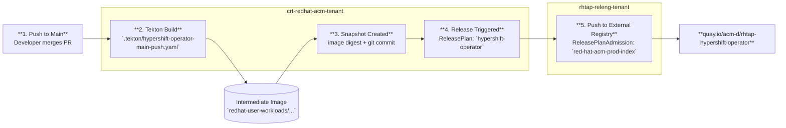

# HyperShift Operator Image Release Process

This document explains how HyperShift Operator images are built and released to `quay.io/acm-d/rhtap-hypershift-operator`.

## TL;DR

```
Push to main
    → Tekton builds image to quay.io/redhat-user-workloads/...
    → Konflux creates a Snapshot
    → ReleasePlan auto-triggers a Release
    → ReleasePlanAdmission pushes to quay.io/acm-d/rhtap-hypershift-operator
```

## Prerequisites

To query the Konflux cluster, you need:

1. `oc` CLI
2. Access to the Konflux cluster (Red Hat SSO)

**Login:**
```bash
oc login --web https://api.stone-prd-rh01.pg1f.p1.openshiftapps.com:6443/
```

**Set namespace:**
```bash
oc project crt-redhat-acm-tenant
```

For alternative kubeconfig-based login, see [README.md](./README.md).

## Step-by-Step Process

### Step 1: Build (Tekton Pipelines)

**What happens:** When code is pushed to `main`, Tekton pipelines build the container image.

**Where it's configured:** `.tekton/` directory in the hypershift repo

| File | Trigger |
|------|---------|
| `hypershift-operator-main-push.yaml` | Push to `main` |
| `hypershift-operator-main-pull-request.yaml` | Pull requests |
| `hypershift-operator-main-tag.yaml` | Tags matching `v0.1.*` |

**Pipeline used:** `.tekton/pipelines/common-operator-build.yaml`

**Dockerfile:** `Containerfile.operator`

**Platforms built:** `linux/x86_64`, `linux/arm64`, `linux/ppc64le`

**Output image:**
```
quay.io/redhat-user-workloads/crt-redhat-acm-tenant/hypershift-operator/hypershift-operator-main:{{revision}}
```

**How to verify a build ran:**
```bash
# List recent PipelineRuns
oc get pipelinerun -n crt-redhat-acm-tenant \
  -l "appstudio.openshift.io/component=hypershift-operator-main" \
  --sort-by=.metadata.creationTimestamp
```

---

### Step 2: Snapshot Creation

**What happens:** After a successful build, Konflux automatically creates a Snapshot containing the built image reference and git commit info.

**How to list Snapshots:**
```bash
oc get snapshot -n crt-redhat-acm-tenant \
  -l "appstudio.openshift.io/application=hypershift-operator" \
  --sort-by=.metadata.creationTimestamp
```

**Example output:**
```
NAME                        AGE
hypershift-operator-lpbj4   6m57s
hypershift-operator-vxh9b   2s
```

**How to inspect a Snapshot:**
```bash
oc get snapshot/<snapshot-name> -n crt-redhat-acm-tenant -oyaml
```

**Key fields in a Snapshot:**

| Field | Description |
|-------|-------------|
| `pac.test.appstudio.openshift.io/event-type` | `push` or `pull_request` - only `push` triggers release |
| `spec.components[].containerImage` | The built image with digest |
| `spec.components[].source.git.revision` | The git commit SHA |
| `status.conditions` | Whether integration tests passed |

**Important:** Only Snapshots from `push` events (not `pull_request`) trigger automatic releases to `quay.io/acm-d`.

---

### Step 3: Release (ReleasePlan)

**What happens:** The ReleasePlan watches for new Snapshots and automatically creates a Release when `auto-release: true`.

**How to view the ReleasePlan:**
```bash
oc get releaseplan/hypershift-operator -n crt-redhat-acm-tenant -oyaml
```

**Key fields:**

```yaml
metadata:
  labels:
    release.appstudio.openshift.io/auto-release: "true"  # Triggers automatically
spec:
  application: hypershift-operator
  target: rhtap-releng-tenant                            # Target namespace
status:
  releasePlanAdmission:
    name: rhtap-releng-tenant/red-hat-acm-prod-index     # The admission that handles it
```

**How to list Releases:**
```bash
oc get release -n crt-redhat-acm-tenant \
  -l "appstudio.openshift.io/application=hypershift-operator" \
  --sort-by=.metadata.creationTimestamp
```

**Example output:**
```
NAME                                      SNAPSHOT                    RELEASEPLAN         RELEASE STATUS   AGE
hypershift-operator-xkkxd-d606d00-v7vmk   hypershift-operator-xkkxd   hypershift-operator Succeeded        21h
hypershift-operator-t4dpx-fac7c6c-7gc6b   hypershift-operator-t4dpx   hypershift-operator Succeeded        10h
```

---

### Step 4: Push to External Registry (ReleasePlanAdmission)

**What happens:** The ReleasePlanAdmission defines where images are pushed and what tags to apply.

**How to view the ReleasePlanAdmission:**
```bash
oc get releaseplanadmission/red-hat-acm-prod-index -n rhtap-releng-tenant -oyaml
```

**Key fields:**

```yaml
spec:
  applications:
    - hypershift-operator              # Watches this application
  data:
    mapping:
      components:
        - name: hypershift-operator-main
          repositories:
            - url: quay.io/acm-d/rhtap-hypershift-operator   # Target registry!
        - name: hypershift
          repositories:
            - url: quay.io/acm-d/rhtap-hypershift-operator
      defaults:
        tags:
          - latest
          - latest-{{ timestamp }}
          - "{{ git_sha }}"
          - "{{ git_short_sha }}"
          - "{{ digest_sha }}"
          - "1.0"
          - 1.0-{{ timestamp }}
  pipeline:
    pipelineRef:
      params:
        - name: url
          value: https://github.com/konflux-ci/release-service-catalog.git
        - name: pathInRepo
          value: pipelines/managed/rh-push-to-external-registry/rh-push-to-external-registry.yaml
```

**Pipeline that does the actual push:**
`konflux-ci/release-service-catalog` repo → `pipelines/managed/rh-push-to-external-registry/rh-push-to-external-registry.yaml`

---

## Complete Flow Diagram



### Query Commands for Each Step

| Step | Query Command |
|------|---------------|
| 2. Build | `oc get pipelinerun -n crt-redhat-acm-tenant -l appstudio.openshift.io/component=hypershift-operator-main --sort-by=.metadata.creationTimestamp` |
| 3. Snapshot | `oc get snapshot -n crt-redhat-acm-tenant -l appstudio.openshift.io/application=hypershift-operator --sort-by=.metadata.creationTimestamp` |
| 4. Release | `oc get release -n crt-redhat-acm-tenant -l appstudio.openshift.io/application=hypershift-operator --sort-by=.metadata.creationTimestamp` |
| 5. ReleasePlanAdmission | `oc get releaseplanadmission/red-hat-acm-prod-index -n rhtap-releng-tenant -oyaml` |

---

## Troubleshooting

### Image not appearing in quay.io/acm-d?

1. **Check if the build succeeded:**
   ```bash
   oc get pipelinerun -n crt-redhat-acm-tenant \
     -l appstudio.openshift.io/component=hypershift-operator-main \
     --sort-by=.metadata.creationTimestamp | tail -5
   ```

2. **Check if a Snapshot was created:**
   ```bash
   oc get snapshot -n crt-redhat-acm-tenant \
     -l appstudio.openshift.io/application=hypershift-operator \
     --sort-by=.metadata.creationTimestamp | tail -5
   ```

3. **Check if it was a push event (not a PR):**
   ```bash
   oc get snapshot/<name> -n crt-redhat-acm-tenant \
     -o jsonpath='{.metadata.annotations.pac\.test\.appstudio\.openshift\.io/event-type}'
   ```
   Must be `push` to trigger release.

4. **Check if a Release was created:**
   ```bash
   oc get release -n crt-redhat-acm-tenant \
     -l appstudio.openshift.io/application=hypershift-operator \
     --sort-by=.metadata.creationTimestamp | tail -5
   ```

5. **Check Release status:**
   ```bash
   oc get release/<name> -n crt-redhat-acm-tenant \
     -o jsonpath='{.status.conditions[*].reason}'
   ```

---

## Component Ownership

| Component | Location | Managed By |
|-----------|----------|------------|
| Build Pipelines | `.tekton/` in hypershift repo | HyperShift team |
| Containerfile | `Containerfile.operator` in hypershift repo | HyperShift team |
| ReleasePlan | `crt-redhat-acm-tenant` namespace | HyperShift team (via ArgoCD) |
| ReleasePlanAdmission | `rhtap-releng-tenant` namespace | Release Engineering team |
| Release Pipeline | `konflux-ci/release-service-catalog` repo | Konflux team |

---

## Other Images in the Same Release Flow

The `red-hat-acm-prod-index` ReleasePlanAdmission also handles these components:

| Component | Target Repository |
|-----------|-------------------|
| `hypershift-operator-main` | `quay.io/acm-d/rhtap-hypershift-operator` |
| `hypershift` | `quay.io/acm-d/rhtap-hypershift-operator` |
| `hypershift-gomaxprocs-webhook` | `quay.io/acm-d/hypershift-gomaxprocs-webhook` |
| `maestro-addon-main` | `quay.io/acm-d/maestro-addon` |
| `maestro-main` | `quay.io/acm-d/maestro` |
| `siteconfig-main` | `quay.io/acm-d/siteconfig` |

---

## Related Documentation

- [Konflux Documentation](https://konflux-ci.dev)
- [Release Service Catalog](https://github.com/konflux-ci/release-service-catalog)
- [HyperShift Konflux README](./README.md) - Creating new CPO releases and HO hotfixes
- [HyperShift Release Process](../../docs/content/contribute/release-process.md) - Tagging and release notes
