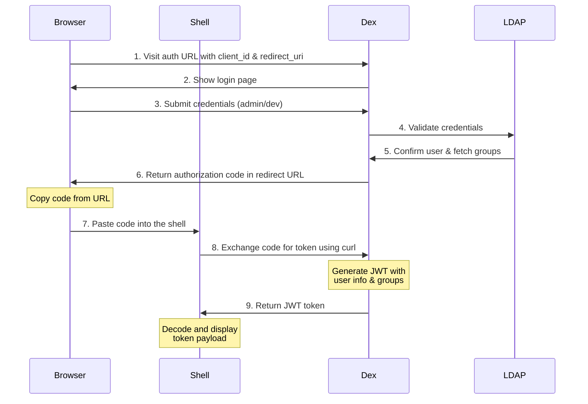
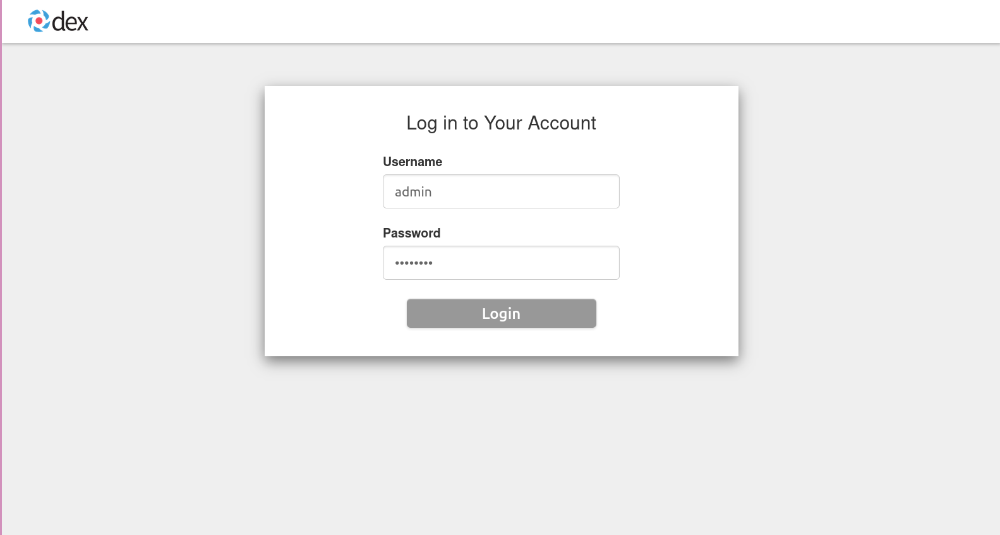

# OIDC Provider Setup with Dex

This directory contains Ansible playbooks for setting up and configuring an OpenID Connect (OIDC) provider using Dex with LDAP backend. This setup can be used to test and validate OIDC authentication flows.

## Overview

The playbooks set up a complete OIDC environment by:

1. Creating an EC2 instance in AWS to host the OIDC provider
2. Installing and configuring OpenLDAP with two test users:
   - `admin` (password: `admin123`) - Member of the `admins` group
   - `dev` (password: `dev123`) - Member of the `developers` group
3. Installing and configuring Dex (OIDC provider) which:
   - Integrates with the OpenLDAP backend for authentication
   - Provides standard OIDC endpoints (auth, token, userinfo)
   - Issues JWT tokens with claims for email, groups, and username
   - Uses a self-signed TLS certificate for HTTPS
   - Configured with client ID `openshift-console` and client secret `secret123`

Here's the authentication flow implemented in this demo:



## Directory Contents

- `playbooks/` - Directory containing all Ansible playbooks
  - `main.yml` - Main playbook that orchestrates the entire setup process
  - `infra_setup.yml` - Sets up the required AWS infrastructure (EC2 instance, security groups, etc.)
  - `infra_cleanup.yml` - Cleans up the AWS infrastructure
  - `oidc_configure.yml` - Configures Dex OIDC provider with LDAP backend
- `assets/` - Directory containing images and other assets
  - `login-screen.png` - Screenshot of the Dex login page
- `requirements.yml` - Ansible Galaxy requirements
- `requirements.txt` - Python package requirements

## Prerequisites

1. AWS CLI configured with appropriate credentials
2. Ansible installed on your local machine
3. Required Python packages and Ansible collections:
   ```bash
   pip install -r requirements.txt
   ansible-galaxy install -r requirements.yml
   ```

## Configuration

Before running the playbooks, you may want to customize the following variables in `playbooks/infra_setup.yml`:

- `region`: AWS region (default: us-east-1)
- `instance_type`: EC2 instance type (default: t3.medium)
- `vpc_id`: Your VPC ID
- `subnet_id`: Your Subnet ID

And in `playbooks/oidc_configure.yml`:

- `ldap_base_dn`: LDAP base DN (default: dc=example,dc=com)
- `ldap_admin_password`: LDAP admin password (change this in production!)

## Setup

To set up the OIDC environment, run the main playbook which executes both `infra_setup.yml` for AWS infrastructure and `oidc_configure.yml` for Dex configuration:

```bash
ansible-playbook playbooks/main.yml
```

## Cleanup

When you're done testing, you can clean up all AWS resources:

```bash
ansible-playbook playbooks/infra_cleanup.yml
```

## Testing the OIDC Setup

After setting up the OIDC provider, you can test the authentication flow using the following steps:

1. Generate and visit the authentication URL:
```bash
# Store the hostname in a variable
HOSTNAME=$(cat hostname.txt)

# Create the authentication URL
AUTH_URL="https://$HOSTNAME/auth?client_id=openshift-console&redirect_uri=https://console-openshift.example.com/oauth2/callback&response_type=code&scope=openid%20email%20profile%20groups&state=testing129"

# Display the URL to visit
echo "Open this URL in your browser (will get a certificate warning - accept it):"
echo $AUTH_URL
```

2. Visit the URL in your browser and authenticate using either:
   - Username: `admin` / Password: `admin123`
   - Username: `dev` / Password: `dev123`

You'll see the Dex login screen:



3. After successful authentication, you'll be redirected. Copy the authorization code from the URL parameter.

4. Exchange the authorization code for a JWT token and decode it:
```bash
# Replace with the code you received
CODE="your-authorization-code"

# Exchange code for token
TOKEN=$(curl -k -X POST \
  "https://$HOSTNAME/token" \
  -H "Content-Type: application/x-www-form-urlencoded" \
  -d "grant_type=authorization_code" \
  -d "code=$CODE" \
  -d "client_id=openshift-console" \
  -d "client_secret=secret123" \
  -d "redirect_uri=https://console-openshift.example.com/oauth2/callback")

# Decode and pretty-print the JWT token payload
echo $TOKEN | string split '.' | head -n 2 | tail -n 1 | \
  string replace -a '_' '/' | string replace -a '-' '+' | base64 -d | jq .
```

Example decoded token payload:
```json
{
  "iss": "https://ec2-13-219-235-90.compute-1.amazonaws.com",
  "sub": "CgVhZG1pbhIEbGRhcA",
  "aud": "openshift-console",
  "exp": 1750332985,
  "iat": 1750246585,
  "at_hash": "Ry3szklIrVZ5vZsWlTemfw",
  "email": "admin@example.com",
  "email_verified": true,
  "groups": [
    "admins"
  ],
  "name": "admin",
  "preferred_username": "admin"
}
```

This response confirms that:
- The token was issued by your OIDC provider
- The user is authenticated and has the 'admin' role
- Claims like email, groups, and username are properly included

## Understanding OpenLDAP Setup

The OpenLDAP server is configured with the following users and groups:

```ldif
# Users
dn: uid=admin,ou=People,dc=example,dc=com
objectClass: person
objectClass: inetOrgPerson
cn: admin
sn: admin
uid: admin
userPassword: admin123
mail: admin@example.com

dn: uid=dev,ou=People,dc=example,dc=com
objectClass: person
objectClass: inetOrgPerson
cn: dev
sn: dev
uid: dev
userPassword: dev123
mail: dev@example.com

# Groups
dn: cn=admins,ou=Groups,dc=example,dc=com
objectClass: groupOfNames
cn: admins
member: uid=admin,ou=People,dc=example,dc=com

dn: cn=developers,ou=Groups,dc=example,dc=com
objectClass: groupOfNames
cn: developers
member: uid=dev,ou=People,dc=example,dc=com
```

## Understanding Dex Setup

Dex is configured with a static client for testing purposes:

```yaml
staticClients:
- id: openshift-console
  redirectURIs:
  - 'https://console-openshift.example.com/oauth2/callback'
  name: 'OpenShift Console'
  secret: secret123
```

This client configuration is used in the authentication URLs and token requests. The client credentials are:
- Client ID: `openshift-console`
- Client Secret: `secret123`
- Redirect URI: `https://console-openshift.example.com/oauth2/callback`

Note: In a production environment, you should use more secure credentials and configure proper redirect URIs for your application.
