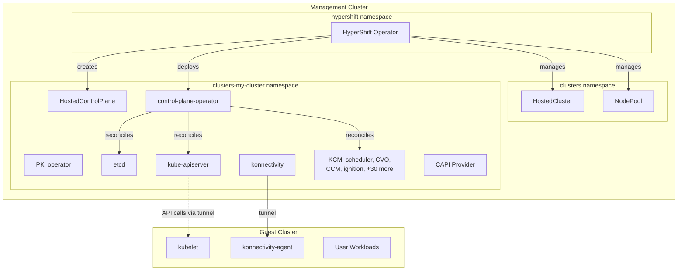
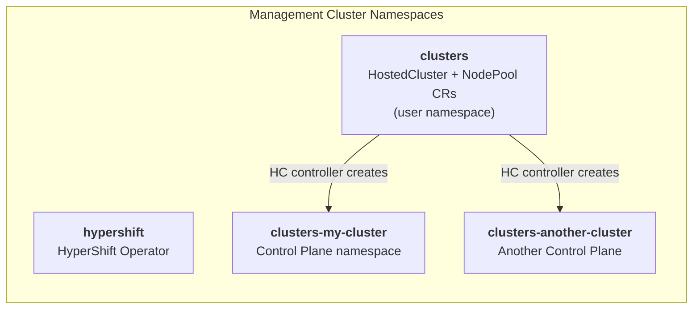
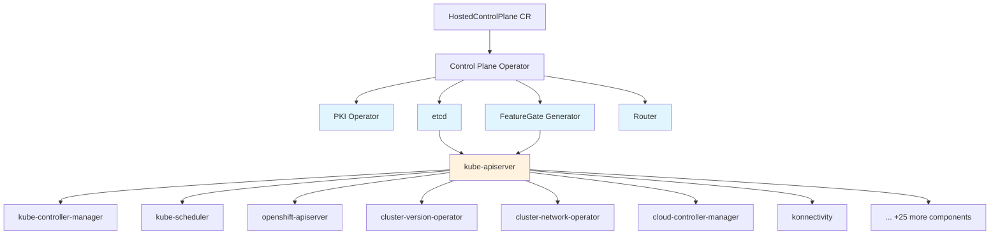
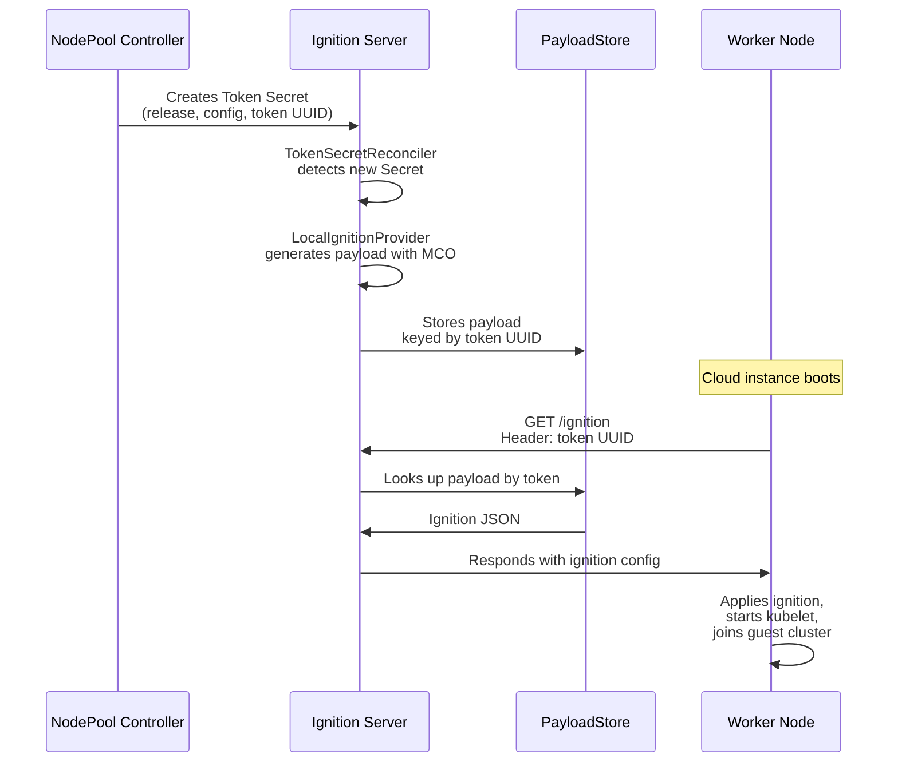

# Architecture and Main Components

## Overall Architecture

> **See also**: [Controller Architecture](../../reference/controller-architecture.md) for detailed controller diagrams and resource dependency graphs.



> For the full detailed architecture diagram with all components, see [Controller Architecture](../../reference/controller-architecture.md).

### Namespace Layout



The namespace naming convention is implemented in `hypershift-operator/controllers/manifests/manifests.go`:
```go
func HostedControlPlaneNamespace(hostedClusterNamespace, hostedClusterName string) string {
    return fmt.Sprintf("%s-%s", hostedClusterNamespace, strings.ReplaceAll(hostedClusterName, ".", "-"))
}
```

!!! tip "Explore yourself"
    Read `hypershift-operator/controllers/manifests/manifests.go` to see all the naming helpers used across the codebase.

---

## Main Components

> **See also**: [Controller Architecture](../../reference/controller-architecture.md) for detailed controller diagrams, resource dependency graphs, and the Hosted Cluster Config Operator.

### HyperShift Operator (HO)

- **Entry point**: `hypershift-operator/main.go`
- **Deployed in**: `hypershift` namespace as a Deployment

Contains the main controllers:

| Controller | Directory | Function | Read This First |
|------------|-----------|----------|-----------------|
| **HostedCluster** | `hypershift-operator/controllers/hostedcluster/` | Manages full HC lifecycle, creates CP namespace, deploys CPO | `hostedcluster_controller.go` (start at `Reconcile` method, ~line 337) |
| **NodePool** | `hypershift-operator/controllers/nodepool/` | Manages CAPI Machines, ignition tokens, rolling upgrades | `nodepool_controller.go` (start at `Reconcile` method) |
| **HostedClusterSizing** | `hypershift-operator/controllers/hostedclustersizing/` | Resource-based sizing decisions | `hostedclustersizing_controller.go` |
| **Scheduler** | `hypershift-operator/controllers/scheduler/` | Schedules HCs on management cluster nodes | `scheduler.go` |
| **SharedIngress** | `hypershift-operator/controllers/sharedingress/` | Shared ingress across multiple HCs | `sharedingress_controller.go` |

!!! tip "Explore yourself"
    The HostedCluster controller (`hostedcluster_controller.go`) is ~5200 lines. Don't try to read it all at once. Start with the `Reconcile` method and follow the function calls. Key sub-functions to look at:

    - `reconcileHostedControlPlane()` (~line 2404) - how HC spec is translated to HCP
    - `reconcileControlPlaneOperator()` - how the CPO deployment is created
    - `reconcileCAPICluster()` (~line 2901) - how the CAPI Cluster CR is created
    - `r.delete()` (~line 501) - the deletion flow

### Control Plane Operator (CPO)

- **Source**: `control-plane-operator/`
- **Main controller**: `control-plane-operator/controllers/hostedcontrolplane/hostedcontrolplane_controller.go` (~3200 lines)
- **Deployed in**: each CP namespace (one CPO instance per hosted cluster)

The CPO reads the `HostedControlPlane` resource and reconciles ~40 control plane components:



> Light blue components have no KAS dependency. KAS (orange) is an implicit dependency for everything else. The full list includes oauth-server, oauth-apiserver, openshift-controller-manager, ingress-operator, dns-operator, machine-approver, config-operator, storage-operator, node-tuning-operator, and more.

!!! tip "Explore yourself"
    Look at the `registerComponents()` function (~line 236 in `hostedcontrolplane_controller.go`) to see the full list of registered components.

    Then pick one simple component like `kube-scheduler` at `control-plane-operator/controllers/hostedcontrolplane/v2/kube_scheduler/` to understand the pattern.

### CPOv2 Framework

The declarative framework for defining control plane components. Each component uses a builder pattern:

```go
component.NewDeploymentComponent(name, opts).
    WithAdaptFunction(adaptDeployment).           // Dynamic deployment mutations
    WithPredicate(predicate).                      // Enable/disable the component
    WithDependencies("etcd", "featuregate-generator"). // Block until deps are ready
    WithManifestAdapter("config.yaml", ...).       // Adapt supporting manifests
    InjectTokenMinterContainer(tokenOpts).         // Auto-inject token minter sidecar
    InjectKonnectivityContainer(konnOpts).         // Auto-inject konnectivity proxy
    RolloutOnConfigMapChange("my-config").          // Auto-rollout on config change
    Build()
```

| File | What it does | Why you should read it |
|------|-------------|----------------------|
| `support/controlplane-component/controlplane-component.go` | Core reconcile logic, `ControlPlaneComponent` interface | Understand how components are reconciled (line 163, `Reconcile` method) |
| `support/controlplane-component/builder.go` | Builder pattern for constructing components | Learn how to create a new component |
| `support/controlplane-component/status.go` | Dependency checking, status conditions | Understand `checkDependencies` (line 50) and how `Available`/`RolloutComplete` conditions work |
| `support/controlplane-component/workload.go` | Workload (Deployment/StatefulSet) reconciliation | See how deployments are created from asset manifests |

Each component generates a `ControlPlaneComponent` CR with conditions:

- `ControlPlaneComponentAvailable` - at least one pod is ready
- `ControlPlaneComponentRolloutComplete` - all pods at the desired version

!!! tip "Explore yourself"
    Compare a simple component (`v2/kube_scheduler/`) with a complex one (`v2/kas/`) to see how the framework scales. Assets (YAML manifests) live in `v2/assets/<component>/`.

### PKI Operator

**Directory**: `control-plane-pki-operator/`

Manages all PKI (certificates) for the hosted cluster:

| Controller | Directory | Function |
|------------|-----------|----------|
| CertRotation | `certrotationcontroller/` | Rotates CAs and leaf certs using library-go |
| CertificateSigning | `certificatesigningcontroller/` | Signs CSRs for break-glass access |
| CSR Approval | `certificatesigningrequestapprovalcontroller/` | Auto-approves CSRs matching known signers |
| CertRevocation | `certificaterevocationcontroller/` | Handles certificate revocation |
| TargetConfig | `targetconfigcontroller/` | PKI target configuration |

Supports two break-glass signers: **Customer** and **SRE**.

!!! tip "Explore yourself"
    Start with `control-plane-pki-operator/operator.go` to see how all sub-controllers are wired together. Then look at `certificates/` for signer definitions.

### Ignition Server

**Directory**: `ignition-server/`

HTTPS server serving ignition configs to worker nodes during bootstrap:



| File | What it does |
|------|-------------|
| `ignition-server/cmd/start.go` | HTTPS server setup, `/ignition` request handler |
| `ignition-server/controllers/tokensecret_controller.go` | `TokenSecretReconciler`: watches token Secrets, generates payloads, rotates tokens |
| `ignition-server/controllers/local_ignitionprovider.go` | `LocalIgnitionProvider`: extracts MCO binaries from release image, runs them to produce ignition JSON |
| `ignition-server/controllers/cache.go` | `ExpiringCache`: in-memory TTL cache for payloads |

!!! tip "Explore yourself"
    Start with `ignition-server/cmd/start.go` to understand the HTTP handler, then follow the flow into `tokensecret_controller.go`.
