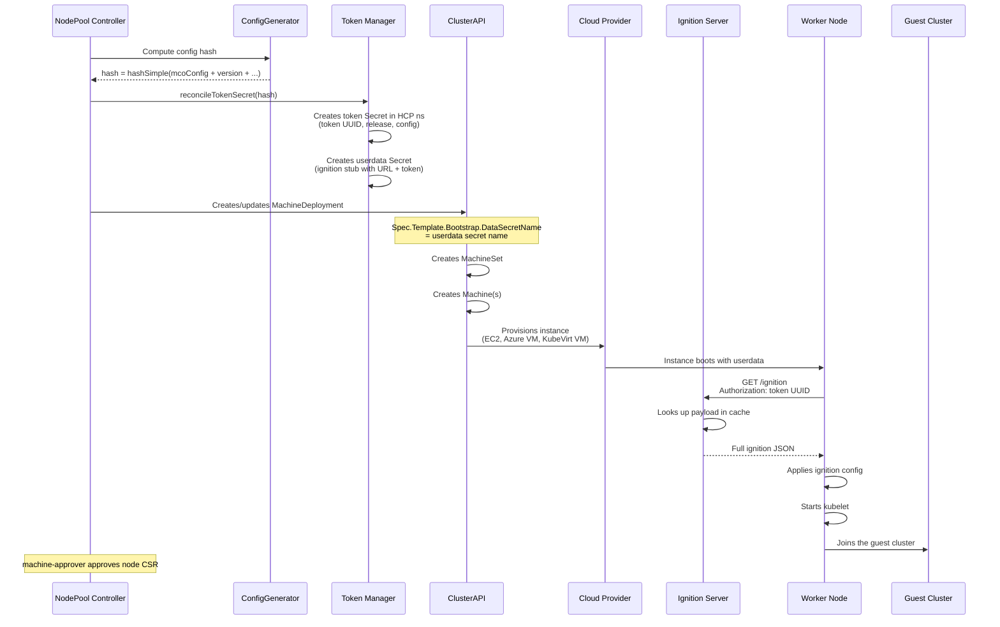
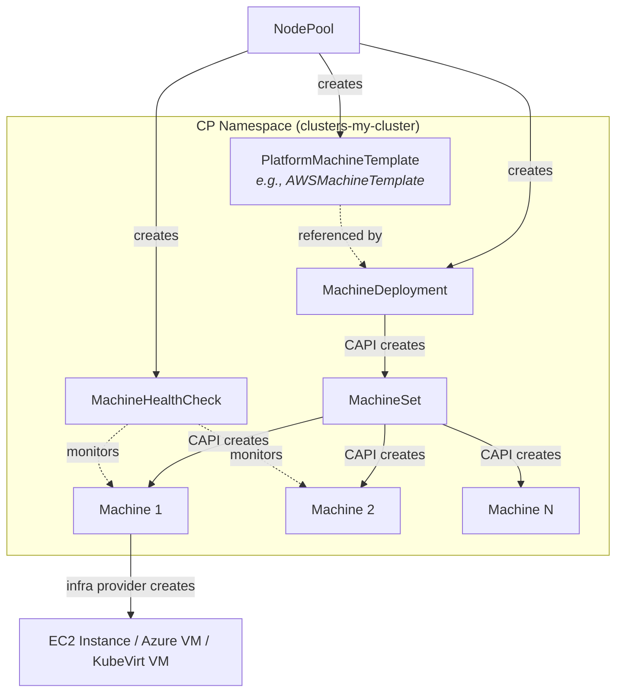
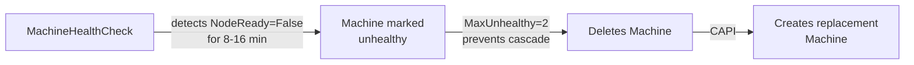

# Data Plane and Node Management

> **See also**: [NodePool Rollouts](../../reference/nodepool-rollouts.md) for in-depth rollout mechanics and update strategies.

## NodePool - Key Fields

| Field | Purpose | Look at |
|-------|---------|---------|
| `spec.clusterName` | Immutable reference to the HostedCluster | `api/hypershift/v1beta1/nodepool_types.go` |
| `spec.release` | Release image (change triggers rollout, tagged `+rollout`) | Same file |
| `spec.platform` | Platform-specific machine config (AMI, instance type, etc.) | `aws.go`, `azure.go`, `kubevirt.go` in the api dir |
| `spec.replicas` / `spec.autoScaling` | Node count control | Same file |
| `spec.management.upgradeType` | `Replace` (default) or `InPlace` | Same file |
| `spec.management.autoRepair` | Enables MachineHealthCheck | Same file |
| `spec.config` | ConfigMap refs with MachineConfig (change triggers rollout) | Same file |

## Node Lifecycle

!!! tip "Explore yourself"
    The NodePool controller is split across several files. Read them in this order:

    1. `hypershift-operator/controllers/nodepool/nodepool_controller.go` - Main reconciler entry point, condition checks
    2. `hypershift-operator/controllers/nodepool/config.go` - `ConfigGenerator`: how config hash is computed for rollout detection
    3. `hypershift-operator/controllers/nodepool/token.go` - `Token`: token Secret and userdata Secret lifecycle
    4. `hypershift-operator/controllers/nodepool/capi.go` - `CAPI`: MachineDeployment, MachineSet, MachineHealthCheck, MachineTemplate creation

## ClusterAPI Integration

**Rollout detection**: `ConfigGenerator.Hash()` produces a new hash when config or version changes. New hash = new Secrets = new `DataSecretName` on MachineDeployment = CAPI rolling update.

!!! tip "Explore yourself"
    Platform-specific machine template builders:

    - `hypershift-operator/controllers/nodepool/aws.go` - `awsMachineTemplateSpec()`: AMI resolution, instance type, root volume, security groups
    - `hypershift-operator/controllers/nodepool/azure.go` - Azure VM config
    - `hypershift-operator/controllers/nodepool/kubevirt/kubevirt.go` - KubeVirt VM config
    - `hypershift-operator/controllers/nodepool/agent.go` - Agent/bare-metal label selectors
    - `hypershift-operator/controllers/nodepool/gcp.go` - GCP machine config
    - `hypershift-operator/controllers/nodepool/openstack.go` - OpenStack config

## Auto-scaling

> **See also**: [Resource-Based Control Plane Autoscaling](../../how-to/resource-based-control-plane-autoscaling.md) for detailed autoscaling configuration.

- **Manual**: `nodePool.spec.replicas` propagates to `MachineDeployment.Spec.Replicas`
- **Cluster Autoscaler**: `nodePool.spec.autoScaling.min/max` becomes CAPI annotations on MachineDeployment
- **Scale-from-zero** (AWS only): capacity annotations (`vCPU`, `memoryMb`, `GPU`) in `hypershift-operator/controllers/nodepool/scale_from_zero.go`
- **Karpenter** (alternative): provisions nodes directly based on pending pods, bypassing MachineDeployments. See `karpenter-operator/controllers/`

!!! tip "Explore yourself"
    Karpenter integration files:

    - `karpenter-operator/controllers/karpenter/karpenter_controller.go` - Main reconciler
    - `karpenter-operator/controllers/karpenterignition/karpenterignition_controller.go` - Ignition for Karpenter nodes
    - `api/karpenter/v1beta1/` - HyperShift Karpenter API types

## Auto-repair

!!! tip "Explore yourself"
    MHC creation is in `hypershift-operator/controllers/nodepool/capi.go`, function `reconcileMachineHealthCheck()` (~line 649). Note the different timeouts for cloud (8 min) vs Agent/None (16 min) platforms.

---
