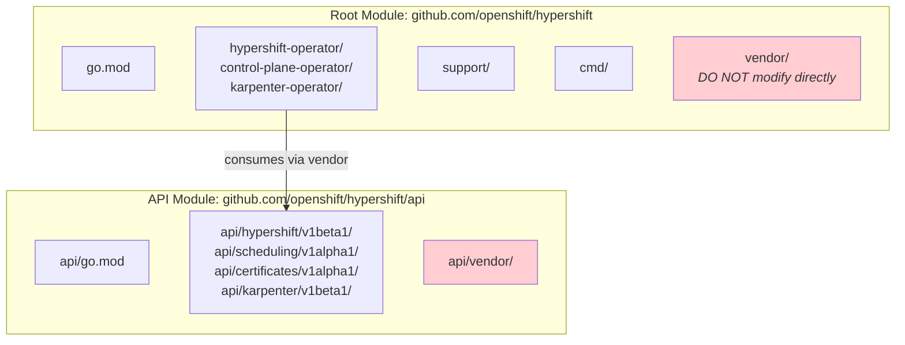
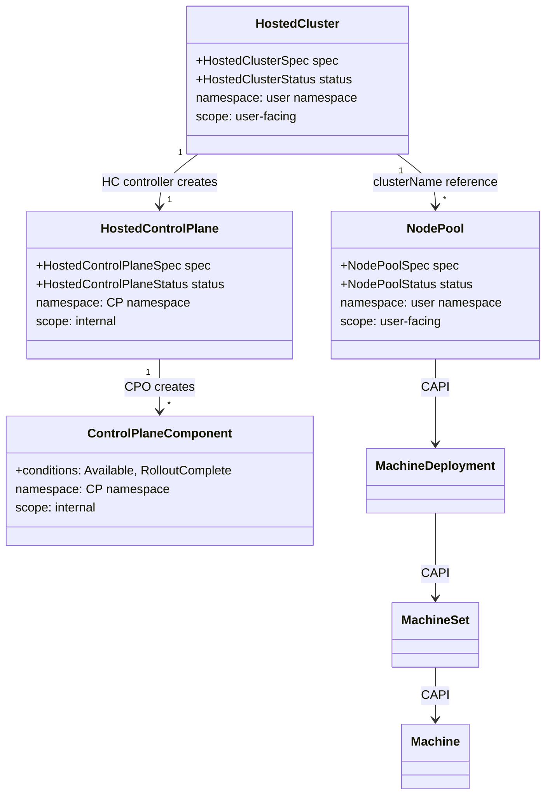
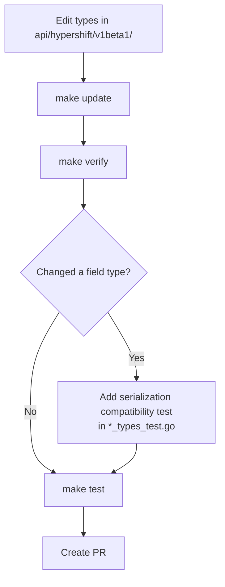

# APIs, Code Structure, and Development

## Multi-Module Structure



> **GOLDEN RULE**: After any change in `api/`, run `make update`. This runs: `api-deps` -> `workspace-sync` -> `deps` -> `api` -> `api-docs` -> `clients` -> `docs-aggregate`.

!!! tip "Explore yourself"
    - `api/go.mod` - the separate module definition
    - `api/CLAUDE.md` - API backward compatibility rules (critical reading!)
    - `hack/workspace/go.work` - Go workspace for local development across both modules

## Main API Types



!!! tip "Explore yourself"
    Key API files to read:

    - `api/hypershift/v1beta1/hostedcluster_types.go` - Start here. HostedClusterSpec (~line 529), HostedClusterStatus (~line 2105)
    - `api/hypershift/v1beta1/hosted_controlplane.go` - HCP spec (~line 44) mirrors HC spec
    - `api/hypershift/v1beta1/nodepool_types.go` - NodePoolSpec, note the `+rollout` tags
    - `api/hypershift/v1beta1/controlplanecomponent_types.go` - CPOv2 status tracking
    - `api/hypershift/v1beta1/etcdbackup_types.go` - Example of a feature-gated type
    - `api/hypershift/v1beta1/groupversion_info.go` - API group registration

## Feature Gates

Feature gates control which API fields and CRD types are available:

```go
// Example: gated field
// +openshift:enable:FeatureGate=AutoNodeKarpenter
AutoNode *AutoNode `json:"autoNode,omitempty"`
```

!!! tip "Explore yourself"
    Feature gate definitions are in `api/hypershift/v1beta1/featuregates/`:

    - `featureGate-Hypershift-Default.yaml` - Default feature set
    - `featureGate-Hypershift-TechPreviewNoUpgrade.yaml` - TechPreview set
    - Per-gate CRD fragments are generated in `api/hypershift/v1beta1/zz_generated.featuregated-crd-manifests/`

## Key Annotations

Some important annotations you'll encounter (defined in `api/hypershift/v1beta1/hostedcluster_types.go`, lines 29-449):

| Annotation | Purpose |
|-----------|---------|
| `hypershift.openshift.io/control-plane-operator-image` | Override CPO image (dev/e2e) |
| `hypershift.openshift.io/restart-date` | Triggers rolling restart of all components |
| `hypershift.openshift.io/force-upgrade-to` | Force upgrade even if CVO says not upgradeable |
| `hypershift.openshift.io/disable-pki-reconciliation` | Stops PKI cert regeneration |
| `resource-request-override.hypershift.openshift.io/<deploy>.<container>` | Override resource requests per container |
| `hypershift.openshift.io/topology` | `dedicated-request-serving-components` for dedicated nodes |
| `hypershift.openshift.io/cleanup-cloud-resources` | Controls cloud resource cleanup on deletion |

!!! tip "Explore yourself"
    Read the annotation constants block at the top of `hostedcluster_types.go` (lines 29-449). Each has a comment explaining its purpose.

---

## Development Workflow

> **See also**: [Run Tests](../../contribute/run-tests.md), [Run HyperShift Operator Locally](../../contribute/run-hypershift-operator-locally.md), and [Develop In-Cluster](../../contribute/develop_in_cluster.md) for detailed development setup guides.

### Essential Commands

```bash
# Build
make build                    # All binaries
make hypershift               # CLI only
make hypershift-operator      # HO only
make control-plane-operator   # CPO only

# Test
make test                     # Unit tests with race detection
make e2e                      # Build E2E test binaries

# Code quality
make verify                   # Full verification (BEFORE PR) - includes generate, fmt, vet, lint, codespell, gitlint
make lint                     # golangci-lint
make lint-fix                 # Auto-fix linting
make fmt                      # Format
make vet                      # go vet

# API and generation
make update                   # Full update after api/ changes
make api                      # Only regenerate CRDs
make generate                 # go generate
make clients                  # Update generated clients
```

### Workflow for API Changes



!!! tip "Explore yourself"
    Look at `api/hypershift/v1beta1/nodepool_types_test.go` for the serialization compatibility test pattern. It defines an N-1 struct and verifies JSON round-trip compatibility.

### Running Locally

```bash
# Install HyperShift in development mode
make hypershift-install-aws-dev

# Run operator locally
make run-operator-locally-aws-dev

# Or manually
bin/hypershift install --development
bin/hypershift-operator run
```

!!! tip "Explore yourself"
    The CLI is built from `main.go` at the repo root. Subcommands are in `cmd/`:

    - `cmd/cluster/` - `create cluster` and `destroy cluster` commands
    - `cmd/nodepool/` - `create nodepool` and `destroy nodepool`
    - `cmd/install/` - `install` command and CRD assets
    - `cmd/infra/` - `create infra` commands per platform
    - `cmd/install/assets/hypershift-operator/` - Final CRD YAML files

---

## Common Development Patterns

### Upsert Pattern

`support/upsert/upsert.go` wraps `controllerutil.CreateOrUpdate` to prevent reconciliation loops by copying server-defaulted fields.

```go
// Typical usage in a reconciler
result, err := r.createOrUpdate(ctx, r.client, deployment, func() error {
    // mutate deployment here
    return nil
})
```

!!! tip "Explore yourself"
    Read `support/upsert/upsert.go` to understand the loop detection mechanism. The `CreateOrUpdateProvider` interface is injected into controllers via `SetupWithManager`.

### Controller Structure

```go
type MyReconciler struct {
    client         crclient.Client
    createOrUpdate upsert.CreateOrUpdateFN
}

func (r *MyReconciler) Reconcile(ctx context.Context, req ctrl.Request) (ctrl.Result, error) {
    // 1. Fetch resource
    // 2. Handle deletion
    // 3. Add finalizer
    // 4. Reconcile sub-resources
    // 5. Update status
}
```

!!! tip "Explore yourself"
    Compare how different controllers are set up:

    - `hypershift-operator/controllers/hostedcluster/hostedcluster_controller.go` - Large, complex controller
    - `hypershift-operator/controllers/hostedclustersizing/hostedclustersizing_controller.go` - Simpler controller
    - `control-plane-operator/controllers/hostedcontrolplane/hostedcontrolplane_controller.go` - CPO main controller

### Test Conventions

- Use **Gherkin syntax** for test names: `"When ... it should ..."`
- Use **gomega** for assertions
- Unit tests live alongside source files
- E2E tests in `test/e2e/`
- Integration tests in `test/integration/`

!!! tip "Explore yourself"
    - `test/e2e/` - E2E tests covering cluster lifecycle, nodepool operations, upgrades
    - `test/integration/` - Integration tests for controller behavior
    - Any `*_test.go` file alongside the source for unit test examples

### API Backward Compatibility

Rules from `api/CLAUDE.md`:

- Every API type change must be safe for **N+1 (forward)** and **N-1 (rollback)** compatibility
- Changing a value type to a pointer (e.g., `int32` to `*int32`) requires `omitempty`
- Never remove or rename fields
- Always add serialization compatibility tests when modifying field types
