# HyperShift / Hosted Control Planes (HCP) - Onboarding Guide

!!! note "How this guide relates to other docs"
    This is a **curated learning path** — it provides a structured narrative to help newcomers build a mental model of HyperShift step by step. It intentionally summarizes topics that are covered in more detail in dedicated reference pages. Where applicable, "See also" links point you to the authoritative source for deeper reading. This guide is not a replacement for those docs.

---

## Tips for New Team Members

1. **Start with the CRDs**: Understanding `HostedCluster`, `HostedControlPlane`, and `NodePool` is 80% of the work
2. **Follow the data flow**: HC -> HCP -> Components. NP -> CAPI -> Cloud -> Node
3. **Conditions are your friend**: Always check `.status.conditions` to understand what's happening
4. **`make verify` before pushing**: Always
5. **The CP namespace is where the magic happens**: `kubectl get pods -n clusters-<name>` shows you everything
6. **Read the tests**: Unit tests and E2E tests are the best living documentation
7. **Use `hypershift dump`**: The diagnostic tool at `cmd/dump/` captures full cluster state for debugging
8. **Don't read 5000-line files end-to-end**: Follow function calls from the `Reconcile` entry point
9. **The API module is separate**: Remember to run `make update` after any change in `api/`
10. **Ask about invariants**: When in doubt about a design decision, check if it violates any of the [architectural invariants](reference.md#architectural-invariants)

---

## Recommended Learning Path

```mermaid
graph TD
    subgraph "Week 1-2: Foundations"
        S1A[Read this guide end-to-end]
        S1B[Install HyperShift locally<br/><code>make hypershift-install-aws-dev</code>]
        S1C[Create a test HostedCluster<br/><code>bin/hypershift create cluster</code>]
        S1D[Explore the CRDs:<br/>HostedCluster, HCP, NodePool<br/><i>Read the API type files</i>]
        S1E[Observe pods in the<br/>CP namespace with kubectl]
    end

    subgraph "Week 3-4: Architecture"
        S2A[Read hostedcluster_controller.go<br/>Understand the reconcile loop]
        S2B[Read hostedcontrolplane_controller.go<br/>Understand how the CPO<br/>deploys components]
        S2C[Read nodepool_controller.go<br/>Understand the node flow]
        S2D[Study the CPOv2 framework<br/>support/controlplane-component/]
        S2E[Read a simple v2 component<br/>e.g., kube-scheduler]
    end

    subgraph "Week 5-6: Deep Dive"
        S3A[Study the Platform interface<br/>and one implementation<br/>e.g., AWS or KubeVirt]
        S3B[Understand the ignition flow<br/>Token -> Ignition Server -> Node]
        S3C[Study PKI and certificates]
        S3D[Make a real change:<br/>bug fix or small feature]
        S3E[Run make verify<br/>and create your first PR]
    end

    subgraph "Week 7+: Specialization"
        S4A[Choose area of focus:<br/>- Control Plane<br/>- Data Plane / NodePool<br/>- Platform specific<br/>- API Design]
        S4B[Read E2E tests<br/>test/e2e/]
        S4C[Contribute features<br/>and PR reviews]
    end

    S1A --> S1B --> S1C --> S1D --> S1E
    S1E --> S2A
    S2A --> S2B --> S2C --> S2D --> S2E
    S2E --> S3A
    S3A --> S3B --> S3C --> S3D --> S3E
    S3E --> S4A --> S4B --> S4C
```

### Suggested Reading Order for Code

For each area, follow this order to build understanding incrementally:

**Control Plane path:**

1. `api/hypershift/v1beta1/hostedcluster_types.go` (skim the Spec, focus on key fields)
2. `api/hypershift/v1beta1/hosted_controlplane.go` (note the similarity to HC)
3. `hypershift-operator/controllers/hostedcluster/hostedcluster_controller.go` (`Reconcile` method only)
4. `control-plane-operator/controllers/hostedcontrolplane/hostedcontrolplane_controller.go` (`Reconcile` and `registerComponents`)
5. `support/controlplane-component/controlplane-component.go` (core framework)
6. `control-plane-operator/controllers/hostedcontrolplane/v2/kube_scheduler/` (simple component)

**Data Plane path:**

1. `api/hypershift/v1beta1/nodepool_types.go`
2. `hypershift-operator/controllers/nodepool/nodepool_controller.go` (`Reconcile` entry point)
3. `hypershift-operator/controllers/nodepool/config.go` (hash-based rollout)
4. `hypershift-operator/controllers/nodepool/token.go` (ignition tokens)
5. `hypershift-operator/controllers/nodepool/capi.go` (CAPI resource creation)
6. `ignition-server/cmd/start.go` (how nodes fetch their config)

**Platform path (pick one):**

1. `hypershift-operator/controllers/hostedcluster/internal/platform/platform.go` (interface)
2. `hypershift-operator/controllers/hostedcluster/internal/platform/<your-platform>/` (implementation)
3. `hypershift-operator/controllers/nodepool/<your-platform>.go` (machine template)
4. `control-plane-operator/controllers/hostedcontrolplane/v2/cloud_controller_manager/<your-platform>/` (CCM)
5. `api/hypershift/v1beta1/<your-platform>.go` (API types)

---

## Guide Contents

| Section | What you'll learn |
|---------|------------------|
| [What is HyperShift?](what-is-hypershift.md) | The problem HyperShift solves and how it works |
| [Key Concepts](key-concepts.md) | Core resources, glossary, and terminology |
| [Architecture](architecture.md) | Overall architecture, namespace layout, and main components |
| [Cluster Lifecycle](lifecycle.md) | Creation, upgrades, deletion, and the CPO reconciliation flow |
| [Data Plane](data-plane.md) | NodePool management, node lifecycle, ClusterAPI, auto-scaling |
| [Cloud Platforms](platforms.md) | Supported platforms, comparison, and infrastructure details |
| [Development](development.md) | APIs, code structure, development workflow, and patterns |
| [Reference](reference.md) | Architectural invariants and key file reference |
