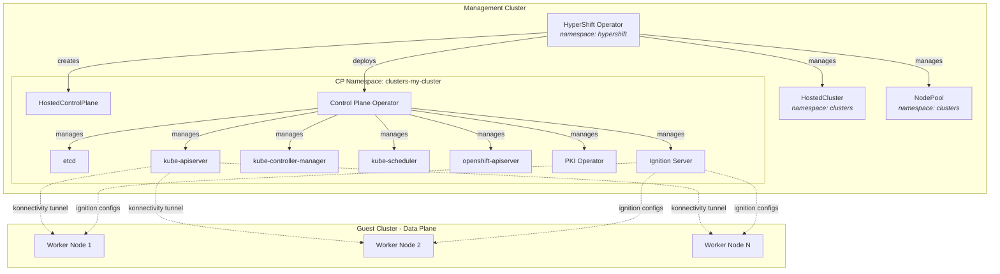

# Key Concepts

> **See also**: [Concepts and Personas](../../reference/concepts-and-personas.md) for detailed persona definitions (Service Provider, Consumer, Instance Admin) and [Controller Architecture](../../reference/controller-architecture.md) for detailed controller diagrams and resource dependency graphs.

## Glossary

> For full persona and concept definitions, see [Concepts and Personas](../../reference/concepts-and-personas.md).

| Term | Description | Start Reading Here |
|------|-------------|-------------------|
| **Management Cluster** | The OpenShift/K8s cluster where HyperShift operators run and where control plane pods live | `hypershift-operator/main.go` |
| **Guest Cluster** (Hosted Cluster) | The cluster end users consume. Only has worker nodes | - |
| **HostedCluster (HC)** | User-facing CRD declaring the intent to create a cluster. Lives in the user's namespace | `api/hypershift/v1beta1/hostedcluster_types.go` |
| **HostedControlPlane (HCP)** | Internal CRD created by the HC controller. Lives in the control plane namespace. The CPO reads it to know what to deploy | `api/hypershift/v1beta1/hosted_controlplane.go` |
| **NodePool (NP)** | User-facing CRD defining a scalable set of worker nodes. References a HostedCluster | `api/hypershift/v1beta1/nodepool_types.go` |
| **Control Plane Namespace** | Namespace (`{hc-ns}-{hc-name}`) where all control plane components live | `hypershift-operator/controllers/manifests/manifests.go` |
| **HyperShift Operator (HO)** | Main operator managing HostedClusters and NodePools | `hypershift-operator/controllers/hostedcluster/hostedcluster_controller.go` |
| **Control Plane Operator (CPO)** | Runs inside each CP namespace and manages all control plane components | `control-plane-operator/controllers/hostedcontrolplane/hostedcontrolplane_controller.go` |
| **PKI Operator** | Certificate operator handling rotation and signing | `control-plane-pki-operator/operator.go` |
| **Ignition Server** | HTTPS server that serves ignition configs to worker nodes during bootstrap | `ignition-server/cmd/start.go` |
