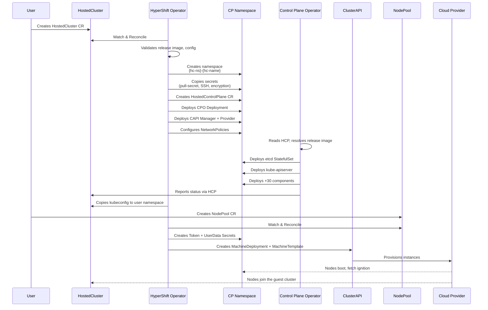
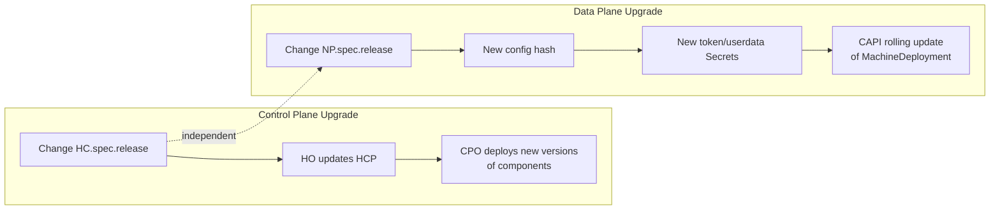
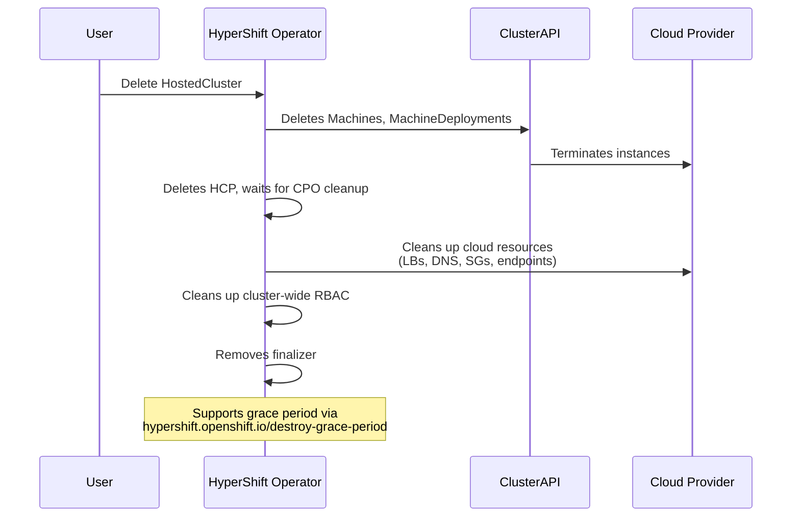
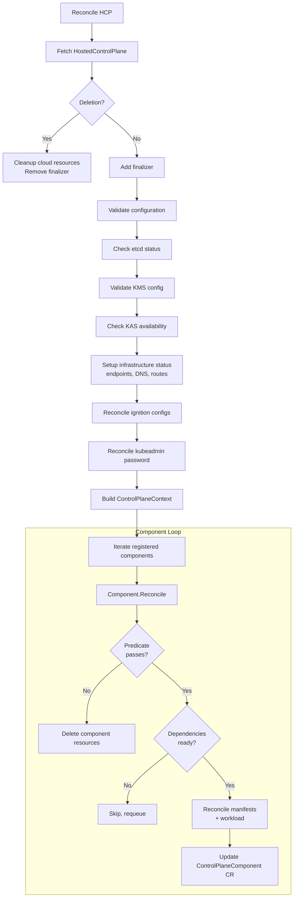
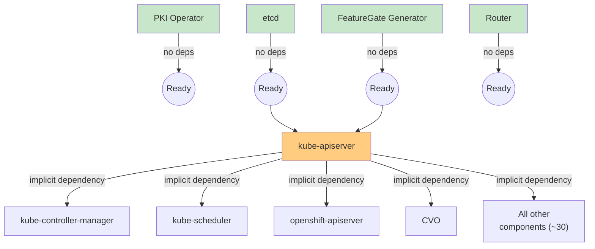
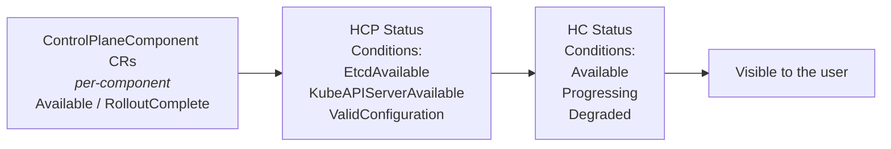

# Cluster Lifecycle and Control Plane

---

## HostedCluster Lifecycle

### Creation



!!! tip "Explore yourself"
    Follow the creation flow step by step in `hostedcluster_controller.go`:

    1. `Reconcile()` (~line 337) - entry point
    2. `reconcileHostedControlPlane()` (~line 2404) - HCP creation
    3. `reconcileControlPlaneOperator()` - CPO deployment
    4. `reconcileCAPIManager()` - CAPI deployment
    5. Network policies: `hypershift-operator/controllers/hostedcluster/network_policies.go`

### Steady State

- The CPO continuously reconciles all components against the HCP spec
- The PKI operator rotates certificates automatically
- The NodePool controller manages auto-repair and scaling
- Status flow: `CPO -> HCP status -> HO -> HC status`

### Upgrade

> **See also**: [Upgrades](../../how-to/upgrades.md) for detailed upgrade procedures and version skew policies.

Control plane and data plane upgrades are **decoupled**:



- `controlPlaneRelease`: allows patching management-side components without touching the data plane
- NodePool releases can be updated independently (within N-3 y-stream skew)

### Deletion



!!! tip "Explore yourself"
    The deletion flow starts at `r.delete()` (~line 501 in `hostedcluster_controller.go`). Notice the `CloudResourcesDestroyed` and `HostedClusterDestroyed` conditions.

---

## Control Plane in Detail

### CPO Reconciliation Flow

> **See also**: [Controller Architecture](../../reference/controller-architecture.md) for the full controller dependency graph and reconciliation details.



!!! tip "Explore yourself"
    In `hostedcontrolplane_controller.go`, the component iteration loop is at ~line 1232:

    ```go
    for _, c := range r.components {
        r.Log.Info("Reconciling component", "component_name", c.Name())
        if err := c.Reconcile(cpContext); err != nil {
            errs = append(errs, err)
        }
    }
    ```

### Component Dependencies



KAS is an implicit dependency for all components **except**: etcd, featuregate-generator, control-plane-operator, cluster-api, capi-provider, karpenter, and router.

### Status Propagation



!!! tip "Explore yourself"
    - HC conditions are defined in `api/hypershift/v1beta1/hostedcluster_conditions.go`
    - NP conditions are in `api/hypershift/v1beta1/nodepool_conditions.go`
    - The CPOv2 status logic is in `support/controlplane-component/status.go`
