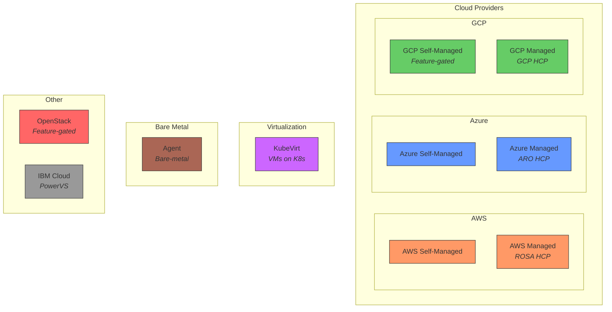
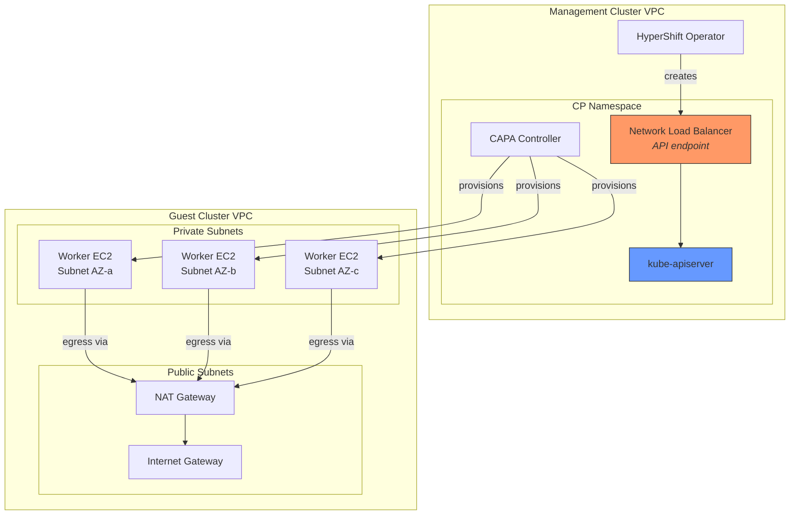
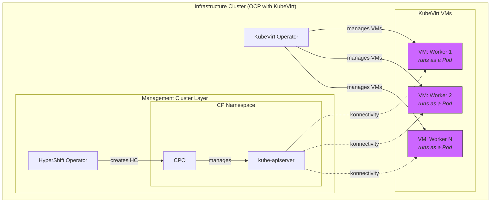
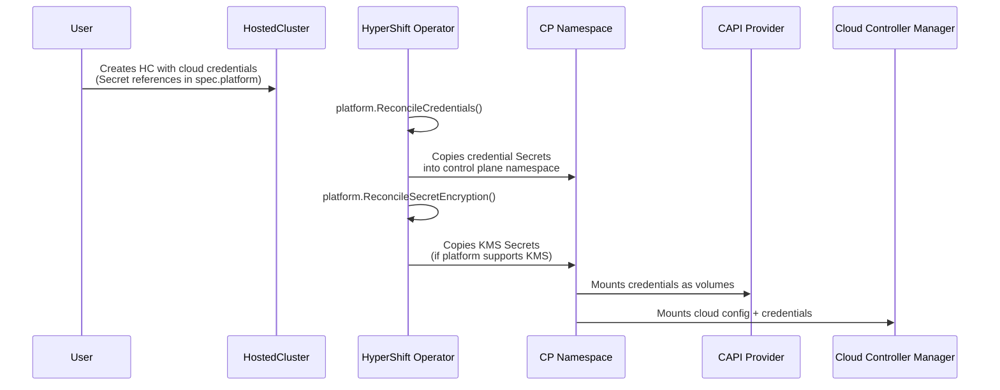

# Supported Cloud Platforms

> **See also**: [Multi-Platform Support](../../reference/multi-platform-support.md) for the full support matrix across HostedCluster, NodePool, and management cluster platform combinations.

HyperShift supports multiple infrastructure platforms. Each platform implements the same `Platform` interface but brings its own CAPI provider, credential model, and networking primitives. Some platforms are generally available while others are behind feature gates.



---

## Platform Interface

Every platform must implement the `Platform` interface defined in `hypershift-operator/controllers/hostedcluster/internal/platform/platform.go`. The HyperShift Operator uses this interface to abstract away cloud-specific details during HostedCluster reconciliation.

```go
type Platform interface {
    // ReconcileCAPIInfraCR creates/updates the platform-specific CAPI infrastructure CR
    // that will be referenced by the CAPI Cluster CR.
    ReconcileCAPIInfraCR(ctx context.Context, c client.Client, createOrUpdate upsert.CreateOrUpdateFN,
        hcluster *hyperv1.HostedCluster, controlPlaneNamespace string,
        apiEndpoint hyperv1.APIEndpoint) (client.Object, error)

    // CAPIProviderDeploymentSpec returns the DeploymentSpec for the CAPI provider
    // with platform-specific volumes, secrets, and containers.
    CAPIProviderDeploymentSpec(hcluster *hyperv1.HostedCluster,
        hcp *hyperv1.HostedControlPlane) (*appsv1.DeploymentSpec, error)

    // ReconcileCredentials copies cloud credentials from the HostedCluster namespace
    // into the control plane namespace for the CPO to consume.
    ReconcileCredentials(ctx context.Context, c client.Client, createOrUpdate upsert.CreateOrUpdateFN,
        hcluster *hyperv1.HostedCluster, controlPlaneNamespace string) error

    // ReconcileSecretEncryption copies KMS-related resources into the control plane
    // namespace (if the platform supports KMS).
    ReconcileSecretEncryption(ctx context.Context, c client.Client, createOrUpdate upsert.CreateOrUpdateFN,
        hcluster *hyperv1.HostedCluster, controlPlaneNamespace string) error

    // CAPIProviderPolicyRules returns additional RBAC PolicyRules required by the
    // CAPI provider to manage platform resources. Return nil if none are needed.
    CAPIProviderPolicyRules() []rbacv1.PolicyRule

    // DeleteCredentials cleans up platform credential resources so they don't leak
    // when a HostedCluster is deleted.
    DeleteCredentials(ctx context.Context, c client.Client,
        hcluster *hyperv1.HostedCluster, controlPlaneNamespace string) error
}
```

The `GetPlatform()` function in the same file uses a `switch` on `hcluster.Spec.Platform.Type` to instantiate the correct implementation (AWS, Azure, GCP, KubeVirt, Agent, etc.).

---

## Platform Comparison

| Aspect | AWS (Self-Managed) | AWS (ROSA HCP) | Azure (Self-Managed) | Azure (ARO HCP) | GCP (GCP HCP) | KubeVirt | Agent |
|--------|-------------------|----------------|---------------------|-----------------|---------------|----------|-------|
| **Managed service** | No | Yes | No | Yes | Yes | No | No |
| **CAPI Provider** | CAPA | CAPA | CAPZ | CAPZ | CAPG | - | - |
| **Identity** | STS / IRSA | STS / IRSA | Workload Identity | Workload Identity | Workload Identity | N/A | N/A |
| **KMS** | AWS KMS | AWS KMS | Azure Key Vault | Azure Key Vault | GCP KMS | N/A | N/A |
| **Private connectivity** | AWS PrivateLink | AWS PrivateLink | Azure Private Link Service | Azure Private Link Service | Private Service Connect | N/A | N/A |
| **Infra provisioning** | EC2/VPC | EC2/VPC | VMs/VNet | VMs/VNet | GCE/VPC | KubeVirt VMs | BareMetalHost |
| **Cloud Controller Manager** | aws-ccm | aws-ccm | azure-ccm | azure-ccm | gcp-ccm | kubevirt-ccm | N/A |

!!! tip "Explore yourself"
    Browse the platform implementation directories to see how each platform implements the interface:

    - `hypershift-operator/controllers/hostedcluster/internal/platform/aws/`
    - `hypershift-operator/controllers/hostedcluster/internal/platform/azure/`
    - `hypershift-operator/controllers/hostedcluster/internal/platform/gcp/`
    - `hypershift-operator/controllers/hostedcluster/internal/platform/kubevirt/`
    - `hypershift-operator/controllers/hostedcluster/internal/platform/agent/`
    - `hypershift-operator/controllers/hostedcluster/internal/platform/openstack/`
    - `hypershift-operator/controllers/hostedcluster/internal/platform/powervs/`

---

## AWS Infrastructure

AWS is the most mature platform. Both self-managed and managed (ROSA HCP) deployments use the same underlying infrastructure primitives.



The guest cluster VPC contains public subnets (with an Internet Gateway and NAT Gateway for outbound traffic) and private subnets where worker EC2 instances run. The CAPI AWS provider (CAPA) manages the machine lifecycle. The kube-apiserver is fronted by a Network Load Balancer for external access.

---

## AWS PrivateLink

For private clusters on AWS, HyperShift uses AWS PrivateLink to expose the kube-apiserver without traversing the public internet. The CPO runs a dedicated controller that manages the PrivateLink endpoint service and VPC endpoint:

- **Source**: `control-plane-operator/controllers/awsprivatelink/`
- The management cluster creates a VPC Endpoint Service backed by the kube-apiserver NLB
- Consumers create a VPC Endpoint in their VPC that connects through PrivateLink
- DNS is configured so the API server hostname resolves to the private endpoint

This model is critical for ROSA HCP where the control plane runs in a service account VPC that the customer never sees directly.

---

## KubeVirt Nested Virtualization

KubeVirt is unique because it runs guest cluster worker nodes as virtual machines on an existing Kubernetes cluster, creating a nested architecture:



Key differences from cloud platforms:

- **No CAPI provider**: KubeVirt manages VMs directly through the KubeVirt API
- **No cloud credentials**: The infrastructure cluster already has everything needed
- **Nested networking**: Guest cluster pods run inside VMs that run inside pods on the infra cluster
- **Shared infrastructure**: The management cluster, control plane, and worker VMs all share the same underlying cluster

---

## Cloud Controller Managers

Each cloud platform has a Cloud Controller Manager (CCM) that runs in the control plane namespace. The CCM is responsible for:

- Initializing nodes with cloud-specific metadata (zone, instance type, addresses)
- Managing cloud load balancers for Services of type `LoadBalancer`
- Handling node lifecycle (detecting when cloud instances are terminated)

Platform-specific CCM implementations are registered as CPO v2 components:

- `control-plane-operator/controllers/hostedcontrolplane/v2/cloud_controller_manager/aws/`
- `control-plane-operator/controllers/hostedcontrolplane/v2/cloud_controller_manager/azure/`
- `control-plane-operator/controllers/hostedcontrolplane/v2/cloud_controller_manager/gcp/`
- `control-plane-operator/controllers/hostedcontrolplane/v2/cloud_controller_manager/kubevirt/`
- `control-plane-operator/controllers/hostedcontrolplane/v2/cloud_controller_manager/openstack/`
- `control-plane-operator/controllers/hostedcontrolplane/v2/cloud_controller_manager/powervs/`

Each CCM component adapts a `cloud-provider-<platform>` binary with the appropriate cloud configuration file, credentials, and feature gates for the hosted cluster.

---

## Credential Management Pattern

Cloud credentials flow from the user-facing HostedCluster resource into the control plane namespace where they are consumed by the CAPI provider, CCM, and other platform-aware components:



The cloud configuration file that the CCM and other components consume is generated per-platform:

- **AWS**: `control-plane-operator/controllers/hostedcontrolplane/cloud/aws/providerconfig.go`
- **Azure**: `control-plane-operator/controllers/hostedcontrolplane/cloud/azure/providerconfig.go`
- **OpenStack**: `control-plane-operator/controllers/hostedcontrolplane/cloud/openstack/providerconfig.go`

These files build the `cloud.conf` (or equivalent) that gets mounted into the CCM, KCM, and other components that need to interact with the cloud API.
