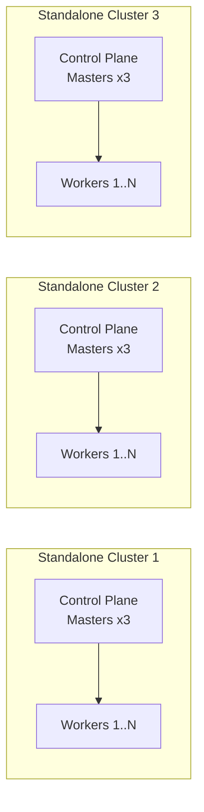
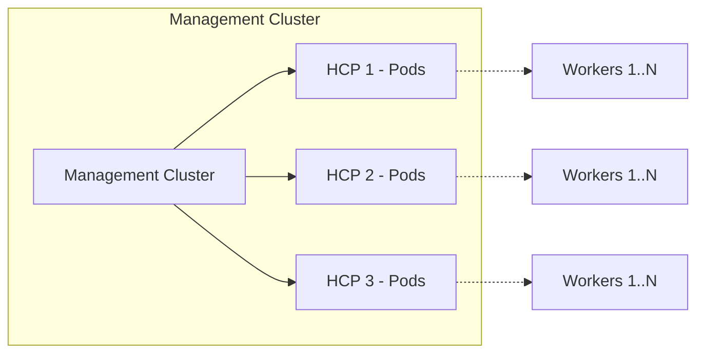

# What is HyperShift?

HyperShift is an OpenShift middleware that **decouples the control plane from the data plane** (worker nodes), allowing control planes to run as workloads on a central **management cluster**.

## The Problem it Solves

In standalone OpenShift, every cluster runs its own control plane (etcd, kube-apiserver, controllers) on dedicated master nodes. This creates:

- **Resource overhead**: 3+ master nodes per cluster just for the control plane
- **Provisioning time**: 30-45 minutes including bootstrap
- **Distributed operations**: each control plane is independently operated

## How HyperShift Solves It

**Standalone OpenShift** — each cluster embeds its own control plane on dedicated master nodes:

Each standalone cluster is **self-contained** — it embeds its own control plane on dedicated master nodes. There is no shared management layer; every cluster independently operates its own etcd, API server, and controllers.

**HyperShift Model** — a single management cluster hosts all control planes as pods:

| Aspect | Standalone OpenShift | HyperShift (HCP) |
|--------|---------------------|-------------------|
| Control plane location | Dedicated master nodes inside the cluster | Pods on a management cluster |
| Master nodes | 3+ required | Zero; only worker nodes in the guest cluster |
| Provisioning time | 30-45 minutes | ~10-15 minutes |
| Control plane isolation | Physical/VM | Namespace + NetworkPolicies |
| Upgrade model | Single upgrade for CP + workers | Independent upgrades for CP vs data plane |
