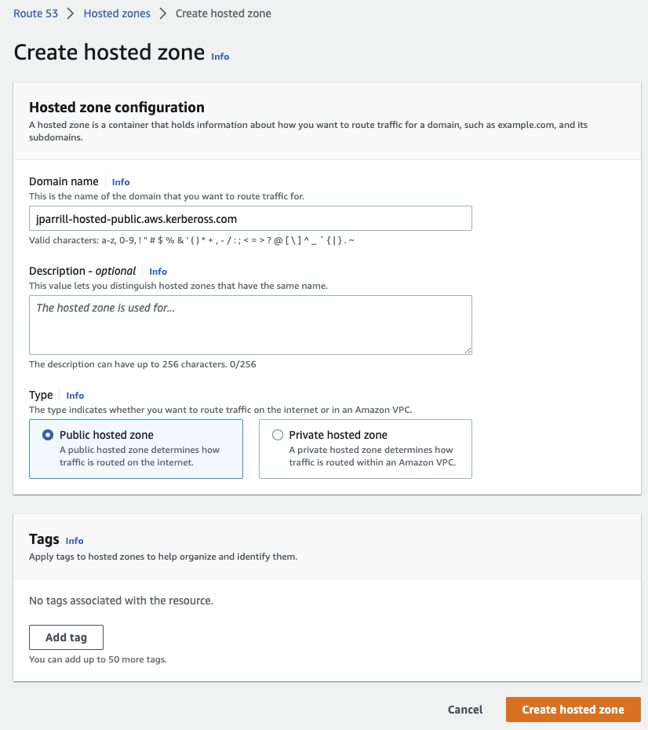
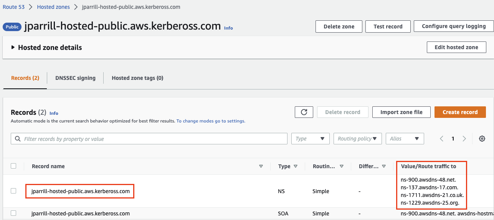
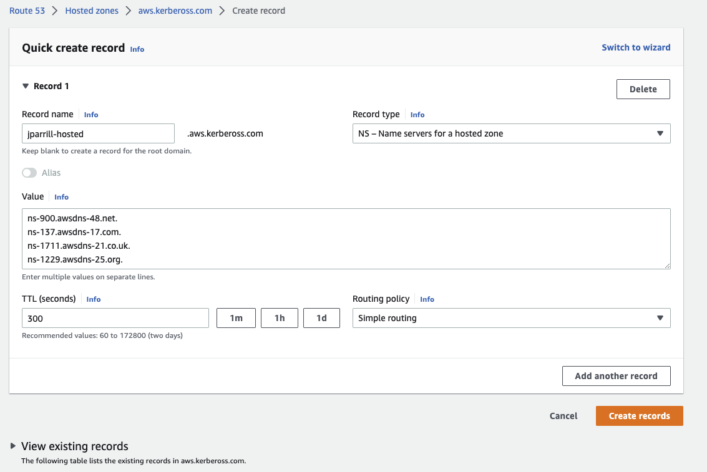
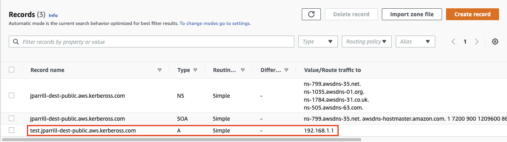
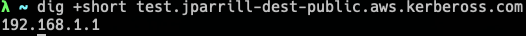

# External DNS

Hypershift separation between Control Plane and Data Plane enables two independent areas for DNS configuration: 

* Ingress for workloads within the hosted cluster (traditionally *.apps.service-consumer-domain.com).
* Ingress for service endpoints within the management cluster (e.g. api / oauth endpoints via *.service-provider-domain.com).


The input for the `hostedCluster.spec.dns` dictates the first one.
The input for `hostedCluster.spec.services.routePublishingStrategy.hostname` dictates the second one, which we'll elaborate in this doc.

Note: External DNS will only make a difference for setups with Public endpoints i.e. "Public" or "PublicAndPrivate". For a "Private" setup all endpoints will be accessible via `.hypershift.local`, which will contain CNAME records to the appropriate Private Link Endpoint Services.

## Platform Compatibility

!!! warning "Cloud Platforms Only"
    External-DNS is designed for **cloud platforms only** (AWS, Azure) and requires **explicit route hostnames** (Pattern A).

    **Key Requirements**:
    - Only processes routes with `spec.services[].route.hostname` explicitly set in the HostedCluster spec
    - Requires `--external-dns-domain` flag during cluster creation (e.g., `--external-dns-domain=service-provider-domain.com`)
    - Creates DNS records in the cloud provider's DNS service (AWS Route53, Azure DNS)

    **Platform=None Limitation**:
    - External-DNS does **NOT** process Platform=None routes
    - Platform=None clusters should use **NodePort** or **LoadBalancer** service publishing strategies
    - For route-based publishing on Platform=None, see [Exposing Services from HCP](../common/exposing-services-from-hcp.md) for alternative approaches using shared ingress

    For more details on service publishing patterns, see [Exposing Services from HCP](../common/exposing-services-from-hcp.md).

# Use Service-level DNS for Control Plane Services
There are four service that are exposed by a Hosted Control Plane (HCP)

* `APIServer`
* `OAuthService`
* `Konnectivity`
* `Ignition`

Each of these services is exposed using a `servicePublishingStrategy` in the HostedCluster spec.

By default, for `servicePublishingStrategy` types `LoadBalancer` and `Route`, the service will be published using the hostname of the LoadBalancer found in the status of the `Service` with type `LoadBalancer`, or in the `status.host` field of the `Route`.

This is acceptable for Hypershift development environments.  However, when deploying Hypershift in a managed service context, this method leaks the ingress subdomain of the underlying management cluster and can limit options for management cluster lifecycling and disaster recovery.  For example, if the AWS load balancer for a service is lost for whatever reason, the DNS name of that load balancer is in the kubelet kubeconfig of each node in the guest cluster.  Restoring the cluster would involve an out-of-band update of all kubelet kubeconfigs on existing nodes.

Having a DNS indirection layer on top of the `LoadBalancer` and `Route` publishing types allows a managed service operator to publish all _public_ HostedCluster `services` using a service-level domain.  This allows remampping on the DNS name to a new `LoadBalancer` or `Route` and does not expose the ingress domain of the management cluster.

## External-dns setup

Hypershift uses [external-dns](https://github.com/openshift/external-dns) to achieve this indirection.

`external-dns` is optionally deployed alongside the `hypershift-operator` in the `hypershift` namespace of the management cluster. It watches the cluster for `Services` or `Routes` with the `external-dns.alpha.kubernetes.io/hostname` annotation.  This value of this annotation is used to create a DNS record pointing to the `Service` (A record) or `Route` (CNAME record).

`hypershift install` will create the `external-dns` deployment if the proper flags are set:

```
hypershift install --external-dns-provider=aws --external-dns-credentials=route53-aws-creds --external-dns-domain-filter=service-provider-domain.com ...
```

where `external-dns-provider` is the DNS provider that manages the service-level DNS zone, `external-dns-credentials` is the credentials file appropriate for the specified provider, and `external-dns-domain-filter` is the service-level domain.

### Creating the public DNS Hosted zone

**external-dns-domain**: Should point to an external public domain (pre-created).

To create this Hosted Zone, you can do it in the AWS Route53 Management console:

- Create a Hosted zone in your Management console



- Grab the values from the zone created to configure them (in our case) in the subzone



- In the main domain, create the NS record to redirect the DNS requests to that delegated zone (use the values from the previous step)



- In order to verify that all works fine, create a test entry in the new subzone and test it with a dig command





## HostedCluster with Service Hostnames

Create a HostedCluster that sets `hostname` for `LoadBalancer` and `Route` services:

```
hypershift create cluster aws --name=example --endpoint-access=PublicAndPrivate --external-dns-domain=service-provider-domain.com ...
```

> **NOTE:** The **external-dns-domain** should match the Public Hosted Zone created in the previous step

The resulting HostedCluster `services` block looks like this:

```
  platform:
    aws:
      endpointAccess: PublicAndPrivate
...
  services:
  - service: APIServer
    servicePublishingStrategy:
      route:
        hostname: api-example.service-provider-domain.com
      type: Route
  - service: OAuthServer
    servicePublishingStrategy:
      route:
        hostname: oauth-example.service-provider-domain.com
      type: Route
  - service: Konnectivity
    servicePublishingStrategy:
      type: Route
  - service: Ignition
    servicePublishingStrategy:
      type: Route
```

When the `Services` and `Routes` are created by the Control Plane Operator (CPO), it will annotate them with the `external-dns.alpha.kubernetes.io/hostname` annotation. The value will be the `hostname` field in the `servicePublishingStrategy` for that type.  The CPO uses this name blindly for the service endpoints and assumes that if `hostname` is set, there is some mechanism external-dns or otherwise, that will create the DNS records.

There is an interaction between the `spec.platform.aws.endpointAccess` and which services are permitted to set `hostname` when using [AWS Private clustering](deploy-aws-private-clusters.md).  Only *public* services can have service-level DNS indirection.  Private services use the `hypershift.local` private zone and it is not valid to set `hostname` for `services` that are private for a given `endpointAccess` type.

The following table notes when it is valid to set hostname for a particular `service` and `endpointAccess` combination:

|              | Public | PublicAndPrivate | Private |
|--------------|--------|------------------|---------|
| APIServer    | Y      | Y                | N       |
| OAuthServer  | Y      | Y                | N       |
| Konnectivity | Y      | N                | N       |
| Ingition     | Y      | N                | N       |

## Examples of how to deploy a cluster using the CLI and externalDNS

Having a vanilla Openshift cluster, follow this steps

<details>
<summary>Deploy Hypershift and ExternalDNS operators with the external Public HostedZone already created</summary>

- Ensure the public hosted zone already exists, in our case is `service-provider-domain.com` 
- Hypershift Deployment command
```bash
export KUBECONFIG=<PATH TO MANAGEMENT's CLUSTER's KUBECONFIG's>
export REGION=us-west-1
export BUCKET_NAME=jparrill-hosted-us-west-1
export AWS_CREDS=~/.aws/credentials

hypershift install \
    --oidc-storage-provider-s3-bucket-name ${BUCKET_NAME} \
    --oidc-storage-provider-s3-credentials ${AWS_CREDS} \
    --oidc-storage-provider-s3-region ${REGION} \
    --external-dns-provider=aws \
    --external-dns-credentials=${AWS_CREDS} \
    --external-dns-domain-filter=service-provider-domain.com \
    --private-platform AWS \
    --aws-private-creds ${AWS_CREDS} \
    --aws-private-region ${REGION}
```

</details>

<details>
<summary>Deploy HostedCluster using ExternalDNS feature</summary>

- Ensure the `externaldns` operator is up and the internal flags points to the desired public hosted zone
- HostedCluster Deployment command 
```bash
export KUBECONFIG=<MGMT Cluster Kubeconfig>
export AWS_CREDS=~/.aws/credentials
export REGION=us-west-1

hypershift create cluster aws \
    --aws-creds ${AWS_CREDS} \
    --instance-type m6i.xlarge \
    --region ${REGION} \
    --auto-repair \
    --generate-ssh \
    --name jparrill-hosted \
    --namespace clusters \
    --base-domain service-consumer-domain.com \
    --node-pool-replicas 2 \
    --pull-secret ${HOME}/pull_secret.json \
    --release-image quay.io/openshift-release-dev/ocp-release:4.12.0-ec.3-x86_64 \
    --external-dns-domain=service-provider-domain.com \
    --endpoint-access=PublicAndPrivate
```

Let's remark some things from this command:<br>

```bash
- external-dns-domain: Points to our public externalDNS hosted zone service-provider-domain.com, typically in an AWS account owned by the service provider.
- base-domain: Points to the public hosted zone service-consumer-domain.com, typically in an AWS account owned by the service consumer. 
- endpoint-access: Is set as PublicAndPrivate. ExternalDNS feature only could be used with Public and PublicAndPrivate configurations.
```

</details>
