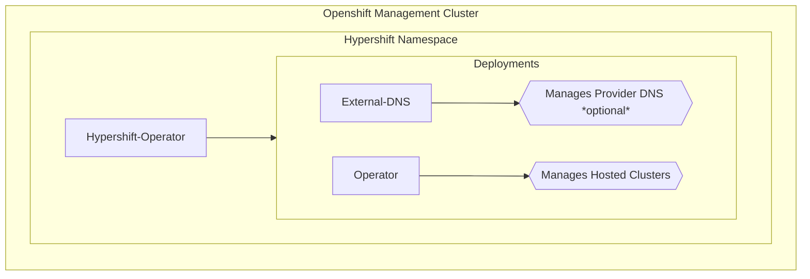
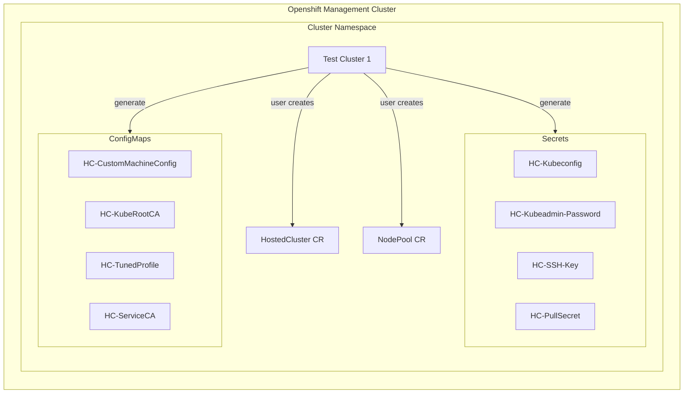
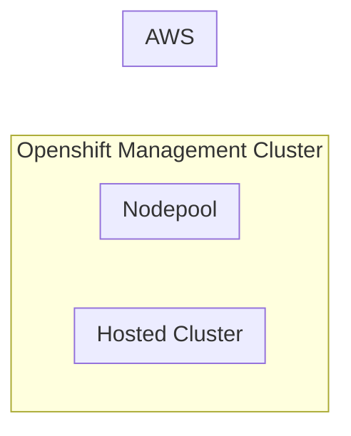

# AWS Architecture and Resources

In this section we will talk about the AWS Resources and Openshift objects generated by Hypershift and how the Controllers interact with them during a Hosted Cluster deployment.

You have 2 paths to follow, using the CLI and using Openshift/Kubernetes objects (CRs), like *HostedCluster* and *NodePool* which are the top level objects that we will focus on. From both ones the proper Controller for that resource will take care of the object generation under that CR.

This is how looks like when you have the Hypershift Operator deployed into the Openshift Management Cluster

The CLI will create 2 deployments:

- **ExternalDNS**: It will take care of the DNS management with the Cloud Provider. It will try to create entries into the domain/subdomain set in the install command.
- **Operator**: Stands for Hypershift Operator and it has some controllers inside which manages the HostedClusters and NodePools created in the cluster's namespace.

This is the Hosted Cluster namespace where you as a user will create the definition of your cluster and your nodes.

Once you creates the Hosted Cluster, the controllers will come in action and they will create the Infra components in the defined provider and as a first step it will assign an InfraID to all the objects created in the AWS side.

