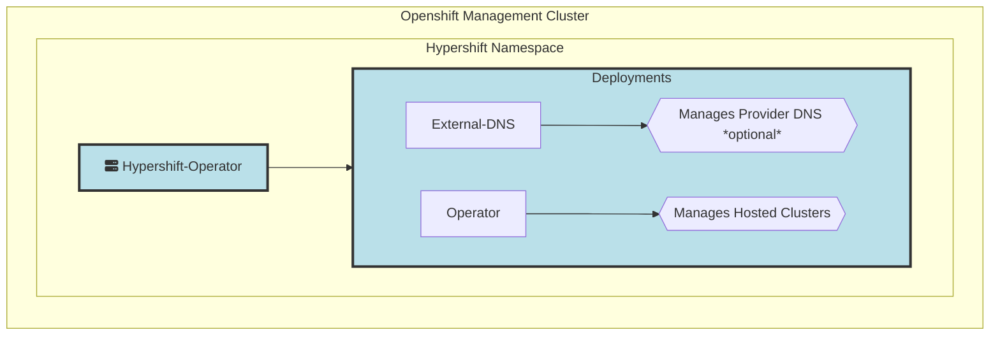
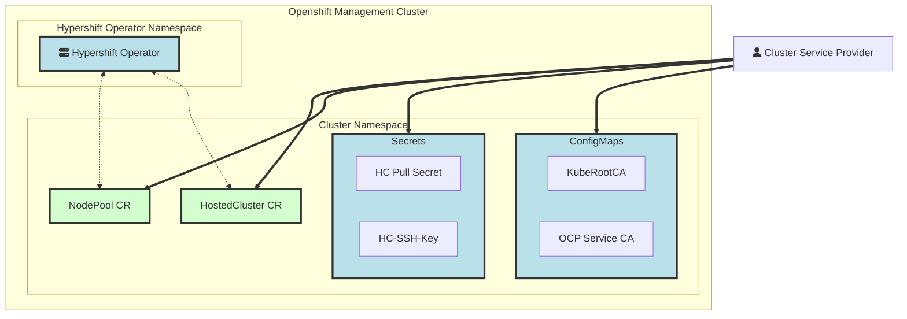
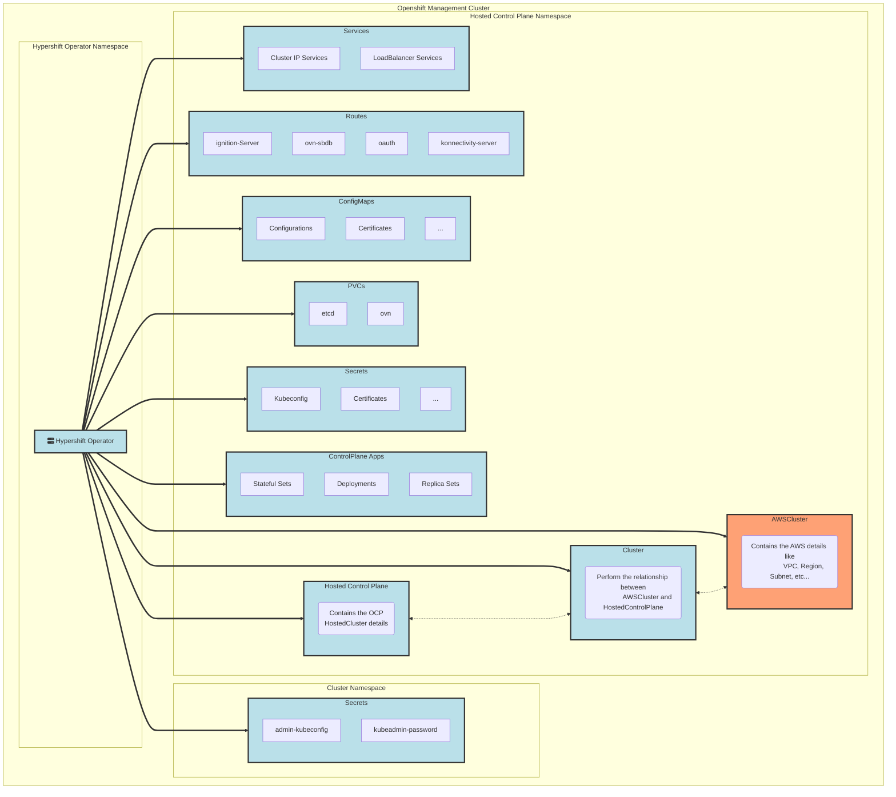
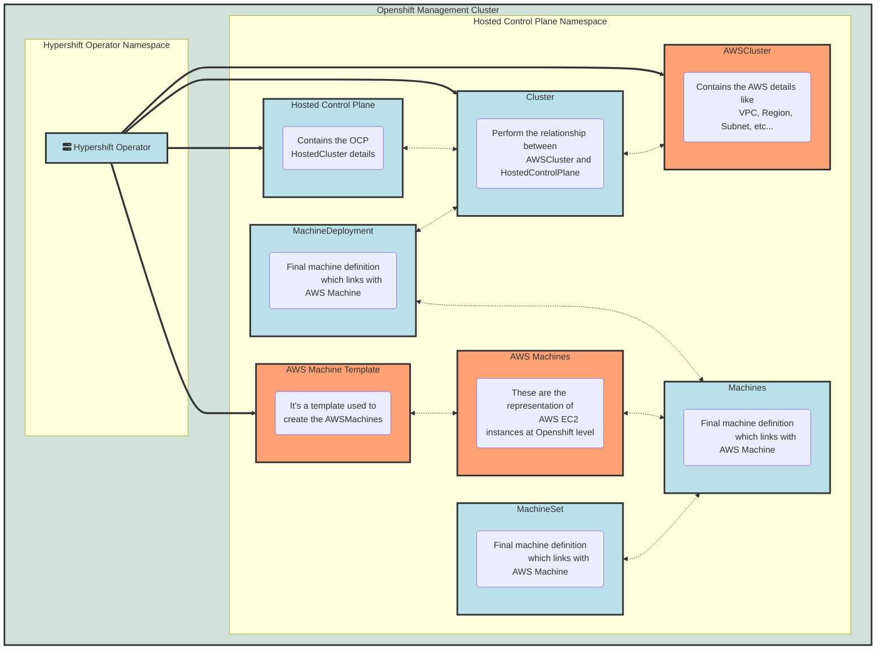
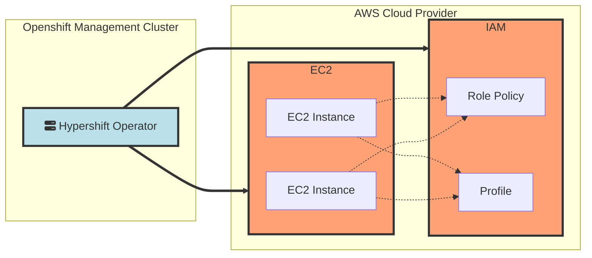
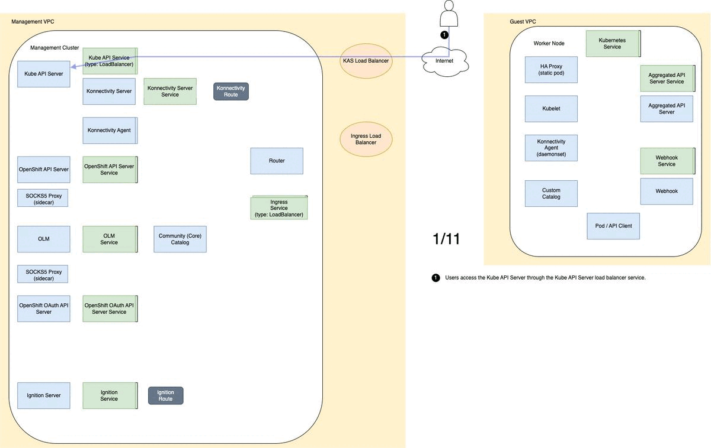

# AWS Architecture and Resources

In this section we will talk about the AWS Resources and Openshift objects generated by Hypershift and how the Controllers interact with them during a Hosted Cluster deployment.

## Prerequisites and Assumptions

In order to understand the Concepts and Personas of this document, please check the already existant documentation [here](../../reference/concepts-and-personas.md).

In the Prerequisites side we will have 2 statements:

- Prerequisites to deploy and work with Hypershift Operator
- Prerequisites to deploy a HostedCluster

### Prerequisites to deploy and work with Hypershift Operator

- **For Hypershift Deployment and Configuration**: This is required in order to allow the CLI to generate the proper SA and ClusterRoles to deploy Hypershift into the management cluster
- **For a Hosted Cluster deployment**: In order to create a HostedCluster, you will need to create some Roles and RolePolicies (all points to the same IAM resource id) in AWS platform. You can check the sample roles created in AWS:

    - **Roles Needed in AWS AIM**

    === "controlPlaneOperatorARN"
        ```json

        {
            "Version": "2012-10-17",
            "Statement": [
                {
                    "Effect": "Allow",
                    "Action": [
                        "ec2:CreateVpcEndpoint",
                        "ec2:DescribeVpcEndpoints",
                        "ec2:ModifyVpcEndpoint",
                        "ec2:DeleteVpcEndpoints",
                        "ec2:CreateTags",
                        "route53:ListHostedZones"
                    ],
                    "Resource": "*"
                },
                {
                    "Effect": "Allow",
                    "Action": [
                        "route53:ChangeResourceRecordSets",
                        "route53:ListResourceRecordSets"
                    ],
                    "Resource": "arn:aws:route53:::hostedzone/Z093004827I7TY8DW3Z9K"
                }
            ]
        }

        ```

    === "storageARN"
        ```json

        {
            "Version": "2012-10-17",
            "Statement": [
                {
                    "Effect": "Allow",
                    "Action": [
                        "ec2:AttachVolume",
                        "ec2:CreateSnapshot",
                        "ec2:CreateTags",
                        "ec2:CreateVolume",
                        "ec2:DeleteSnapshot",
                        "ec2:DeleteTags",
                        "ec2:DeleteVolume",
                        "ec2:DescribeInstances",
                        "ec2:DescribeSnapshots",
                        "ec2:DescribeTags",
                        "ec2:DescribeVolumes",
                        "ec2:DescribeVolumesModifications",
                        "ec2:DetachVolume",
                        "ec2:ModifyVolume"
                    ],
                    "Resource": "*"
                }
            ]
        }

        ```

    === "kubeCloudControllerARN"
        ```json

        {
            "Version": "2012-10-17",
            "Statement": [
                {
                    "Action": [
                        "ec2:DescribeInstances",
                        "ec2:DescribeImages",
                        "ec2:DescribeRegions",
                        "ec2:DescribeRouteTables",
                        "ec2:DescribeSecurityGroups",
                        "ec2:DescribeSubnets",
                        "ec2:DescribeVolumes",
                        "ec2:CreateSecurityGroup",
                        "ec2:CreateTags",
                        "ec2:CreateVolume",
                        "ec2:ModifyInstanceAttribute",
                        "ec2:ModifyVolume",
                        "ec2:AttachVolume",
                        "ec2:AuthorizeSecurityGroupIngress",
                        "ec2:CreateRoute",
                        "ec2:DeleteRoute",
                        "ec2:DeleteSecurityGroup",
                        "ec2:DeleteVolume",
                        "ec2:DetachVolume",
                        "ec2:RevokeSecurityGroupIngress",
                        "ec2:DescribeVpcs",
                        "elasticloadbalancing:AddTags",
                        "elasticloadbalancing:AttachLoadBalancerToSubnets",
                        "elasticloadbalancing:ApplySecurityGroupsToLoadBalancer",
                        "elasticloadbalancing:CreateLoadBalancer",
                        "elasticloadbalancing:CreateLoadBalancerPolicy",
                        "elasticloadbalancing:CreateLoadBalancerListeners",
                        "elasticloadbalancing:ConfigureHealthCheck",
                        "elasticloadbalancing:DeleteLoadBalancer",
                        "elasticloadbalancing:DeleteLoadBalancerListeners",
                        "elasticloadbalancing:DescribeLoadBalancers",
                        "elasticloadbalancing:DescribeLoadBalancerAttributes",
                        "elasticloadbalancing:DetachLoadBalancerFromSubnets",
                        "elasticloadbalancing:DeregisterInstancesFromLoadBalancer",
                        "elasticloadbalancing:ModifyLoadBalancerAttributes",
                        "elasticloadbalancing:RegisterInstancesWithLoadBalancer",
                        "elasticloadbalancing:SetLoadBalancerPoliciesForBackendServer",
                        "elasticloadbalancing:AddTags",
                        "elasticloadbalancing:CreateListener",
                        "elasticloadbalancing:CreateTargetGroup",
                        "elasticloadbalancing:DeleteListener",
                        "elasticloadbalancing:DeleteTargetGroup",
                        "elasticloadbalancing:DescribeListeners",
                        "elasticloadbalancing:DescribeLoadBalancerPolicies",
                        "elasticloadbalancing:DescribeTargetGroups",
                        "elasticloadbalancing:DescribeTargetHealth",
                        "elasticloadbalancing:ModifyListener",
                        "elasticloadbalancing:ModifyTargetGroup",
                        "elasticloadbalancing:RegisterTargets",
                        "elasticloadbalancing:SetLoadBalancerPoliciesOfListener",
                        "iam:CreateServiceLinkedRole",
                        "kms:DescribeKey"
                    ],
                    "Resource": [
                        "*"
                    ],
                    "Effect": "Allow"
                }
            ]
        }

        ```

    === "controlPlaneOperatorARN"
        ```json

        {
            "Version": "2012-10-17",
            "Statement": [
                {
                    "Effect": "Allow",
                    "Action": [
                        "ec2:CreateVpcEndpoint",
                        "ec2:DescribeVpcEndpoints",
                        "ec2:ModifyVpcEndpoint",
                        "ec2:DeleteVpcEndpoints",
                        "ec2:CreateTags",
                        "route53:ListHostedZones"
                    ],
                    "Resource": "*"
                },
                {
                    "Effect": "Allow",
                    "Action": [
                        "route53:ChangeResourceRecordSets",
                        "route53:ListResourceRecordSets"
                    ],
                    "Resource": "arn:aws:route53:::hostedzone/Z093004827I7TY8DW3Z9K"
                }
            ]
        }

        ```

    === "networkARN"
        ```json

        {
            "Version": "2012-10-17",
            "Statement": [
                {
                    "Effect": "Allow",
                    "Action": [
                        "ec2:DescribeInstances",
                        "ec2:DescribeInstanceStatus",
                        "ec2:DescribeInstanceTypes",
                        "ec2:UnassignPrivateIpAddresses",
                        "ec2:AssignPrivateIpAddresses",
                        "ec2:UnassignIpv6Addresses",
                        "ec2:AssignIpv6Addresses",
                        "ec2:DescribeSubnets",
                        "ec2:DescribeNetworkInterfaces"
                    ],
                    "Resource": "*"
                }
            ]
        }

        ```

    === "nodePoolManagementARN"
        ```json

        {
            "Version": "2012-10-17",
            "Statement": [
                {
                    "Action": [
                        "ec2:AllocateAddress",
                        "ec2:AssociateRouteTable",
                        "ec2:AttachInternetGateway",
                        "ec2:AuthorizeSecurityGroupIngress",
                        "ec2:CreateInternetGateway",
                        "ec2:CreateNatGateway",
                        "ec2:CreateRoute",
                        "ec2:CreateRouteTable",
                        "ec2:CreateSecurityGroup",
                        "ec2:CreateSubnet",
                        "ec2:CreateTags",
                        "ec2:DeleteInternetGateway",
                        "ec2:DeleteNatGateway",
                        "ec2:DeleteRouteTable",
                        "ec2:DeleteSecurityGroup",
                        "ec2:DeleteSubnet",
                        "ec2:DeleteTags",
                        "ec2:DescribeAccountAttributes",
                        "ec2:DescribeAddresses",
                        "ec2:DescribeAvailabilityZones",
                        "ec2:DescribeImages",
                        "ec2:DescribeInstances",
                        "ec2:DescribeInternetGateways",
                        "ec2:DescribeNatGateways",
                        "ec2:DescribeNetworkInterfaces",
                        "ec2:DescribeNetworkInterfaceAttribute",
                        "ec2:DescribeRouteTables",
                        "ec2:DescribeSecurityGroups",
                        "ec2:DescribeSubnets",
                        "ec2:DescribeVpcs",
                        "ec2:DescribeVpcAttribute",
                        "ec2:DescribeVolumes",
                        "ec2:DetachInternetGateway",
                        "ec2:DisassociateRouteTable",
                        "ec2:DisassociateAddress",
                        "ec2:ModifyInstanceAttribute",
                        "ec2:ModifyNetworkInterfaceAttribute",
                        "ec2:ModifySubnetAttribute",
                        "ec2:ReleaseAddress",
                        "ec2:RevokeSecurityGroupIngress",
                        "ec2:RunInstances",
                        "ec2:TerminateInstances",
                        "tag:GetResources",
                        "ec2:CreateLaunchTemplate",
                        "ec2:CreateLaunchTemplateVersion",
                        "ec2:DescribeLaunchTemplates",
                        "ec2:DescribeLaunchTemplateVersions",
                        "ec2:DeleteLaunchTemplate",
                        "ec2:DeleteLaunchTemplateVersions"
                    ],
                    "Resource": [
                        "*"
                    ],
                    "Effect": "Allow"
                },
                {
                    "Condition": {
                        "StringLike": {
                            "iam:AWSServiceName": "elasticloadbalancing.amazonaws.com"
                        }
                    },
                    "Action": [
                        "iam:CreateServiceLinkedRole"
                    ],
                    "Resource": [
                        "arn:*:iam::*:role/aws-service-role/elasticloadbalancing.amazonaws.com/AWSServiceRoleForElasticLoadBalancing"
                    ],
                    "Effect": "Allow"
                },
                {
                    "Action": [
                        "iam:PassRole"
                    ],
                    "Resource": [
                        "arn:*:iam::*:role/*-worker-role"
                    ],
                    "Effect": "Allow"
                }
            ]
        }

        ```

    === "imageRegistryARN"
        ```json

        {
            "Version": "2012-10-17",
            "Statement": [
                {
                    "Effect": "Allow",
                    "Action": [
                        "s3:CreateBucket",
                        "s3:DeleteBucket",
                        "s3:PutBucketTagging",
                        "s3:GetBucketTagging",
                        "s3:PutBucketPublicAccessBlock",
                        "s3:GetBucketPublicAccessBlock",
                        "s3:PutEncryptionConfiguration",
                        "s3:GetEncryptionConfiguration",
                        "s3:PutLifecycleConfiguration",
                        "s3:GetLifecycleConfiguration",
                        "s3:GetBucketLocation",
                        "s3:ListBucket",
                        "s3:GetObject",
                        "s3:PutObject",
                        "s3:DeleteObject",
                        "s3:ListBucketMultipartUploads",
                        "s3:AbortMultipartUpload",
                        "s3:ListMultipartUploadParts"
                    ],
                    "Resource": "*"
                }
            ]
        }

        ```

    === "ingressARN"
        ```json

        {
            "Version": "2012-10-17",
            "Statement": [
                {
                    "Effect": "Allow",
                    "Action": [
                        "elasticloadbalancing:DescribeLoadBalancers",
                        "tag:GetResources",
                        "route53:ListHostedZones"
                    ],
                    "Resource": "*"
                },
                {
                    "Effect": "Allow",
                    "Action": [
                        "route53:ChangeResourceRecordSets"
                    ],
                    "Resource": [
                        "arn:aws:route53:::hostedzone/Z04148342DPTGWECPH7M5",
                        "arn:aws:route53:::hostedzone/Z0498824N2ZYL62T258T"
                    ]
                }
            ]
        }

        ```

    === "workerRoleARN"
        ```json

        {
            "Version": "2012-10-17",
            "Statement": [
                {

                    "Effect": "Allow",
                    "Action": [
                        "ec2:DescribeInstances",
                        "ec2:DescribeRegions"
                    ],
                    "Resource": "*"
                }
            ]
        }

        ```


- **AWS Route 53 Domain**: This is needed in order to create reachable API via DNS name instead of using the ELB name. This is only relevant when a Cluster type is `Public` or `PublicAndPrivate`, not relevant for Private only.
- **S3 Bucket**: An S3 Bucket publicly accesible, this is mandatory in order to upload the OIDC data for the given HostedCluster.
- **OCP Pull Secret**: Openshift Pull Secret (Authorization/Authentication file) to pull the images from the remote registry. This it is not an AWS Object but will be mandatory to deploy the OCP Cluster
- **AWS Credentials**: Your path to AWS credentials, something like `$HOME/.aws/credentials` To create resources into AWS Provider
- **AWS Quota**: You will need enough quota (described [here](#prerequisites-to-deploy-a-hostedcluster) to create all the AWS Objects managed by Hypershift and others managed by Openshift itself. We will provide a detailed list of resources.

With these elements you should be able to deploy Hypershift into the Openshift cluster.

### Prerequisites to deploy a HostedCluster

This is a detailed list of objects **needed** by Hypershift/OCP into AWS in order to manage Hosted Clusters, so **they should preexists** in order to have a successfull Hosted Cluster deployment.

- Components needed in AWS for HostedCluster deployments

    === "Public"

        - 1 VPC
        - 1 DHCP Options
        - 1 Public Subnet (for Public HostedCluster)
        - 1 Internet Gateway
        - 1 NAT Gateway
        - 1 Security Group (Worker Nodes)
        - 1 Route Tables (Public)
        - 1 Private Hosted Zones for Cluster Ingress

    === "Private"

        - 1 VPC
        - 1 DHCP Options
        - 1 Private Subnet (for Private HostedCluster)
        - 1 Internet Gateway
        - 1 NAT Gateway
        - 1 Security Group (Worker Nodes)
        - 1 Route Tables (Private)
        - 1 Private Hosted Zones for PrivateLink

    === "PublicAndPrivate"
        - 1 VPC
        - 1 DHCP Options
        - 2 Subnets
            - 1 Private Subnet (for Private HostedCluster)
            - 1 Public Subnet (for Public HostedCluster)
        - 1 Internet Gateway
        - 1 NAT Gateway
        - 1 Security Group (Worker Nodes)
        - 2 Route Tables (1 Private, 1 Public)
        - 2 Private Hosted Zones
            - 1 for Cluster Ingress (for Public clusters)
            - 1 for PrivateLink (for private clusters)

After the creation of these AWS Objects and to perform the relationship among them, you can create the Hosted Cluster CR in order to begin the Control Plane deployment.

An easy way to see how the relationships are made among the AWS Objects you can check this CLI HostedCluster deployment

<details>
<summary>Hosted Cluster deployment</summary>

- Command
```bash
./bin/hypershift create cluster aws \
    --aws-creds ~/.aws/credentials \
    --instance-type m6i.xlarge \
    --region us-west-1 \
    --auto-repair --generate-ssh \
    --name jparrill-dest \
    --namespace jparrill \
    --base-domain jpdv.aws.kerbeross.com \
    --node-pool-replicas 2 \
    --pull-secret pull_secret.json \
    --release-image quay.io/openshift-release-dev/ocp-release:4.12.0-ec.3-x86_64
```

- Example Output
```bash
<Timestamp>  INFO  Creating infrastructure	{"id": "jparrill-dest-zjhcn"}
<Timestamp>  INFO  Using zone	{"zone": "us-west-1b"}
<Timestamp>  INFO  Created VPC	{"id": "vpc-0308cd23c0f02f581"}
<Timestamp>  INFO  Enabled DNS support on VPC	{"id": "vpc-0308cd23c0f02f581"}
<Timestamp>  INFO  Enabled DNS hostnames on VPC	{"id": "vpc-0308cd23c0f02f581"}
<Timestamp>  INFO  Created DHCP options	{"id": "dopt-0a5697eb99ac6d2b0"}
<Timestamp>  INFO  Associated DHCP options with VPC	{"vpc": "vpc-0308cd23c0f02f581", "dhcp options": "dopt-0a5697eb99ac6d2b0"}
<Timestamp>  INFO  Created internet gateway	{"id": "igw-05e94b5cf6c7dcf37"}
<Timestamp>  INFO  Attached internet gateway to VPC	{"internet gateway": "igw-05e94b5cf6c7dcf37", "vpc": "vpc-0308cd23c0f02f581"}
<Timestamp>  INFO  Created security group	{"name": "jparrill-dest-zjhcn-worker-sg", "id": "sg-0bb89f0dc63317a3d"}
<Timestamp>  INFO  Authorized ingress rules on security group	{"id": "sg-0bb89f0dc63317a3d"}
<Timestamp>  INFO  Created subnet	{"name": "jparrill-dest-zjhcn-private-us-west-1b", "id": "subnet-0c39d4e9d15939102"}
<Timestamp>  INFO  Created subnet	{"name": "jparrill-dest-zjhcn-public-us-west-1b", "id": "subnet-09e44eb489efda594"}
<Timestamp>  INFO  Created elastic IP for NAT gateway	{"id": "eipalloc-0f8cf37878036e4f2"}
<Timestamp>  INFO  Created NAT gateway	{"id": "nat-0a2468d81aa7702d4"}
<Timestamp>  INFO  Created route table	{"name": "jparrill-dest-zjhcn-private-us-west-1b", "id": "rtb-0d2d22c15b5117341"}
<Timestamp>  INFO  Created route to NAT gateway	{"route table": "rtb-0d2d22c15b5117341", "nat gateway": "nat-0a2468d81aa7702d4"}
<Timestamp>  INFO  Associated subnet with route table	{"route table": "rtb-0d2d22c15b5117341", "subnet": "subnet-0c39d4e9d15939102"}
<Timestamp>  INFO  Created route table	{"name": "jparrill-dest-zjhcn-public", "id": "rtb-06c3ce14f6ec66aea"}
<Timestamp>  INFO  Set main VPC route table	{"route table": "rtb-06c3ce14f6ec66aea", "vpc": "vpc-0308cd23c0f02f581"}
<Timestamp>  INFO  Created route to internet gateway	{"route table": "rtb-06c3ce14f6ec66aea", "internet gateway": "igw-05e94b5cf6c7dcf37"}
<Timestamp>  INFO  Associated route table with subnet	{"route table": "rtb-06c3ce14f6ec66aea", "subnet": "subnet-09e44eb489efda594"}
<Timestamp>  INFO  Created s3 VPC endpoint	{"id": "vpce-082cb38bea3a524bf"}
<Timestamp>  INFO  Found existing public zone	{"name": "jpdv.aws.kerbeross.com", "id": "Z0738860150HLCUE93T0O"}
<Timestamp>  INFO  Created private zone	{"name": "jparrill-dest.jpdv.aws.kerbeross.com", "id": "Z0715900QU0F9PYOG1BK"}
<Timestamp>  INFO  Created private zone	{"name": "jparrill-dest.hypershift.local", "id": "Z084467911JBX8P3G8359"}
<Timestamp>  INFO  Detected Issuer URL	{"issuer": "https://hypershift-ci-1-oidc.s3.us-east-1.amazonaws.com/jparrill-dest-zjhcn"}
<Timestamp>  INFO  Created OIDC provider	{"provider": "arn:aws:iam::820196288204:oidc-provider/hypershift-ci-1-oidc.s3.us-east-1.amazonaws.com/jparrill-dest-zjhcn"}
<Timestamp>  INFO  Created role	{"name": "jparrill-dest-zjhcn-openshift-ingress"}
<Timestamp>  INFO  Created role policy	{"name": "jparrill-dest-zjhcn-openshift-ingress"}
<Timestamp>  INFO  Created role	{"name": "jparrill-dest-zjhcn-openshift-image-registry"}
<Timestamp>  INFO  Created role policy	{"name": "jparrill-dest-zjhcn-openshift-image-registry"}
<Timestamp>  INFO  Created role	{"name": "jparrill-dest-zjhcn-aws-ebs-csi-driver-controller"}
<Timestamp>  INFO  Created role policy	{"name": "jparrill-dest-zjhcn-aws-ebs-csi-driver-controller"}
<Timestamp>  INFO  Created role	{"name": "jparrill-dest-zjhcn-cloud-controller"}
<Timestamp>  INFO  Created role policy	{"name": "jparrill-dest-zjhcn-cloud-controller"}
<Timestamp>  INFO  Created role	{"name": "jparrill-dest-zjhcn-node-pool"}
<Timestamp>  INFO  Created role policy	{"name": "jparrill-dest-zjhcn-node-pool"}
<Timestamp>  INFO  Created role	{"name": "jparrill-dest-zjhcn-control-plane-operator"}
<Timestamp>  INFO  Created role policy	{"name": "jparrill-dest-zjhcn-control-plane-operator"}
<Timestamp>  INFO  Created role	{"name": "jparrill-dest-zjhcn-cloud-network-config-controller"}
<Timestamp>  INFO  Created role policy	{"name": "jparrill-dest-zjhcn-cloud-network-config-controller"}
<Timestamp>  INFO  Created role	{"name": "jparrill-dest-zjhcn-worker-role"}
<Timestamp>  INFO  Created instance profile	{"name": "jparrill-dest-zjhcn-worker"}
<Timestamp>  INFO  Added role to instance profile	{"role": "jparrill-dest-zjhcn-worker-role", "profile": "jparrill-dest-zjhcn-worker"}
<Timestamp>  INFO  Created role policy	{"name": "jparrill-dest-zjhcn-worker-policy"}
<Timestamp>  INFO  Created IAM profile	{"name": "jparrill-dest-zjhcn-worker", "region": "us-west-1"}
<Timestamp>  INFO  Applied Kube resource	{"kind": "Namespace", "namespace": "", "name": "jparrill"}
<Timestamp>  INFO  Applied Kube resource	{"kind": "Secret", "namespace": "jparrill", "name": "jparrill-dest-pull-secret"}
<Timestamp>  INFO  Applied Kube resource	{"kind": "", "namespace": "jparrill", "name": "jparrill-dest"}
<Timestamp>  INFO  Applied Kube resource	{"kind": "Secret", "namespace": "jparrill", "name": "jparrill-dest-etcd-encryption-key"}
<Timestamp>  INFO  Applied Kube resource	{"kind": "Secret", "namespace": "jparrill", "name": "jparrill-dest-ssh-key"}
<Timestamp>  INFO  Applied Kube resource	{"kind": "NodePool", "namespace": "jparrill", "name": "jparrill-dest-us-west-1b"}
```

</details>


After this, the Openshift Hosted Control Plane will continue being deployed and eventually the cluster will create some resources which will end on AWS object creation (These are not managed by Hypershift but Openshift):

- **Cluster Route**: It's the main router for the accesses from outside in Openshift. **It creates 1 ELB (External Load Balancer) in AWS** provider which route the request to the cluster from outside.

## Architecture and Workflow

In order to deploy a HostedCluster you have two options, using the **CLI** or using **Openshift/Kubernetes objects (CRs)**, like *HostedCluster* and *NodePool* which are the top-level API objects that we will focus on. From each, the proper controller will take care of the object generation under that CR.

This is how looks like when you have the Hypershift Operator deployed into the Openshift Management Cluster

- Objects Created and Managed after the Hypershift Operator deployment, in the Hypershift namespace:



!!! note "Legend"
    - **Cyan:** Provider agnostic OCP objects.

The CLI will create 2 deployments:

- **ExternalDNS**: the external-dns pod creates the DNSs entries within the Cloud Provider (Route 53). It will try to create entries into the domain/subdomain set in the install command.
- **Operator**: Stands for Hypershift Operator and it has some controllers inside which manages the HostedClusters and NodePools created in the cluster's namespace.

!!! info
    Regardless of whether you use the External DNS feature or not, as mentioned earlier, you need an already registered (or at least delegated) DNS domain in *Route 53*. This is where the public records are created to allow external access


### HostedCluster

This is the Hosted Cluster namespace where you as a user will create the definition of your cluster and your nodes. An easy way to create a hosted cluster is by using the CLI as we've seen in the last sample.

HostedCluster and NodePool controllers (part of Hypershift Operator) are monitoring the HostedCluster and NodePool objects being created in the whole cluster. So once you create one of these components, the controllers will begin the reconciliation.

You will need to have in mind that some more objects like Secrets and ConfigMaps (described in the diagram) are needed for a successful `HostedCluster` deployment.

From these mentioned objects, the Hypershift operator will create some more in 2 places, Openshift infrastructure and also in AWS Cloud Provider. Let's take a look to the following diagram to discover which objects are created in Openshift.

- **Diagram:** Objects manually created in the Cluster namespace needed for HostedCluster deployment



!!! note "Legend"
    - **Green:** Hypershift CRDs monitored by Hypershift Operator (also Provider Agnostic)
    - **Cyan:** Provider agnostic OCP objects.
    - The *dotted* lines are associations among AWS Components created by the CLI or the Operator
    - The **thick** lines are objects created by the CLI into AWS platform and needed by the Hypershift Operator to work properly

As we can see, the Hypershift operator has some watchers on top of HostedCluster and NodePool objects. Once created, the operator will start the HostedCluter deployment.

!!! info
    All the components showed in the previous diagram should be manually created.**


- **Diagram:** Objects automatically created in the Cluster and Hosted Control Plane namespaces, during the HostedCluster deployment


!!! note "Legend"
    - **Orange:** OCP objects directly related with AWS.
    - **Cyan:** Provider agnostic OCP objects.
    - The *dotted* lines are associations among AWS Components created by the CLI or the Operator
    - The **thick** lines are objects created by the CLI into AWS platform and needed by the Hypershift Operator to work properly

At the same time, the Hypershift operator will expect to exists the mentioned Infra components in the defined provider (You could use the Hypershift CLI in order to create them automatically). As a first step it will assign an InfraID to all the objects created in the AWS side.

- **Diagram:** The Diagrams shows 2 things, the objects Needed and Created in the AWS infrastructure. After this one we will dissect the objects in a more detailed way.

```mermaid
flowchart TB
    style HC fill:#BAE0E9,stroke:#333,stroke-width:3px
    style IC fill:#FF0000,stroke:#333,stroke-width:3px
    style vpc fill:#FEA175,stroke:#333,stroke-width:3px
    style AZ fill:#FEA175,stroke:#333,stroke-width:3px
    style IG fill:#FEA175,stroke:#333,stroke-width:3px
    style PBRT fill:#FEA175,stroke:#333,stroke-width:3px
    style PVRT fill:#FEA175,stroke:#333,stroke-width:3px
    style IAM fill:#FEA175,stroke:#333,stroke-width:3px
    style ELB fill:#FEA175,stroke:#333,stroke-width:3px
    style SG fill:#FEA175,stroke:#333,stroke-width:3px
    style DNS fill:#FEA175,stroke:#333,stroke-width:3px
    style EP fill:#FEA175,stroke:#333,stroke-width:3px

    subgraph OMC[Openshift Management Cluster]
        direction LR
        HC[fa:fa-server Hypershift Operator]
        IC[Ingress Controller]
    end
    HC ==> vpc
    HC ==> IG
    HC ==> SG
    HC ==> IG
    HC ==> PVRT
    HC ==> PBRT
    HC ==> PVZNPD
    HC ==> PVZNL
    HC ==> IAM
    HC -.-> PBZN
    IC ==> IELB
    vpcN <-.-> EIFNG
    PRTN -.-> vpcN
    PBRT <-.-> pbs
    PVRT <-.-> prs
    PVRIG -.-> IG
    PBRIG -.-> IG

    subgraph "AWS Cloud Provider"
        subgraph vpc[VPC]
            direction LR
            AZ[Availability Zone]
            subgraph AZ[Availability Zone]
                prs[Private Subnet]
                pbs[Public Subnet]
            end
            vpcDS[DNS Support]
            vpcDH[DNS Hostnames]
            vpcDC[DHCP Options]
            vpcN[NAT Gateway]

            subgraph EP[Endpoints]
                direction TB
                EPS3[S3 Endpoint]
            end
        end
        subgraph IG[Internet Gateway]
            direction LR
            EIFNG[Elastic Ip For NAT GW]
        end
        subgraph SG[Security Groups]
            direction LR
            AuthIngressesRules
        end

        subgraph PVRT[Private Route Table]
            direction TB
            PRTN[Route]
            PVRIG[Route]
        end

        subgraph PBRT[Public Route Table]
            direction TB
            PBRIG[Route]
        end

        subgraph DNS
            direction TB
            PVZNL[Private Zone: .local]
            PVZNPD[Private Zone: public domain]
            PBZN[Public Zone]
        end

        subgraph IAM
            direction TB
            IAMR[Roles]
            IAMRP[Role Policies]
        end

        subgraph ELB[Elastic Load Balancer]
            direction TB
            IELB[Ingress ELB]
        end
    end
```



!!! note "Legend"
    - **Orange:** AWS Components
    - **Cyan:** Hypershift Operator
    - **Red:** Openshift Hosted Cluster
    - The *dotted* lines are associations among AWS Components created by the CLI or the Operator
    - The **thick** lines are objects created by the CLI into AWS platform and needed by the Hypershift Operator to work properly

!!! info
    Just to remark something already mentioned, the Hypershift operator expects that the components in AWS exists. The only htings that are automatically created are the **Private Links** and the **Elastic Load Balancer**

### NodePools

The NodePool object creation implies a creation of a set of Openshift objects which triggers the NodePool controller actions.

Let's reuse the last diagram to dissect the object creation inside of Openshift:

- **Diagram:** The diagram shows the components needed by Hypershift to build a Control Plane and located in the Hosted Control Plane Namespace


!!! note "Legend"
    - **Orange:** OCP objects directly related with AWS.
    - **Cyan:** Provider agnostic OCP objects.
    - The *dotted* lines are associations among AWS Components created by the CLI or the Operator
    - The **thick** lines are objects created by the CLI into AWS platform and needed by the Hypershift Operator to work properly

Also the NodePool Controller calling tha AWS Cluster API provider, will create some objects in AWS which are these ones:

- **Diagram:** The diagram shows the NodePool resultant objects created into the AWS Infrastructure.



!!! note "Legend"
    - **Orange:** OCP objects directly related with AWS.
    - **Cyan:** Provider agnostic OCP objects.
    - The *dotted* lines are associations among AWS Components created by the CLI or the Operator
    - The **thick** lines are objects created by the CLI into AWS platform and needed by the Hypershift Operator to work properly

## AWS Components and Hypershift

As you've seen, we've been showing all the components created, managed, not managed, etc... in the Hypershift life cycle. In this section we want to dissect who creates what and what not in this 4 stages:

- Pre-required and Unmanaged Hosted Cluster AWS account
- Infra managed by hypershift in Management AWS account
- Infra managed by hypershift in Hosted Cluster AWS account
- Infra managed by kubernetes in Hosted Cluster AWS account

#### Pre-required and Unmanaged Infra in Hosted Cluster AWS account

=== "Public"
    - 1 VPC
    - 1 DHCP Options
    - 1 Public Subnet (for Public HostedCluster)
    - 1 Internet Gateway
    - 1 NAT Gateway
    - 1 Security Group (Worker Nodes)
    - 1 Route Tables (Public)

=== "Private"
    - 1 VPC
    - 1 DHCP Options
    - 1 Private Subnet (for Private HostedCluster)
    - 1 Internet Gateway
    - 1 NAT Gateway
    - 1 Security Group (Worker Nodes)
    - 1 Route Tables (Private)

=== "PublicAndPrivate"
    - 1 VPC
    - 1 DHCP Options
    - 2 Subnets
        - 1 Private Subnet (for Private HostedCluster)
        - 1 Public Subnet (for Public HostedCluster)
    - 1 Internet Gateway
    - 1 NAT Gateway
    - 1 Security Group (Worker Nodes)
    - 2 Route Tables (1 Private, 1 Public)

#### AWS Infra Managed by Hypershift

=== "Management Cluster"
    - Kube API Server Load Balancer

=== "Hosted Cluster"
    - Kube API Server Load Balancer
    - Ingress Service Load Balancer (for Public Hosted Clusters)
    - Private Link (for Private Hosted Clusters)

#### AWS Infra Managed by Kubernetes

=== "Management and Hosted Cluster"
    - Elastic Load Balancer


## Networking flow

Let's explain how the networking among Management Cluster and Hosted Clusters works using this animated diagram:



1. Users access the Kube API Server through the Kube API Server load balancer service.
2. A Konnectivity agent on workers connects to the Konnectivity Server on the management side to establish a tunnel
3. The Kube API server uses the Konnectivity tunnel to access the kubelet on worker nodes
4. The Kube API server uses the Konnectivity tunnel to access aggregated API servers and webhooks on guest cluster
5. The Kube API server routes requests to control-plane side API servers through the Konnectivity server and a Konnectivity agent running on the control plane side.
6. The Kubelet on workers communicates with the Kube API Server via the KAS load balancer
7. Workloads/Pods inside the cluster can communicate with the Kube API Server via the Kubernetes service which points to an HA Proxy running locally on the worker
8. OLM communicates with custom catalogs running on the guest cluster via a SOCKS5 proxy that sends requests via the Konnectivity server
9. OLM communicates with core catalogs that run on the control plane side directly
10. Workers obtain their ignition payload from the control plane via the ignition route
11. OpenShift API Server uses a SOCKS5 proxy to communicate with aggregated API servers and webhooks running on the guest cluster

