# AWS Architecture and Resources

In this section we will talk about the AWS Resources and Openshift objects generated by Hypershift and how the Controllers interact with them during a Hosted Cluster deployment.

## Prerequisites and Assumptions

Here we will set the legend about the terms used in this document:

- **The Management Cluster**: It's the cluster which will host the Hosted Control Planes and the operator itself.
- **Guest Clusters**: Those are the Hosted Control Plane deployed inside of the Management cluster.
- **Node Pools**: Set of nodes (0..N) which belongs to one Hosted Cluster. Once we have at least 1 worker inside of this NodePool we will have at least 1 EC2 Instance mapped in AWS. but the relationship goes in reverse, the NodePool does not knows about the Nodes or Workers. On the other hand we have the *Machines* which has a Label where the *NodePool* and *MachineSet* is configured.

In the Prerequisites side we will have 2 states:

- Prerequisites to deploy and work with Hypershift Operator
- Prerequisites to deploy a HostedCluster

### Prerequisites to deploy and work with Hypershift Operator

- **OCP Cluster Admin account**: Regarding roles, this is required in order to allow the CLI to generate the proper SA and ClusterRoles.
- **AWS Route 53 Domain**: This is needed in order to create reachable API via DNS name instead of using the ELB name.
- **S3 Bucket**: Publicly accesible, this is mandatory in order to upload the OIDC data for the given HostedCluster.
- **OCP Pull Secret**: This is not an AWS Object but will be mandatory to deploy the OCP CLuster
- **AWS Credentials**: To create resources into AWS Provider
- **AWS Quota**: You will need enough quota to create all the AWS Objects managed by Hypershift and others managed by Openshift itself. We will provide a detailed list of resources.

With theses elements you should be able to deploy Hypershift into the Openshift cluster.

### Prerequisites to deploy a HostedCluster

This is a detailed list of objects **needed** by Hypershift/OCP into AWS in order to manage Hosted Clusters, so **they should preexists** in order to have a successfull Hosted Cluster deployment.

- 1 VPC
- 1 DHCP Options
- 1 Private Subnet
- 1 Public Subnet
- 1 Internet Gateway
- 1 NAT Gateway
- 1 Security Group (Worker Nodes)
- 2 Route Tables (1 Private, 1 Public)
- 2 Private Hosted Zones (1 for Cluster Ingress, 1 for PrivateLink (for private clusters))

After the creation of these AWS Objects and to perform the relationship among them, you can create the Hosted Cluster CR in order to begin the Control Plane deployment.

An easy way to see how the relationships are made among the AWS Objects you can check this CLI HostedCluster deployment

<details>
<summary>Hosted Cluster deployment</summary>

- Command
```bash
./bin/hypershift create cluster aws \
    --aws-creds ~/.aws/credentials \
    --instance-type m6i.xlarge \
    --region us-west-1 \
    --auto-repair --generate-ssh \
    --name jparrill-dest \
    --namespace jparrill \
    --base-domain jpdv.aws.kerbeross.com \
    --node-pool-replicas 2 \
    --pull-secret pull_secret.json \
    --release-image quay.io/openshift-release-dev/ocp-release:4.12.0-ec.3-x86_64
```

- Output
```bash
<Timestamp>  INFO  Creating infrastructure	{"id": "jparrill-dest-zjhcn"}
<Timestamp>  INFO  Using zone	{"zone": "us-west-1b"}
<Timestamp>  INFO  Created VPC	{"id": "vpc-0308cd23c0f02f581"}
<Timestamp>  INFO  Enabled DNS support on VPC	{"id": "vpc-0308cd23c0f02f581"}
<Timestamp>  INFO  Enabled DNS hostnames on VPC	{"id": "vpc-0308cd23c0f02f581"}
<Timestamp>  INFO  Created DHCP options	{"id": "dopt-0a5697eb99ac6d2b0"}
<Timestamp>  INFO  Associated DHCP options with VPC	{"vpc": "vpc-0308cd23c0f02f581", "dhcp options": "dopt-0a5697eb99ac6d2b0"}
<Timestamp>  INFO  Created internet gateway	{"id": "igw-05e94b5cf6c7dcf37"}
<Timestamp>  INFO  Attached internet gateway to VPC	{"internet gateway": "igw-05e94b5cf6c7dcf37", "vpc": "vpc-0308cd23c0f02f581"}
<Timestamp>  INFO  Created security group	{"name": "jparrill-dest-zjhcn-worker-sg", "id": "sg-0bb89f0dc63317a3d"}
<Timestamp>  INFO  Authorized ingress rules on security group	{"id": "sg-0bb89f0dc63317a3d"}
<Timestamp>  INFO  Created subnet	{"name": "jparrill-dest-zjhcn-private-us-west-1b", "id": "subnet-0c39d4e9d15939102"}
<Timestamp>  INFO  Created subnet	{"name": "jparrill-dest-zjhcn-public-us-west-1b", "id": "subnet-09e44eb489efda594"}
<Timestamp>  INFO  Created elastic IP for NAT gateway	{"id": "eipalloc-0f8cf37878036e4f2"}
<Timestamp>  INFO  Created NAT gateway	{"id": "nat-0a2468d81aa7702d4"}
<Timestamp>  INFO  Created route table	{"name": "jparrill-dest-zjhcn-private-us-west-1b", "id": "rtb-0d2d22c15b5117341"}
<Timestamp>  INFO  Created route to NAT gateway	{"route table": "rtb-0d2d22c15b5117341", "nat gateway": "nat-0a2468d81aa7702d4"}
<Timestamp>  INFO  Associated subnet with route table	{"route table": "rtb-0d2d22c15b5117341", "subnet": "subnet-0c39d4e9d15939102"}
<Timestamp>  INFO  Created route table	{"name": "jparrill-dest-zjhcn-public", "id": "rtb-06c3ce14f6ec66aea"}
<Timestamp>  INFO  Set main VPC route table	{"route table": "rtb-06c3ce14f6ec66aea", "vpc": "vpc-0308cd23c0f02f581"}
<Timestamp>  INFO  Created route to internet gateway	{"route table": "rtb-06c3ce14f6ec66aea", "internet gateway": "igw-05e94b5cf6c7dcf37"}
<Timestamp>  INFO  Associated route table with subnet	{"route table": "rtb-06c3ce14f6ec66aea", "subnet": "subnet-09e44eb489efda594"}
<Timestamp>  INFO  Created s3 VPC endpoint	{"id": "vpce-082cb38bea3a524bf"}
<Timestamp>  INFO  Found existing public zone	{"name": "jpdv.aws.kerbeross.com", "id": "Z0738860150HLCUE93T0O"}
<Timestamp>  INFO  Created private zone	{"name": "jparrill-dest.jpdv.aws.kerbeross.com", "id": "Z0715900QU0F9PYOG1BK"}
<Timestamp>  INFO  Created private zone	{"name": "jparrill-dest.hypershift.local", "id": "Z084467911JBX8P3G8359"}
<Timestamp>  INFO  Detected Issuer URL	{"issuer": "https://hypershift-ci-1-oidc.s3.us-east-1.amazonaws.com/jparrill-dest-zjhcn"}
<Timestamp>  INFO  Created OIDC provider	{"provider": "arn:aws:iam::820196288204:oidc-provider/hypershift-ci-1-oidc.s3.us-east-1.amazonaws.com/jparrill-dest-zjhcn"}
<Timestamp>  INFO  Created role	{"name": "jparrill-dest-zjhcn-openshift-ingress"}
<Timestamp>  INFO  Created role policy	{"name": "jparrill-dest-zjhcn-openshift-ingress"}
<Timestamp>  INFO  Created role	{"name": "jparrill-dest-zjhcn-openshift-image-registry"}
<Timestamp>  INFO  Created role policy	{"name": "jparrill-dest-zjhcn-openshift-image-registry"}
<Timestamp>  INFO  Created role	{"name": "jparrill-dest-zjhcn-aws-ebs-csi-driver-controller"}
<Timestamp>  INFO  Created role policy	{"name": "jparrill-dest-zjhcn-aws-ebs-csi-driver-controller"}
<Timestamp>  INFO  Created role	{"name": "jparrill-dest-zjhcn-cloud-controller"}
<Timestamp>  INFO  Created role policy	{"name": "jparrill-dest-zjhcn-cloud-controller"}
<Timestamp>  INFO  Created role	{"name": "jparrill-dest-zjhcn-node-pool"}
<Timestamp>  INFO  Created role policy	{"name": "jparrill-dest-zjhcn-node-pool"}
<Timestamp>  INFO  Created role	{"name": "jparrill-dest-zjhcn-control-plane-operator"}
<Timestamp>  INFO  Created role policy	{"name": "jparrill-dest-zjhcn-control-plane-operator"}
<Timestamp>  INFO  Created role	{"name": "jparrill-dest-zjhcn-cloud-network-config-controller"}
<Timestamp>  INFO  Created role policy	{"name": "jparrill-dest-zjhcn-cloud-network-config-controller"}
<Timestamp>  INFO  Created role	{"name": "jparrill-dest-zjhcn-worker-role"}
<Timestamp>  INFO  Created instance profile	{"name": "jparrill-dest-zjhcn-worker"}
<Timestamp>  INFO  Added role to instance profile	{"role": "jparrill-dest-zjhcn-worker-role", "profile": "jparrill-dest-zjhcn-worker"}
<Timestamp>  INFO  Created role policy	{"name": "jparrill-dest-zjhcn-worker-policy"}
<Timestamp>  INFO  Created IAM profile	{"name": "jparrill-dest-zjhcn-worker", "region": "us-west-1"}
<Timestamp>  INFO  Applied Kube resource	{"kind": "Namespace", "namespace": "", "name": "jparrill"}
<Timestamp>  INFO  Applied Kube resource	{"kind": "Secret", "namespace": "jparrill", "name": "jparrill-dest-pull-secret"}
<Timestamp>  INFO  Applied Kube resource	{"kind": "", "namespace": "jparrill", "name": "jparrill-dest"}
<Timestamp>  INFO  Applied Kube resource	{"kind": "Secret", "namespace": "jparrill", "name": "jparrill-dest-etcd-encryption-key"}
<Timestamp>  INFO  Applied Kube resource	{"kind": "Secret", "namespace": "jparrill", "name": "jparrill-dest-ssh-key"}
<Timestamp>  INFO  Applied Kube resource	{"kind": "NodePool", "namespace": "jparrill", "name": "jparrill-dest-us-west-1b"}
```

</details>


After this, the Openshift Hosted Control Plane will continue their way in deployment terms and eventually the cluster will create some resources which will end on AWS object creation (These are not managed by Hypershift but Openshift):

- **Cluster Ingress**: It's the main router for the accesses from outside in Openshift. **It creates 1 ELB (External Load Balancer) in AWS** provider which route the request to the cluster from outside.
## Architecture and Workflow

In order to deploy a HostedCluster you have two options, using the **CLI** and using **Openshift/Kubernetes objects (CRs)**, like *HostedCluster* and *NodePool* which are the top level objects that we will focus on. From both ones the proper Controller for that resource will take care of the object generation under that CR.

This is how looks like when you have the Hypershift Operator deployed into the Openshift Management Cluster


> Legend:
>
> - Cyan: Provider agnostic OCP objects.

The CLI will create 2 deployments:

- **ExternalDNS**: It will take care of the DNS management with the Cloud Provider. It will try to create entries into the domain/subdomain set in the install command.
- **Operator**: Stands for Hypershift Operator and it has some controllers inside which manages the HostedClusters and NodePools created in the cluster's namespace.

> **NOTE:** Even using External DNS feature or not, as we said before, we will need to have an already registered DNS domain (or at least delegated) in *Route 53*. There, the Public entries will be created to allow access from outside.


### HostedCluster

This is the Hosted Cluster namespace where you as a user will create the definition of your cluster and your nodes. An easy way to create a hosted cluster it's just using the CLI as we've seen in the last sample.

HostedCluster and NodePool controllers (part of Hypershift Operator) are monitoring the HostedCluster and NodePool objects present o created in the whole cluster. So once you create one of these components, the controllers will begin the reconciliation.

You will need to have in mind that some more objects like Secrets and ConfigMaps (described in the diagram) are needed to achieve a succesfully HostedCluster deployment.

From these mentioned objects, the Hypershift operator will create some more in 2 places, Openshift infrastructure and also in AWS Cloud Provider. Let's take a look to the following diagram to discover which objects are created in Openshift.


> Legend:
>
> - Green: Hypershift CRDs monitored by Hypershift Operator (also Provider Agnostic)
> - Cyan: Provider agnostic OCP objects.

As we can see, the Hypershift operator has some watchers on top of HostedCluster and NodePool objects. Once created, the operator will start the HostedCluter deployment.

> **NOTE: All the components showed in the previous diagram should be manually created.**


> Legend:
>
> - Orange: OCP objects directly related with AWS.
> - Cyan: Provider agnostic OCP objects.

At the same time, the Hypershift operator will create the Infra components in the defined provider and as a first step it will assign an InfraID to all the objects created in the AWS side.

```mermaid
flowchart TB
    style HC fill:#BAE0E9,stroke:#333,stroke-width:3px
    style IC fill:#FF0000,stroke:#333,stroke-width:3px
    style vpc fill:#FEA175,stroke:#333,stroke-width:3px
    style AZ fill:#FEA175,stroke:#333,stroke-width:3px
    style IG fill:#FEA175,stroke:#333,stroke-width:3px
    style PBRT fill:#FEA175,stroke:#333,stroke-width:3px
    style PVRT fill:#FEA175,stroke:#333,stroke-width:3px
    style IAM fill:#FEA175,stroke:#333,stroke-width:3px
    style ELB fill:#FEA175,stroke:#333,stroke-width:3px
    style SG fill:#FEA175,stroke:#333,stroke-width:3px
    style DNS fill:#FEA175,stroke:#333,stroke-width:3px
    style EP fill:#FEA175,stroke:#333,stroke-width:3px

    subgraph OMC[Openshift Management Cluster]
        direction LR
        HC[fa:fa-server Hypershift Operator]
        IC[Ingress Controller]
    end
    HC ==> vpc
    HC ==> IG
    HC ==> SG
    HC ==> IG
    HC ==> PVRT
    HC ==> PBRT
    HC ==> PVZNPD
    HC ==> PVZNL
    HC ==> IAM
    HC -.-> PBZN
    IC ==> IELB
    vpcN <-.-> EIFNG
    PRTN -.-> vpcN
    PBRT <-.-> pbs
    PVRT <-.-> prs
    PVRIG -.-> IG
    PBRIG -.-> IG

    subgraph "AWS Cloud Provider"
        subgraph vpc[VPC]
            direction LR
            AZ[Availability Zone]
            subgraph AZ[Availability Zone]
                prs[Private Subnet]
                pbs[Public Subnet]
            end
            vpcDS[DNS Support]
            vpcDH[DNS Hostnames]
            vpcDC[DHCP Options]
            vpcN[NAT Gateway]

            subgraph EP[Endpoints]
                direction TB
                EPS3[S3 Endpoint]
            end
        end
        subgraph IG[Internet Gateway]
            direction LR
            EIFNG[Elastic Ip For NAT GW]
        end
        subgraph SG[Security Groups]
            direction LR
            AuthIngressesRules
        end

        subgraph PVRT[Private Route Table]
            direction TB
            PRTN[Route]
            PVRIG[Route]
        end

        subgraph PBRT[Public Route Table]
            direction TB
            PBRIG[Route]
        end

        subgraph DNS
            direction TB
            PVZNL[Private Zone: .local]
            PVZNPD[Private Zone: public domain]
            PBZN[Public Zone]
        end

        subgraph IAM
            direction TB
            IAMR[Roles]
            IAMRP[Role Policies]
        end

        subgraph ELB[Elastic Load Balancer]
            direction TB
            IELB[Ingress ELB]
        end
    end
```



> Legend:
>
> - Orange: AWS Components
> - Cyan: Hypershift Operator
> - Red: Openshift Hosted Cluster

> **NOTE:** Just to remark somthing already mentioned, the Hypershift operator expects that the components in AWS exists. The only htings that are automatically created are the **Private Links** and the **Elastic Load Balancer**

### NodePools

The NodePool object creation implies a creation of a set of Openshift objects which triggers the NodePool controller actions.

Let's reuse the last diagram to dissect the object creation inside of Openshift:


> Legend:
>
> - Orange: OCP objects directly related with AWS.
> - Cyan: Provider agnostic OCP objects.

Also the NodePool Controller will create some objects in AWS which are these ones:


- The *dotted* lines are associations among AWS Components created by the CLI or the Operator
- The **thick** lines are objects created by the CLI into AWS platform and needed by the Hypershift Operator to work properly

## Networking flow

Let's explain how the networking among Management Cluster and Hosted Clusters works using this animated diagram:


1. Users access the Kube API Server through the Kube API Server load balancer service.
2. A Konnectivity agent on workers connects to the Konnectivity Server on the management side to establish a tunnel
3. The Kube API server uses the Konnectivity tunnel to access the kubelet on worker nodes
4. The Kube API server uses the Konnectivity tunnel to access aggregated API servers and webhooks on guest cluster
5. The Kube API server routes requests to control-plane side API servers through the Konnectivity server and a Konnectivity agent running on the control plane side.
6. The Kubelet on workers communicates with the Kube API Server via the KAS load balancer
7. Workloads/Pods inside the cluster can communicate with the Kube API Server via the Kubernetes service which points to an HA Proxy running locally on the worker
8. OLM communicates with custom catalogs running on the guest cluster via a SOCKS5 proxy that sends requests via the Konnectivity server
9. OLM communicates with core catalogs that run on the control plane side directly
10. Workers obtain their ignition payload from the control plane via the ignition route
11. OpenShift API Server uses a SOCKS5 proxy to communicate with aggregated API servers and webhooks running on the guest cluster

