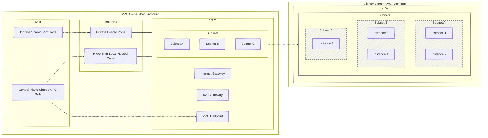

# Creating a HostedCluster in a Shared VPC

## Background

AWS allows [sharing a VPC's subnets](https://docs.aws.amazon.com/vpc/latest/userguide/vpc-sharing.html) from one account to another.
This enables a use case where network management can be done in a single AWS account, while workloads such as OpenShift clusters exist
in a separate, satellite account.

Creating a standalone OCP cluster is already [supported in ROSA classic](https://docs.openshift.com/rosa/rosa_install_access_delete_clusters/rosa-shared-vpc-config.html).

In hosted clusters, the shared VPC architecture is very similar to standalone OCP. However, hosted clusters require some new resources to be created.

The following resources must be created in the VPC owner account:

* The VPC (along with related resources such as subnets, nat gateway, internet gateway, route tables, etc.)
* Private Hosted Zone - this will be the same domain as the public hosted zone of the HostedCluster where the cluster ingress operator will place router records.
* Local Hosted Zone - the `[cluster-name].hypershift.local` hosted zone where the control plane operator places records that point to the VPC endpoint that sends traffic to the control plane.
* Ingress Shared VPC Role - a role that allows managing records in the private hosted zone. The ingress operator of the hosted cluster will assume this role in order to create records in the private hosted zone.
* Control Plane Shared VPC Role - a role that allows:
   - Managing a VPC endpoint so that workers can communicate with the control plane
   - Managing a Security Group for the VPC endpoint
   - Managing records in the local hosted zone so that workers can use known names to communicate with the VPC endpoint.


Once created, both public and private subnets of the VPC must be shared with the account where the cluster will be created.
Once shared, the subnets in the cluster creator account must be tagged with either `kubernetes.io/role/elb=1` (for public subnets)
or `kubernetes.io/role/internal-elb=1` (for private subnets). It is important to note that any tags that were set on the subnets in the VPC owner account do not transfer to the cluster creator account when shared.



## API fields to support a Shared VPC cluster

The HostedCluster API exposes a `sharedVPC` field under `.spec.platform.aws` that allows specifying the following fields:
- IngressRoleARN - the ARN of a role in the VPC owner account that allows managing DNS records in the private hosted zone of the HostedCluster. The ingress operator will assume this role to manage DNS records.
- ControlPlaneRoleARN - the ARN of a role in the VPC owner account that allows creating a VPC endpoint, a corresponding security group and DNS records in the `[cluster-name].hypershift.local` hosted zone for this HostedCluster.
- LocalZoneID - the ID of the route53 hosted zone for `[cluster-name].hypershift.local` that is associated with the HostedCluster's VPC and exists in the VPC owner account.

The `sharedVPC` field is optional. However, if it is set, all of the above fields are required and the HostedCluster is assumed to be using a shared VPC for its infrastructure.


## Using the CLI to create a Hosted Cluster in a Shared VPC

The `hypershift create cluster aws` command exposes a flag `--vpc-owner-aws-creds` that allows specifying a file that contains credentials to the VPC owner account. With this credential file, the `hypershift create cluster aws` command will create the VPC and all required artifacts in the VPC owner account, share the subnets, and create a hosted cluster in the cluster creator account (the one for which AWS creds are normally specified).

Example command:

```
hypershift create cluster aws \
  --aws-creds ${AWS_CREDS_FILE} \
  --vpc-owner-aws-creds ${VPC_OWNER_AWS_CREDS_FILE} \
  --region us-east-2 \
  --auto-repair \
  --generate-ssh \
  --name ${NAME} \
  --endpoint-access PublicAndPrivate \
  --node-pool-replicas 2 \
  --pull-secret ${PULL_SECRET_FILE} \
  --base-domain ${BASE_DOMAIN} \
  --external-dns-domain ${CUSTOM_DOMAIN} \
  --release-image ${RELEASE_IMAGE}
```

To destroy the HostedCluster, the `--vpc-owner-aws-creds` must also be specified so that resources in the VPC owner account can also be destroyed.


The `--vpc-owner-aws-creds` flag has been added to the following commands:

* `hypershift create cluster aws`
* `hypershift create infra aws`
* `hypershift create iam aws`
* `hypershift destroy cluster aws`
* `hypershift destroy infra aws`
* `hypershift destroy iam aws`
