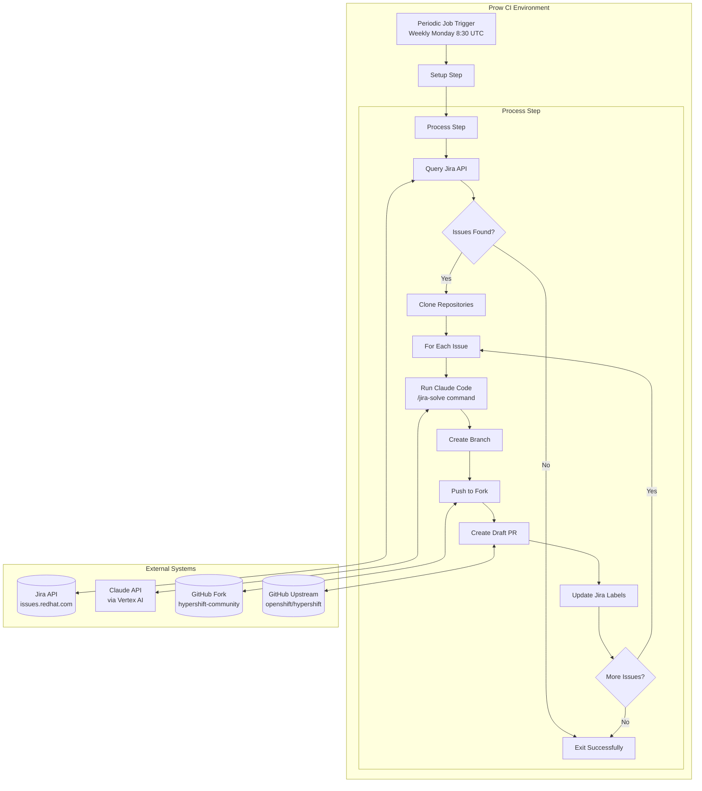
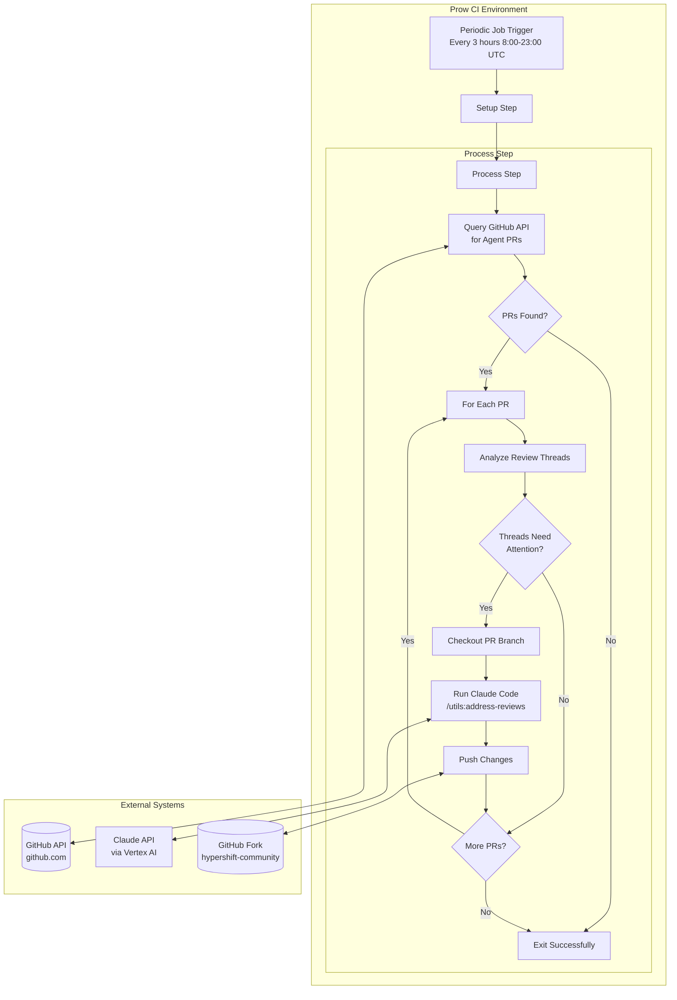

# AI-Assisted CI Jobs

This document describes the AI-assisted CI jobs that help automate issue resolution and PR review handling in the HyperShift repository.

!!! warning "Human Review Required"
    **AI-generated code must not be relied upon without human review.** All PRs created by these jobs are drafts and must go through the standard GitHub PR review process. HyperShift repository OWNERS are responsible for reviewing and approving all changes.

!!! info "Responsible Use"
    Please review the [Guidelines on Responsible Use of AI Code Assistants](https://source.redhat.com/projects_and_programs/ai/wiki/code_assistants_guidelines_for_responsible_use_of_ai_code_assistants) before using these tools.

## Overview

HyperShift uses two AI-assisted CI jobs powered by Claude Code to help with development workflows:

| Job | Purpose | Schedule |
|-----|---------|----------|
| `periodic-jira-agent` | Analyzes Jira issues and creates draft PRs with fixes | Weekly on Mondays at 8:30 AM UTC |
| `periodic-review-agent` | Addresses PR review comments on agent-created PRs | Every 3 hours (8:00-23:00 UTC) daily |
| `review-agent-single-pr` | On-demand review agent for a single PR | Triggered via `/test review-agent-single-pr` |

### Usage Scope

These jobs process **internal Red Hat tickets only** from the following Jira projects:

- **OCPBUGS** - OpenShift bug tracking
- **CNTRLPLANE** - HyperShift/Control Plane team issues

---

## Jira Agent

### Overview

The Jira Agent (`periodic-jira-agent`) automatically analyzes Jira issues and creates draft pull requests with proposed fixes.

- **Job name**: `periodic-jira-agent`
- **Schedule**: Weekly on Mondays at 8:30 AM UTC (`30 8 * * 1`)
- **Max issues per run**: 1 (configurable via `JIRA_AGENT_MAX_ISSUES`)
- **Max agentic turns**: 100 per issue

### How It Works

1. **Queries Jira** for unresolved issues matching the criteria (see JQL below)
2. **Clones repositories**: ai-helpers and hypershift-community/hypershift fork
3. **Runs Claude Code** with the `/jira-solve` command to analyze each issue and implement a fix
4. **Creates draft PR** from the `hypershift-community/hypershift` fork to `openshift/hypershift`
5. **Updates Jira** after successful processing:
   - Adds `agent-processed` label
   - Transitions to "ASSIGNED" (OCPBUGS) or "Code Review" (CNTRLPLANE)
   - Sets assignee to `hypershift-automation`

### JQL Query

Issues are selected for processing using this query:

```sql
project in (OCPBUGS, CNTRLPLANE)
  AND resolution = Unresolved
  AND status in (New, "To Do")
  AND labels = issue-for-agent
  AND labels != agent-processed
```

### Data Flow



### Configuration

| Variable | Default | Description |
|----------|---------|-------------|
| `JIRA_AGENT_MAX_ISSUES` | 1 | Maximum issues to process per run |
| Rate limit | 60 seconds | Delay between processing issues |

---

## Review Agent

### Overview

The Review Agent (`periodic-review-agent`) automatically addresses PR review comments on PRs created by the Jira Agent.

- **Job name**: `periodic-review-agent`
- **Schedule**: Every 3 hours (8:00-23:00 UTC) daily (`0 8-23/3 * * *`)
- **Max PRs per run**: 10 (configurable via `REVIEW_AGENT_MAX_PRS`)
- **Max agentic turns**: 100 per PR
- **On-demand job**: `review-agent-single-pr` (trigger with `/test review-agent-single-pr`)

### How It Works

1. **Queries GitHub** for open PRs authored by `app/hypershift-jira-solve-ci`
2. **Analyzes review threads** to identify comments needing attention
3. **Runs Claude Code** with the `/utils:address-reviews` command
4. **Pushes changes** back to the PR branch

### Comment Analysis Logic

The agent uses a Python-based comment analyzer to intelligently determine which review threads need attention. This prevents duplicate responses and ensures only actionable feedback is processed.

#### What Gets Processed

| Condition | Action |
|-----------|--------|
| No bot reply in thread | Process (first response needed) |
| Human replied after bot's last comment | Process (follow-up needed) |
| Bot already replied, no human follow-up | Skip (already addressed) |
| Thread is resolved | Skip (marked complete by reviewer) |
| Thread is outdated (code changed) | Skip (likely addressed by code change) |

#### What Counts as an Unresolved Review Thread

A review thread is considered **unresolved** when:

- **Inline code comments**: A reviewer left a comment on a specific line of code in the "Files changed" tab, and no one has clicked "Resolve conversation"
- **Review comments with suggestions**: Comments that include suggested code changes that haven't been resolved
- **Threaded discussions**: Any reply chain started from a code review that remains open

A review thread is **NOT** created by:

- General PR comments (comments in the main "Conversation" tab that aren't attached to code)
- PR reviews that only contain an approval/request changes without inline comments
- Commit comments

#### Author Authorization

The review agent only responds to feedback from authorized authors:

| Author Type | Example |
|-------------|---------|
| OpenShift org members | Members of the `openshift` GitHub organization |
| OWNERS file entries | Users listed in `OWNERS` or `OWNERS_ALIASES` |
| Approved bots | `coderabbitai[bot]` |

Comments from unauthorized users are ignored to prevent abuse.

#### Response Rules

When addressing feedback, the bot follows these rules:

1. **One response per feedback**: Never responds to the same feedback via both inline reply AND general PR comment
2. **Code changes only when requested**: Only modifies code when explicitly asked (imperative language like "change", "fix", "update")
3. **Explanations for questions**: Replies with explanation only for clarifying questions, without code changes

### Data Flow



### Configuration

| Variable | Default | Description |
|----------|---------|-------------|
| `REVIEW_AGENT_MAX_PRS` | 10 | Maximum PRs to process per run |

---

## User Guide

### Submitting Issues for Processing

To have an issue processed by the Jira Agent:

1. Ensure the issue is in **OCPBUGS** or **CNTRLPLANE** project
2. Set status to **New** or **To Do**
3. Ensure resolution is **Unresolved**
4. Add the label **`issue-for-agent`**
5. Security set to none

The issue will be picked up on the next weekly run (Mondays at 8:30 AM UTC).

### Viewing AI-Generated Output

Track PRs created by the Jira Agent:

- **PR List**: [github.com/openshift/hypershift/pulls?q=is:pr+author:app/hypershift-jira-solve-ci](https://github.com/openshift/hypershift/pulls?q=is%3Apr+author%3Aapp%2Fhypershift-jira-solve-ci)

PRs are created as **drafts** and require human review before merging.

### Reprocessing Issues

To have an issue reprocessed:

1. Remove the **`agent-processed`** label from the Jira issue
2. The issue will be picked up on the next weekly run

### Triggering Review Agent On-Demand

For a single PR, you can trigger the review agent manually:

```
/test review-agent-single-pr
```

This runs the review agent for that specific PR only.

---

## Limitations

- **AI may produce incorrect or incomplete solutions** - always review carefully
- **Complex issues may not be fully addressed** - multi-faceted problems may need human intervention
- **Rate limited**: 1 issue per weekly run (jira-agent), 10 PRs per run (review-agent)
- **Cannot access private resources** - no access to internal systems beyond Jira/GitHub
- **Cannot execute destructive operations** - no ability to delete resources or force-push
- **Maximum agentic turns**: 100 per issue (jira-agent), 100 per PR (review-agent)

---

## Support and Feedback

- **Slack channel**: #project-hypershift
- **Feedback**: File issues in [openshift/hypershift](https://github.com/openshift/hypershift/issues) with label `ai-feedback`
- **Urgent issues**: Contact HyperShift OWNERS directly

---

## Monitoring and Effectiveness

### Performance Monitoring

- **Prow job logs**: [prow.ci.openshift.org](https://prow.ci.openshift.org/?repo=openshift%2Fhypershift)
- Track job success/failure rates
- Monitor for recurring authentication errors

### Metrics and Indicators

| Metric | Description |
|--------|-------------|
| Issues processed per week | Number of issues successfully analyzed |
| PRs merged vs. closed | Success rate of generated PRs |
| Review cycles needed | Average iterations before merge |
| Time to PR creation | Duration from issue creation to PR |

### Periodic Review Process

The HyperShift team conducts monthly reviews:

- Review AI-generated PRs for quality and accuracy
- Track false positives and missed solutions
- Adjust issue labeling criteria based on results
- Document lessons learned and improve the `/jira-solve` command

---

## Data Flow and Security

### Authentication

| System | Method |
|--------|--------|
| GitHub | GitHub App tokens (JWT-based) for fork and upstream |
| Claude API | GCP service account via Vertex AI |
| Jira | Personal access token for label management |

### Data Retention

- No persistent storage beyond PR content
- Logs retained per Prow standard retention policy

### External Systems

| System | Purpose |
|--------|---------|
| Jira API (issues.redhat.com) | Issue queries and label updates |
| GitHub API (github.com) | PR creation and management |
| Claude API via Vertex AI (GCP) | AI-powered code analysis and generation |
