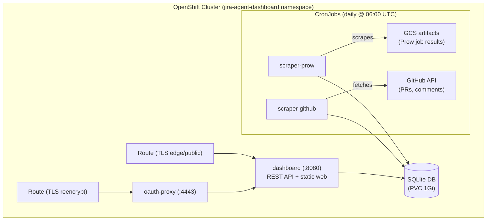
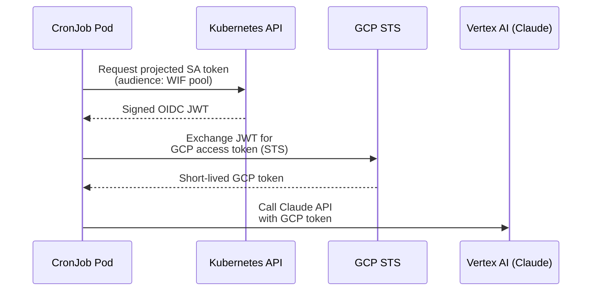

# JIRA Agent Dashboard

The JIRA Agent Dashboard is a web application that tracks the performance and quality of the [AI-assisted CI jobs](index.md) — merge rates, API costs, review comment patterns, and PR lifecycle metrics.

!!! info "Access"
    - **Authenticated** (edit access): [dashboard-jira-agent-dashboard.apps.jira-agent-scraper.brcox.hypershift.devcluster.openshift.com](https://dashboard-jira-agent-dashboard.apps.jira-agent-scraper.brcox.hypershift.devcluster.openshift.com) (requires OpenShift OAuth login)
    - **Public** (read-only): [dashboard-public-jira-agent-dashboard.apps.jira-agent-scraper.brcox.hypershift.devcluster.openshift.com](https://dashboard-public-jira-agent-dashboard.apps.jira-agent-scraper.brcox.hypershift.devcluster.openshift.com) (no authentication required)

## Overview

The dashboard collects data from Prow job artifacts and the GitHub API, stores it in a SQLite database, and presents it through a web frontend with charts and filters.

## Data Pipeline

### Scraper CronJobs

Two CronJobs run daily to populate the database:

| CronJob | Schedule | Source | What it collects |
|---------|----------|--------|-----------------|
| `scraper-prow` | 06:00 UTC | GCS artifacts | Prow job run metadata — build IDs, timestamps, artifact URLs, Claude API usage (tokens, cost, duration per phase) |
| `scraper-github` | 06:10 UTC | GitHub API | PR metadata (state, merge dates, lines changed, files changed), review comments with full body text |

The GitHub scraper also computes diff stats (lines added/deleted, files changed) for each PR. Complexity analysis (gocyclo/gocognit deltas) can be run separately via `--step=complexity`.

### Database Schema

5 tables in SQLite (WAL mode for concurrent readers):

| Table | Description |
|-------|-------------|
| `job_runs` | Prow job execution records (build ID, timestamps, artifact URL) |
| `issues` | JIRA issues with linked PR data (state, dates, merge duration, quality score) |
| `phase_metrics` | Claude API usage per phase (tokens, cost, duration, model) |
| `review_comments` | GitHub PR review comments with severity/topic classification |
| `pr_complexity` | Lines added/deleted, files changed, complexity deltas |

## Frontend Pages

### Overview

Summary cards showing total issues processed, merge rate, average cost, and average duration. Includes:

- Status and cost distribution charts
- Weekly trends (issues processed, merge rate, cost over time)
- Top reviewers by comment count
- Review comment severity breakdown
- Recent activity feed

### Issues

Sortable, filterable table of all issues with:

- JIRA key and PR link
- PR status (open, merged, closed)
- Lines changed, files changed
- Cost and duration
- Quality score

### Comments

Filterable view of all review comments with:

- Severity and topic doughnut charts
- Pattern table showing severity × topic combinations
- Per-comment detail with collapsible bodies
- Filter by severity, topic, author, and free-text search
- Markdown report download for offline analysis

### Issue Detail

Per-issue breakdown with:

- Phase-by-phase cost and duration bar chart
- PR metrics cards (lines added/deleted, files changed, complexity delta, quality score)
- Individual review comments with editable severity/topic classification (authenticated route only)

## Comment Classification

Review comments are classified along two dimensions — **severity** and **topic** — to enable pattern analysis. The classification values are defined in [config.json](https://github.com/openshift-eng/ai-helpers/blob/main/plugins/code-review/skills/classify-review-comment/config.json) in the ai-helpers repo. Classifications can be set by AI (auto-classification) or overridden by humans through the issue detail page on the authenticated route.

## Quality Score

Each issue receives a quality score (0–100) computed from:

| Component | Weight | Scoring |
|-----------|--------|---------|
| Outcome | 40 pts | Merged = 40, Open = 20, Closed = 0 |
| Severity | 35 pts | Deduct per comment by severity |
| Density | 15 pts | Fewer comments per 100 lines = better |
| Topics | 10 pts | Deduct for logic bugs and test gaps |

## API Reference

| Method | Path | Description |
|--------|------|-------------|
| `GET` | `/api/issues?from=YYYY-MM-DD&to=YYYY-MM-DD` | List issues in date range |
| `GET` | `/api/issues/{id}` | Issue detail with phases and comments |
| `GET` | `/api/comments/summary?from=YYYY-MM-DD&to=YYYY-MM-DD` | All comments in date range |
| `GET` | `/api/comments/{issueID}` | Comments for a specific issue |
| `PATCH` | `/api/comments/{id}` | Update comment classification (authenticated only) |
| `GET` | `/api/trends?from=YYYY-MM-DD&to=YYYY-MM-DD` | Weekly trend aggregates |
| `GET` | `/healthz` | Health check |

## Deployment

The dashboard runs in the `jira-agent-dashboard` namespace. Full deployment instructions including secrets setup and restore procedures are in the [project README](https://github.com/openshift/hypershift/tree/main/jira-agent-dashboard).

### Resources

| Resource | Name | Description |
|----------|------|-------------|
| Deployment | `dashboard` | Dashboard pod (oauth-proxy sidecar + dashboard container) |
| Service | `dashboard` | Ports 4443 (https/oauth-proxy) and 8080 (http/dashboard) |
| Route | `dashboard` | TLS reencrypt route through oauth-proxy (authenticated) |
| Route | `dashboard-public` | TLS edge route direct to dashboard (read-only, no auth) |
| PVC | `dashboard-db` | 1Gi volume for SQLite database |
| CronJob | `scraper-prow` | Daily Prow artifact scraper |
| CronJob | `scraper-github` | Daily GitHub API scraper |
| NetworkPolicy | `dashboard-allow-ingress` | Allows traffic from OpenShift router on ports 4443 and 8080 |
| NetworkPolicy | `deny-all-scraper` | Blocks all ingress to scraper pods |

### Security

| Layer | Implementation |
|-------|---------------|
| Authentication | OpenShift OAuth proxy sidecar (authenticated route) |
| Public access | Edge-terminated route bypasses oauth-proxy; PATCH endpoint checks `X-Forwarded-User` header |
| TLS | Reencrypt (authenticated) and edge (public) termination |
| Network | NetworkPolicy restricts ingress to OpenShift router only |
| Containers | Non-root (`USER 1001`), `readOnlyRootFilesystem`, all capabilities dropped |
| Input validation | PATCH body limited to 1KB, severity/topic validated against allowlists |

### Claude API Authentication (GCP Workload Identity Federation)

Jobs that call the Claude API (e.g., comment classification) authenticate to Vertex AI using **GCP Workload Identity Federation (WIF)** — no long-lived API keys or service account JSON keys are stored on the cluster.

#### How it works

1. The pod requests a **projected service account token** from the Kubernetes API server. The token's audience is set to the GCP Workload Identity Pool.
2. The GCP Security Token Service (STS) validates the JWT against the cluster's OIDC issuer URL and exchanges it for a short-lived GCP access token.
3. The pod uses the GCP token to call Claude via Vertex AI.

#### Security boundaries

| Control | Implementation |
|---------|---------------|
| No stored credentials | No JSON keys or API tokens on disk — tokens are issued at runtime and expire automatically |
| Service account scoping | The GCP service account has only `roles/aiplatform.user` — it can call Vertex AI and nothing else |
| Kubernetes SA restriction | The WIF attribute condition restricts authentication to a single, named Kubernetes ServiceAccount in a specific namespace |
| OIDC issuer trust | GCP only accepts tokens signed by the cluster's OIDC issuer — tokens from other clusters are rejected |

#### Pod configuration

CronJobs that need Claude API access mount a credential configuration file via ConfigMap and set these environment variables:

| Variable | Purpose |
|----------|---------|
| `GOOGLE_APPLICATION_CREDENTIALS` | Path to the WIF credential config file (mounted from ConfigMap) |
| `CLAUDE_CODE_USE_VERTEX` | `1` — tells Claude Code CLI to use Vertex AI instead of direct API |
| `CLOUD_ML_REGION` | GCP region for Vertex AI |
| `ANTHROPIC_VERTEX_PROJECT_ID` | GCP project hosting the Vertex AI endpoint |

The credential config file tells the GCP SDK how to find and exchange the projected SA token. It references a token file path where Kubernetes mounts the projected volume.

#### Setting up WIF for a new cluster

To configure WIF for a new cluster deployment:

1. **Create a Workload Identity Pool and OIDC provider** in the GCP project, using the cluster's OIDC issuer URL
2. **Create a GCP service account** with `roles/aiplatform.user` only
3. **Add a principal binding** on the GCP service account that matches the exact Kubernetes ServiceAccount (namespace and name)
4. **Create the credential config** ConfigMap in the cluster namespace with the pool, provider, and token path
5. **Configure the CronJob** with projected SA token volume (audience matching the WIF pool) and the environment variables above

## Feedback Loop: improve-ai-quality Skill

The dashboard powers a feedback loop via the `improve-ai-quality` Claude Code skill. This skill:

1. Fetches classified review comments from the dashboard API
2. Identifies recurring patterns by topic and severity
3. Maps patterns to specific files in the hypershift and ai-helpers repos
4. Opens draft PRs with evidence-backed improvements to AI skills and configuration

The goal is to reduce review comments over time by teaching jira-solve to avoid the same mistakes. See [PR #8688](https://github.com/openshift/hypershift/pull/8688) for the skill definition.
