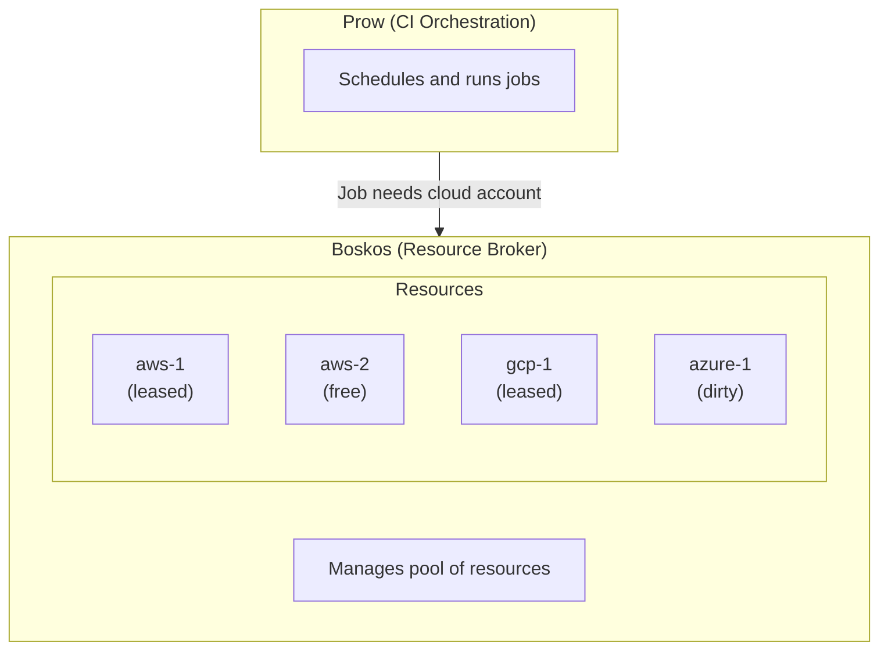

# CI Infrastructure

This document explains the HyperShift CI testing infrastructure, focusing on how Boskos manages cloud resources and how jobs coordinate access to shared infrastructure.

## Overview

CI jobs often need exclusive access to expensive or limited resources:

- Cloud accounts (AWS, Azure, GCP)
- Quota-limited infrastructure
- Clusters for testing

Without coordination, multiple jobs would conflict trying to use the same resources simultaneously. **Boskos** is a resource management service that works alongside Prow to handle shared, limited resources in CI environments.

## Architecture

The following diagram shows how Prow, Boskos, and cloud resources work together:



## Key Components

| Component | Role |
|-----------|------|
| **Boskos Server** | Tracks resource state, handles acquire/release requests |
| **Boskos Reaper** | Reclaims resources from jobs that died without releasing |
| **Boskos Janitor** | Cleans "dirty" resources (e.g., deletes leftover cloud resources) |
| **Boskos Client** | Library used by jobs to request/release resources |

## Lease Lifecycle

1. **Acquire**: Job requests a resource of a specific type
2. **Lease**: Boskos grants exclusive access, marks resource as "busy"
3. **Heartbeat**: Job periodically confirms it's still using the resource
4. **Release**: Job finishes, returns resource (may be marked "dirty")
5. **Clean**: Janitor component cleans dirty resources for reuse

## Cluster Profiles and Quota Slices

In OpenShift CI, Prow jobs that need cloud infrastructure use Boskos leases. The **ci-operator** handles Boskos integration automatically when jobs request cluster provisioning.

HyperShift jobs use the `hypershift` cluster profile, which maps to `hypershift-quota-slice` in Boskos:

```yaml
# Example from ci-operator config
cluster_profile: hypershift
```

This cluster profile is defined in the [Boskos configuration](https://github.com/openshift/release/blob/master/core-services/prow/02_config/_boskos.yaml) and controls how many concurrent jobs can run.

### Platform Separation

Each cloud platform (AWS, Azure, GCP, Oracle) should ideally have its own cluster profile and Boskos slice for quota isolation. This ensures:

- **Cost control**: Limits concurrent cloud usage per platform
- **Isolation**: Jobs on different platforms don't compete for the same quota
- **Cleanup**: Resources are properly cleaned between uses
- **Fairness**: Jobs wait in queue rather than failing from conflicts

!!! note
    Currently, HyperShift AWS and Azure/AKS jobs share the same `hypershift` cluster profile. Future improvements may separate these into platform-specific profiles.

## Identifying Leases in Build Logs

When a job acquires a Boskos lease, you'll see entries like this in the build log:

```
[2025-12-10T16:07:50Z] Acquiring leases for test e2e-aws: [hypershift-quota-slice]
[2025-12-10T16:52:55Z] Acquired 1 lease(s) for hypershift-quota-slice: [0ae8b8f2-4072-43b0-9bd0-136ee5bb8ab4]
```

If jobs are queued waiting for resources, you'll see the "Acquiring leases" message without a corresponding "Acquired" message until a lease becomes available.

## CI Dashboard

The HyperShift CI dashboard shows the current state of test clusters:

[https://ci-dashboard-route-clusters.apps.rosa.hypershift-ci-2.1xls.p3.openshiftapps.com/](https://ci-dashboard-route-clusters.apps.rosa.hypershift-ci-2.1xls.p3.openshiftapps.com/)

This dashboard displays clusters provisioned by CI jobs.

!!! note
    The number of clusters shown may be less than the maximum Boskos leases if some jobs are running on external infrastructure (e.g., Azure/AKS jobs running directly in Azure).

## Why This Matters

Understanding the CI infrastructure helps when:

- **Debugging slow CI**: Jobs may be waiting for Boskos leases
- **Investigating failures**: Resource cleanup issues can cause test failures
- **Planning capacity**: Understanding quota limits helps predict CI throughput
- **Troubleshooting flakes**: Dirty resources or cleanup failures can cause intermittent issues

## References

- [Boskos configuration](https://github.com/openshift/release/blob/master/core-services/prow/02_config/_boskos.yaml)
- [HyperShift CI config](https://github.com/openshift/release/blob/master/ci-operator/config/openshift/hypershift/openshift-hypershift-main.yaml)
- [CI Dashboard](https://ci-dashboard-route-clusters.apps.rosa.hypershift-ci-2.1xls.p3.openshiftapps.com/)
