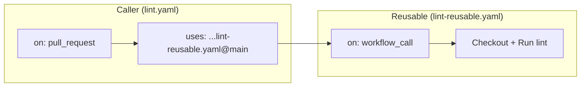

# GitHub Actions Workflows

HyperShift uses GitHub Actions for lightweight CI checks that run on every pull request. These workflows complement the heavier Prow-based e2e tests by providing fast feedback on code quality, formatting, and documentation.

## Reusable Workflow Architecture

All GHA workflows follow a **caller + reusable** pattern:

- **Caller workflow** (e.g., `lint.yaml`) — defines triggers (`pull_request`, branch filters) and delegates to a reusable workflow pinned at `@main`.
- **Reusable workflow** (e.g., `lint-reusable.yaml`) — contains the actual job steps. Triggered via `workflow_call` and optionally on `push` to `main` for post-merge runs.



This pattern provides:

- **Consistency** — all PR and push workflows share the same job definitions.
- **Maintainability** — job logic is defined once in the reusable workflow and updated in a single place.
- **Security** — callers pin reusable workflows to `@main`, reducing the risk of PRs altering reusable job logic. Caller workflows are protected by branch protection rules and CODEOWNERS.

## Workflows

All workflows run on self-hosted ARC runners and target the `main` and `release-4.22` branches.

### Code Quality

| Caller | Reusable | Purpose |
|--------|----------|---------|
| `codespell.yaml` | `codespell-reusable.yaml` | Spell checking across the codebase |
| `gitlint.yaml` | `gitlint-reusable.yaml` | Commit message format validation |
| `lint.yaml` | `lint-reusable.yaml` | Go linting via `golangci-lint` |
| `verify.yaml` | `verify-reusable.yaml` | Full verification (`make verify`) |

### Testing

| Caller | Reusable | Purpose |
|--------|----------|---------|
| `test.yaml` | `test-reusable.yaml` | Unit tests with race detection and Codecov upload |
| `envtest-ocp.yaml` | `envtest-ocp-reusable.yaml` | CRD validation tests against OpenShift k8s versions |
| `envtest-kube.yaml` | `envtest-kube-reusable.yaml` | CRD validation tests against vanilla k8s versions |

### Documentation

| Caller | Reusable | Purpose |
|--------|----------|---------|
| `docs-build.yaml` | `docs-build-reusable.yaml` | Build MkDocs site in strict mode |

The `docs-deploy.yaml` workflow is not a reusable workflow pair — it triggers via `workflow_run` after the Docs Build completes to deploy the preview. See [Documentation Preview](docs-preview.md) for details.

### Other

| Caller | Reusable | Purpose |
|--------|----------|---------|
| `cpo-container-sync.yaml` | `cpo-container-sync-reusable.yaml` | Validate CPO container image references are in sync |
| `dependabot-commit-fix.yaml` | `dependabot-commit-fix-reusable.yaml` | Rewrite dependabot commit messages to pass gitlint |

The `sync-community-fork.yaml` workflow runs on push to `main` only (not on PRs) and does not use the reusable pattern. See [Sync Community Fork](sync-community-fork.md) for details.

## Adding a New Workflow

To add a new GHA workflow:

1. Create the reusable workflow (e.g., `my-check-reusable.yaml`) with `on: workflow_call`.
2. Create the caller workflow (e.g., `my-check.yaml`) that uses the reusable workflow pinned at `@main`.
3. Add branch filters for `main` and any active release branches.
4. Use `arc-runner-set` as the runner.

Example caller:

```yaml
name: My Check

on:
  pull_request:
    branches:
      - main
      - release-4.22

jobs:
  my-check:
    uses: openshift/hypershift/.github/workflows/my-check-reusable.yaml@main
    permissions:
      contents: read
```
