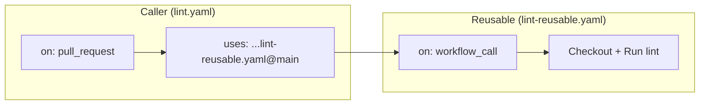

# 🔄 GitHub Actions Workflows

HyperShift uses GitHub Actions for lightweight CI checks that run on every pull request. These workflows complement the heavier Prow-based e2e tests by providing fast feedback on code quality, formatting, and documentation.

## 🏗️ Reusable Workflow Architecture

All GHA workflows follow a **caller + reusable** pattern:

- **Caller workflow** (e.g., `lint.yaml`) — defines triggers (`pull_request`, branch filters) and delegates to a reusable workflow pinned at `@main`.
- **Reusable workflow** (e.g., `lint-reusable.yaml`) — contains the actual job steps. Triggered via `workflow_call` and optionally on `push` to `main` for post-merge runs.



This pattern provides:

- ✅ **Consistency** — all PR and push workflows share the same job definitions.
- 🔧 **Maintainability** — job logic is defined once in the reusable workflow and updated in a single place.
- 🔒 **Security** — callers pin reusable workflows to `@main`, reducing the risk of PRs altering reusable job logic. Caller workflows are protected by branch protection rules and CODEOWNERS.

## 📋 Workflows

All workflows run on self-hosted ARC runners and target the `main` and `release-4.22` branches.

### 🧹 Code Quality

| Caller | Reusable | Purpose |
|--------|----------|---------|
| `codespell.yaml` | `codespell-reusable.yaml` | Spell checking across the codebase |
| `gitlint.yaml` | `gitlint-reusable.yaml` | Commit message format validation |
| `lint.yaml` | `lint-reusable.yaml` | Go linting via `golangci-lint` |
| `verify.yaml` | `verify-reusable.yaml` | Full verification (`make verify`) |

### 🧪 Testing

| Caller | Reusable | Purpose |
|--------|----------|---------|
| `test.yaml` | `test-reusable.yaml` | Unit tests with race detection and Codecov upload |
| `envtest-ocp.yaml` | `envtest-ocp-reusable.yaml` | CRD validation tests against OpenShift k8s versions |
| `envtest-kube.yaml` | `envtest-kube-reusable.yaml` | CRD validation tests against vanilla k8s versions |

### 📖 Documentation

| Caller | Reusable | Purpose |
|--------|----------|---------|
| `docs-build.yaml` | `docs-build-reusable.yaml` | Build MkDocs site in strict mode |

!!! info
    The `docs-deploy.yaml` workflow is not a reusable workflow pair — it triggers via `workflow_run` after the Docs Build completes to deploy the preview. See [Documentation Preview](docs-preview.md) for details.

### 🤖 PR Slash Commands

These workflows are triggered by posting a **slash command** as a comment on a pull request. They are powered by [Claude Code](https://docs.anthropic.com/en/docs/claude-code) via the shared `reusable-claude-on-pr.yaml` workflow, which handles checking out the PR branch, authenticating to GCP (for Vertex AI), and running Claude with the appropriate prompt.

!!! warning "Permissions"
    Only organization **members**, **owners**, and **collaborators** can trigger these commands. Comments from external contributors are ignored.

| Command | Workflow | What it does |
|---------|----------|--------------|
| `/rebase` | `rebase.yaml` | Rebases the PR branch onto the latest `main` and force-pushes |
| `/restructure-commits` | `restructure-commits.yaml` | Reorganizes the PR's commits into logical units with conventional commit messages |

**How it works:**

1. Post the slash command (e.g., `/rebase`) as a comment on a PR.
2. The workflow posts a 🔗 reply comment linking to the Actions run so you can follow progress.
3. Claude checks out the PR branch, performs the requested operation, and pushes the result.

!!! tip
    Each command uses concurrency groups scoped to the PR number — re-triggering a command automatically cancels the previous run for that PR.

### 🔧 Other

| Caller | Reusable | Purpose |
|--------|----------|---------|
| `cpo-container-sync.yaml` | `cpo-container-sync-reusable.yaml` | Validate CPO container image references are in sync |
| `dependabot-commit-fix.yaml` | `dependabot-commit-fix-reusable.yaml` | Rewrite dependabot commit messages to pass gitlint |
| `gocacheprog-test.yaml` | `gocacheprog-test-reusable.yaml` | Tests for the `contrib/ci/gocacheprog` build cache tool (path-filtered) |
| `validate-cpo-overrides.yaml` | — | Validate CPO override images contain the PRs claimed in the PR description |

!!! note
    The `sync-community-fork.yaml` workflow runs on push to `main` only (not on PRs) and does not use the reusable pattern. See [Sync Community Fork](sync-community-fork.md) for details.

## ➕ Adding a New Workflow

To add a new GHA workflow:

1. **Create the reusable workflow** (e.g., `my-check-reusable.yaml`) with `on: workflow_call`. This is where all the job logic lives.
2. **Create the caller workflow** (e.g., `my-check.yaml`) that uses the reusable workflow pinned at `@main`.
3. Add **branch filters** for `main` and any active release branches (e.g., `release-4.22`).
4. Use `arc-runner-set` as the runner.

### Post-merge runs

If your workflow should also run after PRs merge to `main` (e.g., for Codecov baseline uploads or post-merge validation), add `on: push` triggers **to the reusable workflow**, not the caller. This lets the reusable workflow run directly on push events without needing a separate caller.

### Why callers pin to `@main`

Callers reference the reusable workflow at `@main` (e.g., `uses: openshift/hypershift/.github/workflows/my-check-reusable.yaml@main`). This means a PR **cannot modify the reusable workflow logic that runs against itself** — it always executes the version from `main`. This is a deliberate security measure: it prevents a PR from weakening checks to make itself pass.

!!! warning "Implication for new workflows"
    When you add a new reusable workflow, the caller in the same PR will **not** be able to reference it until it lands on `main`. You'll need to merge the reusable workflow first (or together with the caller, accepting that the first PR run will use a stale/missing reference).

??? example "Example caller workflow"
    ```yaml
    name: My Check

    on:
      pull_request:
        branches:
          - main
          - release-4.22

    jobs:
      my-check:
        uses: openshift/hypershift/.github/workflows/my-check-reusable.yaml@main
        permissions:
          contents: read
    ```

??? example "Example reusable workflow with post-merge support"
    ```yaml
    name: My Check (Reusable)

    on:
      workflow_call:
      push:
        branches:
          - main
          - release-4.22

    permissions:
      contents: read

    jobs:
      my-check:
        name: My Check
        runs-on: arc-runner-set
        timeout-minutes: 60
        steps:
          - uses: actions/checkout@de0fac2e4500dabe0009e67214ff5f5447ce83dd # v6.0.2
            with:
              persist-credentials: false
          - run: echo "Run your check here"
    ```
