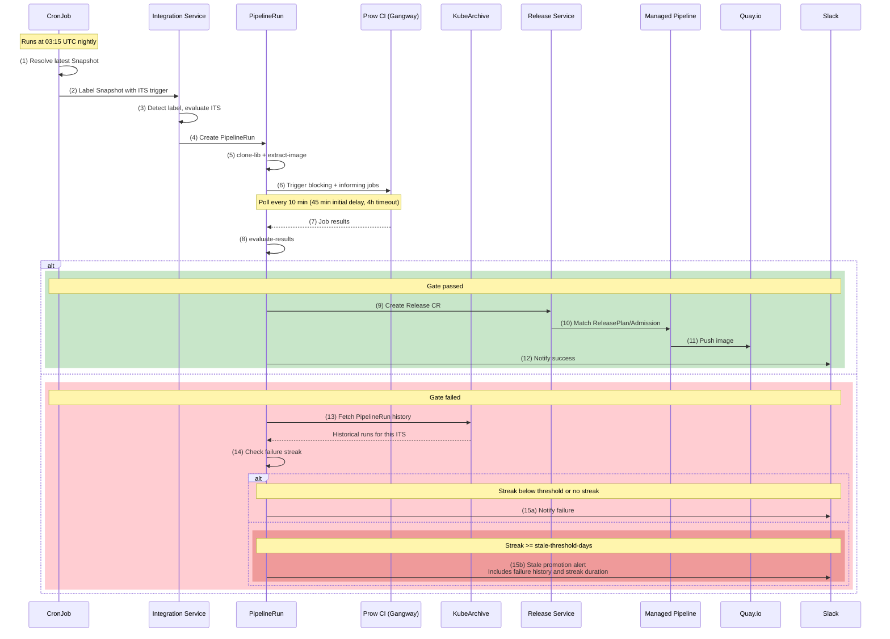
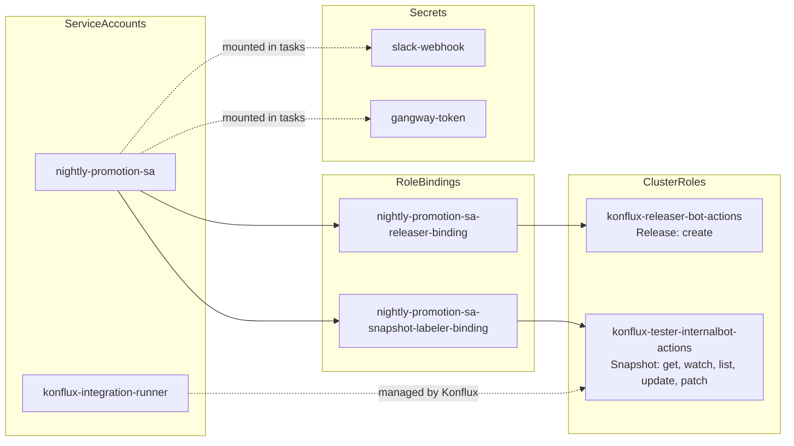
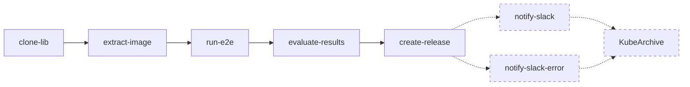
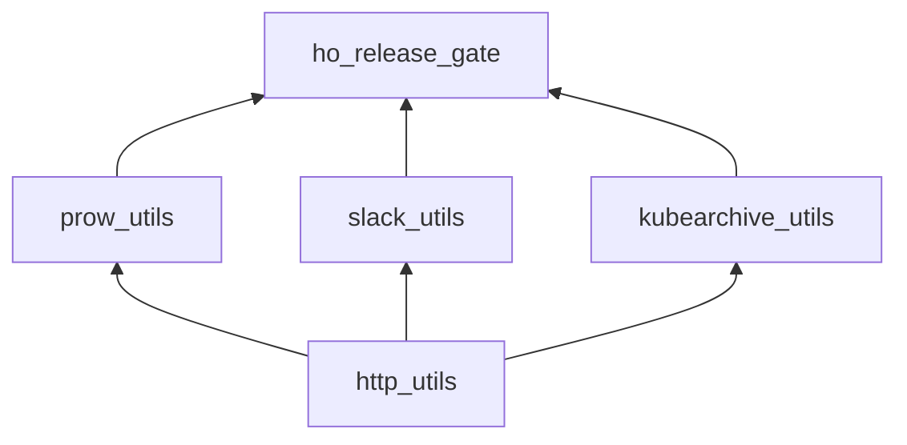
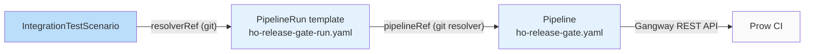

# Architecture

## End-to-End Flow

All release gating resources run on the Konflux production cluster **stone-prd-rh01**. Two namespaces are involved:

| Namespace | Owner | Resources |
|-----------|-------|-----------|
| `crt-redhat-acm-tenant` | HyperShift team | CronJob, ITS, Snapshot, PipelineRun, Release, ReleasePlan, ServiceAccounts, Secrets |
| `rhtap-releng-tenant` | Release Engineering | ReleasePlanAdmission, managed pipeline |

The following sequence diagram shows the complete nightly promotion cycle, from the CronJob trigger through image promotion to Quay.



**Step-by-step:**

1. The [`CronJob`](https://gitlab.cee.redhat.com/releng/konflux-release-data/-/blob/main/tenants-config/cluster/stone-prd-rh01/tenants/crt-redhat-acm-tenant/hypershift-operator/nightly-promotion/cronjob.yaml) fires at 03:15 UTC and resolves the latest Snapshot for the `hypershift-operator` application.
2. The CronJob iterates over the `ITS_NAMES` environment variable and labels the Snapshot for each service gate sequentially. This allows a single CronJob to trigger multiple gates (e.g. ARO HCP, ROSA).
3. The Integration Service detects the label and matches it to the corresponding [`IntegrationTestScenario`](https://gitlab.cee.redhat.com/releng/konflux-release-data/-/blob/main/tenants-config/cluster/stone-prd-rh01/tenants/crt-redhat-acm-tenant/hypershift-operator/nightly-promotion/its.yaml) (ITS). The ITS has `contexts: disabled`, so it only triggers from explicit CronJob labels, not from every new Snapshot.
4. The Integration Service creates a PipelineRun by resolving the [`PipelineRun template`](https://github.com/openshift/hypershift/blob/main/.tekton/pipelines/ho-release-gate-run.yaml) and the [`Pipeline`](https://github.com/openshift/hypershift/blob/main/.tekton/pipelines/ho-release-gate.yaml) via git resolver (see [Pipeline Resolution](#integration-service-and-pipeline-resolution) below). The ITS parameters (blocking/informing job lists, gate label, release plan name) are injected into the PipelineRun.
5. The pipeline starts with `clone-lib` (sparse git clone of the Python modules to a shared PVC workspace) followed by `extract-image` (validates the HO container image from the Snapshot JSON).
6. `run-e2e` triggers all blocking and informing Prow periodic jobs via the Gangway REST API, with the HO image injected as an environment override.
7. The task polls Gangway for job results (45 min initial delay, then every 10 min, up to 4h timeout).
8. `evaluate-results` applies the gate verdict: all blocking tests must pass (AND logic). Informing tests are reported but do not affect the verdict.
9. If the gate passed, `create-release` creates a Release CR referencing the validated Snapshot and the [`ReleasePlan`](https://gitlab.cee.redhat.com/releng/konflux-release-data/-/blob/main/tenants-config/cluster/stone-prd-rh01/tenants/crt-redhat-acm-tenant/hypershift-operator/nightly-promotion/releaseplan.yaml).
10. The Release Service matches the Release CR to a [`ReleasePlanAdmission`](https://gitlab.cee.redhat.com/releng/konflux-release-data/-/blob/main/config/stone-prd-rh01.pg1f.p1/service/ReleasePlanAdmission/crt-redhat-acm/redhat-hypershift-operator-ho-release-gate-aro-hcp.yaml) in the `rhtap-releng-tenant` namespace and launches the `rh-push-to-external-registry` managed pipeline.
11. The managed pipeline's `apply-mapping` task pushes the image to Quay with service-prefixed tags.
12. If the gate passed, a Slack notification is sent with the pass verdict, per-job results, and links to the PipelineRun.
13. If the gate failed (or the pipeline crashed before reaching evaluation), the `notify-slack` or `notify-slack-error` finally task queries the [KubeArchive](#kubearchive) REST API to fetch historical PipelineRun data for the current ITS. The ITS name is used as a label selector, so each managed service's history is tracked independently with zero configuration.
14. The pipeline checks whether consecutive recent failures form a streak meeting or exceeding the configurable `stale-threshold-days` parameter.
15. If the streak meets the threshold, a stale promotion alert is sent to Slack with the failure history and links to each PipelineRun (15a). Otherwise, a standard failure notification is sent (15b).

## RBAC and Service Accounts

Two ServiceAccounts are involved in the release gating flow:

| ServiceAccount | Used By | Purpose |
|----------------|---------|---------|
| `nightly-promotion-sa` | CronJob, `create-release` task | Resolves and labels Snapshots, creates Release CRs |
| `konflux-integration-runner` | Integration Service | Evaluates ITS, creates PipelineRuns |



Key RBAC details:

- [`nightly-promotion-sa`](https://gitlab.cee.redhat.com/releng/konflux-release-data/-/blob/main/tenants-config/cluster/stone-prd-rh01/tenants/crt-redhat-acm-tenant/hypershift-operator/nightly-promotion/serviceaccount.yaml) is used by the CronJob (to label Snapshots) and by the `create-release` task (to create Release CRs). The `create-release` task runs as this SA via a `taskRunSpecs` override in the PipelineRun template:

    ```yaml
    taskRunSpecs:
      - pipelineTaskName: create-release
        serviceAccountName: nightly-promotion-sa
    ```

- `konflux-integration-runner` is the default SA for all PipelineRun tasks. The Integration Service forces this SA on every integration test PipelineRun (KONFLUX-5207). It has no extra bindings beyond what Konflux manages internally. The `taskRunSpecs` override above is what allows `create-release` to run as a different SA.
- [`nightly-promotion-sa-snapshot-labeler-binding`](https://gitlab.cee.redhat.com/releng/konflux-release-data/-/blob/main/tenants-config/cluster/stone-prd-rh01/tenants/crt-redhat-acm-tenant/hypershift-operator/nightly-promotion/rbac-nightly-snapshot-labeler.yaml) binds the SA to [`konflux-tester-internalbot-actions`](https://github.com/redhat-appstudio/infra-deployments/blob/main/components/konflux-rbac/production/base/konflux-tester-internalbot-actions.yaml) (Snapshot: get, watch, list, update, patch). This ClusterRole was created by the Konflux infra team ([infra-deployments#12810](https://github.com/redhat-appstudio/infra-deployments/pull/12810)).
- [`nightly-promotion-sa-releaser-binding`](https://gitlab.cee.redhat.com/releng/konflux-release-data/-/blob/main/tenants-config/cluster/stone-prd-rh01/tenants/crt-redhat-acm-tenant/hypershift-operator/nightly-promotion/rbac-nightly-releaser.yaml) binds the SA to [`konflux-releaser-bot-actions`](https://github.com/redhat-appstudio/infra-deployments/blob/main/components/konflux-rbac/production/base/konflux-releaser-bot-actions.yaml) (Release and Snapshot: list, get, watch, create).
- Secrets (`gangway-token`, `slack-webhook`) are managed manually, not via GitOps.

## Tekton Pipeline Internals

### Design Rationale

The pipeline uses Python modules instead of inline bash scripts. This choice was driven by:

- **Readability**: structured Python functions with clear inputs/outputs vs multi-hundred-line shell scripts with embedded `jq` and `curl` chains
- **Reusability**: shared modules (`http_utils`, `prow_utils`, `slack_utils`) are used across multiple service gates without duplication
- **Testability**: individual functions can be unit-tested outside of the pipeline context
- **stdlib-only**: all modules use only the Python standard library (no `pip install`, no external dependencies). This is a hard constraint: tasks run on the Konflux-provided `appstudio-utils` container image, which we do not control and cannot install packages on

### Task Dependency Graph



`notify-slack` and `notify-slack-error` are `finally` tasks that are mutually exclusive. Tekton skips a finally task whose parameter bindings reference results from a task that was skipped (unresolved results). `notify-slack` binds parameters to results of `create-release`, `evaluate-results`, and `extract-image`, so it fires only when all of them ran. `notify-slack-error` uses a `when` clause (`create-release.status == None`) and fires when `create-release` was skipped or never reached (either because the gate failed and `create-release` exited non-zero, or because an earlier DAG task crashed before reaching it). Both finally tasks query KubeArchive for historical PipelineRun data and check for stale promotion streaks.

The per-job results JSON produced by `run-e2e` is written to a file on the shared workspace (`results.json`) rather than to a Tekton task result. This is a deliberate choice: Tekton task results have a hard 4 KB size limit, which can be exceeded when the pipeline runs many blocking and informing jobs, each carrying a full Prow URL. Both `evaluate-results` and `notify-slack` read the results directly from the workspace file.

### Python Module Dependency Graph



| Module | Reusable | Functions |
|--------|----------|-----------|
| `http_utils` | Yes | `http_request`, `http_request_with_retry` |
| `prow_utils` | Yes | `trigger_prow_job`, `resolve_prow_url`, `get_prow_job_status`, `short_name` |
| `slack_utils` | Yes | `send_slack_message`, `build_slack_payload`, `mrkdwn_section`, `fields_section`, `divider` |
| `kubearchive_utils` | Yes | `fetch_pipelineruns`, `build_pipelinerun_url` |
| `ho_release_gate` | Per-service | `extract_component_image`, `trigger_all_jobs`, `resolve_all_urls`, `poll_until_complete`, `evaluate_gate`, `build_gate_notification`, `build_error_notification`, `check_failure_streak`, `build_stale_notification`, `check_and_build_stale_payload` |

The four reusable modules are service-agnostic. When extending to a new managed service, only `ho_release_gate` would need a service-specific counterpart (or the existing one can be reused if the gate logic is identical).

### Workspace and Library Delivery

The pipeline uses a PersistentVolumeClaim (PVC) workspace to deliver the Python modules to all tasks:

1. The `clone-lib` task performs a **sparse git clone** of the repository, checking out only `.tekton/lib/`
2. Library files are copied to the shared workspace root
3. Each subsequent task adds the workspace path to `sys.path` and imports the modules directly

This avoids embedding library code in the pipeline YAML and allows updating the modules independently of the pipeline definition.

### Task Container Images

All pipeline task steps use the `appstudio-utils` container image provided by Konflux. Container image references in the pipeline YAML must follow the **tag+digest** pinning convention:

```text
quay.io/konflux-ci/appstudio-utils:latest@sha256:<digest>
```

This format satisfies two requirements:

- The **digest** ensures reproducible builds: the exact image layer set is locked regardless of tag mutations
- The **tag** enables [MintMaker](https://gitlab.cee.redhat.com/konflux/mintmaker-rules) (a Renovate-based service managed by the Konflux team) to detect when the tag points to a new digest and automatically open a pull request to bump it

MintMaker scans all YAML files under `.tekton/` on a weekly schedule (Saturdays at 05:00 UTC). When it detects that the `latest` tag now resolves to a different digest, it opens a PR updating the `@sha256:...` suffix in every matching image reference. The pipeline maintainers only need to review and merge the PR.

**Initial pinning is manual.** MintMaker will not convert a bare `:latest` tag to `tag+digest` format on its own. When adding a new task step or changing its base image, the author must look up the current digest (e.g. via the Quay API or `docker manifest inspect`) and write the full `tag@sha256:...` reference in the first commit. MintMaker takes over from that point forward.

## Integration Points and Secrets

| Integration | Protocol | Secret |
|-------------|----------|--------|
| **Integration Service** | Kubernetes label watch | None (cluster-internal) |
| **Gangway (Prow CI)** | HTTPS REST API | `gangway-token` (Bearer token) |
| **KubeArchive** | HTTPS REST API | SA projected token (cluster-internal) |
| **Slack** | HTTPS webhook | `slack-webhook` (webhook URL) |
| **Release Service** | Kubernetes CR creation | None (RBAC-based via `nightly-promotion-sa`) |

### Integration Service and Pipeline Resolution

The Integration Service watches for labeled Snapshots on the Konflux cluster. When the CronJob labels a Snapshot with `test.appstudio.openshift.io/scenario=<ITS_NAME>`, the Integration Service matches it to the corresponding IntegrationTestScenario and creates a PipelineRun with the ITS-defined parameters.

The ITS has `contexts: disabled`, meaning it only triggers from explicit CronJob labels, not from every new Snapshot.

The pipeline code is resolved at runtime through a two-step git resolver chain:



1. The ITS `resolverRef` points to the [`PipelineRun template`](https://github.com/openshift/hypershift/blob/main/.tekton/pipelines/ho-release-gate-run.yaml) in the GitHub repository
2. The PipelineRun template's `pipelineRef` uses a git resolver to fetch the [`Pipeline`](https://github.com/openshift/hypershift/blob/main/.tekton/pipelines/ho-release-gate.yaml) definition
3. Both are resolved and executed on the Konflux cluster (stone-prd-rh01), with no pipeline code stored on the cluster itself
4. From within the pipeline, the `run-e2e` task calls out to the external Prow CI cluster via the Gangway REST API

### Gangway (Prow CI)

The `run-e2e` task uses the Gangway REST API to trigger Prow periodic jobs with custom environment overrides (HO image, test image). It then polls job status until all jobs complete or a 4-hour timeout is reached.

#### Image Override Mechanism

The candidate HO image is injected into the Prow job via `MULTISTAGE_PARAM_OVERRIDE_OVERRIDE_HYPERSHIFT_OPERATOR_IMAGE`. This is a Gangway transport variable: the `MULTISTAGE_PARAM_OVERRIDE_` prefix tells Gangway to pass the value as a multi-stage step parameter (`OVERRIDE_HYPERSHIFT_OPERATOR_IMAGE`) rather than as a ci-operator ImageStream override. The direct ImageStream mechanism (`OVERRIDE_IMAGE_HYPERSHIFT_OPERATOR`) cannot be used here because ci-operator resolves ImageStream overrides during the `base-images` phase, which may race with steps that consume the image before the override is applied. The transport variable bypasses this by injecting the value directly into the step's environment.

The receiving step ([`hypershift-install-commands.sh`](https://github.com/openshift/release/blob/master/ci-operator/step-registry/hypershift/install/hypershift-install-commands.sh)) reads this parameter and uses it to install the HO from the candidate image.

The test image (`hypershift-tests`) is overridden separately via `OVERRIDE_IMAGE_HYPERSHIFT_TESTS` using `:latest`. This is intentional: the test image is built by OpenShift CI, not by Konflux, so it is not part of the Snapshot and there is no straightforward way to extract a matching version.

Timing parameters can be adjusted by modifying the corresponding constants in the `run-e2e` task script:

| Parameter | Value | Purpose |
|-----------|-------|---------|
| `TRIGGER_DELAY` | 60s | Delay between triggering consecutive jobs |
| `RATE_LIMIT_BACKOFF` | 120s | Backoff on HTTP 429/5xx responses |
| `MAX_RETRIES` | 3 | Retry attempts per trigger |
| `INITIAL_DELAY` | 2700s (45 min) | Wait before first poll (let jobs start) |
| `POLL_INTERVAL` | 600s (10 min) | Time between poll cycles |
| `POLL_STAGGER` | 30s | Delay between polling individual jobs |
| `TIMEOUT` | 14400s (4h) | Maximum total polling time |

The Gangway endpoint URL is exposed as a pipeline parameter (`gangway-url`) with the current production URL as default. This allows updating the endpoint without a code change if the CI cluster migrates (as happened in the `app.ci` to `build0x` migration).

### KubeArchive

Both `notify-slack` and `notify-slack-error` query the KubeArchive REST API to retrieve archived PipelineRun data for stale promotion detection. KubeArchive is a cluster-internal service on stone-prd-rh01 that archives Kubernetes resources after they are garbage-collected. The KubeArchive API URL is exposed as a pipeline parameter (`kubearchive-api-base`) with the current production URL as default, following the same rationale as `gangway-url`.

The pipeline authenticates to KubeArchive using a projected ServiceAccount token (audience: `kubearchive`), which is automatically available to the PipelineRun's SA. No additional secrets or configuration are required.

The query uses the ITS name as a label selector (`test.appstudio.openshift.io/scenario=<ITS_NAME>`), so each managed service's PipelineRun history is tracked independently. This means the stale check works automatically for every service gate with zero additional configuration beyond the optional `stale-threshold-days` parameter (see [Stale Promotion Alerting](strategy.md#stale-promotion-alerting)).

### Slack

Both `notify-slack` and `notify-slack-error` send Block Kit payloads to a Slack webhook. Notifications are currently posted to [`#forum-ocp-hypershift`](https://redhat.enterprise.slack.com/archives/C0B71V5TDMW). The target channel is determined by the webhook URL stored in the `slack-webhook` Secret in `crt-redhat-acm-tenant`.

When the gate passes, a success notification is sent. When the gate fails, both finally tasks query KubeArchive to check for a failure streak. If the streak meets or exceeds `stale-threshold-days`, a stale promotion alert is sent instead of the standard failure notification. The stale alert includes the failure streak duration, a history of recent PipelineRuns with links and failure reasons, and the configurable threshold. If there is no streak or it is below the threshold, a standard failure notification is sent. See [Stale Promotion Alerting](strategy.md#stale-promotion-alerting) for the rationale.

### Release Service

When the gate passes, the `create-release` task creates a Release CR referencing the validated Snapshot and the [`ReleasePlan`](https://gitlab.cee.redhat.com/releng/konflux-release-data/-/blob/main/tenants-config/cluster/stone-prd-rh01/tenants/crt-redhat-acm-tenant/hypershift-operator/nightly-promotion/releaseplan.yaml). The Release Service matches this to a [`ReleasePlanAdmission`](https://gitlab.cee.redhat.com/releng/konflux-release-data/-/blob/main/config/stone-prd-rh01.pg1f.p1/service/ReleasePlanAdmission/crt-redhat-acm/redhat-hypershift-operator-ho-release-gate-aro-hcp.yaml) (RPA) in the `rhtap-releng-tenant` namespace and launches the `rh-push-to-external-registry` managed pipeline. The managed pipeline's `apply-mapping` task pushes the image to Quay with service-prefixed tags. The tag mapping is defined in the RPA, so each service has its own set of tags. For example, the ARO HCP RPA produces:

- `aro-hcp-latest`
- `aro-hcp-latest-{{ timestamp }}`
- `aro-hcp-{{ git_sha }}`
- `aro-hcp-{{ git_short_sha }}`
