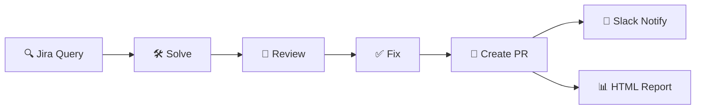
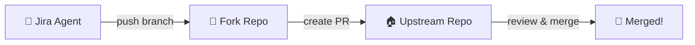

# :robot: Jira Agent Onboarding Guide

This guide walks you through setting up the **jira-agent** periodic Prow job for your OpenShift team. The jira-agent automatically picks up Jira issues, solves them using Claude Code, runs code review, addresses findings, creates PRs, and sends Slack notifications.

!!! info ":package: Generic Step Registry"
    The Jira Agent is implemented as a generic, parameterized step registry in
    `openshift/release` at `ci-operator/step-registry/jira-agent/`. Any team can
    reuse it by creating a thin wrapper workflow with their own env vars and credentials.
    **No bash scripting required.**

    For the full setup guide — workflow templates, periodic job config, credentials,
    environment variables, and credential overrides — see the
    [step registry ONBOARDING.md](https://github.com/openshift/release/blob/main/ci-operator/step-registry/jira-agent/ONBOARDING.md).

---

## :gear: How It Works



The jira-agent runs as a periodic Prow job with three phases:

| Phase | What happens |
|-------|-------------|
| :white_check_mark: **Setup** | Verifies Claude Code CLI and Vertex AI credentials |
| :hammer_and_wrench: **Process** | For each Jira issue: solve :arrow_right: review :arrow_right: fix :arrow_right: PR creation |
| :bar_chart: **Report** | Generates an HTML report with token usage, cost breakdown, and phase output |

Your team creates a **thin workflow YAML** that sets team-specific env vars and references the generic step registry components.

---

## :clipboard: Prerequisites

!!! abstract "Checklist"
    - [x] :fontawesome-brands-github: **GitHub App** installed on both your fork org and upstream repo
    - [x] :fork_and_knife: **Fork organization** on GitHub where the agent pushes branches
    - [x] :closed_lock_with_key: **Vault secret** synced to OpenShift CI
    - [x] :cloud: **Vertex AI access** via a Google Cloud service account
    - [x] :label: **Jira labels** on issues you want the agent to process (e.g., `issue-for-agent`)
    - [ ] :mega: **(Optional)** Slack incoming webhook for PR notifications

### :fork_and_knife: Fork / Upstream Model

The jira-agent pushes branches to a **fork** and creates PRs against the **upstream** repo.
This is the same fork-based workflow developers use — it avoids needing write access to the upstream repo.



!!! example "HyperShift Team Example"
    | | Repo | Purpose |
    |---|------|---------|
    | :house: **Upstream** | `openshift/hypershift` | PRs are created against this repo |
    | :fork_and_knife: **Fork** | `hypershift-community/hypershift` | Agent pushes branches here |

!!! tip
    For teams working on repos within the `openshift/` GitHub org, create a fork organization
    (e.g., `my-team-bots/my-repo`) and install the GitHub App on both. The agent only needs
    push access to the fork; PR creation to upstream is handled by the GitHub App's permissions.

---

## :rocket: Setup Steps

Follow the [step registry ONBOARDING.md](https://github.com/openshift/release/blob/main/ci-operator/step-registry/jira-agent/ONBOARDING.md) for the complete setup instructions:

1. **Create your wrapper workflow** — a thin YAML file referencing the generic step refs with your team's env vars
2. **Create the periodic job config** — add the job to your CI config in `openshift/release`
3. **Set up credentials** — store GitHub App, Jira, and Vertex AI credentials in a Vault secret
4. **Submit a PR** to `openshift/release`

!!! tip ":test_tube: Rehearsal Testing"
    To test your job in a PR, trigger a rehearsal with the **full** job name:

    ```
    /pj-rehearse periodic-ci-openshift-<your-repo>-main-periodic-jira-agent
    ```

    :warning: Never run bare `/pj-rehearse` — always specify the full job name.

---

## :fontawesome-brands-jira: Jira Setup

### :label: Labels

The agent uses labels to track which issues have been processed:

| Label | Who adds it | Purpose |
|-------|:-----------:|---------|
| `issue-for-agent` | :bust_in_silhouette: You | Marks issues for the agent to pick up |
| `agent-processed` | :robot: Agent | Prevents re-processing on subsequent runs |

Your JQL query should include `labels = issue-for-agent AND labels != agent-processed` to implement this pattern.

### :lock: Security Level

!!! warning
    Make sure your Jira issues are accessible to the service account. If issues have
    restricted security levels, the agent's API token must have access to that level.
    Issues with security levels the agent can't see will **silently** be excluded from
    JQL results.

### :writing_hand: Issue Format

For best results, structure Jira issue descriptions with these sections:

=== ":red_circle: Required"

    - **Context** — Background information about the problem
    - **Acceptance criteria** — Clear criteria for what the fix should accomplish

=== "🔵 Optional"

    - **Steps to reproduce** — For bugs, numbered reproduction steps
    - **Expected vs actual behavior** — What should happen vs what happens

!!! tip "Validate issues with `/jira:ready-to-solve`"
    The [`/jira:ready-to-solve`](../agentic-sdlc.md) skill validates that an issue's description
    is well-groomed enough for the agent to produce a quality solution. It checks for required
    sections (Context, Acceptance Criteria, Technical Details), runs AI qualitative assessments,
    and can auto-fix failing checks with `--fix`. Run it before labeling issues for the agent:

    ```bash
    /jira:ready-to-solve OCPBUGS-12345        # validate
    /jira:ready-to-solve OCPBUGS-12345 --fix  # validate and fix
    ```

    Issues that pass are labeled `ready-to-solve`; those that fail get `not-ready-to-solve`.

??? example "Example Issue Description"

    ```markdown
    ## Context
    The FooController does not handle the case where the bar field is nil,
    causing a nil pointer dereference when reconciling resources created
    before v4.15.

    ## Acceptance Criteria
    - The controller handles nil bar field gracefully
    - Existing resources without the bar field continue to work
    - Unit tests cover the nil case

    ## Steps to Reproduce
    1. Create a Foo resource without the bar field
    2. Wait for reconciliation
    3. Observe panic in controller logs
    ```

---

## :mag: JQL Examples

=== "Simple"

    ```sql
    project = OCPBUGS
      AND labels = issue-for-agent
      AND labels != agent-processed
    ```

=== "With status filter"

    ```sql
    project = OCPBUGS AND resolution = Unresolved
      AND status in (New, "To Do")
      AND labels = issue-for-agent
      AND labels != agent-processed
    ```

=== "Multiple projects"

    ```sql
    project in (OCPBUGS, CNTRLPLANE) AND resolution = Unresolved
      AND status in (New, "To Do")
      AND labels = issue-for-agent
      AND labels != agent-processed
    ```

=== "Priority filter"

    ```sql
    project = OCPBUGS AND priority in (High, Highest)
      AND labels = issue-for-agent
      AND labels != agent-processed
    ```

!!! example "HyperShift Team"
    The HyperShift team uses this JQL to find agent-eligible bugs:

    ```sql
    project in (OCPBUGS, CNTRLPLANE)
      AND resolution = Unresolved
      AND status in (New, "To Do")
      AND labels = issue-for-agent
      AND labels = ready-to-solve
      AND labels != agent-processed
    ```

    Note the `labels = ready-to-solve` filter — only issues validated by
    [`/jira:ready-to-solve`](#issue-format) are picked up.

---

## :rotating_light: Troubleshooting

??? failure "\"No issues found\""
    - :mag: Check that your JQL query returns results in the Jira UI
    - :closed_lock_with_key: Verify the Jira API token has access to the project and security level
    - :label: Ensure issues have the `issue-for-agent` label (or whatever your JQL filters for)

??? failure "\"Required credentials are missing\""
    - :package: Verify your Vault secret is synced to the CI namespace
    - :key: Check that the key names in your secret match `JIRA_AGENT_FORK_INSTALLATION_ID_KEY` and `JIRA_AGENT_UPSTREAM_INSTALLATION_ID_KEY`
    - :white_check_mark: Required keys: `app-id`, `private-key`, fork installation ID, upstream installation ID

??? failure "\"Failed to generate GitHub App token\""
    - :fontawesome-brands-github: Verify the GitHub App is installed on the target org/repo
    - :id: Check that the installation ID is correct (not the app ID)
    - :key: Ensure the private key matches the app

??? failure "Plugin installation fails"
    - The process script forces HTTPS for git operations:
      ```bash
      git config --global url."https://github.com/".insteadOf "git@github.com:"
      ```
    - :warning: If you see SSH-related errors, check that this config is applied before plugin installs

??? failure "PR creation fails"
    - :shield: Verify the GitHub App has `Pull requests: Read & write` permission on the upstream repo
    - :arrows_counterclockwise: Check that the fork is synced with upstream (the agent does this automatically)
    - :no_entry_sign: Ensure the branch name doesn't conflict with an existing branch

??? failure "Slack notification not sent"
    - :link: Verify `slack-webhook-url` in the Vault secret is a valid incoming webhook URL
    - :page_facing_up: Check job logs for webhook response errors

---

## :star: Reference Implementation

See the HyperShift team's implementation for a complete working example:

| Resource | Link |
|----------|------|
| :book: **Step registry onboarding guide** | [`ONBOARDING.md`](https://github.com/openshift/release/blob/main/ci-operator/step-registry/jira-agent/ONBOARDING.md) |
| :page_facing_up: **Wrapper workflow** | [`hypershift-jira-agent-workflow.yaml`](https://github.com/openshift/release/tree/main/ci-operator/step-registry/hypershift/jira-agent) |
| :alarm_clock: **Periodic job config** | [`openshift-hypershift-main.yaml`](https://github.com/openshift/release/blob/main/ci-operator/config/openshift/hypershift/openshift-hypershift-main.yaml) |
| :package: **Generic steps** | [`ci-operator/step-registry/jira-agent/`](https://github.com/openshift/release/tree/main/ci-operator/step-registry/jira-agent) |
| :books: **HyperShift CI docs** | [AI-Assisted CI Jobs](ai-assisted-ci-jobs.md) |
