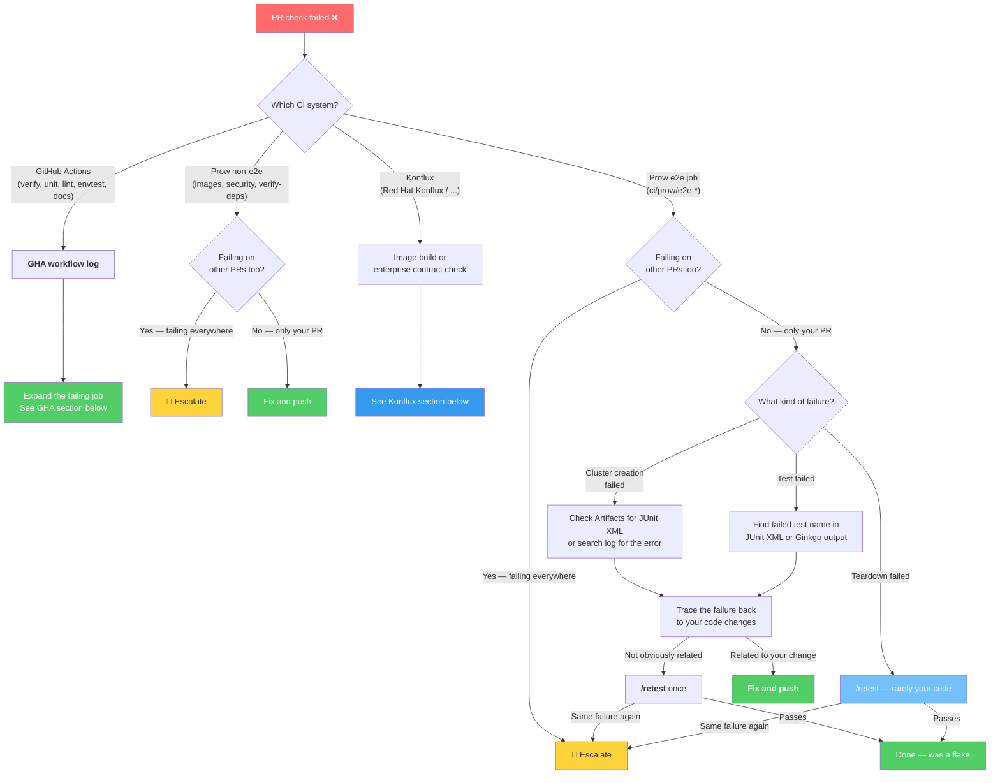

# Triaging Presubmit Failures

Your PR has a failing check. Use the flowchart below to figure out what's going on and what to do about it.

!!! tip "Automated analysis with Claude Code"

    If you use Claude Code, the [openshift-eng/ai-helpers](https://github.com/openshift-eng/ai-helpers) CI plugin can automate most of the investigation below:

    - `ci:analyze-prow-job-test-failure` — Analyzes test failures from a Prow job.
    - `ci:analyze-prow-job-install-failure` — Analyzes install/cluster-creation failures from a Prow job.

---

## Triage flowchart

On your PR, click **Details** on the failing check. The check name tells you which CI system it belongs to.

!!! info "Interactive flowchart"

    Click any box in the flowchart to jump to the relevant section on this page.



The rest of this page gives details for each branch in the flowchart.

---

## GitHub Actions failures

Click **Details** on the failing check — it takes you to the GitHub Actions workflow run. On that page:

1. Look at the left sidebar for the job name with a red ❌.
2. Click it to expand the job's steps.
3. Find the red step and click it to see the log output.

These checks run on every PR:

| Check name | What it runs | What to look for when it fails |
|------------|--------------|-------------------------------|
| **Unit Tests** | `make test` — Go unit tests, sharded across parallel jobs | `--- FAIL:` followed by the test name and assertion |
| **Verify** | `make generate update`, `make staticcheck`, `make fmt`, `make vet`, then checks for uncommitted diffs | If it fails on the diff check, run `make generate fmt` locally and commit the result |
| **Lint** | `make lint` — golangci-lint | Linter name and file path (e.g., `govet: ...`, `staticcheck: ...`) |
| **Codespell** | `make verify-codespell` — spell checker | The misspelled word, the file, and the suggested fix |
| **Gitlint** | `make run-gitlint` — commit message format checker | The rule that was violated (e.g., `title-max-length`) |
| **CPO Container Sync** | `make cpo-container-sync` — validates CPO container image references are in sync | The container name or image reference that's out of sync |

These checks only run when relevant files change:

| Check name | Triggers on | What to look for |
|------------|-------------|-----------------|
| **Envtest OCP API Validation** | `api/`, `test/envtest/`, CRD test assets | `FAIL` with the test name — see `test/envtest/README.md` for details |
| **Envtest Vanilla Kube API Validation** | Same as above | Same as above |
| **Docs Build** | `docs/**` changes | MkDocs build errors — usually a broken link or YAML syntax error |
| **Validate CPO Overrides** | `hypershift-operator/controlplaneoperator-overrides/assets/overrides.yaml` changes | Validation error for the CPO overrides file |
| **gocacheprog Tests** | `contrib/ci/gocacheprog/**` changes | `FAIL` with the test name |

GHA failures are almost always caused by your code changes. Fix and push.

To see all runs of a particular workflow (useful for checking if a failure is widespread), go to the [GitHub Actions page](https://github.com/openshift/hypershift/actions) and select the workflow from the left sidebar.

---

## Prow jobs

Prow checks appear on your PR as `ci/prow/<job-name>`. Click **Details** to open the Prow job page.

### Prow non-e2e jobs

These jobs don't run e2e tests. They build images or run static checks.

| Job | What it does | What to look for |
|-----|-------------|-----------------|
| `images` | Builds all HyperShift container images | `error:` — compilation or Dockerfile failure |
| `okd-scos-images` | Builds OKD/SCOS image variants | Same as `images` |
| `security` | Runs security scanning | Security policy violations |
| `verify-deps` | Verifies dependency consistency | Dependency mismatch errors |

If `images` fails, it usually means your code doesn't compile. Search the log for `error:` and fix. If you're unsure whether it's your code, [check the job history](#checking-prow-job-history) — if the same job is red on other PRs, it's not you.

---

### Prow e2e jobs

These jobs create real clusters and run tests against them. They are the most common source of failures.

| Job | Platform | What it tests | Trigger |
|-----|----------|---------------|---------|
| `e2e-aws` | AWS | Core v1 e2e tests | Auto |
| `e2e-v2-aws` | AWS | V2 e2e tests | Auto |
| `e2e-aws-4-22` | AWS | E2e tests against OCP 4.22 | `/test` only |
| `e2e-aws-upgrade-hypershift-operator` | AWS | HyperShift operator upgrade | Auto |
| `e2e-aks` | Azure (AKS) | AKS-managed e2e tests | Auto |
| `e2e-aks-4-22` | Azure (AKS) | AKS with OCP 4.22 | `/test` only |
| `e2e-azure-v2-self-managed` | Azure (self-managed) | Self-managed Azure v2 tests | Auto |
| `e2e-v2-gke` | GKE | V2 e2e tests on GKE | Auto |
| `e2e-kubevirt-aws-ovn-reduced` | KubeVirt on AWS | KubeVirt e2e tests | Auto |

Jobs marked **Auto** run when the PR receives `/lgtm` but can also be triggered manually with `/test <job-name>`. Jobs marked **`/test` only** must always be triggered manually.

### Finding the failed e2e step

On the Prow job page, look at the step list on the left. The e2e pipeline runs in this order:

1. **`create-guests`** — Creates hosted clusters in parallel
2. **`run-tests`** — Runs Ginkgo test suites against the clusters
3. **`dump-guests`** — Collects diagnostic artifacts (always runs)
4. **`destroy-guests`** — Tears down clusters

Find the step that failed and click it to see the log.

---

### `create-guests` failures

A hosted cluster failed to come up. To find out why:

1. Open the **Artifacts** tab and look for `junit_hosted_cluster_*.xml` files. These contain the `HostedCluster` and `NodePool` conditions at the time of failure.
2. If no JUnit file exists, the failure happened before the cluster reached the version rollout phase — check the `create-guests` step log directly.

Common causes:

| Phase | What failed | Typical cause |
|-------|-------------|---------------|
| Phase 1 | `hypershift create cluster` | Invalid flags or missing credentials |
| Phase 2 | Platform post-create hooks | Platform-specific setup failure |
| Phase 3 | Wait for Available | Control plane startup failure |
| Phase 4 | Platform post-available hooks | Day-2 config transition failure |
| Phase 5 | Version rollout | Cluster came up but couldn't roll out target version |

After identifying the error, [check the job history](#checking-prow-job-history) to determine if this is specific to your PR.

---

### `run-tests` failures

A test assertion failed. To find which test:

1. Open the **Artifacts** tab and look for JUnit XML files (e.g., `junit_self_managed_azure_public.xml`). The failed test name and assertion message are in the XML.
2. Alternatively, search the `run-tests` step log for `[FAIL]` to find the Ginkgo failure output, which includes the test description, the failed assertion, and the source file and line number.

After identifying the failing test, [check the job history](#checking-prow-job-history) to determine if this is specific to your PR.

For more details on reading test artifacts and Ginkgo output, see [Debugging CI Failures](../v2-testing/debugging.md).

---

### `destroy-guests` failures

Cluster teardown failed. This is rarely caused by your PR — it usually means a cloud API issue or a resource stuck in a deleting state. `/retest` is almost always the right move.

---

## Konflux failures

Konflux checks appear as `Red Hat Konflux / <component>-on-pull-request` or `Red Hat Konflux / enterprise-contract-*`. Click **Details** to open the Konflux pipeline run in the Konflux UI.

| Check pattern | What it does |
|---------------|-------------|
| `hypershift-operator-main-on-pull-request` | Builds the hypershift-operator image via Konflux |
| `control-plane-operator-main-on-pull-request` | Builds the control-plane-operator image |
| `hypershift-cli-mce-50-on-pull-request` | Builds the hypershift CLI image |
| `hypershift-release-mce-50-on-pull-request` | Builds the release image |
| `enterprise-contract-*` | Validates image provenance and policy compliance |

Common causes:

- **Compilation error** — Same as `images` failures. Your code doesn't compile. Fix and push.
- **Stale or retired Tekton pipeline images** — Konflux pipelines reference specific Tekton task images that get retired over time. When this happens, every PR fails on Konflux until the pipeline definitions are updated. The fix is to update the Tekton pipelines in the repo, merge that fix, and then rebase your PR onto the updated main branch.
- **Enterprise contract failures** — Policy violations on image provenance or signing. Usually not your code — `/retest` once.
- If the failure persists or you're unsure, [escalate](#escalate).

---

## Checking Prow job history

This is the key step for determining whether a failure is your fault. Check whether the same job is failing on other PRs.

### Non-e2e job history

| Job | History link |
|-----|-------------|
| images | [job history](https://prow.ci.openshift.org/job-history/gs/test-platform-results/pr-logs/directory/pull-ci-openshift-hypershift-main-images) |
| okd-scos-images | [job history](https://prow.ci.openshift.org/job-history/gs/test-platform-results/pr-logs/directory/pull-ci-openshift-hypershift-main-okd-scos-images) |
| security | [job history](https://prow.ci.openshift.org/job-history/gs/test-platform-results/pr-logs/directory/pull-ci-openshift-hypershift-main-security) |
| verify-deps | [job history](https://prow.ci.openshift.org/job-history/gs/test-platform-results/pr-logs/directory/pull-ci-openshift-hypershift-main-verify-deps) |

### E2e job history

| Job | History link |
|-----|-------------|
| e2e-aws | [job history](https://prow.ci.openshift.org/job-history/gs/test-platform-results/pr-logs/directory/pull-ci-openshift-hypershift-main-e2e-aws) |
| e2e-v2-aws | [job history](https://prow.ci.openshift.org/job-history/gs/test-platform-results/pr-logs/directory/pull-ci-openshift-hypershift-main-e2e-v2-aws) |
| e2e-aws-4-22 | [job history](https://prow.ci.openshift.org/job-history/gs/test-platform-results/pr-logs/directory/pull-ci-openshift-hypershift-main-e2e-aws-4-22) |
| e2e-aws-upgrade | [job history](https://prow.ci.openshift.org/job-history/gs/test-platform-results/pr-logs/directory/pull-ci-openshift-hypershift-main-e2e-aws-upgrade-hypershift-operator) |
| e2e-aks | [job history](https://prow.ci.openshift.org/job-history/gs/test-platform-results/pr-logs/directory/pull-ci-openshift-hypershift-main-e2e-aks) |
| e2e-aks-4-22 | [job history](https://prow.ci.openshift.org/job-history/gs/test-platform-results/pr-logs/directory/pull-ci-openshift-hypershift-main-e2e-aks-4-22) |
| e2e-azure-v2-self-managed | [job history](https://prow.ci.openshift.org/job-history/gs/test-platform-results/pr-logs/directory/pull-ci-openshift-hypershift-main-e2e-azure-v2-self-managed) |
| e2e-v2-gke | [job history](https://prow.ci.openshift.org/job-history/gs/test-platform-results/pr-logs/directory/pull-ci-openshift-hypershift-main-e2e-v2-gke) |
| e2e-kubevirt | [job history](https://prow.ci.openshift.org/job-history/gs/test-platform-results/pr-logs/directory/pull-ci-openshift-hypershift-main-e2e-kubevirt-aws-ovn-reduced) |

Look at the last 10-20 runs:

- **Mostly red** → The job is failing for everyone. It's not your code. [🚨 Escalate](#escalate).
- **Mostly green, yours is red** → The failure is likely related to your change. Continue to [tracing the failure](#tracing-the-failure-to-your-change).
- **Mixed** → Could be a flaky test. Check if the same test is failing in the red runs.

---

## Tracing the failure to your change

If the failure appears specific to your PR:

1. **Find the test file.** Search for the failing test name in `test/e2e/`:

    ```bash
    grep -r "test description from the failure" test/e2e/
    ```

2. **Read the test.** Understand what it's checking and what code paths it exercises.

3. **Trace back to your changes.** Common relationships:
    - Changed a controller → tests that verify that controller's behavior
    - Changed API types → tests that create or validate those resources
    - Changed a CPO component → compliance tests that check all control plane workloads

If your change clearly relates to the test, **fix and push** — the test is catching a real problem.

If it's not obvious, **`/retest` once**. If the same test fails again, escalate.

---

## 🚨 Escalate

If you've already retested and got the same failure, don't keep retesting — escalate.

Post in [#forum-ocp-hypershift](https://redhat.enterprise.slack.com/archives/C04PEHGPFCE) and tag `@hypershift-engineering-ic` with:

- The Prow job link
- The failing test or job name
- A one-line summary of what your PR changes
- Whether `/retest` produced the same failure

---

## Further reading

- [Debugging CI Failures](../v2-testing/debugging.md) — Reading JUnit XML, Ginkgo output, and dump-guests artifacts
- [V2 E2E Testing Overview](../v2-testing/index.md) — Architecture of the v2 test framework
- [CI Pipeline Configuration](../v2-testing/ci-pipeline.md) — How presubmit jobs are configured
- [Daily CI Health](daily-health.md) — Monitoring periodic and presubmit job health
