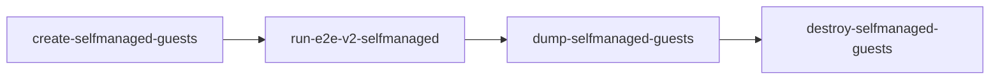
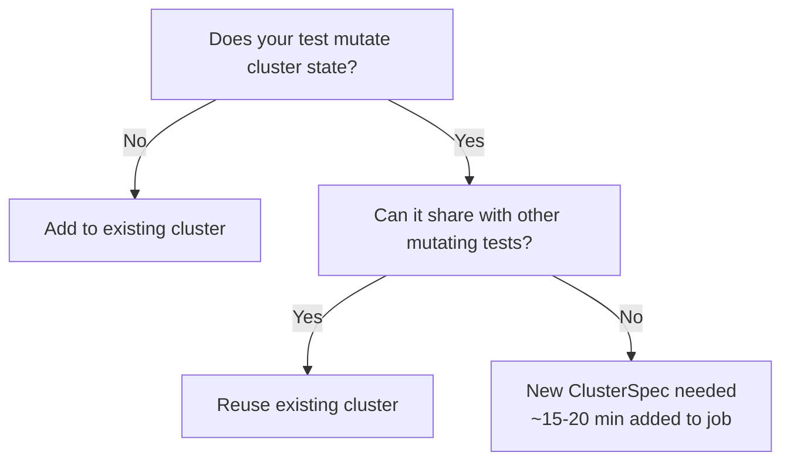

# CI Pipeline Configuration

This page explains how v2 tests run in CI, covering the two-repo model, step registry structure, CI binaries, and how to add or modify CI jobs.

## Two-Repo Model

The HyperShift v2 testing architecture spans two repositories:

- **[openshift/hypershift](https://github.com/openshift/hypershift)**: Owns test code, test binaries, and the CLI
- **[openshift/release](https://github.com/openshift/release)**: Owns job definitions, step registry, and CI orchestration

The `hypershift-tests` image is the bridge between these repos. Built from `Dockerfile.e2e`, it ships compiled test binaries to `/hypershift/bin/`. The image contains both v1 and v2 test binaries; this page covers only v2.

When you add a new v2 test to the hypershift repo and tag it with an existing Ginkgo label filter, it automatically runs in CI the next time the job executes. No release repo changes are needed unless you're adding a new cluster variant, label filter, or platform.

## Step Registry Anatomy

Prow jobs are built from a hierarchy of reusable components in the [openshift/release step registry](https://github.com/openshift/release/tree/master/ci-operator/step-registry). We'll use the Azure self-managed job as a concrete example.

### Workflow

The top-level workflow orchestrates the entire job. For Azure self-managed v2 tests, this is [`hypershift-azure-e2e-v2-self-managed-workflow.yaml`](https://github.com/openshift/release/blob/master/ci-operator/step-registry/hypershift/azure/e2e/v2/self-managed/hypershift-azure-e2e-v2-self-managed-workflow.yaml):

```yaml
workflow:
  as: hypershift-azure-e2e-v2-self-managed
  steps:
    pre:
    - ref: hypershift-azure-create-selfmanaged-guests
    test:
    - ref: hypershift-azure-run-e2e-v2-selfmanaged
    post:
    - ref: hypershift-azure-dump-selfmanaged-guests
    - ref: hypershift-azure-destroy-selfmanaged-guests
  env:
  - name: HYPERSHIFT_PLATFORM
    default: "azure"
```

The workflow sets `HYPERSHIFT_PLATFORM: "azure"` to tell the CI binaries which `PlatformConfig` to load, then chains together four steps: create → run → dump → destroy.

### Steps

The workflow references individual refs (using `ref:` directives), which may themselves be part of larger chains. In the step registry, a **ref** is a single step (a shell script that calls a binary), while a **chain** groups multiple refs together. The Azure self-managed v2 workflow references refs directly, but those refs may also appear in shared chains used by other jobs.

The four logical phases are:

- **Create** (shared with v1): Provisions management cluster infrastructure, installs HyperShift operator
- **Run** (v2-specific): Executes the test matrix
- **Dump** (shared with v1): Collects must-gather artifacts
- **Destroy** (shared with v1): Tears down clusters and infrastructure

Only the workflow and run ref are v2-specific. The create, dump, and destroy refs are shared between v1 and v2 jobs.

### Ref Scripts

Each ref is a thin shell script that invokes a Go binary from the `hypershift-tests` image. Here's the typical pattern:

```bash
#!/bin/bash
set -euo pipefail

HYPERSHIFT_BINARY="${HYPERSHIFT_BINARY:-/hypershift/bin/hypershift}"

/hypershift/bin/create-guests
```

The ref script sets up the environment, then calls the compiled binary. All v2-specific logic lives in the binary, not the shell script.

For the full Azure self-managed step registry, see [openshift/release#79347](https://github.com/openshift/release/pull/79347).

### Step Execution Order



The `pre` steps run before tests (setup), `test` steps run the actual tests, and `post` steps run after tests regardless of test outcome (cleanup).

## The Four CI Binaries

All v2 CI logic is implemented in Go binaries built from `test/e2e/v2/cmd/` and shipped in the `hypershift-tests` image at `/hypershift/bin/`.

### `create-guests`

**Source:** `test/e2e/v2/cmd/create-guests/`  
**Shipped as:** `/hypershift/bin/create-guests`

Creates hosted clusters in parallel using a five-phase flow:

1. **Cluster creation**: Calls `hypershift create cluster <platform>` in parallel for each `ClusterSpec` in the platform's test matrix. Cluster names are derived from `PROW_JOB_ID` via SHA-256 hashing: `{variant}-{sha256(prowJobID)[:10]}`

2. **Post-create hooks**: Runs platform-specific `PostCreate()` hooks. For example, Azure patches the `OperatorConfiguration` CRD to enable lifecycle tests

3. **Wait for available**: Watches each cluster's `HostedClusterAvailable` condition with timeout

4. **Wait for rollout**: Watches for version rollout completion on each cluster. If rollout fails, emits JUnit XML marking the cluster creation as failed

5. **Write cluster names**: Writes cluster names to `SHARED_DIR` files for consumption by `run-tests`

If any cluster fails to create or roll out, the binary exits non-zero and the job fails fast.

### `run-tests`

**Source:** `test/e2e/v2/cmd/run-tests/`  
**Shipped as:** `/hypershift/bin/run-tests`

Reads cluster names from `SHARED_DIR` files, then executes the platform's test matrix. For each `TestGroup`:

```bash
bin/test-e2e-v2 \
  --ginkgo.label-filter="<filter>" \
  --ginkgo.junit-report="<junit-file>" \
  --ginkgo.timeout="3h" \
  --ginkgo.skip="<skip-pattern>" \
  --ginkgo.v
```

with `E2E_HOSTED_CLUSTER_NAME` and `E2E_HOSTED_CLUSTER_NAMESPACE` set to the appropriate cluster name and namespace. The `--ginkgo.timeout` defaults to `3h` (overridable via `GINKGO_TIMEOUT` env var) and `--ginkgo.skip` is included when the `TestGroup.Skip` field is non-empty.

Before running any tests, `run-tests` calls `platform.SetupTestEnv(sharedDir)` to let the platform configure any environment variables needed by tests (for example, reading subnet IDs or other infrastructure details from `SHARED_DIR` files).

Whether a group runs in parallel or sequentially is determined by its placement in the `TestMatrix` struct returned by `PlatformConfig.TestMatrix()`:

```go
type TestMatrix struct {
    Parallel   []TestGroup       // all run concurrently
    Sequential []SequentialGroup // each group runs its Steps in order
}
```

**`Parallel`** groups run concurrently across multiple clusters. This maximizes throughput and is the common case.

**`Sequential`** groups run their `Steps` one after another on the same cluster. If any step fails, remaining steps in that group are skipped. Use sequential groups for ordered workflows like upgrade → validate → downgrade.

See [Labels](writing-tests.md#labels-two-layer-model) for how to control which tests run in each group.

### `dump-guests`

**Source:** `test/e2e/v2/cmd/dump-guests/`  
**Shipped as:** `/hypershift/bin/dump-guests`

Calls `hypershift dump cluster` in parallel for all clusters, collecting must-gather artifacts to `ARTIFACT_DIR`. Unlike `create` and `destroy`, the dump command is platform-agnostic (no platform subcommand).

This binary **always exits 0** to ensure cleanup steps run even if dump fails.

### `destroy-guests`

**Source:** `test/e2e/v2/cmd/destroy-guests/`  
**Shipped as:** `/hypershift/bin/destroy-guests`

Calls `hypershift destroy cluster <platform>` in parallel for all clusters.

Exits non-zero if any cluster fails to destroy. Logs `ACTION REQUIRED` messages to stdout for orphaned resources, which appear in job logs for manual cleanup.

## When to Create New CI Clusters

Not every test needs its own cluster. Use this decision framework:



### Examples

- **Read-only health check**: Add to existing public cluster. No mutation, so safe to share.
- **Autoscaling + nodepool lifecycle**: Share an existing cluster variant. Both tests mutate NodePools, but in non-conflicting ways.
- **Upgrade test** (needs N-1 image, HA control plane): New cluster variant required. Upgrade state cannot be shared.

### Adding a New ClusterSpec

If you need a new cluster variant, add it to both `ClusterSpecs()` and `TestMatrix()` in your platform's lifecycle file (e.g., `test/e2e/v2/lifecycle/azure.go`):

```diff
// ClusterSpecs() — cluster creation parameters
+{
+    Variant:    "my-new-variant",
+    OutputFile: "cluster-name-my-new-variant",
+    ExtraArgs:  []string{"--my-flag=value"},
+},

// TestMatrix() — test execution parameters
+{
+    Name:        "my-new-variant",
+    ClusterFile: "cluster-name-my-new-variant",
+    LabelFilter: "my-new-label",
+    JUnitFile:   "junit_my_new_variant.xml",
+    // Optional fields:
+    // Skip:     "regex-of-tests-to-skip",
+    // ExtraEnv: []string{"KEY=value"},
+},
```

Each new `ClusterSpec` adds approximately 15–20 minutes to the job runtime (cluster creation + rollout + deletion). Only add new variants when state sharing is impossible.

## Adding a Test to an Existing CI Job

When you write a new v2 test and want it to run in CI, the process depends on whether your test's label is already in an existing label filter.

### Case 1: Label Already Exists in Filter

If your test uses a label that's already in a `TestGroup.LabelFilter` (e.g., `nodepool-lifecycle`), **no changes are needed**. The test automatically runs the next time the job executes.

### Case 2: New Label

If your test introduces a new label, add it to the appropriate `TestGroup.LabelFilter` in the platform's test matrix:

```diff
 {
     Name:        "public",
     ClusterFile: "cluster-name-public",
-    LabelFilter: "self-managed-azure-public || nodepool-lifecycle",
+    LabelFilter: "self-managed-azure-public || nodepool-lifecycle || my-new-label",
     JUnitFile:   "junit_self_managed_azure_public.xml",
 },
```

**No release repo changes are needed in either case.** The test matrix lives in the hypershift repo, and the `hypershift-tests` image is rebuilt for every PR.

## Adding a New CI Job for a New Platform

Adding v2 support for a new platform requires changes in both repositories.

### Step 1: Implement PlatformConfig (hypershift repo)

Create `test/e2e/v2/lifecycle/<platform>.go` implementing the `PlatformConfig` interface. Use `azure.go` as a reference:

```go
// Abbreviated — see platform.go for the full interface.
type PlatformConfig interface {
    ClusterSpecs(releaseImage, n1Image string) []ClusterSpec
    TestMatrix(releaseImage string) TestMatrix
    PostCreate(ctx context.Context, cl crclient.WithWatch, namespace string, clusterNames map[string]string) error
    // Also: Name(), DefaultBaseDomain(), CreateArgs(),
    // SetupTestEnv(sharedDir), DestroyArgs()
}
```

See [`test/e2e/v2/lifecycle/platform.go`](https://github.com/openshift/hypershift/blob/main/test/e2e/v2/lifecycle/platform.go) for the full `PlatformConfig` interface, including `Name()`, `DefaultBaseDomain()`, `CreateArgs()`, `SetupTestEnv()`, and `DestroyArgs()`.

Register your platform in the `NewPlatformConfig()` switch in `test/e2e/v2/lifecycle/platform.go`:

```diff
 func NewPlatformConfig(platform, sharedDir string) (PlatformConfig, error) {
     switch platform {
     case "azure", "":
         return NewAzurePlatformConfig(sharedDir), nil
+    case "my-platform":
+        return NewMyPlatformConfig(sharedDir), nil
     default:
         return nil, fmt.Errorf("unsupported platform %q (supported: azure)", platform)
     }
 }
```

### Step 2: Add Step Registry Components (release repo)

Create a workflow, chain, and ref in the [openshift/release step registry](https://github.com/openshift/release/tree/master/ci-operator/step-registry):

1. **Workflow**: `hypershift-<platform>-e2e-v2-<variant>-workflow.yaml`
2. **Ref**: `hypershift-<platform>-run-e2e-v2-<variant>.yaml` (shell script that calls `/hypershift/bin/run-tests`)

Reuse existing create/dump/destroy chains where possible (they're usually platform-specific but v1/v2-agnostic).

### Step 3: Wire into Job Definition

Add the job to `ci-operator/config/openshift/hypershift/openshift-hypershift-main.yaml`:

```yaml
- as: e2e-<platform>-v2-<variant>
  steps:
    workflow: hypershift-<platform>-e2e-v2-<variant>
  always_run: false
  skip_if_only_changed: "^docs/|^contrib/|^\.github/|^.*\\.md$"
```

Regenerate CI config with `make jobs WHAT=openshift/hypershift` from the release repo root.

For a complete example, see the Azure self-managed v2 implementation in [openshift/hypershift#8527](https://github.com/openshift/hypershift/pull/8527).

## Job Configuration Knobs

Common CI configuration points and where to find them:

| Knob | File | Description |
|------|------|-------------|
| `always_run` | `ci-operator/config/openshift/hypershift/openshift-hypershift-main.yaml` | `true` runs the job on every PR; `false` requires `/test <job-name>` |
| `skip_if_only_changed` | `ci-operator/config/openshift/hypershift/openshift-hypershift-main.yaml` | Regex of file paths that skip the job when they're the only changes |
| Image dependencies | Workflow/ref YAML | `release:latest`, `release:n1minor` provide OpenShift release images as environment variables |
| Timeout | Ref YAML `timeout` field | Per-step timeout (e.g., `150m` for lifecycle tests that create clusters) |
| `HYPERSHIFT_PLATFORM` | Workflow YAML `env` | Tells CI binaries which `PlatformConfig` to load from `test/e2e/v2/lifecycle/` |

All step registry YAML lives in [openshift/release](https://github.com/openshift/release/tree/master/ci-operator/step-registry/hypershift). Job definitions live in [ci-operator/config/openshift/hypershift/](https://github.com/openshift/release/tree/master/ci-operator/config/openshift/hypershift).

After editing job config, regenerate with `make jobs WHAT=openshift/hypershift` from the release repo root, then submit a PR to openshift/release.
