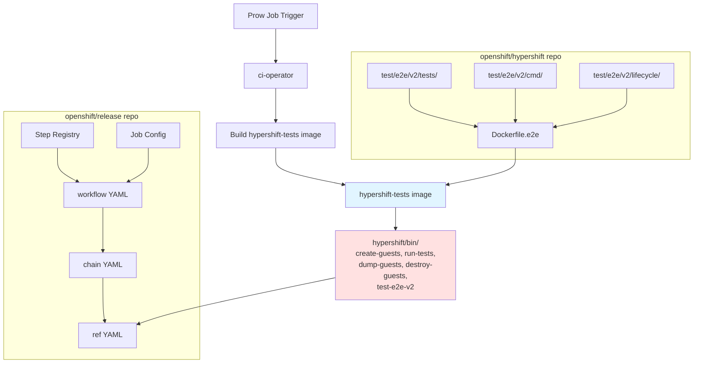

# V2 E2E Test Framework

## Why V2

The v1 framework produced test results where a single test case failure appeared as 4–5 separate failures due to how tests were structured. This made Sippy triage impossible and prevented HyperShift from being represented in Component Readiness. The v2 framework (Ginkgo v2 + structured JUnit reporting) produces one JUnit entry per `It` block, which these tools consume directly.

## Architecture



!!! note "Image contents"
    The `hypershift-tests` image ships both v1 and v2 test binaries. This documentation covers only the v2 components.

## Key Concepts

- **Ginkgo labels** — Tags on `Describe`/`It` blocks (e.g., `hosted-cluster-health`, `lifecycle`) used by `--ginkgo.label-filter` to select which tests run on which cluster.

- **PlatformConfig** — Interface in `test/e2e/v2/lifecycle/platform.go` that encapsulates all platform-specific configuration. Implement this to add a new platform.

- **TestContext** — Shared context initialized in `BeforeSuite` from environment variables. Provides management client (created eagerly in `SetupTestContextFromEnv`) and hosted cluster client (lazy-loaded via `sync.Once` in `GetHostedClusterClient`), along with cluster name/namespace.

- **Informing tests** — Tests labeled `Informing` that convert failures to skips via the custom fail handler. They appear as "skipped" in JUnit and don't fail CI or appear in Sippy.

- **CI binaries** — Four compiled Go programs (`create-guests`, `run-tests`, `dump-guests`, `destroy-guests`) that replace inline bash in the release repo step registry.

- **Step registry** — The openshift/release repo's hierarchy of workflow → chain → ref YAML files that define CI job steps.

## Test Execution Flow

1. Prow triggers the CI job (e.g., `e2e-azure-v2-self-managed`)
2. ci-operator builds the `hypershift-tests` image from `Dockerfile.e2e`
3. **create-guests** creates clusters in parallel — 5 phases: create, post-create hooks, wait Available, wait version rollout, write cluster names to `SHARED_DIR`. Emits JUnit XML to `ARTIFACT_DIR` recording success or failure for each cluster's version rollout.
4. **run-tests** invokes `bin/test-e2e-v2` once per `TestGroup` with a different `--ginkgo.label-filter` and `E2E_HOSTED_CLUSTER_NAME`. Whether groups run concurrently or sequentially is determined by placement in the `TestMatrix` struct — groups in `TestMatrix.Parallel` run concurrently, while groups in `TestMatrix.Sequential` run their steps one after another on the same cluster.
5. **dump-guests** collects diagnostic artifacts in parallel. Always exits 0.
6. **destroy-guests** tears down all clusters in parallel. Exits non-zero if any destroy fails.

!!! info "Key insight"
    `run-tests` doesn't run tests itself — it invokes the same compiled `bin/test-e2e-v2` binary multiple times with different label filters and cluster targets.

## Directory Structure

```text
test/e2e/v2/
├── tests/           — All Ginkgo test files + suite_test.go entry point
├── internal/        — Framework internals (TestContext, env vars, fail handler, workload registry)
├── lifecycle/       — Platform-specific config (PlatformConfig interface + implementations)
├── cmd/             — CI binary source (create-guests, run-tests, dump-guests, destroy-guests)
├── util/            — Shared test utilities (pod exec, metrics)
└── backuprestore/   — Backup/restore test helpers (Velero, prober, CLI wrappers)
```

!!! note
    This structure may expand as the framework evolves.

## Scope

Azure self-managed is the reference implementation used throughout these docs. The framework is platform-agnostic — AWS, GCP HCP, and other platforms will follow the same patterns by implementing the `PlatformConfig` interface.

## Framework Conventions

For detailed coding standards, test patterns, and framework conventions, see the [v2 framework AGENTS.md](https://github.com/openshift/hypershift/blob/main/test/e2e/v2/AGENTS.md).
