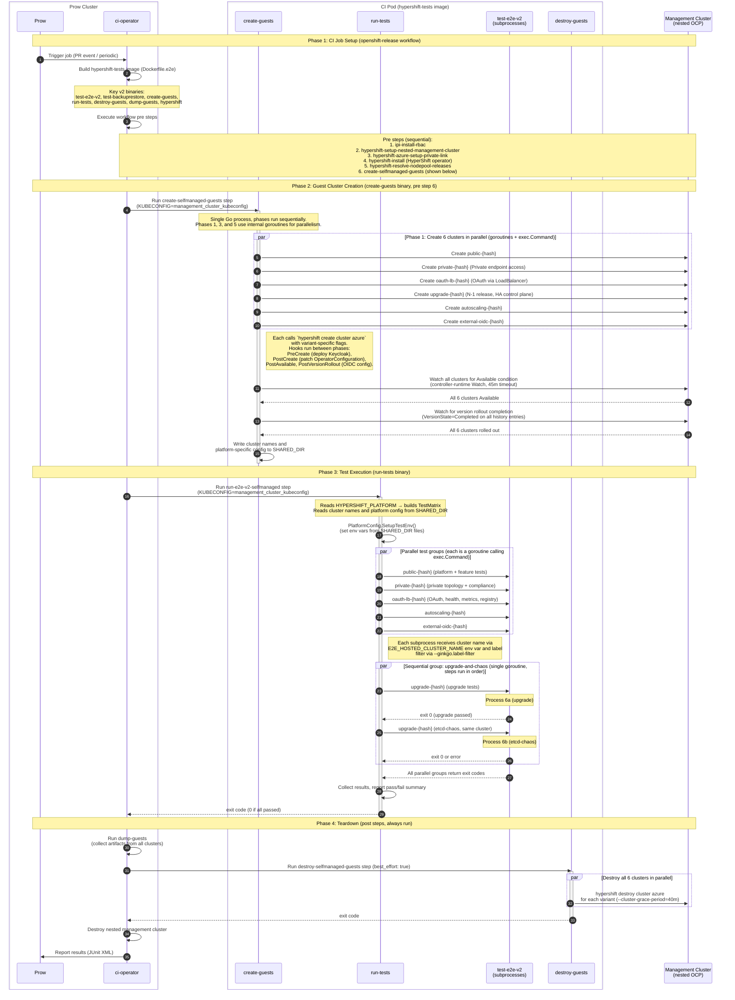
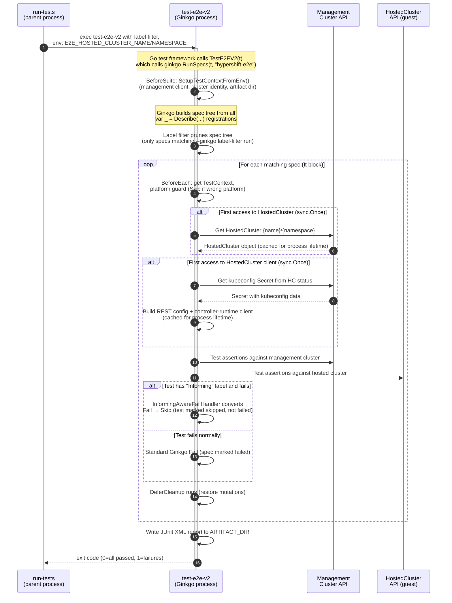
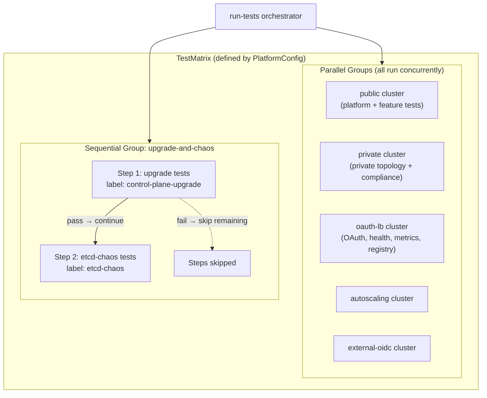
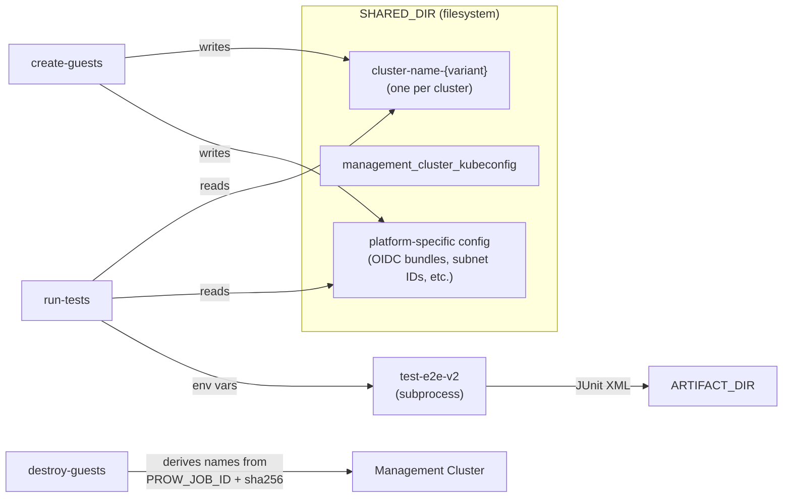

# E2E v2 Test Flow

This document describes the end-to-end flow of the HyperShift v2 e2e test framework,
from CI job trigger through test execution and teardown. It covers process boundaries,
inter-process communication, and the sequencing of mutually exclusive tests.

## Contents

- [Ginkgo Decorators, Hooks, and Labels for Test Isolation](#ginkgo-decorators-hooks-and-labels-for-test-isolation)
    - [Decorators](#decorators)
    - [Hooks](#hooks)
    - [Labels](#labels)
    - [How These Layers Compose](#how-these-layers-compose)
- [High-Level Flow](#high-level-flow)
- [Inside a test-e2e-v2 Process (Ginkgo Lifecycle)](#inside-a-test-e2e-v2-process-ginkgo-lifecycle)
- [Process Boundary Summary](#process-boundary-summary)
- [Sequencing of Mutually Exclusive Tests](#sequencing-of-mutually-exclusive-tests)
- [Inter-Process Communication](#inter-process-communication)

## Ginkgo Decorators, Hooks, and Labels for Test Isolation

The v2 framework uses Ginkgo features at two levels to keep tests from interfering
with each other: the [**`run-tests` orchestrator**][run-tests] isolates test groups
into separate OS processes targeting different clusters, and **within each process**,
Ginkgo decorators and hooks manage execution order, state mutation, cleanup, and
reporting semantics.

### Decorators

| Decorator | Purpose | Used by |
|-----------|---------|---------|
| **`Ordered`** | Specs in the container run in declaration order. If one fails, subsequent specs in the same container are skipped. Prevents dependent steps from running against corrupted state. | [BackupRestore, EtcdSnapshot][backup-restore-test], [EtcdChaos][etcd-chaos-test], [AzurePrivateLink, AzureEndpointAccess][azure-test], [PKI operator TLS modification][pki-test], [AdmissionPolicies][security-test], [ImageRegistryCapability][image-registry-test], [ExternalOIDCKeycloakAuth][external-oidc-test] |
| **`Serial`** | Specs never run concurrently with other specs, even if Ginkgo parallel mode were enabled. Applied alongside `Ordered` when a test mutates shared cluster state that could interfere with other specs. | [BackupRestore, EtcdSnapshot][backup-restore-test] (separate binary), [PKI operator TLS modification][pki-test] |

`Ordered` is the primary tool for inter-test dependencies within a single feature
(e.g., backup must complete before restore can start). `Serial` adds the guarantee
that no other spec in the process runs at the same time, which matters for tests
that mutate cluster-wide resources like HostedCluster configuration or etcd state.
In practice, since `run-tests` does not pass `--procs` to Ginkgo, all specs within
a process already run sequentially — but `Serial` makes the constraint explicit and
future-proof.

### Hooks

| Hook | Scope | Purpose |
|------|-------|---------|
| **`BeforeSuite`** | Once per process | Initializes the global [`TestContext`][test-context] from env vars (cluster name, namespace, artifact dir, management client). Runs before any spec. See [`suite_test.go`][suite-test]. |
| **`BeforeAll`** | Once per `Ordered` container | Initializes shared state for an ordered sequence (e.g., resolve `TestContext`, validate platform support, capture original config for later restoration). Runs once before the first spec in the container. |
| **`AfterAll`** | Once per `Ordered` container | Tears down shared state created by `BeforeAll` (e.g., delete backup resources, restore original HostedCluster config). |
| **`BeforeEach`** | Before every spec | Top-level: resolves `TestContext` and validates the hosted cluster resource exists on the management cluster. (`Ordered` containers use `BeforeAll` for the same purpose.) Nested (in `Context`/`When` blocks) or inline in specs: runs platform guards (`Skip()` if wrong platform) or other precondition checks. |
| **`DeferCleanup`** | After each spec (LIFO) | Restores mutated state or deletes created resources. Registered immediately after mutation/creation so cleanup runs even if the test panics or fails before reaching manual deletion. |

The `BeforeAll`/`AfterAll` pair is critical for lifecycle tests that share expensive
preconditions across multiple ordered specs (e.g., backup-restore creates a backup
once, then multiple specs verify different aspects of the restore). Without `Ordered`,
`BeforeAll`/`AfterAll` cannot be used — Ginkgo enforces this at the framework level.

### Labels

| Label | Effect |
|-------|--------|
| **`lifecycle`** | Marks tests that mutate cluster state (upgrades, nodepool scaling, etcd chaos, global pull secret, OS image stream, autoscaling, platform-specific lifecycle). The simple [`hypershift-e2e-v2` CI chain][e2e-v2-chain] filters these out with `--ginkgo.label-filter='!lifecycle'` so that read-only compliance runs don't trigger mutations. The `run-tests` orchestrator runs lifecycle tests on dedicated clusters via specific label filters. |
| **`Informing`** | The custom [`InformingAwareFailHandler`][fail-handler] converts failures on specs with this label into skips. The test appears as "skipped" in JUnit XML rather than "failed", so it doesn't block the CI job. Used for tests validating optional or in-progress features (e.g., metrics forwarding, custom labels/tolerations). |
| **Feature/platform labels** (e.g., `self-managed-azure-public`, `nodepool-autoscaling`, `control-plane-upgrade`) | Control which specs run in which `test-e2e-v2` process. The [`run-tests` orchestrator][run-tests] passes `--ginkgo.label-filter` with non-overlapping label sets so each process only runs specs relevant to its assigned cluster variant. The label-to-cluster mapping is defined by [`TestMatrix`][azure-platform] in the platform config. |

### How These Layers Compose

```text
run-tests orchestrator
├── Process 1 (public cluster): --ginkgo.label-filter="self-managed-azure-public || nodepool-lifecycle || ..."
│   ├── Describe "NodePool Lifecycle" [Ordered] ← specs run in order, share BeforeAll setup
│   │   ├── BeforeAll: create test nodepool
│   │   ├── It "should scale up" ← mutation test
│   │   ├── It "should scale down"
│   │   └── AfterAll: delete test nodepool
│   ├── Describe "Control Plane Workloads" ← read-only, no Ordered needed
│   │   ├── It "should have resource requests" ← stateless assertion
│   │   └── Context "Custom labels" [Informing] ← failure → skip, non-blocking
│   └── ...
├── Process 2 (private cluster): --ginkgo.label-filter="self-managed-azure-private || ..."
│   └── ...
└── Sequential group (upgrade cluster):
    ├── Process 6a: --ginkgo.label-filter="control-plane-upgrade" ← must finish before 6b
    │   └── Describe "Control Plane Upgrade" ← triggers version rollout
    └── Process 6b: --ginkgo.label-filter="etcd-chaos" ← only runs if 6a passed
        └── Describe "Etcd Chaos" [Ordered] ← specs run in order, BeforeAll snapshots etcd
```

Cluster-level isolation (different processes target different clusters) prevents
inter-group interference. Within a process, `Ordered`/`Serial` prevent inter-spec
interference for mutation-heavy features. `DeferCleanup` ensures each spec restores
what it touched. `Informing` decouples experimental coverage from gate status. The
`lifecycle` label separates mutation tests from read-only compliance runs at the CI
job level.

## High-Level Flow

The diagram below shows the general v2 e2e flow. The framework is
platform-agnostic — each platform implements the [`PlatformConfig`][platform]
interface — but Azure is currently the only implementation and serves as the
reference. The concrete examples here follow the
[`e2e-azure-v2-self-managed`][ci-job-config] CI job and its
[workflow][workflow]. ci-operator builds the [`hypershift-tests`][dockerfile-e2e]
image (via [`Dockerfile.e2e`][dockerfile-e2e], which invokes several
[`Makefile`][makefile] targets), then chains together cluster creation, test
execution, and teardown steps.



## Inside a test-e2e-v2 Process (Ginkgo Lifecycle)

Each `test-e2e-v2` invocation is a single OS process running the Ginkgo v2 test
framework. The process is a compiled Go test binary (`go test -c`) with the `e2ev2`
build tag.



## Process Boundary Summary

| Process | Binary | Lifecycle | Communication |
|---------|--------|-----------|---------------|
| **ci-operator** | CI infrastructure | Manages the entire [job][ci-job-config] | Runs [workflow steps][workflow] as pods |
| **Step shell** | bash | One per CI step | Sets KUBECONFIG, runs Go binaries ([create][create-guests-sh], [run][run-tests-chain], [destroy][destroy-guests-chain]) |
| **[create-guests][]** | `/hypershift/bin/create-guests` | Runs once in pre step | Forks `hypershift` CLI via `exec.Command`, writes cluster names and platform-specific config to `SHARED_DIR` |
| **[run-tests][]** | `/hypershift/bin/run-tests` | Runs once in test step | Forks one `test-e2e-v2` process per test group via `exec.Command`. Env vars pass cluster name + config. Collects exit codes. |
| **test-e2e-v2** | `/hypershift/bin/test-e2e-v2` | One process per test group (7 total, up to 6 concurrent) | Reads env vars for cluster identity. Talks to management + hosted cluster APIs via kubeconfig. Writes JUnit XML to `ARTIFACT_DIR`. Entry point: [`suite_test.go`][suite-test]. |
| **[destroy-guests][]** | `/hypershift/bin/destroy-guests` | Runs once in post step | Forks `hypershift` CLI via `exec.Command` for each cluster (parallel goroutines). |

## Sequencing of Mutually Exclusive Tests

Mutual exclusion between test groups is achieved through **cluster isolation** and
**sequential groups**, not through in-process locking:



**Key mechanisms:**

1. **Cluster-per-group isolation**: Each parallel test group targets a **different
   HostedCluster**. Tests within a group share one cluster but different groups never
   touch the same cluster. This eliminates inter-group interference without locks.

2. **Label-based partitioning**: Ginkgo's `--ginkgo.label-filter` ensures each
   `test-e2e-v2` process only runs specs matching its assigned labels. The label
   sets are [non-overlapping across groups][azure-platform], so the same spec never
   runs in two processes.

3. **Sequential groups for ordered dependencies**: The `upgrade-and-chaos`
   [sequential group][azure-platform] runs upgrade first, then etcd-chaos on the
   **same cluster**. The [`run-tests` orchestrator][run-tests] enforces ordering by
   running steps sequentially within a single goroutine. If upgrade fails, etcd-chaos
   is skipped (the goroutine returns early).

4. **No in-process mutex**: Because each `test-e2e-v2` process targets exactly one
   cluster and runs non-overlapping label sets, there is no need for mutexes or
   other synchronization between test specs. Ginkgo runs specs within a single
   process serially by default (no `--procs` flag is passed).

## Inter-Process Communication



- **SHARED_DIR**: Filesystem directory shared across all CI steps within a job.
  [`create-guests`][create-guests] writes cluster names and platform-specific
  config; [`run-tests`][run-tests] reads them. This is the primary IPC mechanism
  between CI steps.
- **Environment variables**: `run-tests` passes cluster identity to each `test-e2e-v2`
  subprocess via `E2E_HOSTED_CLUSTER_NAME` and `E2E_HOSTED_CLUSTER_NAMESPACE` env vars.
- **PROW_JOB_ID + SHA256**: [`destroy-guests`][destroy-guests] does not read
  SHARED_DIR cluster names. Instead, it re-derives cluster names deterministically
  from `PROW_JOB_ID` using the same [`DeriveClusterName()`][platform] function as
  `create-guests`. This makes teardown idempotent and independent of whether creation
  succeeded.
- **KUBECONFIG**: All processes authenticate to the management cluster via the
  kubeconfig file at `${SHARED_DIR}/management_cluster_kubeconfig`, set up by the
  nested management cluster provisioning step.
- **Exit codes**: `run-tests` collects exit codes from all `test-e2e-v2` subprocesses
  and exits non-zero if any group failed.
- **JUnit XML**: Each `test-e2e-v2` process writes a separate JUnit report to
  `ARTIFACT_DIR`. ci-operator collects these for Sippy/Prow reporting.

<!-- HyperShift repo links (openshift/hypershift, main branch) -->
[run-tests]: https://github.com/openshift/hypershift/blob/main/test/e2e/v2/cmd/run-tests/main.go
[create-guests]: https://github.com/openshift/hypershift/blob/main/test/e2e/v2/cmd/create-guests/main.go
[destroy-guests]: https://github.com/openshift/hypershift/blob/main/test/e2e/v2/cmd/destroy-guests/main.go
[suite-test]: https://github.com/openshift/hypershift/blob/main/test/e2e/v2/tests/suite_test.go
[test-context]: https://github.com/openshift/hypershift/blob/main/test/e2e/v2/internal/test_context.go
[fail-handler]: https://github.com/openshift/hypershift/blob/main/test/e2e/v2/internal/fail_handler.go
[platform]: https://github.com/openshift/hypershift/blob/main/test/e2e/v2/lifecycle/platform.go
[azure-platform]: https://github.com/openshift/hypershift/blob/main/test/e2e/v2/lifecycle/azure.go
[backup-restore-test]: https://github.com/openshift/hypershift/blob/main/test/e2e/v2/tests/backup_restore_test.go
[etcd-chaos-test]: https://github.com/openshift/hypershift/blob/main/test/e2e/v2/tests/etcd_chaos_test.go
[azure-test]: https://github.com/openshift/hypershift/blob/main/test/e2e/v2/tests/hosted_cluster_azure_test.go
[pki-test]: https://github.com/openshift/hypershift/blob/main/test/e2e/v2/tests/control_plane_pki_operator_test.go
[security-test]: https://github.com/openshift/hypershift/blob/main/test/e2e/v2/tests/hosted_cluster_security_test.go
[image-registry-test]: https://github.com/openshift/hypershift/blob/main/test/e2e/v2/tests/hosted_cluster_image_registry_test.go
[external-oidc-test]: https://github.com/openshift/hypershift/blob/main/test/e2e/v2/tests/hosted_cluster_external_oidc_test.go
[dockerfile-e2e]: https://github.com/openshift/hypershift/blob/main/Dockerfile.e2e
[makefile]: https://github.com/openshift/hypershift/blob/main/Makefile

<!-- openshift/release repo links (main branch) -->
[ci-job-config]: https://github.com/openshift/release/blob/main/ci-operator/config/openshift/hypershift/openshift-hypershift-main.yaml
[workflow]: https://github.com/openshift/release/blob/main/ci-operator/step-registry/hypershift/azure/e2e/v2-self-managed/hypershift-azure-e2e-v2-self-managed-workflow.yaml
[create-guests-sh]: https://github.com/openshift/release/blob/main/ci-operator/step-registry/hypershift/azure/create-selfmanaged-guests/hypershift-azure-create-selfmanaged-guests-commands.sh
[run-tests-chain]: https://github.com/openshift/release/blob/main/ci-operator/step-registry/hypershift/azure/run-e2e-v2-selfmanaged/hypershift-azure-run-e2e-v2-selfmanaged-chain.yaml
[destroy-guests-chain]: https://github.com/openshift/release/blob/main/ci-operator/step-registry/hypershift/azure/destroy-selfmanaged-guests/hypershift-azure-destroy-selfmanaged-guests-chain.yaml
[e2e-v2-chain]: https://github.com/openshift/release/blob/main/ci-operator/step-registry/hypershift/e2e-v2/hypershift-e2e-v2-chain.yaml
