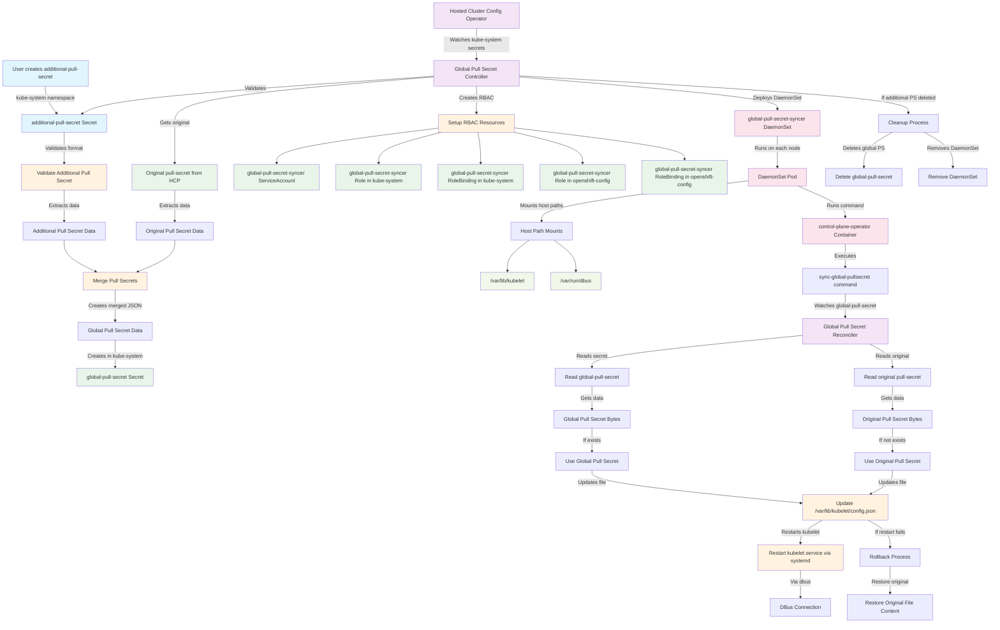

# Global Pull Secret for Hosted Control Planes

## Overview

The Global Pull Secret functionality enables Hosted Cluster administrators to include additional pull secrets for accessing container images from private registries without requiring assistance from the Management Cluster administrator. This feature allows you to merge your custom pull secret with the original HostedCluster pull secret, making it available to all nodes in the cluster.

The implementation uses a DaemonSet approach that automatically detects when you create an `additional-pull-secret` in the `kube-system` namespace of your DataPlane (Hosted Cluster). The system then merges this secret with the original pull secret and deploys the merged result to all nodes via a DaemonSet that updates the kubelet configuration.

!!! note

    This feature is designed to work autonomously - once you create the additional pull secret, the system automatically handles the rest without requiring Management Cluster administrator intervention.

## Adding your Pull Secret

!!! important

    All actions described in this section must be performed on the **HostedCluster's workers** (DataPlane), not on the Management Cluster.

To use this functionality, follow these steps:

### 1. Create your additional pull secret

Create a secret named `additional-pull-secret` in the `kube-system` namespace of your Hosted Cluster (DataPlane). The secret must contain a valid DockerConfigJSON format:

```yaml
apiVersion: v1
kind: Secret
metadata:
  name: additional-pull-secret
  namespace: kube-system
type: kubernetes.io/dockerconfigjson
data:
  .dockerconfigjson: <base64-encoded-docker-config-json>
```

### 2. Example DockerConfigJSON format

Your `.dockerconfigjson` should follow this structure:

```json
{
  "auths": {
    "registry.example.com": {
      "auth": "base64-encoded-credentials"
    },
    "quay.io": {
      "auth": "base64-encoded-credentials"
    }
  }
}
```

### 3. Apply the secret

```bash
kubectl apply -f additional-pull-secret.yaml
```

### 4. Verification

After creating the secret, the system will automatically:

1. Validate the secret format
2. Merge it with the original pull secret
3. Deploy a DaemonSet to all nodes
4. Update the kubelet configuration on each node

You can verify the deployment by checking:

```bash
# Check if the DaemonSet is running
kubectl get daemonset global-pull-secret-syncer -n kube-system

# Check the merged pull secret
kubectl get secret global-pull-secret -n kube-system

# Check DaemonSet pods
kubectl get pods -n kube-system -l name=global-pull-secret-syncer
```

## How it works

The Global Pull Secret functionality operates through a multi-component system:

### Automatic Detection
- The Hosted Cluster Config Operator (HCCO) continuously monitors the `kube-system` namespace
- When it detects the creation of `additional-pull-secret`, it triggers the reconciliation process

### Validation and Merging
- The system validates that your secret contains a proper DockerConfigJSON format
- It retrieves the original pull secret from the HostedControlPlane
- Your additional pull secret is merged with the original one
- If there are conflicting registry entries, your additional pull secret takes precedence

### Deployment Process
- A `global-pull-secret` is created in the `kube-system` namespace containing the merged result
- RBAC resources (ServiceAccount, Role, RoleBinding) are created for the DaemonSet in both `kube-system` and `openshift-config` namespaces
- We use Role and RoleBinding in both namespaces to access secrets in `kube-system` and `openshift-config` namespaces
- A DaemonSet named `global-pull-secret-syncer` is deployed to all nodes

### Node-Level Synchronization
- Each DaemonSet pod runs a controller that watches the secrets under kube-system namespace
- When changes are detected, it updates `/var/lib/kubelet/config.json` on the node
- The kubelet service is restarted via DBus to apply the new configuration
- If the restart fails after 3 attempts, the system rolls back the file changes

### Automatic Cleanup
- If you delete the `additional-pull-secret`, the HCCO automatically removes the globalPullSecret secret
- The DaemonSet is deleted from all nodes
- RBAC resources (ServiceAccount, Role, RoleBinding) in both namespaces are cleaned up by the HCCO

## Implementation details

The implementation consists of several key components working together:

### Core Components

1. **Global Pull Secret Controller** (`globalps` package)
   - Handles validation of user-provided pull secrets
   - Manages the merging logic between original and additional pull secrets
   - Creates and manages RBAC resources
   - Deploys and manages the DaemonSet

2. **Sync Global Pull Secret Command** (`sync-global-pullsecret` package)
   - Runs as a DaemonSet on each node
   - Watches for changes to the `global-pull-secret` in `kube-system` namespace
   - Accesses the original `pull-secret` in `openshift-config` namespace
   - Updates the kubelet configuration file
   - Manages kubelet service restarts via DBus

3. **Hosted Cluster Config Operator Integration**
   - Monitors for the presence of `additional-pull-secret`
   - Orchestrates the entire process
   - Handles cleanup when the secret is removed

### Architecture Diagram



### Key Features

- **Security**: Only watches specific secrets in `kube-system` and `openshift-config` namespaces
- **Robustness**: Includes automatic rollback in case of failures
- **Efficiency**
  - Only updates when there are actual changes
  - The globalPullSecret implementation has their own controller so it cannot interfere with the HCCO reonciliation
- **Minimal privileges**: Specific RBAC for only the required resources in each namespace

### Error Handling

The system includes comprehensive error handling:

- **Validation errors**: Invalid DockerConfigJSON format is caught early
- **Restart failures**: If kubelet restart fails after 3 attempts, the file is rolled back
- **Resource cleanup**: If the additional pull secret is deleted, the HCCO automatically removes the globalPullSecret

This implementation provides a secure, autonomous solution that allows HostedCluster administrators to add private registry credentials without requiring Management Cluster administrator intervention.