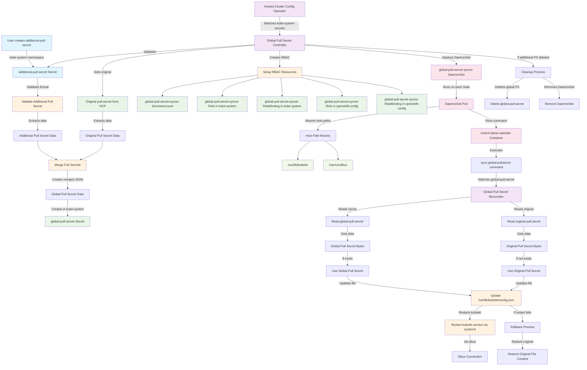

# Global Pull Secret for Hosted Control Planes

## Overview

The Global Pull Secret functionality enables Hosted Cluster administrators to include additional pull secrets for accessing container images from private registries without requiring assistance from the Management Cluster administrator. This feature allows you to merge your custom pull secret with the original HostedCluster pull secret, making it available to all nodes in the cluster.

The implementation uses a DaemonSet approach that automatically detects when you create an `additional-pull-secret` in the `kube-system` namespace of your DataPlane (Hosted Cluster). The system then merges this secret with the original pull secret and deploys the merged result to all nodes via a DaemonSet that updates the kubelet configuration.

!!! note

    This feature is designed to work autonomously - once you create the additional pull secret, the system automatically handles the rest without requiring Management Cluster administrator intervention.

## Adding your Pull Secret

!!! important

    All actions described in this section must be performed on the **HostedCluster's workers** (DataPlane), not on the Management Cluster.

To use this functionality, follow these steps:

### 1. Create your additional pull secret

Create a secret named `additional-pull-secret` in the `kube-system` namespace of your Hosted Cluster (DataPlane). The secret must contain a valid DockerConfigJSON format:

```yaml
apiVersion: v1
kind: Secret
metadata:
  name: additional-pull-secret
  namespace: kube-system
type: kubernetes.io/dockerconfigjson
data:
  .dockerconfigjson: <base64-encoded-docker-config-json>
```

### 2. Example DockerConfigJSON format

Your `.dockerconfigjson` should follow this structure:

```json
{
  "auths": {
    "registry.example.com": {
      "auth": "base64-encoded-credentials"
    },
    "quay.io/mycompany": {
      "auth": "base64-encoded-credentials"
    }
  }
}
```

!!! tip "Using Namespace-Specific Registry Entries"

    For registries like Quay.io that support organization/namespace-specific authentication, you can specify the full path in your registry entry (e.g., `quay.io/mycompany` instead of just `quay.io`). This allows you to provide different credentials for different namespaces within the same registry, and helps avoid conflicts with existing registry entries in the original pull secret.

### 3. Apply the secret

```bash
kubectl apply -f additional-pull-secret.yaml
```

### 4. Verification

After creating the secret, the system will automatically:

1. Validate the secret format
2. Merge it with the original pull secret
3. Deploy a DaemonSet to all nodes
4. Update the kubelet configuration on each node

You can verify the deployment by checking:

```bash
# Check if the DaemonSet is running
kubectl get daemonset global-pull-secret-syncer -n kube-system

# Check the merged pull secret
kubectl get secret global-pull-secret -n kube-system

# Check DaemonSet pods
kubectl get pods -n kube-system -l name=global-pull-secret-syncer
```

## How it works

The Global Pull Secret functionality operates through a multi-component system:

### Automatic Detection
- The Hosted Cluster Config Operator (HCCO) continuously monitors the `kube-system` namespace
- When it detects the creation of `additional-pull-secret`, it triggers the reconciliation process

### Validation and Merging
- The system validates that your secret contains a proper DockerConfigJSON format
- It retrieves the original pull secret from the HostedControlPlane
- Your additional pull secret is merged with the original one
- **If there are conflicting registry entries, the original pull secret takes precedence** (the additional pull secret entry is ignored for conflicting registries)
- The system supports namespace-specific registry entries (e.g., `quay.io/namespace`) for better credential specificity

### Deployment Process
- A `global-pull-secret` is created in the `kube-system` namespace containing the merged result
- RBAC resources (ServiceAccount, Role, RoleBinding) are created for the DaemonSet in both `kube-system` and `openshift-config` namespaces
- We use Role and RoleBinding in both namespaces to access secrets in `kube-system` and `openshift-config` namespaces
- A DaemonSet named `global-pull-secret-syncer` is deployed to eligible nodes

!!! warning "NodePool InPlace Strategy Restriction"

    The Global Pull Secret DaemonSet is **not deployed** to nodes that belong to NodePools using the **InPlace upgrade strategy**. This restriction prevents conflicts between the DaemonSet's modifications to `/var/lib/kubelet/config.json` and the Machine Config Daemon (MCD) during InPlace upgrades.

    - **Nodes with Replace strategy**: ✅ Receive Global Pull Secret DaemonSet
    - **Nodes with InPlace strategy**: ❌ Do not receive Global Pull Secret DaemonSet

    This ensures that MCD operations during InPlace upgrades do not fail due to unexpected changes in kubelet configuration files.

### Node-Level Synchronization
- Each DaemonSet pod runs a controller that watches the secrets under kube-system namespace
- When changes are detected, it reads the existing `/var/lib/kubelet/config.json` on the node
- **Merges on-disk auths** with cluster-provided auths, preserving external registry credentials (see [On-Disk Authentication Preservation](#on-disk-authentication-preservation))
- Uses file locking (`.lock` file) to prevent race conditions with external processes
- Updates the kubelet configuration file atomically
- The kubelet service is restarted via DBus to apply the new configuration
- If the restart fails after 3 attempts, the system rolls back the file changes

### Automatic Cleanup
- If you delete the `additional-pull-secret`, the HCCO automatically removes the `global-pull-secret` secret
- The system reverts to using only the original pull secret from the HostedControlPlane
- The DaemonSet continues running but now syncs only the original pull secret to nodes

## Registry Precedence and Conflict Resolution

The Global Pull Secret system uses a specific precedence model when merging your additional pull secret with the original one:

### Merge Behavior
- **Original pull secret entries always take precedence** over additional pull secret entries for the same registry
- If both secrets contain an entry for `quay.io`, the original pull secret's credentials will be used
- Your additional pull secret entries are only added if they don't conflict with existing entries
- Warnings are logged when conflicts are detected

### Recommended Approach
To avoid conflicts and ensure your credentials are used, consider these strategies:

1. **Use namespace-specific entries**: Instead of `quay.io`, use `quay.io/your-namespace`
2. **Target specific registries**: Add entries only for registries not already in the original pull secret
3. **Check existing entries**: Review what registries are already configured in the HostedControlPlane

### Example Merge Scenario

**Original Pull Secret:**
```json
{
  "auths": {
    "quay.io": {
      "auth": "original-credentials"
    }
  }
}
```

**Your Additional Pull Secret:**
```json
{
  "auths": {
    "quay.io": {
      "auth": "your-credentials"
    },
    "quay.io/mycompany": {
      "auth": "your-namespace-credentials"
    }
  }
}
```

**Resulting Merged Pull Secret:**
```json
{
  "auths": {
    "quay.io": {
      "auth": "original-credentials"
    },
    "quay.io/mycompany": {
      "auth": "your-namespace-credentials"
    }
  }
}
```

Note how the `quay.io` entry keeps the original credentials, but `quay.io/mycompany` is added from your additional secret.

## On-Disk Authentication Preservation

In addition to the control-plane level merging described above, the Global Pull Secret system also preserves external registry authentications that may be added directly to nodes. This feature allows external processes, automation tools, or manual interventions to add registry credentials to nodes that will be preserved across Global Pull Secret synchronizations.

### How On-Disk Preservation Works

When the Global Pull Secret DaemonSet synchronizes the pull secret to a node's `/var/lib/kubelet/config.json`, it:

1. **Reads the existing on-disk configuration** with file locking to prevent race conditions
2. **Merges existing auths** from the on-disk file with the cluster-provided auths
3. **Preserves external auths** that are not managed by HyperShift
4. **Writes the merged result** atomically to maintain consistency

### Node-Level Precedence Rules

The node-level merge follows these precedence rules:

- **Cluster-provided auths (from HyperShift) ALWAYS take precedence** for registries managed by the cluster
- **External/on-disk auths are preserved** ONLY if they're for registries NOT in the cluster-provided pull secret
- If both the cluster and on-disk config have an entry for the same registry, the cluster-provided auth wins

This design allows HyperShift to maintain full control over its managed registries while preserving external modifications for other registries.

### Use Cases for On-Disk Auth Preservation

This feature is useful in scenarios where:

1. **External automation adds node-specific credentials**: Tools like image pre-puller utilities or node provisioning scripts can add registry credentials that persist across Global Pull Secret syncs
2. **Temporary troubleshooting access**: Site reliability engineers can manually add credentials to nodes for debugging without those credentials being removed on the next sync
3. **Third-party integrations**: External systems that manage their own registry credentials can coexist with HyperShift's Global Pull Secret management

### Example On-Disk Merge Scenario

**Cluster-provided Pull Secret** (from global-pull-secret in kube-system):
```json
{
  "auths": {
    "quay.io": {
      "auth": "cluster-credentials"
    },
    "registry.redhat.io": {
      "auth": "cluster-redhat-credentials"
    }
  }
}
```

**Existing On-Disk config.json** (added by external process):
```json
{
  "auths": {
    "quay.io": {
      "auth": "external-credentials"
    },
    "registry.example.com": {
      "auth": "external-example-credentials"
    }
  }
}
```

**Resulting Merged config.json**:
```json
{
  "auths": {
    "quay.io": {
      "auth": "cluster-credentials"
    },
    "registry.redhat.io": {
      "auth": "cluster-redhat-credentials"
    },
    "registry.example.com": {
      "auth": "external-example-credentials"
    }
  }
}
```

Note that:
- `quay.io` uses cluster-provided credentials (HyperShift takes precedence)
- `registry.redhat.io` is added from the cluster-provided secret
- `registry.example.com` is preserved from the on-disk file since it's not managed by HyperShift

## Implementation details

The implementation consists of several key components working together:

### Core Components

1. **Global Pull Secret Controller** (`globalps` package)
   - Handles validation of user-provided pull secrets
   - Manages the merging logic between original and additional pull secrets
   - Creates and manages RBAC resources
   - Deploys and manages the DaemonSet
   - **Node eligibility assessment**: Labels nodes from InPlace NodePools and configures DaemonSet scheduling restrictions

2. **Sync Global Pull Secret Command** (`sync-global-pullsecret` package)
   - Runs as a DaemonSet on each node
   - Watches for changes to the `global-pull-secret` in `kube-system` namespace
   - Accesses the original `pull-secret` in `openshift-config` namespace
   - **Merges on-disk auths** from existing kubelet config with cluster-provided auths
   - Uses file locking (`.lock` file) for thread-safe concurrent access
   - Updates the kubelet configuration file atomically
   - Manages kubelet service restarts via DBus

3. **Hosted Cluster Config Operator Integration**
   - Monitors for the presence of `additional-pull-secret`
   - Orchestrates the entire process
   - Handles cleanup when the secret is removed

### Architecture Diagram



### Key Features

- **Security**: Only watches specific secrets in `kube-system` and `openshift-config` namespaces
- **Robustness**: Includes automatic rollback in case of failures
- **Efficiency**
  - Only updates when there are actual changes
  - The globalPullSecret implementation has their own controller so it cannot interfere with the HCCO reonciliation
- **Security considerations**: Uses specific RBAC for only the required resources in each namespace. The DaemonSet containers run in privileged mode due to the need to:
  - Write to `/var/lib/kubelet/config.json` (kubelet configuration file)
  - Connect to systemd via DBus for service management
  - Restart kubelet.service, which requires root privileges
- **Smart node targeting**: Automatically excludes nodes from InPlace NodePools to prevent MCD conflicts

### InPlace NodePool Handling

To prevent conflicts with Machine Config Daemon operations, the implementation includes intelligent node targeting:

#### Node Labeling Process
1. **MachineSets Discovery**: The controller queries the management cluster for MachineSets with InPlace-specific annotations (`hypershift.openshift.io/nodePoolTargetConfigVersion`)
2. **Machine Enumeration**: For each InPlace MachineSets, it lists all associated Machines
3. **Node Identification**: Maps Machine objects to their corresponding nodes via `machine.Status.NodeRef.Name`
4. **Labeling**: Applies `hypershift.openshift.io/nodepool-inplace-strategy=true` label to identified nodes

#### DaemonSet Scheduling Configuration
The DaemonSet uses NodeAffinity to exclude InPlace nodes:

```yaml
spec:
  template:
    spec:
      affinity:
        nodeAffinity:
          requiredDuringSchedulingIgnoredDuringExecution:
            nodeSelectorTerms:
            - matchExpressions:
              - key: hypershift.openshift.io/nodepool-inplace-strategy
                operator: DoesNotExist
```

This ensures that:
- **Nodes without the label**: ✅ Are eligible for DaemonSet scheduling
- **Nodes with the label** (any value): ❌ Are excluded from DaemonSet scheduling

#### Conflict Prevention Benefits
- **Prevents MCD failures**: Avoids conflicts when MCD expects specific kubelet configuration during InPlace upgrades
- **Maintains upgrade reliability**: InPlace upgrade processes are not interrupted by Global Pull Secret modifications
- **Automatic detection**: No manual intervention required - the system automatically identifies and handles InPlace nodes

### Error Handling

The system includes comprehensive error handling:

- **Validation errors**: Invalid DockerConfigJSON format is caught early
- **Restart failures**: If kubelet restart fails after 3 attempts, the file is rolled back
- **Resource cleanup**: If the additional pull secret is deleted, the HCCO automatically removes the globalPullSecret

This implementation provides a secure, autonomous solution that allows HostedCluster administrators to add private registry credentials without requiring Management Cluster administrator intervention.
