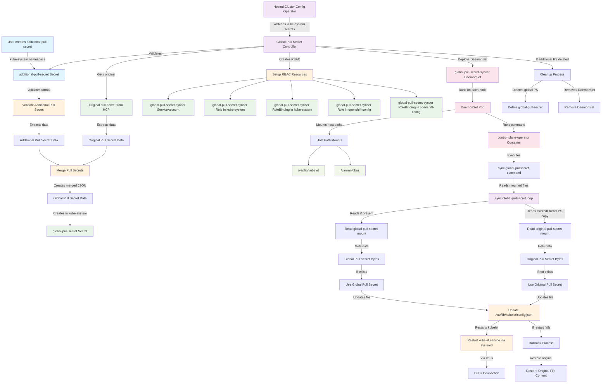

# Global Pull Secret for Hosted Control Planes

## Overview

The Global Pull Secret functionality enables Hosted Cluster administrators to include additional pull secrets for accessing container images from private registries without requiring assistance from the Management Cluster administrator. This feature allows you to merge your custom pull secret with the original HostedCluster pull secret, making it available to nodes that run the sync DaemonSet.

The implementation uses a DaemonSet that updates kubelet pull credentials on the node. The pull secret referenced by **`HostedCluster.spec.pullSecret`** is always copied from the HostedControlPlane into the guest cluster as the `original-pull-secret` Secret in `kube-system`. The `sync-global-pullsecret` process writes that content to `/var/lib/kubelet/config.json` on **eligible** worker nodes (see [Platform and NodePool eligibility](#platform-and-nodepool-eligibility)), even if you **never** create `additional-pull-secret`. In that baseline case there is no merge step: the kubelet file is kept aligned with the HostedCluster pull secret that HCCO reconciles into the data plane.

When you **do** create an `additional-pull-secret` in the `kube-system` namespace of your DataPlane (Hosted Cluster), the system merges it with the original HostedCluster pull secret and deploys the merged result via the same DaemonSet path (still preferring the original secret where registry entries conflict).

!!! note

    This feature is designed to work autonomously. With only `HostedCluster.spec.pullSecret`, the Hosted Cluster Config Operator (HCCO) still reconciles `original-pull-secret` and the DaemonSet object in the guest; sync pods run only on [eligible nodes](#platform-and-nodepool-eligibility). Creating `additional-pull-secret` is optional and only needed to add or layer registry credentials beyond the HostedCluster pull secret.

## Platform and NodePool eligibility

HCCO reconciles Global Pull Secret resources for **every** hosted cluster platform: it always maintains `kube-system/original-pull-secret` (and optional `global-pull-secret`), RBAC, and the `global-pull-secret-syncer` DaemonSet **object** in the data plane.

The DaemonSet pod template requires nodes to have the label **`hypershift.openshift.io/nodepool-globalps-enabled=true`**. Today the HyperShift operator sets that label on **Machines** (and HCCO propagates it to **Nodes**) only for:

- **AWS** and **Azure** NodePools, and  
- the **Replace** upgrade strategy (`MachineDeployment` path).

It does **not** set the label for **InPlace** NodePools (to avoid conflicting with Machine Config Daemon on kubelet config), or for **Replace** on other platforms such as **KubeVirt** (and other providers) in the current implementation—those workers therefore typically have **no** Global Pull Secret sync pods unless something else applies the label.

For platforms without sync pods, pull credentials still come from **ignition/bootstrap** and from in-cluster Secrets (for example `openshift-config/pull-secret`); kubelet on-disk config is not updated by this DaemonSet on those nodes.

## Adding your Pull Secret

!!! important

    All actions described in this section must be performed on the **HostedCluster's workers** (DataPlane), not on the Management Cluster.

To use this functionality, follow these steps:

### 1. Create your additional pull secret

Create a secret named `additional-pull-secret` in the `kube-system` namespace of your Hosted Cluster (DataPlane). The secret must contain a valid DockerConfigJSON format:

```yaml
apiVersion: v1
kind: Secret
metadata:
  name: additional-pull-secret
  namespace: kube-system
type: kubernetes.io/dockerconfigjson
data:
  .dockerconfigjson: <base64-encoded-docker-config-json>
```

### 2. Example DockerConfigJSON format

Your `.dockerconfigjson` should follow this structure:

```json
{
  "auths": {
    "registry.example.com": {
      "auth": "base64-encoded-credentials"
    },
    "quay.io/mycompany": {
      "auth": "base64-encoded-credentials"
    }
  }
}
```

!!! tip "Using Namespace-Specific Registry Entries"

    For registries like Quay.io that support organization/namespace-specific authentication, you can specify the full path in your registry entry (e.g., `quay.io/mycompany` instead of just `quay.io`). This allows you to provide different credentials for different namespaces within the same registry, and helps avoid conflicts with existing registry entries in the original pull secret.

### 3. Apply the secret

```bash
kubectl apply -f additional-pull-secret.yaml
```

### 4. Verification

After creating the secret, the system will automatically:

1. Validate the secret format
2. Merge it with the original pull secret
3. Ensure the DaemonSet is present in the guest cluster
4. Update kubelet configuration on **eligible** worker nodes (see [Platform and NodePool eligibility](#platform-and-nodepool-eligibility))

You can verify the deployment by checking:

```bash
# Check if the DaemonSet is running
kubectl get daemonset global-pull-secret-syncer -n kube-system

# Check the merged pull secret
kubectl get secret global-pull-secret -n kube-system

# Check DaemonSet pods
kubectl get pods -n kube-system -l name=global-pull-secret-syncer
```

## How it works

The Global Pull Secret functionality operates through a multi-component system:

### Automatic detection and baseline sync
- The Hosted Cluster Config Operator (HCCO) continuously reconciles Global Pull Secret resources and watches Secrets in the `kube-system` namespace of the data plane.
- On every reconcile, HCCO copies the HostedControlPlane pull secret (sourced from **`HostedCluster.spec.pullSecret`**) into `kube-system/original-pull-secret` so the DaemonSet can mount it on the node.
- If `additional-pull-secret` is **not** present, HCCO removes the `global-pull-secret` Secret (if it existed) and the DaemonSet syncs **only** the HostedCluster pull secret copy into `/var/lib/kubelet/config.json` on eligible nodes.
- When `additional-pull-secret` **is** present, reconciliation additionally validates and merges it with the HostedCluster pull secret.

### Validation and merging (optional additional secret)
- When `additional-pull-secret` exists, the system validates that it contains a proper DockerConfigJSON format.
- It retrieves the original pull secret from the HostedControlPlane (same content as `HostedCluster.spec.pullSecret`).
- Your additional pull secret is merged with the original one.
- **If there are conflicting registry entries, the original pull secret takes precedence** (the additional pull secret entry is ignored for conflicting registries).
- The system supports namespace-specific registry entries (e.g., `quay.io/namespace`) for better credential specificity.

### Deployment process
- When merging is active, a `global-pull-secret` is created in the `kube-system` namespace containing the merged result. If there is no additional secret, this Secret is absent and the syncer uses `original-pull-secret` only.
- RBAC resources (ServiceAccount, Role, RoleBinding) are created for the DaemonSet in both `kube-system` and `openshift-config` namespaces
- We use Role and RoleBinding in both namespaces to access secrets in `kube-system` and `openshift-config` namespaces
- A DaemonSet named `global-pull-secret-syncer` is deployed to eligible nodes

!!! warning "InPlace and unsupported platforms"

    **InPlace NodePools:** workers are intentionally **not** labeled `hypershift.openshift.io/nodepool-globalps-enabled`, so the Global Pull Secret sync **pods do not schedule** there. That avoids conflicts between edits to `/var/lib/kubelet/config.json` and the Machine Config Daemon (MCD).

    **AWS and Azure, Replace:** workers **are** labeled (via Machine → Node propagation), so sync pods **can** run and reconcile kubelet pull configuration from `original-pull-secret` / `global-pull-secret`.

    **Other platforms (for example KubeVirt, GCP, Agent, …):** the DaemonSet object still exists in `kube-system`, but nodes usually **lack** the selector label, so you will typically see **no** (or very few) sync pods unless you set that label yourself.

    See [Platform and NodePool eligibility](#platform-and-nodepool-eligibility) for the full picture.

### Node-level synchronization
- Each DaemonSet pod runs `sync-global-pullsecret`, which periodically reads the mounted pull secret files (`global-pull-secret` when present, otherwise `original-pull-secret`, which holds the **`HostedCluster.spec.pullSecret`** payload reconciled by HCCO).
- When the desired content differs from `/var/lib/kubelet/config.json`, it updates the file on the node
- The kubelet service is restarted via DBus to apply the new configuration
- If the restart fails after 3 attempts, the system rolls back the file changes

### Automatic cleanup
- If you delete the `additional-pull-secret`, the HCCO automatically removes the `global-pull-secret` secret.
- The system reverts to syncing **only** the HostedCluster pull secret (via `original-pull-secret`, still sourced from the HostedControlPlane).
- The DaemonSet continues to run on eligible nodes and keeps `/var/lib/kubelet/config.json` aligned with that HostedCluster pull secret.

## Registry Precedence and Conflict Resolution

The Global Pull Secret system uses a specific precedence model when merging your additional pull secret with the original one:

### Merge Behavior
- **Original pull secret entries always take precedence** over additional pull secret entries for the same registry
- If both secrets contain an entry for `quay.io`, the original pull secret's credentials will be used
- Your additional pull secret entries are only added if they don't conflict with existing entries
- Warnings are logged when conflicts are detected

### Recommended Approach
To avoid conflicts and ensure your credentials are used, consider these strategies:

1. **Use namespace-specific entries**: Instead of `quay.io`, use `quay.io/your-namespace`
2. **Target specific registries**: Add entries only for registries not already in the original pull secret
3. **Check existing entries**: Review what registries are already configured in the HostedControlPlane

### Example Merge Scenario

**Original Pull Secret:**
```json
{
  "auths": {
    "quay.io": {
      "auth": "original-credentials"
    }
  }
}
```

**Your Additional Pull Secret:**
```json
{
  "auths": {
    "quay.io": {
      "auth": "your-credentials"
    },
    "quay.io/mycompany": {
      "auth": "your-namespace-credentials"
    }
  }
}
```

**Resulting Merged Pull Secret:**
```json
{
  "auths": {
    "quay.io": {
      "auth": "original-credentials"
    },
    "quay.io/mycompany": {
      "auth": "your-namespace-credentials"
    }
  }
}
```

Note how the `quay.io` entry keeps the original credentials, but `quay.io/mycompany` is added from your additional secret.

## Implementation details

The implementation consists of several key components working together:

### Core Components

1. **Global Pull Secret Controller** (`globalps` package)
   - Handles validation of user-provided pull secrets
   - Manages the merging logic between original and additional pull secrets
   - Creates and manages RBAC resources
   - Deploys and manages the DaemonSet in Nodes labeled with `hypershift.openshift.io/nodepool-globalps-enabled=true`

2. **Sync Global Pull Secret Command** (`sync-global-pullsecret` package)
   - Runs in the DaemonSet pod on eligible nodes
   - Reads mounted Docker config JSON from `global-pull-secret` when that volume exists; otherwise uses `original-pull-secret` (the copy of **`HostedCluster.spec.pullSecret`** reconciled into `kube-system`)
   - Updates `/var/lib/kubelet/config.json` on the host
   - Manages kubelet service restarts via DBus

3. **Hosted Cluster Config Operator integration**
   - Reconciles `original-pull-secret` on every pass from the HostedControlPlane pull secret (`HostedCluster.spec.pullSecret`)
   - When `additional-pull-secret` exists, validates, merges, and reconciles `global-pull-secret`; when it does not, removes `global-pull-secret` and relies on `original-pull-secret` only for kubelet sync
   - Orchestrates RBAC and the DaemonSet for both paths

### Architecture Diagram


```mermaid
graph TB
    %% User Input
    User[User creates additional-pull-secret] --> |kube-system namespace| AdditionalPS[additional-pull-secret Secret]

    %% HCCO Controller
    HCCO[Hosted Cluster Config Operator] --> |Watches kube-system secrets| GlobalPSController[Global Pull Secret Controller]
    GlobalPSController --> |Validates| AdditionalPS
    GlobalPSController --> |Gets original| OriginalPS[Original pull-secret from HCP]

    %% Secret Processing
    AdditionalPS --> |Validates format| ValidatePS[Validate Additional Pull Secret]
    OriginalPS --> |Extracts data| OriginalPSData[Original Pull Secret Data]
    ValidatePS --> |Extracts data| AdditionalPSData[Additional Pull Secret Data]

    %% Merge Process
    OriginalPSData --> MergeSecrets[Merge Pull Secrets]
    AdditionalPSData --> MergeSecrets
    MergeSecrets --> |Creates merged JSON| GlobalPSData[Global Pull Secret Data]

    %% Secret Creation
    GlobalPSData --> |Creates in kube-system| GlobalPSSecret[global-pull-secret Secret]

    %% RBAC Setup
    GlobalPSController --> |Creates RBAC| RBACSetup[Setup RBAC Resources]
    RBACSetup --> ServiceAccount[global-pull-secret-syncer ServiceAccount]
    RBACSetup --> KubeSystemRole[global-pull-secret-syncer Role in kube-system]
    RBACSetup --> KubeSystemRoleBinding[global-pull-secret-syncer RoleBinding in kube-system]
    RBACSetup --> OpenshiftConfigRole[global-pull-secret-syncer Role in openshift-config]
    RBACSetup --> OpenshiftConfigRoleBinding[global-pull-secret-syncer RoleBinding in openshift-config]

    %% DaemonSet Deployment
    GlobalPSController --> |Deploys DaemonSet| DaemonSet[global-pull-secret-syncer DaemonSet]
    DaemonSet --> |Runs on each node| DaemonSetPod[DaemonSet Pod]

    %% DaemonSet Pod Details
    DaemonSetPod --> |Mounts host paths| HostMounts[Host Path Mounts]
    HostMounts --> KubeletPath["/var/lib/kubelet"]
    HostMounts --> DbusPath["/var/run/dbus"]

    %% Container Execution
    DaemonSetPod --> |Runs command| Container[control-plane-operator Container]
    Container --> |Executes| SyncCommand[sync-global-pullsecret command]

    %% Sync Process
    SyncCommand --> |Reads mounted files| SyncController[sync-global-pullsecret loop]
    SyncController --> |Reads if present| ReadGlobalPS[Read global-pull-secret mount]
    SyncController --> |Reads HostedCluster PS copy| ReadOriginalPS[Read original-pull-secret mount]

    %% File Update Process
    ReadGlobalPS --> |Gets data| GlobalPSBytes[Global Pull Secret Bytes]
    ReadOriginalPS --> |Gets data| OriginalPSBytes[Original Pull Secret Bytes]

    %% Decision Logic
    GlobalPSBytes --> |If exists| UseGlobalPS[Use Global Pull Secret]
    OriginalPSBytes --> |If not exists| UseOriginalPS[Use Original Pull Secret]

    %% File Update
    UseGlobalPS --> |Updates file| UpdateKubeletConfig["Update /var/lib/kubelet/config.json"]
    UseOriginalPS --> |Updates file| UpdateKubeletConfig

    %% Kubelet Restart
    UpdateKubeletConfig --> |Restarts kubelet| RestartKubelet[Restart kubelet.service via systemd]
    RestartKubelet --> |Via dbus| DbusConnection[DBus Connection]

    %% Error Handling
    UpdateKubeletConfig --> |If restart fails| RollbackProcess[Rollback Process]
    RollbackProcess --> |Restore original| RestoreOriginal[Restore Original File Content]

    %% Cleanup Process
    GlobalPSController --> |If additional PS deleted| CleanupProcess[Cleanup Process]
    CleanupProcess --> |Deletes global PS| DeleteGlobalPS[Delete global-pull-secret]
    CleanupProcess --> |Removes DaemonSet| RemoveDaemonSet[Remove DaemonSet]

    %% Styling
    classDef userInput fill:#e1f5fe
    classDef controller fill:#f3e5f5
    classDef secret fill:#e8f5e8
    classDef process fill:#fff3e0
    classDef daemonSet fill:#fce4ec
    classDef fileSystem fill:#f1f8e9

    class User,AdditionalPS userInput
    class HCCO,GlobalPSController,SyncController controller
    class OriginalPS,GlobalPSSecret,ServiceAccount,KubeSystemRole,KubeSystemRoleBinding,OpenshiftConfigRole,OpenshiftConfigRoleBinding secret
    class ValidatePS,MergeSecrets,RBACSetup,UpdateKubeletConfig,RestartKubelet process
    class DaemonSet,DaemonSetPod,Container daemonSet
    class KubeletPath,DbusPath fileSystem
```

### Key Features

- **Security**: Only watches specific secrets in `kube-system` and `openshift-config` namespaces
- **Robustness**: Includes automatic rollback in case of failures
- **Efficiency**
  - Only updates when there are actual changes
  - The globalPullSecret implementation has their own controller so it cannot interfere with the HCCO reonciliation
- **Security considerations**: Uses specific RBAC for only the required resources in each namespace. The DaemonSet containers run in privileged mode due to the need to:
  - Write to `/var/lib/kubelet/config.json` (kubelet configuration file)
  - Connect to systemd via DBus for service management
  - Restart kubelet.service, which requires root privileges
- **Smart node targeting**: The DaemonSet uses a `nodeSelector` for `hypershift.openshift.io/nodepool-globalps-enabled=true`; the HyperShift operator only applies that label on **AWS** and **Azure** **Replace** NodePools, so InPlace and other platforms do not get sync pods by default (see [Platform and NodePool eligibility](#platform-and-nodepool-eligibility))

### How scheduling avoids InPlace conflicts

Eligibility is **positive selection**, not NodeAffinity on an InPlace label: InPlace workers simply **never** receive `hypershift.openshift.io/nodepool-globalps-enabled=true`, so the sync DaemonSet does not place pods on them. Replace workers on AWS/Azure **do** receive the label so the DaemonSet can run there without colliding with MCD on InPlace upgrade paths.

### Error Handling

The system includes comprehensive error handling:

- **Validation errors**: Invalid DockerConfigJSON format is caught early
- **Restart failures**: If kubelet restart fails after 3 attempts, the file is rolled back
- **Resource cleanup**: If the additional pull secret is deleted, the HCCO automatically removes the globalPullSecret

This implementation provides a secure, autonomous solution that allows HostedCluster administrators to add private registry credentials without requiring Management Cluster administrator intervention.