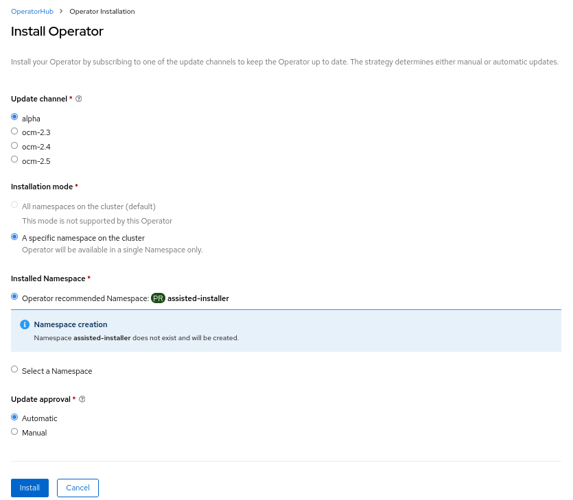

# Deploy Infrastructure Operator

HyperShift supports the Agent platform via [cluster-api-provider-agent](https://github.com/openshift/cluster-api-provider-agent).  This is a platform-agnostic way of adding workers.

The cluster-api-provider-agent requires the Infrastructure Operator to be installed.

## Hive CRDs

As a prerequisite, the following [Hive](https://github.com/openshift/hive) CRDs need to be installed:

```shell
oc apply -f https://raw.githubusercontent.com/openshift/hive/ocm-2.4/config/crds/hive.openshift.io_clusterdeployments.yaml
oc apply -f https://raw.githubusercontent.com/openshift/hive/ocm-2.4/config/crds/hive.openshift.io_clusterimagesets.yaml
```

## Install Infrastructure Operator

!!! note
    Infrastructure Operator requires persistent storage.


1. Go to the Operator Hub and search for "Infrastructure Operator".

    

2. Click and go to `Install`. Select `alpha` in `Update channel`, and leave the defaults for other options.

    

3. Wait for the installation to finish.

    

4. Go to `Operator Details` of `Infrastructure Operator` in `assisted-installer` namespace. Click on `Create an instance` of `Agent Service Config`:

    

5. Use `agent` as name for the CR. If needed, edit the PVCs configuration, and click on `Create`:

    