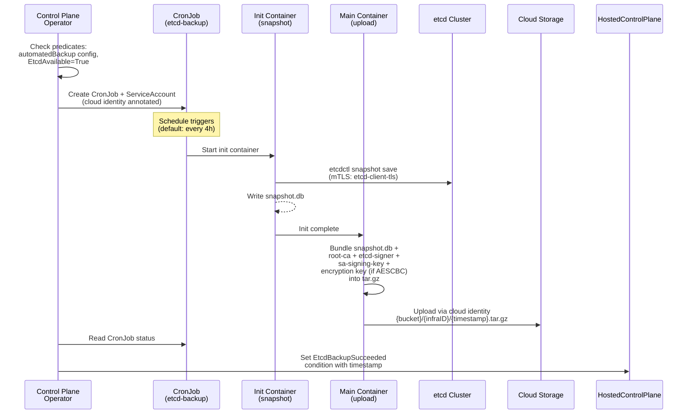
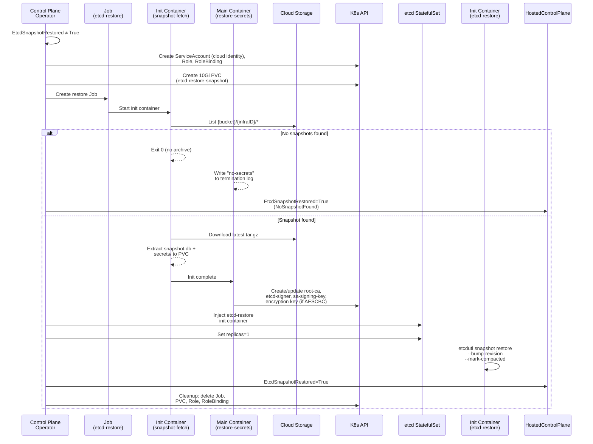

# Automated Etcd Backup and Restore

!!! note "TechPreview in OCP 4.22"

    Automated etcd backup and restore is available as a TechPreview feature in OpenShift Container Platform 4.22.

## Overview

Hosted clusters support automated etcd backup to cloud storage and automatic restore on cluster creation. The storage backend is pluggable — GCS is the first supported backend, with the architecture designed for adding S3, Azure Blob, and others.

The feature:

- **Backs up** etcd snapshots on a configurable schedule using a CronJob
- **Bundles PKI secrets and encryption key** (root-ca, etcd-signer, sa-signing-key, and the AESCBC encryption key when secret encryption is configured) alongside the snapshot in a `.tar.gz` archive
- **Restores automatically** when a new cluster is created with the same `infraID` and a backup exists in storage
- **Uses cloud-native identity** for credential-free access (e.g., GKE Workload Identity for GCS)

This does not use OADP or Velero. For OADP-based backup and restore, see [Backup and Restore with OADP](backup-and-restore-oadp.md).

## Prerequisites

### General

- The HostedCluster must have `EtcdAvailable=True`
- A cloud storage bucket/container accessible from the management cluster

### GCS

- A **GKE management cluster** with Workload Identity support
- A **GCS bucket** in the management cluster's GCP project
- A **GCP service account** with `roles/storage.objectAdmin` on the bucket
- **Workload Identity IAM binding** between the Kubernetes ServiceAccount and the GCP service account. See [Create GCP IAM Resources](../gcp/create-gcp-iam.md) for setup

## Configuration

Enable etcd backup by setting `spec.etcd.managed.automatedBackup` on the HostedCluster. The `storage` block is a union — exactly one backend must be configured based on `type`.

### GCS Example

```yaml
apiVersion: hypershift.openshift.io/v1beta1
kind: HostedCluster
metadata:
  name: my-cluster
  namespace: clusters
spec:
  etcd:
    managementType: Managed
    managed:
      storage:
        type: PersistentVolume
        persistentVolume:
          size: 8Gi
      automatedBackup:
        schedule: "0 */4 * * *"
        storage:
          type: GCS
          gcs:
            bucket: "my-etcd-backups"
            gcpServiceAccount: "etcd-backup@my-project.iam.gserviceaccount.com"
```

| Field | Required | Default | Description |
|-------|----------|---------|-------------|
| `schedule` | No | `0 */4 * * *` (every 4 hours) | Cron expression for backup frequency |
| `storage.type` | Yes | — | Storage backend type (currently `GCS`) |
| `storage.gcs.bucket` | Yes | — | GCS bucket name (3–63 characters) |
| `storage.gcs.gcpServiceAccount` | Yes | — | GCP service account email for Workload Identity |

!!! note

    The `automatedBackup` field is optional and can be added after cluster creation (day-2). It is not immutable. Removing it stops future backups (the CronJob is cleaned up), but existing backups in storage are not deleted.

## Backup Flow

When etcd backup is configured and the etcd cluster is available, the Control Plane Operator (CPO) creates a CronJob that periodically snapshots etcd and uploads the archive to storage.



The CPO verifies that `automatedBackup` config is present and `EtcdAvailable=True`, then creates the CronJob and a ServiceAccount annotated for cloud identity access. On each scheduled run, an init container snapshots etcd via mTLS and the main container bundles the snapshot with PKI secrets and the AESCBC encryption key (when `spec.secretEncryption.type == aescbc`) into a `.tar.gz` archive and uploads it. The CPO reads the CronJob status and sets the `EtcdBackupSucceeded` condition.

### Archive Format

Each backup produces a single `.tar.gz` containing:

- `snapshot.db` — the etcd snapshot
- `secrets/root-ca.json` — root CA certificate and key
- `secrets/etcd-signer.json` — etcd signer certificate and key
- `secrets/sa-signing-key.json` — service account signing keypair
- `secrets/<activeKey-name>.json` — AESCBC encryption key (present only when `spec.secretEncryption.type == aescbc`)

Backups accumulate under `{bucket}/{infraID}/` — each run creates a new timestamped object. They are not automatically pruned. Configure a lifecycle policy on your storage backend (e.g., [GCS Object Lifecycle](https://cloud.google.com/storage/docs/lifecycle)) to delete objects older than your retention window.

### Why PKI Secrets and the Encryption Key Are Backed Up

The etcd snapshot alone is insufficient for recovery. These secrets are cryptographic anchors created once and never regenerated — if replaced with fresh keys, the restored data becomes unusable.

| Secret | Purpose | Impact if lost or regenerated |
|--------|---------|-------------------------------|
| `root-ca` | Self-signed root CA for the hosted control plane. Signs all CP certificates and is embedded in every guest cluster kubeconfig. | All certificates invalid, kubeconfigs can't authenticate, nodes can't join |
| `etcd-signer` | Independent CA that signs all etcd TLS certificates (server, peer, client, metrics). | KAS can't connect to etcd (TLS handshake failure), peer communication breaks |
| `sa-signing-key` | RSA keypair used by KAS to sign and verify ServiceAccount JWT tokens. | Every existing SA token becomes unverifiable, breaking all in-cluster workloads |
| `<activeKey>` (AESCBC) | Symmetric AES-256 key used by KAS to encrypt Secrets at rest in etcd. Referenced by `spec.secretEncryption.aescbc.activeKey`. Present only when `spec.secretEncryption.type == aescbc`. | All encrypted etcd resources (Secrets, ConfigMaps marked for encryption) are permanently unreadable |

The first three secrets are always included in the backup archive. The AESCBC encryption key is included conditionally:

- **AESCBC encryption**: When `spec.secretEncryption.type == aescbc`, the CronJob automatically includes the encryption key as an additional Volume and VolumeMount. No extra configuration is needed.
- **KMS encryption**: The encryption key lives in the cloud KMS service. No Kubernetes secret needs backing up, but the KMS key must remain accessible and the new HostedCluster must reference the same key.
- **No encryption**: No additional secrets beyond the three PKI secrets are needed.

### CronJob Settings

| Setting | Value | Effect |
|---------|-------|--------|
| `concurrencyPolicy` | `Forbid` | Prevents overlapping backup runs |
| `restartPolicy` | `Never` | Failed pods are not retried within a single Job |
| `successfulJobsHistoryLimit` | 3 | Retains the last 3 successful Job objects |
| `failedJobsHistoryLimit` | 3 | Retains the last 3 failed Job objects |

If a backup Job fails, the CronJob runs again at the next interval. The `EtcdBackupSucceeded` condition retains the timestamp of the last success — a failure does not flip it to `False`. Monitor timestamp staleness to detect silent failures.

## Restore Flow

When a new cluster is created with `automatedBackup` configured and a backup exists for the cluster's `infraID`, the CPO automatically restores the etcd snapshot and PKI secrets.



The CPO creates a ServiceAccount, Role, RoleBinding, and a 10Gi PVC for the snapshot. A Job fetches the latest archive from storage and extracts the snapshot, PKI secrets, and encryption key (when present). If no backup exists, the cluster starts fresh (`NoSnapshotFound`). Otherwise, the secrets are restored to the namespace, and the CPO injects an `etcd-restore` init container into the etcd StatefulSet that runs `etcdutl snapshot restore`. Once complete, the CPO sets `EtcdSnapshotRestored=True` and cleans up the Job, PVC, Role, and RoleBinding.

### Restore Details

**Snapshot selection**: The fetch container lists all objects under `{bucket}/{infraID}/` and selects the latest by lexicographic sort. ISO 8601 timestamps in object names ensure this selects the most recent backup.

**Single-replica restore**: The StatefulSet is temporarily set to 1 replica to avoid zonal PV scheduling deadlocks (e.g., on GKE Autopilot). After restore, replicas scale back to 3 and additional members join via Raft replication.

**`etcdutl` flags**: `--bump-revision 1000000000` prevents revision conflicts with the original cluster. `--mark-compacted` prevents re-compaction errors on already-compacted data.

**Idempotent**: The restore init container checks if `/var/lib/data` is non-empty before restoring. If data already exists (e.g., from a pod restart), the restore is skipped.

!!! important

    Restore runs only during initial cluster creation. Once `EtcdSnapshotRestored=True` is set, the restore path is permanently skipped. To restore from a different backup, delete and recreate the HostedCluster with the same `infraID`.

## Failure Modes and Recovery

### Restore Job Failure

When the restore Job fails (all retry attempts exhausted with `backoffLimit: 3`), the CPO sets `EtcdSnapshotRestored=False` with reason `RestoreJobFailed`. The control plane does not continue — etcd cannot start without restored data.

**Recovery**:

1. Inspect the Job pod logs:

    ```bash
    oc logs job/etcd-restore -n <hcp-namespace> --all-containers
    ```

2. Fix the underlying issue (storage permissions, network access, bucket configuration)

3. Delete the failed Job:

    ```bash
    oc delete job etcd-restore -n <hcp-namespace>
    ```

4. Remove the `EtcdSnapshotRestored` condition to allow the CPO to re-create the Job:

    ```bash
    # Find the zero-based index of the condition
    oc get hostedcontrolplane <name> -n <hcp-namespace> \
      -o jsonpath='{range .status.conditions[*]}{.type}{"\n"}{end}' | \
      grep -n EtcdSnapshotRestored
    # Use line number minus 1 as zero-based index

    # Remove only that condition
    oc patch hostedcontrolplane <name> -n <hcp-namespace> --type=json \
      --subresource=status \
      -p='[{"op": "remove", "path": "/status/conditions/INDEX"}]'
    ```

    !!! warning

        Do not remove all conditions from `status.conditions`. Other conditions are used by multiple controllers.

### Backup Failure

Backup failures do not block the control plane. The CronJob runs again at the next interval. Failed Jobs are retained (up to 3) for debugging.

## Verification

### Backup Status

```bash
# Check CronJob status
oc get cronjob etcd-backup-gcs -n <hcp-namespace>

# Check backup condition
oc get hostedcluster <name> -n clusters \
  -o jsonpath='{.status.conditions[?(@.type=="EtcdBackupSucceeded")]}'
```

### Restore Status

```bash
# Check restore Job (only exists during restore)
oc get job etcd-restore -n <hcp-namespace>

# Check restore condition
oc get hostedcluster <name> -n clusters \
  -o jsonpath='{.status.conditions[?(@.type=="EtcdSnapshotRestored")]}'
```

### Backup Integrity

```bash
# Download and inspect the latest backup (GCS example)
gcloud storage ls gs://<bucket>/<infraID>/ | sort | tail -1
gcloud storage cp gs://<bucket>/<infraID>/<timestamp>.tar.gz /tmp/

mkdir -p /tmp/verify && tar xzf /tmp/<timestamp>.tar.gz -C /tmp/verify/
etcdutl snapshot status /tmp/verify/snapshot.db -w table
ls /tmp/verify/secrets/
# Expected: root-ca.json  etcd-signer.json  sa-signing-key.json
# Also present when AESCBC encryption is configured: <activeKey-name>.json

rm -rf /tmp/verify /tmp/<timestamp>.tar.gz
```

## Extending the System

### Adding a Storage Backend

The automated backup architecture uses a union API and modular components. To add a new storage backend (e.g., S3), four areas need changes:

**1. API: Add the storage type**

In `api/hypershift/v1beta1/etcd_automated_backup_types.go`:

- Add a new constant to `AutomatedEtcdBackupStorageType` (e.g., `AutomatedEtcdBackupStorageTypeS3 = "S3"`)
- Add a new config struct (e.g., `AutomatedEtcdBackupS3`) with backend-specific fields (bucket, region, credentials)
- Add the field to `AutomatedEtcdBackupStorage` as an optional union member
- Update the `kubebuilder:validation:Enum` and `XValidation` rules to include the new type

Run `make update` after modifying the API to regenerate CRDs and vendor the changes.

**2. CPOv2 component: Create the backup CronJob**

Create a new component directory (e.g., `control-plane-operator/controllers/hostedcontrolplane/v2/etcd_backup_s3/`) following the pattern in `etcd_backup_gcs/`:

- `component.go` — register with `NewCronJobComponent()` and add a predicate that checks `Storage.Type == "S3"` (see `etcd_backup_gcs/component.go:40-49`)
- `cronjob.go` — adapt the CronJob spec with backend-specific upload args (the `etcd-upload` command already supports `--storage-type S3`)
- `serviceaccount.yaml` — manifest with backend-specific identity annotations

Register the component in the CPO component list.

**3. Restore: Implement or adapt the fetch command**

The restore flow needs a way to download the latest snapshot from the new backend. Options:

- Implement a new fetch subcommand (like `gcs-snapshot-fetch`) that lists objects and downloads the latest
- Or use pre-signed URLs with the existing `RestoreSnapshotURL` mechanism

Wire the fetch command into the restore Job in the CPO controller (`hostedcontrolplane_controller.go`, `reconcileEtcdRestore` method).

**4. Upload: Already supported**

The `etcd-upload` command (`etcd-upload/etcdupload.go`) already supports S3, AzureBlob, and GCS via the `--storage-type` flag. No changes needed for upload unless you're adding a completely new backend.

### Adding a Secret to the Backup

The bundler and restorer work generically over all mounted secret subdirectories — no code changes are needed. In the CronJob definition (`etcd_backup_gcs/cronjob.go`), add a Volume referencing the secret and a VolumeMount on the upload container:

```go
// Volume
{
    Name: "my-new-secret",
    VolumeSource: corev1.VolumeSource{
        Secret: &corev1.SecretVolumeSource{
            SecretName:  "my-new-secret",
            DefaultMode: ptr.To(int32(0640)),
        },
    },
},

// VolumeMount on upload container
{Name: "my-new-secret", MountPath: "/tmp/etcd-backup/secrets/my-new-secret"},
```

The bundler serializes it as `secrets/my-new-secret.json` in the archive, and the restorer creates or updates the Secret during restore.

## Troubleshooting

| Symptom | Cause | Resolution |
|---------|-------|------------|
| `EtcdBackupSucceeded=False`, reason `WaitingForEtcd` | CronJob not created yet | Verify `EtcdAvailable=True` on the HCP |
| `EtcdBackupSucceeded=False`, reason `BackupInProgress` | No backup has succeeded yet | Wait for the first run, or check Job logs |
| Upload fails with permission error | Cloud identity misconfigured | Verify IAM binding and storage permissions |
| `EtcdSnapshotRestored=True`, reason `NoSnapshotFound` | No backup for this `infraID` | Verify backups exist in `{bucket}/{infraID}/` |
| `EtcdSnapshotRestored=False`, reason `RestoreJobFailed` | Restore Job failed | See [Restore Job Failure](#restore-job-failure) |
| Restore pod stuck in Pending | PVC scheduling constraint | Verify PVC can schedule in the same zone as nodes |
| `etcdutl` not found in pod logs | etcd image too old | Requires OCP 4.21+ etcd image |
| Backup timestamp not updating | Backup Jobs failing silently | Check `oc get jobs -n <hcp-namespace>` for failed Jobs |

```bash
# Debugging commands
oc logs job/etcd-restore -n <hcp-namespace> --all-containers
oc describe pod -l app=etcd -n <hcp-namespace> | grep -A5 "etcd-restore"
oc get pvc etcd-restore-snapshot -n <hcp-namespace>
oc get jobs -n <hcp-namespace> -l job-name=etcd-backup-gcs --sort-by=.metadata.creationTimestamp
```

## Conditions Reference

### `EtcdBackupSucceeded`

| Status | Reason | Blocks CP? | Description |
|--------|--------|:----------:|-------------|
| `True` | `BackupSucceeded` | No | Last successful backup timestamp in message |
| `False` | `BackupInProgress` | No | CronJob scheduled but no successful completion yet |
| `False` | `WaitingForFirstSchedule` | No | CronJob has not been scheduled yet |
| `False` | `CronJobSuspended` | No | CronJob is suspended |
| `False` | `WaitingForEtcd` | No | Waiting for `EtcdAvailable=True` |

!!! note

    There is no explicit "backup failed" reason. Monitor timestamp staleness to detect silent failures.

### `EtcdSnapshotRestored`

| Status | Reason | Blocks CP? | Description |
|--------|--------|:----------:|-------------|
| `True` | `AsExpected` | No | Snapshot restored successfully |
| `True` | `NoSnapshotFound` | No | No backup exists — cluster starts fresh |
| `False` | `RestoreJobFailed` | **Yes** | See [Restore Job Failure](#restore-job-failure) |
| Not set | — | **Yes** (temporarily) | Restore in progress or not yet evaluated |
