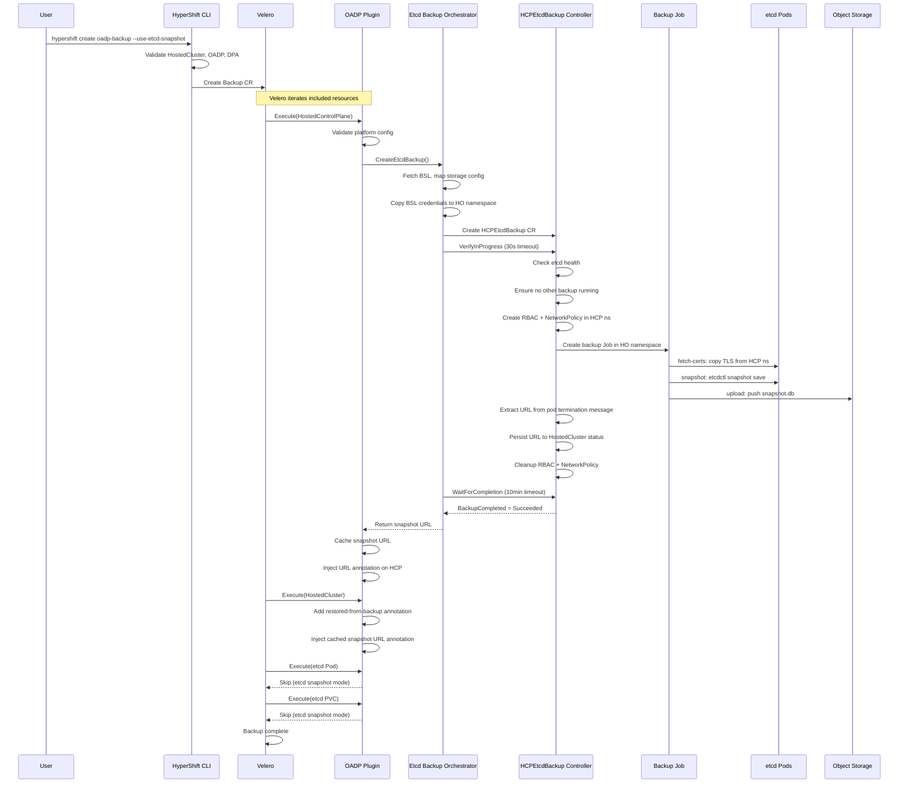
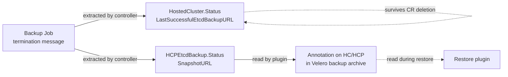

# Etcd Snapshot Backup Flow

!!! warning "Tech Preview"

    This feature requires the `HCPEtcdBackup` feature gate enabled in the HyperShift Operator.

This page describes the end-to-end backup process when using the Etcd Snapshot method. The flow involves three actors: the OADP HyperShift plugin (orchestration), the HyperShift Operator's etcd backup controller (execution), and the backup Job (snapshot + upload).

## End-to-End Sequence



## Step 1: CLI Validation and Backup Creation

The backup starts when the user runs the CLI command or creates a Velero `Backup` CR manually.

**Using the CLI:**

```bash
hypershift create oadp-backup \
  --hc-name my-hosted-cluster \
  --hc-namespace clusters \
  --name my-backup \
  --storage-location default \
  --use-etcd-snapshot
```

The CLI performs the following validations before creating the Backup CR:

1. Backup name is valid (DNS-1123 subdomain, max 63 characters).
2. HostedCluster exists and its platform is detected (AWS, Azure, Agent, KubeVirt, OpenStack).
3. OADP components are ready: `openshift-adp-controller-manager` and `velero` deployments exist with available replicas.
4. A `DataProtectionApplication` CR exists with status `Reconciled`.
5. The HyperShift plugin is configured in the DPA (warning if missing).

The generated Backup CR includes:

- **Included namespaces**: The HostedCluster namespace (e.g. `clusters`) and the HostedControlPlane namespace (e.g. `clusters-my-hosted-cluster`).
- **Included resources**: Platform-aware resource list excluding etcd-related resources (PVCs, PVs, Deployments, StatefulSets).
- **Snapshot settings**: `snapshotVolumes: false`, no volume snapshot data mover.

## Step 2: OADP Plugin Processes Resources

Velero iterates over all included resources and invokes the plugin's `BackupItemAction.Execute()` for each item. The plugin behavior depends on the resource kind:

### HostedControlPlane

1. **Platform validation**: The plugin calls `ValidatePlatformConfig()` to check platform-specific constraints.
2. **Etcd backup creation**: The plugin's Etcd Backup Orchestrator creates the `HCPEtcdBackup` CR:
    - Fetches the Velero `BackupStorageLocation` (BSL) from the `openshift-adp` namespace.
    - Maps BSL configuration to `HCPEtcdBackup` storage config (bucket, region, key prefix for S3; container, storage account for Azure).
    - Copies the BSL credential Secret to the HyperShift Operator namespace, remapping the data key from `cloud` to `credentials`.
    - If encryption is configured in `HostedCluster.Spec.Etcd.Managed.Backup`, sets the KMS key ARN (AWS) or Key Vault URL (Azure) on the storage config.
    - Creates the `HCPEtcdBackup` CR in the HCP namespace.
3. **Verification**: The orchestrator polls the `BackupCompleted` condition for up to 30 seconds, waiting for the controller to acknowledge the backup (status changes to `BackupInProgress` or `BackupSucceeded`).
4. **Completion wait**: The orchestrator polls for up to 10 minutes (every 5 seconds) until the backup reaches a terminal state.
5. **URL caching**: On success, the snapshot URL is cached on the plugin instance for use by subsequent items.
6. **Annotation injection**: The plugin adds `hypershift.openshift.io/etcd-snapshot-url` annotation with the snapshot URL.
7. **Credential cleanup**: The temporary credential Secret in the HO namespace is deleted.

### HostedCluster

1. Adds `hypershift.openshift.io/restored-from-backup` annotation (used during restore to signal the cluster was restored).
2. If the etcd backup was not yet created (HostedCluster may be processed before HostedControlPlane), triggers the same backup creation flow.
3. Injects the cached snapshot URL as annotation and into the status field `lastSuccessfulEtcdBackupURL`.

!!! note

    The URL is injected into both an annotation and the status because Velero strips status fields during backup. The annotation survives and is read during restore.

### etcd Pods

Skipped entirely. In etcd snapshot mode, etcd data is captured via the snapshot, not from the pod's filesystem.

### etcd PVCs

Skipped entirely. PVCs matching the pattern `data-etcd-*` are excluded.

### Other Resources

All other resources (Secrets, ConfigMaps, Services, etc.) are processed normally by Velero without plugin modification.

## Step 3: HCPEtcdBackup Controller Reconciliation

When the OADP plugin creates the `HCPEtcdBackup` CR, the HyperShift Operator's etcd backup controller reconciles it through the following stages:

### 3.1 Pre-flight Checks

1. **Feature gate**: Verifies `HCPEtcdBackup` feature gate is enabled. Returns immediately if disabled.
2. **Terminal state**: If the backup already succeeded, failed, or was rejected, the controller runs cleanup and retention enforcement, then stops.
3. **Etcd health**: Fetches the etcd `StatefulSet` in the HCP namespace and verifies all replicas are ready. If unhealthy, the backup is rejected with reason `EtcdUnhealthy`.
4. **Serial execution**: Scans for active backup Jobs targeting the same HCP namespace. If another backup is running, the new one is rejected with reason `BackupRejected`. This check is idempotent: it runs after checking for the current backup's own Job.
5. **Credentials**: Verifies the credential Secret referenced in the backup spec exists in the HO namespace.

### 3.2 Resource Creation

The controller creates temporary resources required for the backup Job to access etcd across namespaces:

| Resource | Namespace | Purpose |
|----------|-----------|---------|
| `ServiceAccount` | HO namespace | Identity for the backup Job pods |
| `Role` | HCP namespace | Grants read access to `etcd-client-tls` Secret and `etcd-ca` ConfigMap |
| `RoleBinding` | HCP namespace | Binds the HO ServiceAccount to the HCP Role |
| `NetworkPolicy` | HCP namespace | Allows ingress on port 2379 from the HO namespace to etcd pods |

### 3.3 Backup Job

The controller creates a Kubernetes `Job` in the HO namespace with three containers:

| Container | Type | Image | Purpose |
|-----------|------|-------|---------|
| `fetch-certs` | Init container | control-plane-operator | Runs `fetch-etcd-certs`: copies etcd TLS certificates from the HCP namespace using the cross-namespace RBAC |
| `snapshot` | Init container | etcd | Runs `etcdctl snapshot save`: connects to etcd on port 2379 using the fetched TLS certificates and creates a local snapshot file |
| `upload` | Main container | control-plane-operator | Runs `etcd-upload`: uploads the snapshot file to S3 or Azure Blob using the mounted credentials. Writes the final snapshot URL to the container's termination message |

**Job configuration:**

| Setting | Value | Reason |
|---------|-------|--------|
| `backoffLimit` | 0 | No retries on failure |
| `activeDeadlineSeconds` | 900 (15 min) | Prevents indefinitely running Jobs |
| `ttlSecondsAfterFinished` | 600 (10 min) | Automatic Job cleanup |

**Shared volumes:**

- `etcd-certs`: EmptyDir shared between `fetch-certs` and `snapshot` containers for TLS certificates.
- `etcd-backup`: EmptyDir shared between `snapshot` and `upload` containers for the snapshot file.
- `backup-credentials`: Secret mount (read-only) with cloud provider credentials for the upload container.

### 3.4 Job Monitoring

On subsequent reconcile loops, the controller checks the Job status:

- **Succeeded**: Extracts the snapshot URL from the `upload` container's termination message. Persists it to `HostedCluster.Status.LastSuccessfulEtcdBackupURL` using a retry-on-conflict pattern. Marks the `HCPEtcdBackup` as `BackupSucceeded`.
- **Failed**: Marks the `HCPEtcdBackup` as `BackupFailed`.
- **Running**: Requeues reconciliation after 10 seconds.

### 3.5 Cleanup

When the backup reaches a terminal state:

1. Removes the `Role`, `RoleBinding`, and `NetworkPolicy` from the HCP namespace.
2. Skips cleanup if another active backup Job exists for the same HCP (resources are shared).
3. The Job itself is cleaned up automatically by the `ttlSecondsAfterFinished` setting.

### 3.6 Retention Enforcement

After cleanup, the controller enforces the retention policy:

1. Lists all `HCPEtcdBackup` CRs for the same HCP namespace, sorted by creation time.
2. If the count exceeds `MaxBackupCount`, deletes the oldest backups.
3. The snapshot URL survives CR deletion because it was previously persisted to `HostedCluster.Status.LastSuccessfulEtcdBackupURL`.

## Snapshot URL Persistence

The snapshot URL is persisted through two independent paths to ensure availability during restore:



- **HostedCluster status**: Persists across `HCPEtcdBackup` CR deletions (retention). Available for operational reference.
- **Backup annotation**: Stored inside the Velero backup archive. This is the path used during restore, since Velero strips status fields.

## Error Scenarios

| Scenario | Result | Recovery |
|----------|--------|----------|
| etcd StatefulSet not fully ready | `BackupCompleted` = `EtcdUnhealthy` | Wait for etcd to recover, create a new backup |
| Another backup already running for this HCP | `BackupCompleted` = `BackupRejected` | Wait for the active backup to complete |
| Credential Secret not found in HO namespace | Backup fails immediately | Verify the OADP plugin correctly copied the BSL credentials |
| Backup Job fails (etcdctl error, upload error) | `BackupCompleted` = `BackupFailed` | Check Job pod logs, verify etcd connectivity and storage permissions |
| Backup Job exceeds 15 min deadline | Job killed, `BackupCompleted` = `BackupFailed` | Investigate network or storage latency |
| Plugin verification timeout (30s) | Plugin returns error, Velero marks backup failed | Check HyperShift Operator logs for controller issues |
| Plugin completion timeout (10 min) | Plugin returns error, Velero marks backup failed | Check backup Job status and pod logs |
| `HCPEtcdBackup` CRD not installed | Plugin fails with explicit error | Enable the `HCPEtcdBackup` feature gate and ensure CRDs are deployed |

## Platform-specific Notes

### AWS

- Storage uses S3 with the bucket and region from the Velero BSL config.
- Key prefix: `{bsl-prefix}/backups/{backup-name}/etcd-backup`.
- Optional KMS encryption via `HostedCluster.Spec.Etcd.Managed.Backup.AWS.KMSKeyARN`.

### Azure

- Storage uses Azure Blob with container and storage account from the BSL config.
- Key prefix: `{bsl-prefix}/backups/{backup-name}/etcd-backup`.
- Optional Key Vault encryption via `HostedCluster.Spec.Etcd.Managed.Backup.Azure.EncryptionKeyURL`.

### KubeVirt

- RHCOS boot image PVCs (labeled `hypershift.openshift.io/is-kubevirt-rhcos`) are excluded regardless of backup method.
- DataVolumes with the same label are also excluded.

### Agent (Bare Metal)

- `ClusterDeployment.Spec.PreserveOnDelete` is set to `false` during backup.
- `InfraEnv` objects must not be deleted when restoring on the same management cluster.
