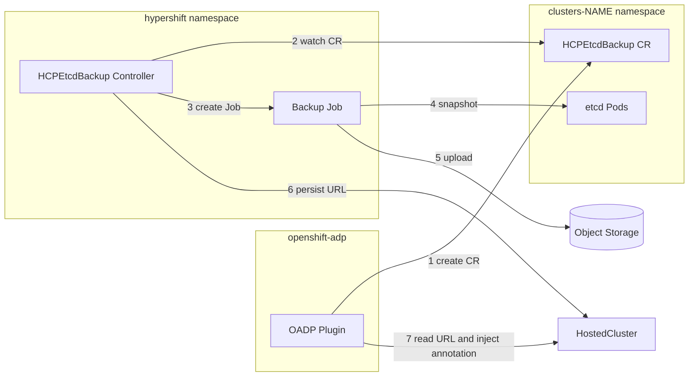
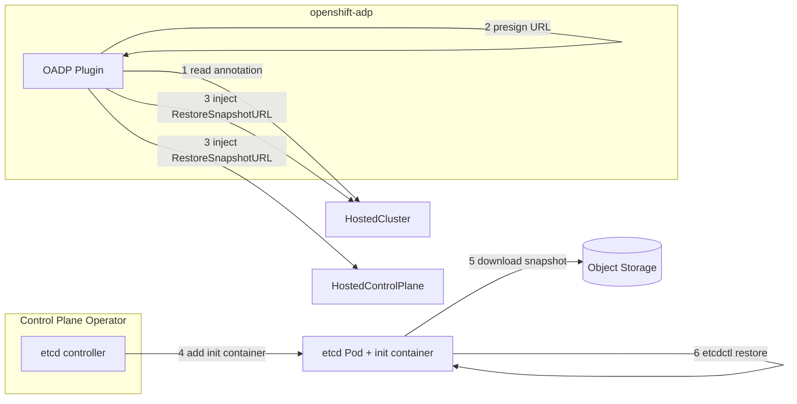

!!! warning "Tech Preview"

    The Etcd Snapshot Backup method is a Tech Preview feature. It requires the `HCPEtcdBackup` feature gate to be enabled in the HyperShift Operator. Tech Preview features are not supported in production environments.

## Overview

The Etcd Snapshot Backup method provides an alternative to the default volume snapshot approach for backing up Hosted Control Plane etcd data. Instead of capturing raw PVC content via CSI volume snapshots or filesystem backup, this method uses `etcdutl snapshot save` to create a consistent snapshot of the etcd database and uploads it to object storage (S3 or Azure Blob).

With the volume snapshot method, Velero captures each etcd PVC individually (typically 3 PVCs for a HighlyAvailable control plane). The etcd snapshot method produces a single snapshot file of the logical database, resulting in significantly smaller backup artifacts.

This approach is driven by the `HCPEtcdBackup` Custom Resource and orchestrated through the OADP HyperShift plugin during Velero backup operations.

## Comparison with Volume Snapshot Method

| Aspect | Volume Snapshot (Default) | Etcd Snapshot (Tech Preview) |
|--------|--------------------------|------------------------------|
| **Backup mechanism** | CSI volume snapshots or Kopia filesystem backup of etcd PVCs (one per replica, typically 3) | `etcdutl snapshot save` producing a single snapshot file, uploaded to object storage |
| **Portability** | Tied to the storage provider and CSI driver | Snapshot is storage-agnostic. Cross-cluster restore supported for AWS, Azure, Agent. Not yet validated for KubeVirt |
| **Backup size** | Full PVC content (3 PVCs for HighlyAvailable) | Single etcd database snapshot (significantly smaller) |
| **Restore mechanism** | PVC restore from snapshot | `etcdctl snapshot restore` via init container |
| **Requirements** | CSI driver with snapshot support or Kopia node agent | `HCPEtcdBackup` feature gate enabled |
| **Encryption** | Depends on storage provider | Optional KMS (AWS) or Key Vault (Azure) encryption |

## Prerequisites

Before using the Etcd Snapshot Backup method, ensure the following:

1. **Feature gate enabled**: The `HCPEtcdBackup` feature gate must be enabled in the HyperShift Operator.
2. **OADP 1.6+ installed**: The OADP operator (version 1.6 or later) with the HyperShift plugin must be deployed. See [Backup and Restore with OADP 1.5](../backup-and-restore-oadp-1-5.md) for DPA configuration reference.
3. **Object storage configured**: A Velero `BackupStorageLocation` pointing to S3 or Azure Blob must be configured.
4. **Plugin ConfigMap**: The OADP HyperShift plugin must be configured to use the etcd snapshot method via a ConfigMap in the OADP namespace (see [Plugin Configuration](#plugin-configuration) below).
5. **General DR prerequisites**: Review the [Disaster Recovery Prerequisites](../prerequisites.md) page for service publishing strategy requirements and platform-specific considerations.

## Plugin Configuration

The OADP HyperShift plugin reads its configuration from a ConfigMap named `hypershift-oadp-plugin-config` in the OADP namespace (typically `openshift-adp`). To use the etcd snapshot method, the `etcdBackupMethod` key must be set to `etcdSnapshot`:

```yaml
apiVersion: v1
kind: ConfigMap
metadata:
  name: hypershift-oadp-plugin-config
  namespace: openshift-adp
data:
  etcdBackupMethod: "etcdSnapshot" # "volumeSnapshot" (default) or "etcdSnapshot"
```

| Key | Values | Description |
|-----|--------|-------------|
| `hoNamespace` | namespace name | Namespace where the HyperShift Operator is installed. Defaults to `hypershift`. |
| `etcdBackupMethod` | `volumeSnapshot` (default), `etcdSnapshot` | Selects the etcd backup method. `etcdSnapshot` enables the Tech Preview flow described in this section. |
| `migration` | `true`, `false` | Set to `true` when the backup is intended for migration to a different management cluster. |

!!! important

    If the `etcdBackupMethod` is set to `etcdSnapshot` but the `HCPEtcdBackup` CRD is not installed (feature gate not enabled), the plugin will fail with an explicit error.

## Architecture

The Etcd Snapshot Backup system is composed of two layers:

- **Orchestration layer**: The OADP HyperShift plugin (running inside Velero) drives the backup/restore lifecycle. During backup, it creates the `HCPEtcdBackup` CR in the HCP namespace, waits for completion, and injects the snapshot URL into the backed-up resources. During restore, it reads the snapshot URL from the `HostedCluster.Status.LastSuccessfulEtcdBackupURL` field (persisted as an annotation during backup) and injects it into the `RestoreSnapshotURL` spec field.
- **Execution layer**: HyperShift controllers perform the actual work. The HyperShift Operator's etcd backup controller (running in the HO namespace) watches `HCPEtcdBackup` CRs across all namespaces and creates the backup Job in the HO namespace. The Control Plane Operator's etcd controller handles snapshot restoration via an init container.

### Backup Flow



### Restore Flow



### HCPEtcdBackup Custom Resource

The `HCPEtcdBackup` CR represents a one-shot backup request for etcd. Key characteristics:

- **Immutable spec**: Once created, the spec cannot be modified.
- **Storage backends**: S3 (AWS) or Azure Blob, configured as a discriminated union.
- **Encryption**: Optional KMS key ARN (AWS) or Key Vault URL (Azure). Immutable once set.
- **Status**: Tracks completion via `BackupCompleted` condition with reasons: `BackupInProgress`, `BackupSucceeded`, `BackupFailed`, `BackupRejected`, `EtcdUnhealthy`.
- **Snapshot URL**: On success, `Status.SnapshotURL` contains the URL where the snapshot was uploaded.

### Credential Handling

During **backup**, the OADP plugin copies the Velero `BackupStorageLocation` credentials from the `openshift-adp` namespace to the HyperShift Operator namespace. The backup Job mounts this temporary Secret to authenticate against object storage. The Secret is cleaned up after the backup completes. Once the backup Job succeeds, the HyperShift Operator persists the snapshot URL to `HostedCluster.Status.LastSuccessfulEtcdBackupURL`. The OADP plugin then reads this status field and injects it as an annotation (`hypershift.openshift.io/etcd-snapshot-url`) on the HostedCluster and HostedControlPlane items in the Velero backup archive. This annotation is the mechanism that carries the snapshot URL through to the restore phase, since Velero strips status fields.

During **restore**, no credential copying is needed. The plugin reads the `etcd-snapshot-url` annotation from the backed-up resources. For S3 URLs, the plugin generates a presigned HTTPS URL (1-hour expiry) using the BSL credentials. The presigned URL embeds temporary authentication, allowing the etcd init container to download the snapshot without direct access to credentials.

### Conditions and Status

| Resource | Condition / Field | Meaning |
|----------|-------------------|---------|
| `HCPEtcdBackup` | `BackupCompleted` | Tracks backup lifecycle (InProgress, Succeeded, Failed, Rejected, EtcdUnhealthy) |
| `HostedControlPlane` | `EtcdSnapshotRestored` | Set to True after etcd is restored from snapshot |
| `HostedControlPlane` | `EtcdBackupSucceeded` | Bubbled from HCPEtcdBackup, indicates most recent backup result |
| `HostedCluster` | `Status.LastSuccessfulEtcdBackupURL` | Persists the last snapshot URL. Set by the HO controller after successful backup. Read by the OADP plugin to inject as annotation during backup. Survives HCPEtcdBackup CR deletion via retention |
| `HostedCluster` | Annotation `etcd-snapshot-url` | Injected by OADP plugin during backup (from Status field). Read by OADP plugin during restore to set RestoreSnapshotURL |
| `HostedCluster` | Annotation `restored-from-backup` | Set during restore, removed once `HostedClusterRestoredFromBackup` condition becomes True |

## Guides

### [Backup Flow](backup-flow.md)

Step-by-step description of the backup process: how the OADP plugin triggers the etcd snapshot, how the HyperShift Operator executes it, and how the snapshot URL is persisted.

### [Restore Flow](restore-flow.md)

Step-by-step description of the restore process: how the OADP plugin injects the snapshot URL, how the Control Plane Operator restores etcd, and how the cluster recovers.
