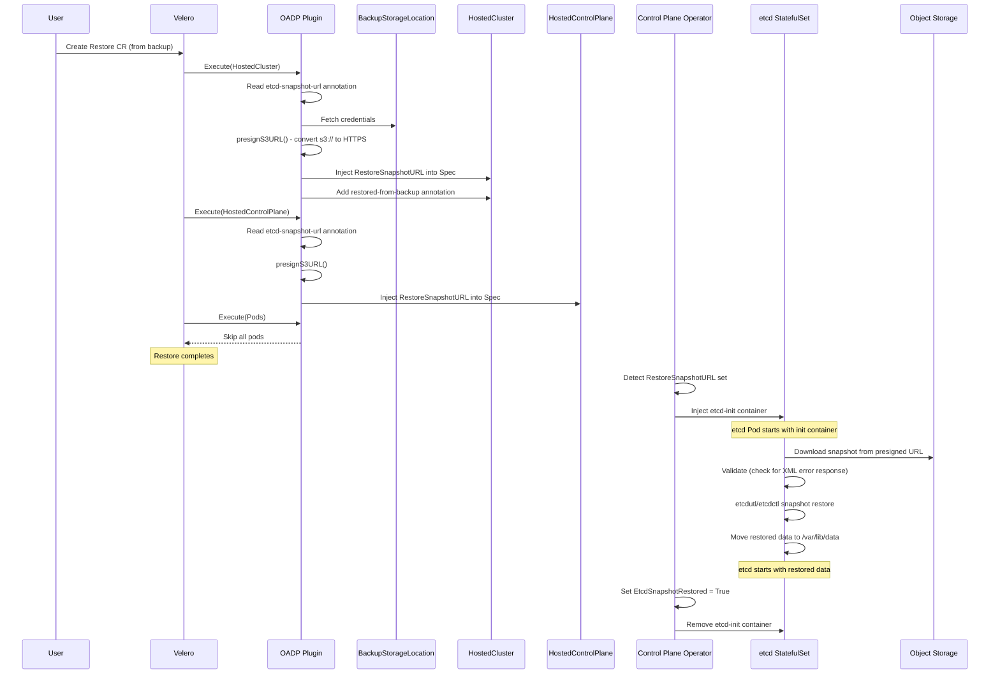
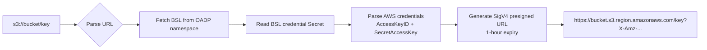

# Etcd Snapshot Restore Flow

!!! warning "Tech Preview"

    This feature requires the `HCPEtcdBackup` feature gate enabled in the HyperShift Operator.

This page describes the end-to-end restore process when recovering a Hosted Control Plane from an etcd snapshot backup. The flow involves the OADP HyperShift plugin (URL injection), the Control Plane Operator (etcd restore), and the etcd init container (snapshot download and apply).

## End-to-End Sequence



## Step 1: Restore CR Creation

The restore starts when the user runs the CLI command or creates a Velero `Restore` CR manually.

**Using the CLI:**

```bash
hypershift create oadp-restore \
  --hc-name my-hosted-cluster \
  --hc-namespace clusters \
  --name my-restore \
  --from-backup my-backup
```

Or from a schedule (uses the latest successful backup):

```bash
hypershift create oadp-restore \
  --hc-name my-hosted-cluster \
  --hc-namespace clusters \
  --name my-restore \
  --from-schedule my-schedule
```

The CLI validates:

1. Either `--from-backup` or `--from-schedule` is specified (mutually exclusive).
2. The backup or schedule exists and has completed successfully.
3. OADP components are ready.
4. A `DataProtectionApplication` CR exists with status `Reconciled`.

The generated Restore CR includes:

- **Included namespaces**: HostedCluster and HostedControlPlane namespaces.
- **Excluded resources**: Nodes, events, Velero CRs, CSI nodes, VolumeAttachments.
- **Restore PVs**: `false` (etcd data comes from snapshot, not volume restore).
- **Existing resource policy**: Configurable (`none` to skip existing, `update` to overwrite).
- **Preserve node ports**: `true`.

## Step 2: OADP Plugin Processes Restored Resources

Velero reads the backed-up resources from the archive and invokes the plugin's `RestoreItemAction.Execute()` for each item.

### HostedCluster

1. **Backup lookup**: The plugin retrieves the associated Velero `Backup` object and validates that `IncludedNamespaces` is set.
2. **Annotation reading**: Reads `hypershift.openshift.io/etcd-snapshot-url` annotation from the backed-up HostedCluster.
3. **URL conversion**: If the URL uses the `s3://` scheme, converts it to a presigned HTTPS URL (see [URL Presigning](#s3-url-presigning) below).
4. **Spec injection**: Sets `Spec.Etcd.Managed.Storage.RestoreSnapshotURL` to a single-element array containing the presigned URL.
5. **Restore annotation**: Adds `hypershift.openshift.io/restored-from-backup` annotation.

### HostedControlPlane

Same flow as HostedCluster:

1. Reads `hypershift.openshift.io/etcd-snapshot-url` annotation.
2. Converts S3 URL to presigned HTTPS if needed.
3. Injects into `Spec.Etcd.Managed.Storage.RestoreSnapshotURL`.

### Pods

All pods are skipped during restore (returned with `WithoutRestore()` flag). Pods are recreated by their parent workloads (Deployments, StatefulSets) after those are restored.

### ClusterDeployment (Agent Platform)

For the Agent platform, the plugin sets `Spec.PreserveOnDelete = true` to prevent unintended cluster cleanup during subsequent deletes.

## Step 3: S3 URL Presigning

When the snapshot URL uses the `s3://bucket/key` format, the OADP plugin converts it to a presigned HTTPS URL. This allows the etcd init container to download the snapshot without needing direct access to cloud credentials.

**Presigning process:**



**Required credentials in the BSL Secret:**

```ini
[default]
aws_access_key_id = AKIA...
aws_secret_access_key = ...
aws_session_token = ...  # optional
```

The presigned URL has a **1-hour expiry**. The etcd init container must download the snapshot within this window. If the URL expires, the init container detects the error (S3 returns an XML error response) and exits with a clear error message.

!!! note

    Azure Blob URLs are already HTTPS and do not require presigning. The plugin passes them through unchanged.

## Step 4: Etcd Snapshot Restore

Once the `HostedControlPlane` is created with `RestoreSnapshotURL` set, the Control Plane Operator detects it and modifies the etcd `StatefulSet`.

### 4.1 Init Container Injection

The CPO checks two conditions:

1. `RestoreSnapshotURL` is non-empty.
2. `EtcdSnapshotRestored` condition is not yet `True`.

If both are met, an `etcd-init` init container is injected into the etcd StatefulSet spec. The container receives the snapshot URL via environment variable `RESTORE_URL_ETCD`.

### 4.2 Snapshot Download and Restore

The `etcd-init` container runs the `etcd-init.sh` script, which executes the following steps:

```
1. Check if /var/lib/data is already populated
   └─ If yes: skip (idempotent, data already restored)
   └─ If no: proceed with restore

2. Download snapshot from RESTORE_URL_ETCD via curl

3. Validate the downloaded file
   └─ Check first 5 bytes for "<?xml" prefix
   └─ If XML detected: log error and exit 1
      (indicates S3 error: object not found, URL expired, etc.)

4. Detect etcd version and restore
   ├─ etcd 3.6+ (OCP 4.21+): etcdutl snapshot restore
   └─ etcd 3.5.x: etcdctl snapshot restore (ETCDCTL_API=3)

5. Restore to staging directory
   └─ Target: /var/lib/restore (not directly to /var/lib/data)

6. Atomic swap
   └─ rm -rf /var/lib/data
   └─ mv /var/lib/restore /var/lib/data

7. etcd starts normally with restored data
```

**Key safety mechanisms:**

- **Idempotency**: If `/var/lib/data` is already populated (e.g. pod restarted after successful restore), the script skips the restore entirely.
- **Staging directory**: Restoring to `/var/lib/restore` first and then moving prevents data corruption if the restore fails mid-write.
- **XML error detection**: S3 returns XML error responses for missing objects, expired presigned URLs, or access denied. The script detects these and fails with a clear error instead of corrupting etcd with XML data.
- **Version detection**: Automatically selects `etcdutl` (etcd 3.6+) or `etcdctl` (etcd 3.5.x) based on the available binaries.

### 4.3 Post-Restore Reconciliation

After the etcd pod starts successfully with restored data:

1. The CPO sets the `EtcdSnapshotRestored` condition to `True` on the `HostedControlPlane`.
2. On the next reconciliation loop, the CPO detects `EtcdSnapshotRestored = True` and removes the `etcd-init` container from the StatefulSet. This prevents the init container from running on subsequent pod restarts.
3. The `HostedCluster` controller detects the `restored-from-backup` annotation and monitors the restore completion. Once the `HostedClusterRestoredFromBackup` condition becomes `True`, the annotation is removed.

## Pre-Restore Checklist

Before performing a restore, ensure:

- [ ] No running pods or PVCs exist in the HostedControlPlane namespace (delete the HostedCluster and NodePools first if restoring on the same management cluster).
- [ ] The Velero backup has `status.phase: Completed`.
- [ ] OADP components are running and the DPA is reconciled.
- [ ] For AWS: BSL credentials are valid and have permission to read the snapshot from S3.
- [ ] For Agent platform: `InfraEnv` objects are preserved (do not delete them).
- [ ] Review [Disaster Recovery Prerequisites](../prerequisites.md) for service publishing strategy requirements.

## Post-Restore Steps

After the restore completes:

1. **Verify etcd health**: Check that the etcd pods are running and the cluster is healthy.

    ```bash
    oc get pods -n clusters-<hc-name> -l app=etcd
    ```

2. **Check restore conditions**:

    ```bash
    oc get hostedcluster <hc-name> -n clusters -o jsonpath='{.status.conditions}' | jq '.[] | select(.type | test("Restore|Etcd"))'
    ```

3. **AWS OIDC fixup** (if applicable): After restoring to a different management cluster, the OIDC provider may need to be updated.

    ```bash
    hypershift fix dr-oidc-iam --hc-name <hc-name> --hc-namespace clusters
    ```

4. **Verify workloads**: Confirm that the hosted cluster's API server is accessible and workloads are running.

    ```bash
    oc --kubeconfig <hosted-cluster-kubeconfig> get nodes
    oc --kubeconfig <hosted-cluster-kubeconfig> get clusteroperators
    ```

## Error Scenarios

| Scenario | Symptom | Recovery |
|----------|---------|----------|
| Presigned URL expired (>1h) | etcd-init exits with error, logs show XML error response | Create a new restore from the same backup (generates fresh presigned URL) |
| Snapshot file corrupted | etcdctl snapshot restore fails | The upload uses S3 CRC32 integrity checks at transport level. If corruption still occurs, restore from a different backup |
| S3 bucket not accessible | curl download fails | Verify BSL credentials and network connectivity |
| Existing data in etcd PVC | etcd-init skips restore | Delete the PVC to force a fresh restore, or verify the existing data is correct |
| HostedCluster already exists with etcd data | etcd-init detects `/var/lib/data` is populated and skips restore | Delete the HostedCluster, NodePools, and etcd PVCs before restoring so the init container can write fresh data |
| Missing `etcd-snapshot-url` annotation | RestoreSnapshotURL not injected, etcd starts empty | Verify the backup was created with `--use-etcd-snapshot` and completed successfully |

## Platform-specific Considerations

### AWS

- Presigned URLs are generated using SigV4 with the BSL credentials.
- Post-restore OIDC fixup may be required when restoring to a different management cluster.
- Worker nodes will be reprovisioned (node readoption is not supported).

### Azure

- Snapshot URLs are already HTTPS (no presigning needed).
- Worker nodes will be reprovisioned.

### Agent (Bare Metal)

- `ClusterDeployment.Spec.PreserveOnDelete` is set to `true` during restore.
- `InfraEnv` objects and the Assisted Installer database must be preserved.
- Node readoption is supported for OCP 4.19+ with MCE 2.9+ / ACM 2.14+.

### KubeVirt

- Restore is only supported on the same management cluster where the backup was created.
- VMs are recreated after restore (not preserved from backup).
- Worker nodes will be reprovisioned.
