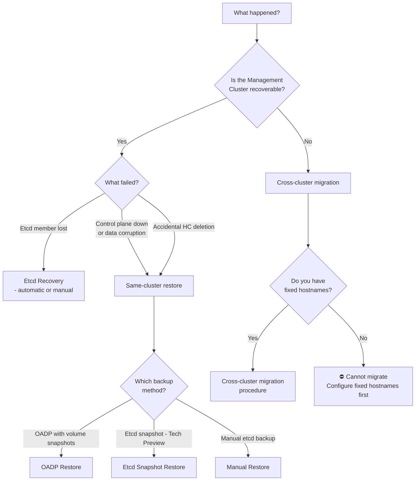

# Disaster Recovery for Hosted Control Planes

This section covers all backup, restore, and disaster recovery procedures for HostedClusters managed by HyperShift. It is organized around **scenarios** (what you want to achieve), **methods** (how to achieve it), and **platform-specific guides** (caveats per provider).

## Choosing the Right Approach

Use the following decision tree to find the right procedure for your situation:

## Supportability Matrix

| Platform | OADP Volume Snapshot | Etcd Snapshot (TP) | Same-cluster Restore | Cross-cluster Migration | Node Readoption |
| ---------- | --------------------- | -------------------- | --------------------- | ------------------------ | ----------------- |
| **AWS** | ✅ Supported | ✅ Tech Preview | ✅ Supported | ⚠️ Procedure documented — not yet supported (no E2E) | ❌ Not supported |
| **Azure** | ✅ Supported | ✅ Tech Preview | ✅ Supported | ⚠️ Procedure documented — not yet supported (no E2E) | ❌ Not supported |
| **Agent / Bare Metal** | ✅ Supported | ✅ Tech Preview | ✅ Supported | ⚠️ Procedure documented — not yet supported (no E2E) | ✅ OCP 4.19+ / MCE 2.9+ |
| **KubeVirt** | ✅ Supported | ⚠️ Not validated | ✅ Supported | ⚠️ Procedure documented — not yet supported (no E2E) | ❌ Not supported |
| **OpenStack** | ⚠️ Tech Preview | ⚠️ Not validated | ⚠️ Tech Preview | ⚠️ Procedure documented — not yet supported (no E2E) | ❌ Not supported |

!!! warning "Cross-cluster Migration Support Status"

    Cross-management-cluster migration procedures are documented in this guide but are **not yet officially supported**. End-to-end test coverage for cross-cluster scenarios does not exist yet. Use these procedures at your own risk in non-production environments, or as a last-resort disaster recovery measure.

## Documentation Structure

### Scenarios

Step-by-step guides organized by what you want to achieve:

- **[Same-cluster Restore](scenarios/same-cluster-restore.md)**: Restore a HostedCluster on the same Management cluster where the backup was taken.
- **[Cross-cluster Migration](scenarios/cross-cluster-migration.md)**: Migrate a HostedCluster to a different Management cluster (unsupported — procedure documented for reference).

### Backup and Restore Methods

Detailed reference for each backup/restore mechanism:

- **[OADP (OpenShift API for Data Protection)](methods/oadp.md)**: The primary backup/restore method using Velero and the OADP HyperShift plugin.
- **[Etcd Snapshot Backup (Tech Preview)](methods/etcd-snapshot/index.md)**: Alternative method using native etcd snapshots instead of volume snapshots.
- **[Manual Etcd Backup](methods/manual-etcd-backup.md)**: Fully manual etcd snapshot and restore process (requires API downtime).
- **[DR CLI Commands](dr-cli.md)**: HyperShift CLI commands for creating OADP backups and restores.

### Platform Guides

Provider-specific configuration, caveats, and examples:

- **[AWS](platform-guides/aws.md)**: OIDC fixup, ExternalDNS cleanup, endpoint access considerations.
- **[Azure](platform-guides/azure.md)**: Workload Identity configuration, Azure Blob Storage setup for etcd snapshots.
- **[Agent / Bare Metal](platform-guides/agent.md)**: InfraEnv lifecycle, Assisted Installer database, node readoption.
- **[KubeVirt](platform-guides/kubevirt.md)**: VM recreation, boot image PVC filtering.
- **[OpenStack](platform-guides/openstack.md)**: CSI driver considerations, floating IP pools.

### Reference

- **[Prerequisites](prerequisites.md)**: Requirements for all DR operations including service publishing strategy.
- **[Etcd Recovery](etcd-recovery.md)**: Manual etcd member recovery (operational procedure, not full DR).
- **[Troubleshooting](troubleshooting.md)**: Common issues and their resolutions.
