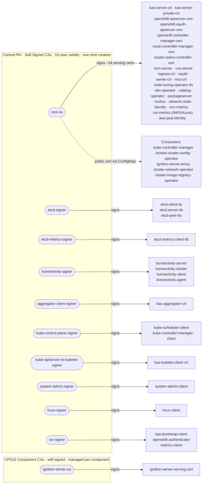

# Internal Control Plane Certificates

This document describes how internal control plane certificates are managed in HyperShift hosted control planes.

## Overview

The control-plane-operator (CPO) manages all internal PKI for the hosted control plane. These certificates secure communication between control plane components and are separate from [break-glass credentials](break-glass-credentials.md), which are managed by the control-plane-pki-operator.

## CA Hierarchy

Each hosted control plane namespace contains **multiple independent self-signed Certificate Authorities**, each governing a distinct trust domain. There is no single shared CA — the `root-ca` signs the majority of serving certificates, while specialized CAs exist for etcd, konnectivity, KAS client authentication, and CPOv2 components.

### Two PKI Management Patterns

Certificates are managed through two distinct patterns:

| Pattern | Location | Description |
|---------|----------|-------------|
| **Central PKI Reconciler** | `pki/*.go` in the HCP controller | Manages the `root-ca` and all signers/certs listed in `pki/ca.go`. Runs during the main HCP reconciliation loop. |
| **CPOv2 Manifest Adapters** | Each component's `certs.go` | Components like ignition-server create their own self-signed CA via `WithManifestAdapter`. These are independent of the central PKI reconciler. |

### CA Trust Diagram

### Root CAs

All root CAs are self-signed with a **10-year validity** and are generated once (never auto-rotated). The `ReconcileSelfSignedCA` function in `support/certs/tls.go` is idempotent — if the CA secret already contains `ca.crt` and `ca.key`, reconciliation is a no-op.

| CA Secret | Trust Domain | Certs Signed |
|-----------|-------------|--------------|
| `root-ca` | Most serving certs | ~24 serving certificates (KAS, OpenShift API servers, OAuth, ingress, OLM, network, CSI, etc.) |
| `etcd-signer` | etcd cluster communication | etcd client, server, and peer TLS |
| `etcd-metrics-signer` | etcd metrics scraping | etcd metrics client TLS |
| `konnectivity-signer` | Konnectivity tunnel | server, cluster, client, and agent certs |
| `aggregator-client-signer` | KAS aggregation layer | KAS aggregator client cert |
| `kube-control-plane-signer` | Control plane clients | kube-scheduler and kube-controller-manager client certs |
| `kube-apiserver-to-kubelet-signer` | KAS-to-kubelet auth | KAS kubelet client cert |
| `system-admin-signer` | Admin access | system:admin client cert |
| `hcco-signer` | HCCO auth | hosted-cluster-config-operator client cert |
| `csr-signer` | Bootstrap and authenticator | KAS bootstrap client, openshift-authenticator, metrics client |

### CPOv2 Component CAs

Some CPOv2 components create their own independent self-signed CA via `WithManifestAdapter` in their component definition. These CAs are managed during the component's own reconciliation, not by the central PKI reconciler.

| CA Secret | Component | Serving Cert |
|-----------|-----------|-------------|
| `ignition-server-ca` | ignition-server | `ignition-server-serving-cert` |

### Trust Distribution

The `root-ca` public certificate is distributed via a **ConfigMap** (not the Secret) so pods can verify root-ca-signed serving certs without access to the private key:

| Resource | Content | Mounted By |
|----------|---------|------------|
| Secret `root-ca` | `ca.crt` (public) + `ca.key` (private) | Used by PKI reconciler for signing only |
| ConfigMap `root-ca` | `ca-bundle.crt` (public only) | kube-controller-manager, hosted-cluster-config-operator, ignition-server-proxy, cluster-network-operator, cluster-image-registry-operator |

Other CAs distribute their trust via dedicated ConfigMaps:

| ConfigMap | Contains | Purpose |
|-----------|----------|---------|
| `etcd-ca` | etcd-signer public cert | etcd client verification |
| `etcd-metrics-ca` | etcd-metrics-signer public cert | etcd metrics client verification |
| `konnectivity-ca-bundle` | konnectivity-signer public cert | Konnectivity tunnel verification |
| `aggregator-client-ca` | aggregator-client-signer public cert | KAS aggregation layer |
| `client-ca` | Aggregate of all KAS client signers | KAS client certificate verification |
| `kubelet-client-ca` | kube-apiserver-to-kubelet-signer + csr-signer | Kubelet client verification |

## Certificates Managed

The CPO manages certificates for:

- Kube API server serving certificates (internal and external)
- Client certificates for kubelet, scheduler, controller-manager
- etcd peer and client certificates
- Aggregator proxy certificates
- Service account signing keys

## CA Certificate Lifecycle

Root CA certificates managed by the CPO have a **10-year validity period** and are generated once. They are not automatically rotated unless the certificate or key data is missing from the secret.

## Leaf Certificate Rotation

Leaf certificates (server and client certificates signed by a CA) are automatically rotated by the CPO:

| Setting | Default Value | Description |
|---------|---------------|-------------|
| Validity Period | 1 year | How long the certificate is valid |
| Renewal Threshold | 30 days | Certificate is renewed when less than this time remains |

Rotation is **reconciliation-driven**: during each reconciliation loop, the CPO validates existing certificates and regenerates them if they are approaching expiration or if their configuration has changed.

## Test Configuration Options

Certificate validity and renewal can be customized using environment variables on the CPO:

| Environment Variable | Description |
|---------------------|-------------|
| `CERTIFICATE_VALIDITY` | Custom certificate validity duration (e.g., `8760h` for 1 year) |
| `CERTIFICATE_RENEWAL_PERCENTAGE` | Fraction of validity period at which to renew (e.g., `0.30` renews when 30% of validity remains) |

!!! warning

    Modifying certificate validity settings is advanced configuration. Incorrect values may cause control plane instability or security issues.
