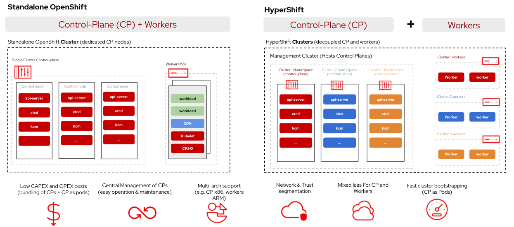

# HyperShift

HyperShift is middleware for hosting [OpenShift](https://www.openshift.com/) control
planes at scale that solves for cost and time to provision, as well as portability 
cross cloud with strong separation of concerns between management and workloads.
Clusters are fully compliant [OpenShift Container Platform](https://www.redhat.com/en/technologies/cloud-computing/openshift/container-platform) (OCP)
clusters and are compatible with standard OCP and Kubernetes toolchains.

[Quick start](getting-started.md){ .md-button .md-button--primary }
[Contribute](contribute/){ .md-button }

