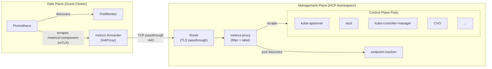

## Enable Control Plane Metrics Forwarding to Hosted Clusters

!!! important
    This feature requires OpenShift 4.22 or later and is currently gated behind an opt-in annotation.

By default, hosted cluster users cannot see control plane metrics (kube-apiserver, etcd, kube-controller-manager, etc.) from within their cluster's monitoring stack. This recipe enables forwarding those metrics from the management cluster's control plane into the hosted cluster's data plane Prometheus.

### How it works

When enabled, three components are deployed:

1. **endpoint-resolver** (management cluster): resolves pod IPs for control plane components in the HCP namespace.
2. **metrics-proxy** (management cluster): scrapes control plane pods, applies per-component metric filters, injects OCP-compatible labels, and serves aggregated metrics at `/metrics/<component>` behind a TLS-passthrough Route.
3. **metrics-forwarder** (guest cluster): an HAProxy deployment in `openshift-monitoring` that TCP-proxies scrape requests to the management cluster's metrics-proxy Route. A PodMonitor tells the guest Prometheus to scrape it.

The full data path is:



mTLS is enforced end-to-end. The guest Prometheus presents a client certificate via the `tls-client-certificate-auth` scrape class, and HAProxy passes TLS through transparently to the metrics-proxy, which verifies it against the cluster-signer CA.

### Prerequisites

- A running HostedCluster on OpenShift 4.22+.
- The cluster must have worker nodes so the Cluster Monitoring Operator (CMO) and Prometheus can run in the data plane.

### Enable metrics forwarding

Add the `hypershift.openshift.io/enable-metrics-forwarding` annotation to your HostedCluster:

```shell
oc annotate hostedcluster -n <HOSTED_CLUSTER_NAMESPACE> <HOSTED_CLUSTER_NAME> \
  hypershift.openshift.io/enable-metrics-forwarding=true
```

This triggers the CPO to deploy the `endpoint-resolver` and `metrics-proxy` in the HCP namespace, and the HCCO to deploy the `metrics-forwarder` and its PodMonitor in the guest cluster's `openshift-monitoring` namespace.

### Verify the deployment

1. Confirm the management-side components are running:

    ```shell
    HCP_NAMESPACE="<HOSTED_CLUSTER_NAMESPACE>-<HOSTED_CLUSTER_NAME>"

    oc get deployment endpoint-resolver -n "$HCP_NAMESPACE"
    oc get deployment metrics-proxy -n "$HCP_NAMESPACE"
    oc get route metrics-proxy -n "$HCP_NAMESPACE"
    ```

2. Confirm the guest-side metrics-forwarder is running:

    ```shell
    oc get deployment control-plane-metrics-forwarder \
      -n openshift-monitoring --kubeconfig <GUEST_KUBECONFIG>
    ```

3. Confirm the PodMonitor was created:

    ```shell
    oc get podmonitor control-plane-metrics-forwarder \
      -n openshift-monitoring --kubeconfig <GUEST_KUBECONFIG>
    ```

### Verify metrics are flowing

Once deployed, wait a few minutes for Prometheus to start scraping, then verify:

1. Check the Prometheus targets in the guest cluster:

    ```shell
    oc exec -n openshift-monitoring prometheus-k8s-0 \
      -c prometheus --kubeconfig <GUEST_KUBECONFIG> -- \
      curl -s http://localhost:9090/api/v1/targets \
      | jq '.data.activeTargets[] | select(.scrapePool | contains("control-plane-metrics-forwarder")) | {scrapePool, scrapeUrl: .scrapeUrl, health}'
    ```

    You should see targets with `"health": "up"` for each component.

2. Query a sample metric to confirm data is being ingested:

    ```shell
    oc exec -n openshift-monitoring prometheus-k8s-0 \
      -c prometheus --kubeconfig <GUEST_KUBECONFIG> -- \
      curl -gs 'http://localhost:9090/api/v1/query?query=apiserver_request_total{job="apiserver"}' \
      | jq '.data.result | length'
    ```

    A non-zero result confirms kube-apiserver metrics are available.

### Exposed components

The metrics-proxy dynamically discovers all ServiceMonitors and PodMonitors in the HCP namespace. The following components are currently forwarded:

**ServiceMonitor-based** (with per-component metric filtering):

| Component | Metrics port | Example metrics |
|---|---|---|
| kube-apiserver | 6443 | `apiserver_request_total`, `apiserver_request_duration_seconds` |
| etcd | 2381 | `etcd_server_has_leader`, `etcd_disk_wal_fsync_duration_seconds` |
| kube-controller-manager | 10257 | `workqueue_depth`, `node_collector_evictions_total` |
| openshift-apiserver | 8443 | `apiserver_request_total` (OpenShift API) |
| openshift-controller-manager | 8443 | Controller workqueue and sync metrics |
| openshift-route-controller-manager | 8443 | Route controller metrics |
| cluster-version-operator | 8443 | `cluster_version`, `cluster_operator_conditions` |
| node-tuning-operator | 60000 | Tuning operator health metrics |
| olm-operator | 8443 | `csv_succeeded`, operator lifecycle metrics |
| catalog-operator | 8443 | Catalog source sync metrics |

**PodMonitor-based** (all metrics passed through, no filtering):

| Component | Metrics port |
|---|---|
| cluster-autoscaler | 8085 |
| control-plane-operator | 8080 |
| hosted-cluster-config-operator | 8080 |
| ignition-server | 8080 |
| ingress-operator | 60000 |
| karpenter | 8080 |
| karpenter-operator | 8080 |
| cluster-image-registry-operator | 60000 |

### Controlling which metrics are forwarded

The metrics-proxy applies the same per-component metric filtering used by the management cluster's monitoring stack. Which metrics are included or excluded is controlled by the **metrics set** configured on the HyperShift Operator. See [Configure Metrics Sets](../../how-to/metrics-sets.md) for full details.

Three metrics sets are available:

| Metrics set | Behaviour | Use case |
|---|---|---|
| `Telemetry` (default) | Only a small curated subset of metrics per component | Minimal resource usage |
| `SRE` | Configurable via a `sre-metric-set` ConfigMap with custom RelabelConfigs per component | Fine-grained control for alerting and troubleshooting |
| `All` | All metrics from each component (some legacy metrics are still dropped) | Full observability |

The metrics set is configured globally on the HyperShift Operator deployment:

```shell
oc set env -n hypershift deployment/operator METRICS_SET=All
```

!!! note
    The metrics-proxy defaults to `All` when no metrics set is explicitly configured. This means that if the HyperShift Operator does not have `METRICS_SET` set, all metrics will be forwarded to the guest cluster.

#### Example: Telemetry metrics set

With `METRICS_SET=Telemetry`, only these kube-apiserver metrics are forwarded:

- `apiserver_storage_objects`
- `apiserver_request_total`
- `apiserver_current_inflight_requests`

And for etcd:

- `etcd_disk_wal_fsync_duration_seconds_bucket`
- `etcd_mvcc_db_total_size_in_bytes`
- `etcd_network_peer_round_trip_time_seconds_bucket`
- `etcd_mvcc_db_total_size_in_use_in_bytes`
- `etcd_disk_backend_commit_duration_seconds_bucket`
- `etcd_server_leader_changes_seen_total`

Similar curated subsets apply to each of the other ServiceMonitor-based components.

#### Example: SRE metrics set with custom configuration

With `METRICS_SET=SRE`, you can define exactly which metrics to forward per component by creating a ConfigMap named `sre-metric-set` in each control plane namespace. Each key in the ConfigMap's `config` field maps a component name to a list of Prometheus RelabelConfigs (typically `action: keep` with a regex on `__name__`). See the [dashboard example below](#using-the-dashboard-with-the-sre-metrics-set) for a complete ConfigMap.

The configurable components are:

- `etcd`
- `kubeAPIServer`
- `kubeControllerManager`
- `openshiftAPIServer`
- `openshiftControllerManager`
- `openshiftRouteControllerManager`
- `cvo`
- `olm`
- `catalogOperator`
- `registryOperator`
- `nodeTuningOperator`
- `controlPlaneOperator`
- `hostedClusterConfigOperator`

!!! note
    PodMonitor-based components (cluster-autoscaler, ignition-server, karpenter, etc.) are not subject to metric filtering and always forward all their metrics regardless of the configured metrics set.

### Label compatibility

The metrics-proxy injects OCP-compatible labels (`job`, `namespace`, `service`, `pod`, `instance`, `endpoint`) so that standard OpenShift dashboards and recording rules work identically to standalone clusters. The guest-side PodMonitor uses `honorLabels: true` to preserve these injected labels.

### Example: Grafana dashboard for control plane metrics

A sample Grafana dashboard JSON is available at [`contrib/metrics/guest-control-plane-dashboard.json`](https://github.com/openshift/hypershift/blob/main/contrib/metrics/guest-control-plane-dashboard.json) in this repository. It is designed to run inside the hosted cluster's monitoring stack using the forwarded metrics and includes the following panels:

| Section | Panels | Key metrics |
|---|---|---|
| **API Server** | Request rate by verb, error rate by resource, inflight requests, request latency (p50/p99), storage objects | `apiserver_request_total`, `apiserver_request_duration_seconds_bucket`, `apiserver_current_inflight_requests`, `apiserver_storage_objects` |
| **etcd** | Database size, WAL fsync / backend commit latency (p99), peer RTT (p99), leader changes, has-leader status | `etcd_mvcc_db_total_size_in_bytes`, `etcd_disk_wal_fsync_duration_seconds_bucket`, `etcd_disk_backend_commit_duration_seconds_bucket`, `etcd_network_peer_round_trip_time_seconds_bucket`, `etcd_server_leader_changes_seen_total`, `etcd_server_has_leader` |
| **Cluster Operators & CVO** | Operator up/down status, operator conditions table, cluster version | `cluster_operator_up`, `cluster_operator_conditions`, `cluster_version` |
| **Scheduler** | Scheduling rate & results, pending pods by queue | `scheduler_schedule_attempts_total`, `scheduler_pending_pods` |
| **Controller Manager** | Work queue depth, work queue add rate | `workqueue_depth`, `workqueue_adds_total` |
| **OLM** | ClusterServiceVersion status | `csv_succeeded` |

!!! note
    This dashboard requires `METRICS_SET=All` or `METRICS_SET=SRE` with the matching configuration shown below. With the default `Telemetry` set, most panels will be empty because the required metrics are not forwarded.

#### Using the dashboard with the SRE metrics set

Using `METRICS_SET=SRE` lets you forward exactly the metrics the dashboard needs — nothing more. This keeps the monitoring footprint small while giving hosted cluster users a complete dashboard experience.

1. Set the metrics set on the HyperShift Operator:

    ```shell
    oc set env -n hypershift deployment/operator METRICS_SET=SRE
    ```

2. Create the `sre-metric-set` ConfigMap in the HCP namespace with the relabel configs that match the dashboard panels:

    ```yaml
    apiVersion: v1
    kind: ConfigMap
    metadata:
      name: sre-metric-set
      namespace: <HCP_NAMESPACE>
    data:
      config: |
        kubeAPIServer:
          - action: keep
            sourceLabels: ["__name__"]
            regex: "(apiserver_request_total|apiserver_request_duration_seconds_bucket|apiserver_current_inflight_requests|apiserver_storage_objects)"
        etcd:
          - action: keep
            sourceLabels: ["__name__"]
            regex: "(etcd_mvcc_db_total_size_in_bytes|etcd_mvcc_db_total_size_in_use_in_bytes|etcd_disk_wal_fsync_duration_seconds_bucket|etcd_disk_backend_commit_duration_seconds_bucket|etcd_network_peer_round_trip_time_seconds_bucket|etcd_server_leader_changes_seen_total|etcd_server_has_leader)"
        kubeControllerManager:
          - action: keep
            sourceLabels: ["__name__"]
            regex: "(workqueue_depth|workqueue_adds_total|scheduler_e2e_scheduling_duration_seconds_count|scheduler_schedule_attempts_total|scheduler_pending_pods)"
        cvo:
          - action: keep
            sourceLabels: ["__name__"]
            regex: "(cluster_version|cluster_operator_up|cluster_operator_conditions)"
        olm:
          - action: keep
            sourceLabels: ["__name__"]
            regex: "(csv_succeeded)"
    ```

    This forwards only the 20 metric names used by the dashboard across 5 components. Components not listed (openshift-apiserver, openshift-controller-manager, etc.) will have no metrics forwarded, which is fine since the dashboard doesn't use them.

    !!! tip
        You can extend this ConfigMap over time. For example, to add etcd proposal metrics for a new panel, append `|etcd_server_proposals_.*` to the etcd regex. The dashboard will pick up the new metrics on the next scrape cycle.

3. Apply the ConfigMap:

    ```shell
    oc apply -f sre-metric-set.yaml
    ```

    The CPO will detect the ConfigMap change and update the metrics-proxy configuration automatically.

#### Loading the dashboard into the hosted cluster

You can load the dashboard as a ConfigMap in the guest cluster's `openshift-config-managed` namespace, which makes it available in the OpenShift console under Observe > Dashboards:

```shell
oc create configmap guest-control-plane-dashboard \
  --from-file=guest-control-plane-dashboard.json=contrib/metrics/guest-control-plane-dashboard.json \
  -n openshift-config-managed \
  --kubeconfig <GUEST_KUBECONFIG>

oc label configmap guest-control-plane-dashboard \
  console.openshift.io/dashboard=true \
  -n openshift-config-managed \
  --kubeconfig <GUEST_KUBECONFIG>
```

Alternatively, if you have the Grafana Operator deployed in the guest cluster, import the JSON file directly as a GrafanaDashboard CR.

### Disable metrics forwarding

Remove the annotation to disable metrics forwarding and clean up all related resources:

```shell
oc annotate hostedcluster -n <HOSTED_CLUSTER_NAMESPACE> <HOSTED_CLUSTER_NAME> \
  hypershift.openshift.io/enable-metrics-forwarding-
```

This deletes the `endpoint-resolver` and `metrics-proxy` from the management cluster, and the `metrics-forwarder`, its ConfigMap, serving CA, and PodMonitor from the guest cluster.
