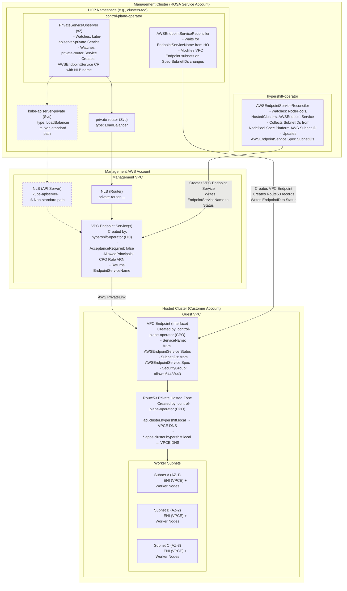

# AWS PrivateLink Architecture in HyperShift

## Overview

HyperShift uses AWS PrivateLink to establish secure connectivity between worker nodes in the guest cluster VPC and the hosted control plane in the management cluster VPC. This is used when `EndpointAccess` is set to `Private` or `PublicAndPrivate`.

## Architecture Diagram

> **Note:** The `kube-apiserver-private` Service and its NLB (shown with dashed lines) are only created when the API server is explicitly exposed via LoadBalancer with PrivateLink configured. This is **not** the standard ROSA HCP path and its use is discouraged. In the standard ROSA HCP flow, only the `private-router` path is used for PrivateLink connectivity.

## Component Responsibilities

### AWS Resources

| AWS Resource | Created By | Description |
|--------------|------------|-------------|
| NLB (kube-apiserver-private) | control-plane-operator | Load balancer for API server traffic (non-standard path, not used in ROSA HCP) |
| NLB (private-router) | control-plane-operator | Load balancer for ingress router traffic |
| VPC Endpoint Service | hypershift-operator | Exposes NLBs via PrivateLink |
| VPC Endpoint (Interface) | control-plane-operator | Connects guest VPC to endpoint service |
| Security Group (for VPCE) | control-plane-operator | Allows 6443/443 from machine CIDRs |
| Route53 Private Zone records | control-plane-operator | DNS resolution for API and apps |

### Kubernetes Resources

| Resource | Created By | Responsibility |
|----------|------------|----------------|
| AWSEndpointService CR | CPO (PrivateServiceObserver) | Tracks NLB name |
| AWSEndpointService.Spec.SubnetIDs | hypershift-operator | Collected from NodePools |
| AWSEndpointService.Status.EndpointServiceName | hypershift-operator | AWS VPC Endpoint Service name |
| AWSEndpointService.Status.EndpointID | control-plane-operator | AWS VPC Endpoint ID |

## Data Flow

1. **CPO creates NLB Services** - `private-router` Service of type LoadBalancer (and optionally `kube-apiserver-private` when the API server is exposed via LoadBalancer, which is not the standard ROSA HCP path)
2. **CPO PrivateServiceObserver** watches Services, creates `AWSEndpointService` CR with NLB name
3. **HO collects SubnetIDs** from all NodePools and updates `AWSEndpointService.Spec.SubnetIDs`
4. **HO creates VPC Endpoint Service** attached to NLB, writes `EndpointServiceName` to status
5. **CPO creates VPC Endpoint** in guest VPC using the endpoint service name and subnet IDs
6. **CPO creates Route53 records** pointing to VPC Endpoint DNS

## EndpointAccess Modes

| Mode | Public NLB | Private NLB | VPC Endpoint | PrivateLink |
|------|------------|-------------|--------------|-------------|
| Public | Yes | No | No | No |
| PublicAndPrivate | Yes | Yes | Yes | Yes |
| Private | No | Yes | Yes | Yes |

## Code References

- **hypershift-operator AWS controller**: `hypershift-operator/controllers/platform/aws/controller.go`
- **control-plane-operator PrivateLink controller**: `control-plane-operator/controllers/awsprivatelink/awsprivatelink_controller.go`
- **AWSEndpointService API types**: `api/hypershift/v1beta1/endpointservice_types.go`
