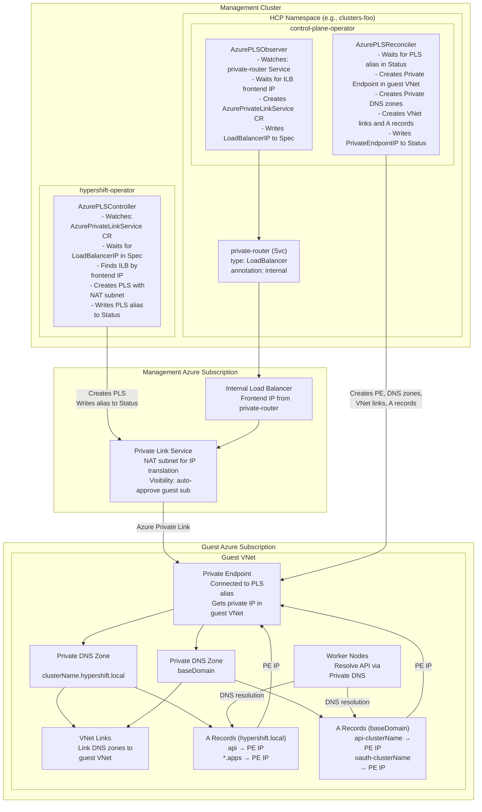

# Azure Private Link Architecture in HyperShift

## Overview

HyperShift uses Azure Private Link Service (PLS) to establish secure connectivity between worker nodes in the guest cluster VNet and the hosted control plane in the management cluster. This is used when `EndpointAccess` is set to `Private` or `PublicAndPrivate`.

Unlike AWS PrivateLink which uses VPC Endpoint Services, Azure Private Link uses a dedicated Private Link Service resource backed by an internal load balancer with NAT IP translation.

## Architecture Diagram

## Component Responsibilities

### Azure Resources

| Azure Resource | Created By | Description |
|----------------|------------|-------------|
| Internal Load Balancer | Azure (via `private-router` Service) | Fronts the KAS/router in the management cluster with an internal IP |
| Private Link Service | HyperShift operator (HO controller) | Exposes the ILB via Private Link using NAT subnet for IP translation |
| Private Endpoint | Control plane operator (CPO reconciler) | Connects guest VNet to PLS, receives a private IP in the guest subnet |
| Private DNS Zone (local) | Control plane operator (CPO reconciler) | `<clusterName>.hypershift.local` - synthetic internal zone for KAS and apps resolution |
| Private DNS Zone (base) | Control plane operator (CPO reconciler) | `<baseDomain>` - zone for API and OAuth hostname resolution via external names |
| VNet Links | Control plane operator (CPO reconciler) | Links both Private DNS zones to the guest VNet |
| A Records (local zone) | Control plane operator (CPO reconciler) | `api` and `*.apps` in the `hypershift.local` zone, pointing to the Private Endpoint IP |
| A Records (base zone) | Control plane operator (CPO reconciler) | `api-<clusterName>` and `oauth-<clusterName>` in the base domain zone, pointing to the Private Endpoint IP |

### Kubernetes Resources

| Resource | Created By | Responsibility |
|----------|------------|----------------|
| `AzurePrivateLinkService` CR | CPO (Observer) | Tracks the PLS lifecycle and coordinates between HO and CPO |
| `.spec.loadBalancerIP` | CPO (Observer) | ILB frontend IP, consumed by HO to find the correct load balancer |
| `.status.privateLinkServiceAlias` | HO (Controller) | Globally unique PLS alias, consumed by CPO to create Private Endpoint |
| `.status.privateEndpointIP` | CPO (Reconciler) | Private Endpoint IP, used for DNS A record creation |

## Data Flow

1. **CPO Observer watches `private-router` Service** - Waits for the Service to get an internal load balancer IP from its `status.loadBalancer.ingress`
2. **CPO Observer creates `AzurePrivateLinkService` CR** - Populates `spec.loadBalancerIP` with the ILB frontend IP, along with subscription, resource group, location, NAT subnet, and guest VNet details
3. **HO Controller finds the ILB** - Uses the `spec.loadBalancerIP` to locate the Azure internal load balancer resource by matching frontend IP configurations
4. **HO Controller creates Private Link Service** - Creates PLS attached to the ILB with NAT IPs from the configured NAT subnet. Configures auto-approval for the guest subscription. Writes `status.privateLinkServiceAlias`
5. **CPO Reconciler creates Private Endpoint** - Uses the PLS alias to create a PE in the guest VNet subnet. Waits for the PE to get a private IP. Writes `status.privateEndpointIP`
6. **CPO Reconciler creates Private DNS (local zone)** - Creates a `<clusterName>.hypershift.local` Private DNS zone, links it to the guest VNet, and creates `api` and `*.apps` A records pointing to the PE IP. This is a synthetic internal domain that only exists within the guest VNet
7. **CPO Reconciler creates Private DNS (base domain zone)** - Creates a `<baseDomain>` Private DNS zone, links it to the guest VNet, and creates `api-<clusterName>` and `oauth-<clusterName>` A records pointing to the PE IP. This enables the console OAuth flow and other services that use external API/OAuth hostnames from within the private network
8. **Workers resolve API hostname** - Worker nodes use the Private DNS zones to resolve the API server hostname to the Private Endpoint IP, which routes through Azure Private Link to the ILB and ultimately to the KAS pods

## Condition Progression

The `AzurePrivateLinkService` CR tracks progress through status conditions:

| Condition | Set By | Meaning |
|-----------|--------|---------|
| `AzureInternalLoadBalancerAvailable` | HO | ILB found with matching frontend IP |
| `AzurePLSCreated` | HO | Private Link Service created in management RG |
| `AzurePrivateEndpointAvailable` | CPO | Private Endpoint created and connected in guest VNet |
| `AzurePrivateDNSAvailable` | CPO | DNS zones, VNet links, and A records created |
| `AzurePrivateLinkServiceAvailable` | CPO | All components ready, full private connectivity established |

## EndpointAccess Modes

| Mode | Public LB | Internal LB | Private Link Service | Private Endpoint | Private DNS |
|------|-----------|-------------|---------------------|-----------------|-------------|
| `Public` | Yes | No | No | No | No |
| `PublicAndPrivate` | Yes | Yes | Yes | Yes | Yes |
| `Private` | No | Yes | Yes | Yes | Yes |

## Deletion Flow

Deletion uses a dual-finalizer pattern to ensure resources are cleaned up in the
correct dependency order:

1. **CPO finalizer runs first**: Removes the Private Endpoint, Private DNS zones (both `<clusterName>.hypershift.local` and `<baseDomain>`), VNet links, and A records from the guest subscription
2. **HO finalizer runs second**: Removes the Private Link Service from the management cluster's resource group

This ordering is critical because:

- The Private Endpoint must be disconnected before the PLS can be deleted
- DNS records must be removed before DNS zones can be deleted
- VNet links must be removed before DNS zones can be deleted

## Code References

| Component | File |
|-----------|------|
| HO PLS Controller | `hypershift-operator/controllers/platform/azure/controller.go` |
| CPO Observer | `control-plane-operator/controllers/azureprivatelinkservice/observer.go` |
| CPO Reconciler | `control-plane-operator/controllers/azureprivatelinkservice/controller.go` |
| AzurePrivateLinkService API | `api/hypershift/v1beta1/azureprivatelinkservice_types.go` |
| Azure platform types | `api/hypershift/v1beta1/azure.go` |
