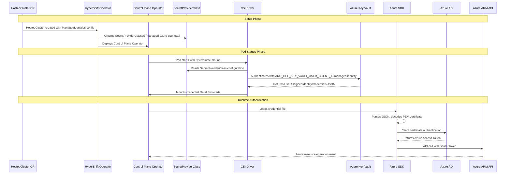
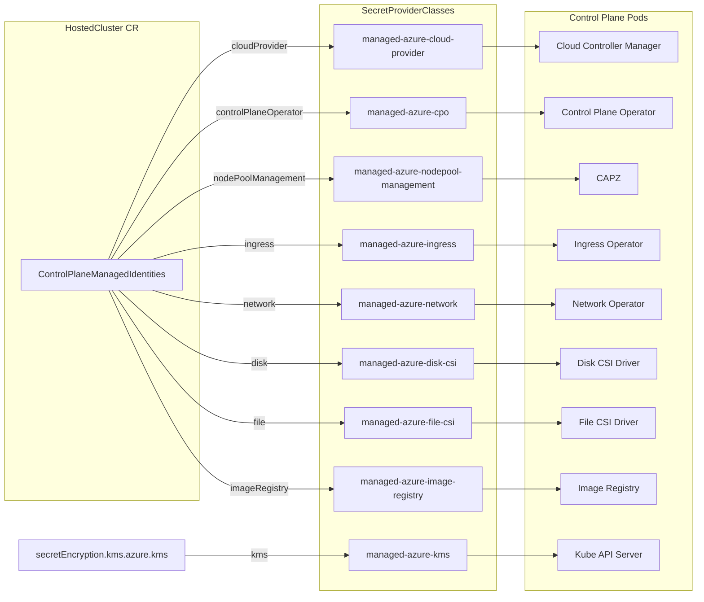
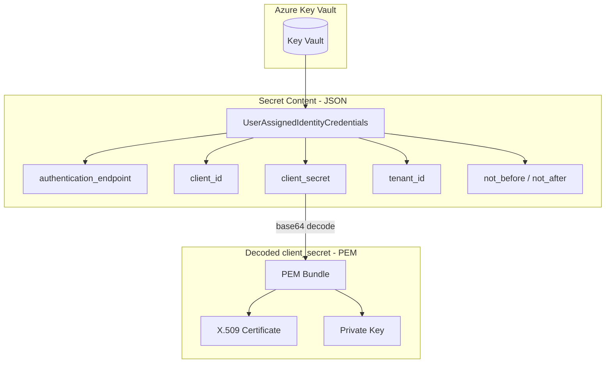

# Managed Azure HostedClusters Identity Flow

This document provides a high-level overview of how Azure identities flow through the managed Azure HostedClusters architecture, from HostedCluster configuration to Azure API authentication.

The diagrams below show the key aspects of the identity flow. For detailed information on each component, see the linked documentation at the bottom of this page.

## Sequence Diagram

The following diagram shows the identity flow using the Control Plane Operator (CPO) as an example. Other control plane pods that need to authenticate with Azure follow a similar pattern, using their respective SecretProviderClass and credential file.

!!! note "ARO_HCP_KEY_VAULT_USER_CLIENT_ID"
    The `ARO_HCP_KEY_VAULT_USER_CLIENT_ID` environment variable contains the client ID of a user-assigned managed identity on the management cluster. This identity is authorized to pull secrets from the Azure Key Vault. It is set on the HyperShift Operator during installation and passed to the SecretProviderClass as `userAssignedIdentityID`.

## Component Identity Mapping

## Key Vault Secret Structure

## Detailed Documentation

Each stage of the identity flow is documented in detail:

| Stage | Documentation | Description |
|-------|---------------|-------------|
| 1. HostedCluster Configuration | [HostedCluster Identity Configuration](./hostedcluster-identity-configuration.md) | API field reference for `AzureAuthenticationConfiguration`, `ControlPlaneManagedIdentities`, `DataPlaneManagedIdentities`, and `ManagedIdentity` types |
| 2. Azure Key Vault | [Key Vault Secret Structure](./keyvault-secret-structure.md) | Secret naming conventions, `UserAssignedIdentityCredentials` JSON schema, PEM certificate format, and `objectEncoding` options |
| 3-4. SecretProviderClass & CSI | [Secrets CSI Usage](./secrets-csi.md) | How `SecretProviderClass` CRs are created and how the Secrets Store CSI driver mounts credentials into pods |
| 5. Pod Volume Mounts | [Pod Volume Mounts](./pod-volume-mounts.md) | Helper functions, mount paths, environment variables, and example pod specs |
| 6-8. Authentication Flow | [Azure Authentication Flow](./azure-authentication-flow.md) | Complete authentication chain from credential loading through Azure AD to ARM API access |

### Additional References

- [SecretProviderClass Configuration](./secretproviderclass-configuration.md) - Deep dive into `ReconcileManagedAzureSecretProviderClass` function and all SecretProviderClass resources created by HO/CPO
