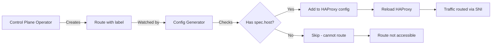

# Shared Ingress
## Motivation

Today, exposing the apiserver of an hosted cluster to its nodes is possible only with two options: LoadBalancer and NodePort.
The downside of the LoadBalancer method is that it would require a separate LB for every hosted cluster configured on the mgmt cluster. This can incur additional costs at the cloud provider and an additional, even if it small, spin up time to provision the LB service.
The downside of the NodePort method is that it is bound to one of the nodes’ IP of the mgmt cluster (typically the 1st one). Once this node is down, all of the hosted clusters’ apiservers which are based on NodePort connectivity are no longer reachable.
Shared Ingress presents another option, in which there would be a single LoadBalacer on the mgmt cluster, that will serve all of the hosted clusters that are configured to use this method.
Connections to the hosted kube-apiservers from outside of the cluster will be made available through a Route.

## Overview

Generally in kubernetes and openshift clusters, pods who wish to communicate with their cluster’s api-server, are doing it through the kubernetes.default.svc.cluster.local master service, which is mapped to the cluster’s kube-apiserver service.
In HyperShift guest clusters, the master service (whose IP is 172.31.0.1) is mapped to a kube-apiserver-proxy pod, running on every node at the host level, which proxies the request to the apiserver on the HCP namespace at the mgmt cluster, 1:1 flat translation, in TLS passthrough.

Shared Ingress (single LB) solution is able to differentiate between various hcp api-servers hosted on the mgmt cluster using the PROXY Protocol. The PROXY protocol enables adding additional info to a TLS connection, outside of the encrypted message, when both ends support this protocol.
The fields that are added with the PROXY protocol are mainly:
- Source IP
- Source Port
- Destination IP
- Destination Port
- TLVs (key-value pairs that carry arbitrary data)

### Guest Intermediate Proxy

On the guest cluster, the kube-apiserver-proxy (HAProxy) instance, will use the PROXY protocol when sending requests and includes a custom TLV which contains the `ClusterID` so the central proxy on the mgmt can see `ClusterID` and forward it to the respective kube-apiserver on the hcp.
The default backend of this proxy will be the LB address of the central proxy.

### MGMT Cluster Central Proxy

On the management cluster, we setup a single proxy server (HAProxy) in the `hypershift-sharedingress` namespace. This central proxy will accept connections through a LoadBalancer service, and with PROXY protocol.
It will then examine the custom TLV field of the PROXY protocol, extract the attached `ClusterID` and using an ACL, will forward the connection to the respective hcp kube-apiserver.
The destination IP in this case will be exactly the same as the ClusterIP of the hcp kube-apiserver.

Note: the kube-apiserver will no longer be exposed through a dedicated LB service.

## Route-Based Services

While the kube-apiserver uses the PROXY protocol mechanism described above, other control plane services (OAuth, Konnectivity, Ignition) are exposed through OpenShift Routes with HAProxy-based routing.

### How Route Processing Works

The shared ingress system includes a **config-generator** sidecar container that dynamically generates HAProxy configuration for route-based services:

1. **Route Creation**: Control plane operator creates Route resources in the HCP namespace
2. **Route Labeling**: Routes are labeled with `hypershift.openshift.io/hosted-control-plane`
3. **Config Generator Watches**: The config-generator watches for routes with this label
4. **HAProxy Configuration**: Generates HAProxy config mapping route hostnames to backend services
5. **Configuration Reload**: Reloads HAProxy when routes are added/modified/deleted

### Critical Requirement: Route Hostnames

**Routes MUST have `spec.host` field populated** to be processed by shared ingress.

Routes without a hostname (`spec.host` is empty) will be **skipped** by the config-generator because:
- HAProxy requires a hostname for SNI-based routing
- Routes without hostnames cannot be matched to incoming requests
- This results in `InfrastructureReady=False` condition on the HostedCluster

**How routes get hostnames** (see [Exposing Services from HCP](../../how-to/common/exposing-services-from-hcp.md) for details):
- **Explicit**: `spec.services[].route.hostname` set in HostedCluster spec
- **Auto-generated**: From `DEFAULT_INGRESS_DOMAIN` environment variable in control-plane-operator

**Platform-specific behavior**:
- **Cloud platforms (AWS, Azure)**: Use explicit hostnames + external-DNS for DNS records
- **Platform=None**: Requires `DEFAULT_INGRESS_DOMAIN` to be set, or routes will have empty hostnames

!!! warning "Empty Route Hostnames"
    If routes are created without `spec.host`, the shared ingress will not route traffic to them. This manifests as the OAuth route not having a valid host, preventing infrastructure readiness and kubeconfig publication.

### Route Processing Flow

## Reference Diagram

