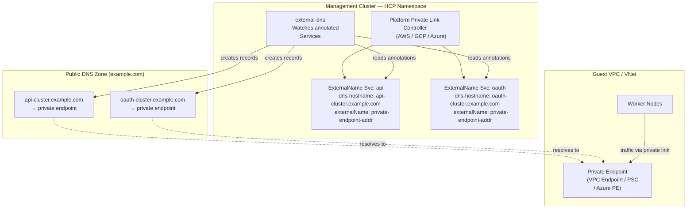

# Private Topology DNS Architecture in HyperShift

## Overview

When HyperShift creates a hosted control plane with `EndpointAccess` set to `Private` or `PublicAndPrivate`, each cloud platform uses a different mechanism to provide private connectivity and DNS resolution between the guest cluster VPC/VNet and the hosted control plane in the management cluster.

This document describes how DNS resolution works for private topologies across AWS, GCP, and Azure, with a focus on:

- How each platform resolves control plane endpoints (API server, OAuth) from within the guest network
- The role of ExternalName services and external-dns in enabling public DNS records for private endpoints
- How DNS-authenticated certificate workflows (e.g. Let's Encrypt DNS challenges used by ROSA) are enabled
- Known issues and troubleshooting guidance

For platform-specific PrivateLink/PSC architecture details, see:

- [AWS PrivateLink](aws/privatelink.md)
- [Azure Private Link](azure/privatelink.md)

## Private Connectivity Summary

Each cloud platform uses a different private connectivity technology, but they all follow the same high-level pattern: the control plane operator (CPO) in the management cluster creates a private endpoint in the guest network that routes traffic through a cloud-specific private link to the hosted control plane.

| Platform | Private Connectivity | DNS Zone Type | ExternalName Target |
|----------|---------------------|---------------|---------------------|
| AWS | PrivateLink (VPC Endpoint Service) | Route53 Private Hosted Zone | VPC Endpoint DNS name (CNAME) |
| GCP | Private Service Connect (PSC) | Cloud DNS Private Zone | PSC Endpoint IP (A record) |
| Azure | Private Link Service (PLS) | Azure Private DNS Zone | Private Endpoint IP (A record) |

## Per-Platform DNS Architecture

### AWS

AWS uses PrivateLink with VPC Endpoint Services for private connectivity. DNS resolution is handled through Route53 private hosted zones.

**DNS records created by CPO:**

- `api.<clusterName>.hypershift.local` → VPC Endpoint DNS name
- `*.<routerDomain>.<clusterName>.hypershift.local` → VPC Endpoint DNS name (for CP-resident services exposed as routes: OAuth, Ignition, Konnectivity)

The Route53 private hosted zone is associated with the guest VPC so that worker nodes can resolve control plane endpoints.

**ExternalName services:** When the cluster is not public and services are configured with `Route` publishing strategy with a custom hostname, the AWS PrivateLink controller creates ExternalName services annotated with `hypershift.openshift.io/external-dns-hostname`. The `spec.externalName` is set to the VPC Endpoint's DNS name (a CNAME target). This enables external-dns to create CNAME records in a public DNS zone.

**Code reference:** `control-plane-operator/controllers/awsprivatelink/awsprivatelink_controller.go`

### GCP

GCP uses Private Service Connect (PSC) for private connectivity. The PSC endpoint receives a private IP address within the guest VPC subnet.

**DNS records created by CPO:**

- Cloud DNS private zones with A records pointing the API server and OAuth hostnames to the PSC endpoint IP

**ExternalName services:** When the cluster is not public and services are configured with `Route` publishing strategy with a custom hostname, the GCP PSC controller creates ExternalName services annotated with `hypershift.openshift.io/external-dns-hostname`. The `spec.externalName` is set to the PSC endpoint IP. This enables external-dns to create A records in a public DNS zone pointing to the private IP.

**Code reference:** `control-plane-operator/controllers/gcpprivateserviceconnect/psc_endpoint_controller.go`

### Azure

Azure uses Private Link Service (PLS) with NAT IP translation for private connectivity. The CPO creates a Private Endpoint in the guest VNet, which receives a private IP.

**DNS records created by CPO (two private DNS zones):**

1. `<clusterName>.hypershift.local` — synthetic internal zone:
    - `api` → Private Endpoint IP
    - `*.apps` → Private Endpoint IP (for CP-resident services, not guest cluster application traffic)
2. `<baseDomain>` — base domain zone:
    - `api-<clusterName>` → Private Endpoint IP
    - `oauth-<clusterName>` → Private Endpoint IP

Both zones are linked to the guest VNet so that worker nodes can resolve control plane endpoints.

**ExternalName services:** Azure creates ExternalName services following the same pattern as GCP, enabling external-dns to publish public DNS records for private endpoint IPs. This supports DNS-authenticated certificate workflows.

**Code reference:** `control-plane-operator/controllers/azureprivatelinkservice/controller.go`

## ExternalName Services and external-dns

### The Pattern

Across all three platforms, HyperShift uses the same pattern to bridge private endpoints with public DNS:

1. The platform's private link controller creates Kubernetes Services of type `ExternalName` in the HCP namespace
2. Each service is annotated with `hypershift.openshift.io/external-dns-hostname` set to the desired public hostname
3. The `spec.externalName` field points to the private endpoint's DNS name (AWS) or IP address (GCP, Azure)
4. external-dns watches for these annotated services and creates DNS records in the configured public DNS zone

### Why This Matters

This pattern enables two important capabilities:

1. **DNS-authenticated certificate issuance**: Services like ROSA use Let's Encrypt DNS-01 challenges to issue TLS certificates. The certificate authority needs to verify domain ownership by querying public DNS. By creating publicly-resolvable records that point to private IPs, the DNS challenge can succeed even though the endpoints are not publicly accessible.

2. **Kubeconfig resolution for authorized clients**: Clients with VPC/VNet access (or access through VPN gateways, peering, etc.) can resolve the API server and OAuth endpoints from the hostnames in the kubeconfig. The public DNS records resolve to private IPs, which are reachable from within the private network.

### When ExternalName Services Are Created

ExternalName services are only created when **all** of the following conditions are met:

- The cluster's `EndpointAccess` is `Private` or `PublicAndPrivate` (i.e. the cluster is not public-only)
- The service publishing strategy for APIServer and/or OAuthServer is set to `Route`
- The Route strategy specifies a custom `hostname`

If the cluster is public-only, any existing ExternalName services are cleaned up.

## Known Issues

### Azure DNS Zone Shadowing (OCPBUGS-85351)

When `--external-dns-domain` is set to a value that matches the cluster's base domain, the Azure Private DNS zone created by the PLS reconciler for the base domain can **shadow** the `*.apps` wildcard DNS zone used for guest cluster application ingress.

**Problem:** Azure Private DNS zones linked to a VNet take precedence over public DNS for resolution within that VNet. If the PLS reconciler creates a private DNS zone for `example.com` (the base domain), and guest cluster application ingress also uses `*.apps.cluster.example.com`, the private DNS zone shadows the public `*.apps` wildcard. Worker nodes and pods within the guest VNet will fail to resolve application routes.

**Recommendation:** Use a distinct prefix for `--external-dns-domain` that does not overlap with the cluster's base domain. For example, if the base domain is `example.com`, use `dns.example.com` or `service.example.com` as the external DNS domain.

## Platform Comparison

| Capability | AWS | GCP | Azure |
|-----------|-----|-----|-------|
| Private connectivity | VPC Endpoint Service | Private Service Connect | Private Link Service |
| Private DNS zone | Route53 Private Hosted Zone | Cloud DNS Private Zone | Azure Private DNS Zone |
| Synthetic `.hypershift.local` zone | Yes | No | Yes |
| Base domain private DNS zone | No | No | Yes |
| ExternalName target type | CNAME (VPC Endpoint DNS) | IP address (PSC Endpoint) | IP address (Private Endpoint) |
| ExternalName services for external-dns | Yes | Yes | Yes |
| DNS-auth cert flow support | Yes | Yes | Yes |

## Code References

| Component | File |
|-----------|------|
| AWS PrivateLink controller (CPO) | `control-plane-operator/controllers/awsprivatelink/awsprivatelink_controller.go` |
| GCP PSC controller (CPO) | `control-plane-operator/controllers/gcpprivateserviceconnect/psc_endpoint_controller.go` |
| Azure PLS observer (CPO) | `control-plane-operator/controllers/azureprivatelinkservice/observer.go` |
| Azure PLS reconciler (CPO) | `control-plane-operator/controllers/azureprivatelinkservice/controller.go` |
| Azure PLS controller (HO) | `hypershift-operator/controllers/platform/azure/controller.go` |
| GCP PSC controller (HO) | `hypershift-operator/controllers/platform/gcp/privateserviceconnect_controller.go` |
| AWS platform controller (HO) | `hypershift-operator/controllers/platform/aws/controller.go` |
| GCP PSC DNS helpers | `control-plane-operator/controllers/gcpprivateserviceconnect/dns.go` |
