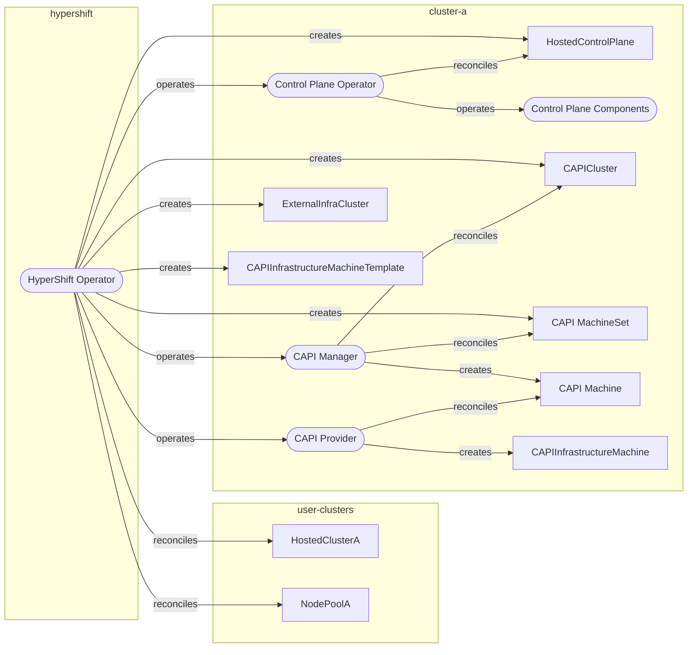
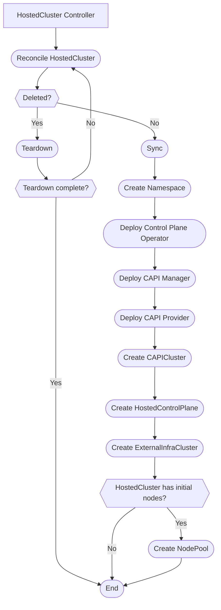
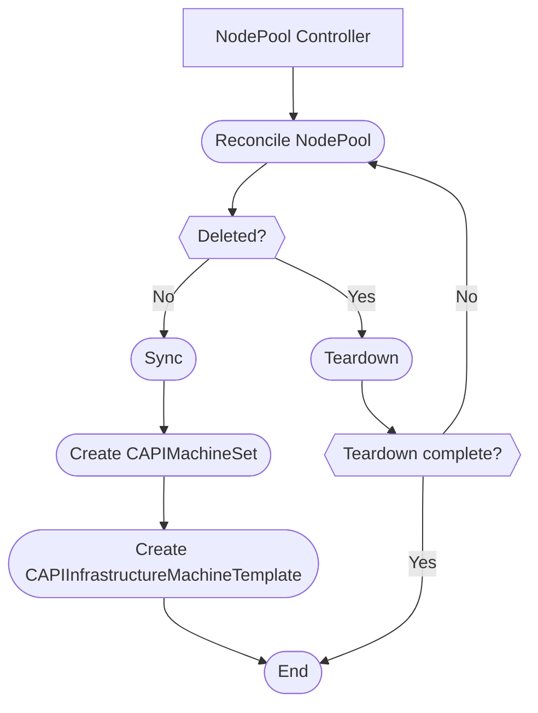
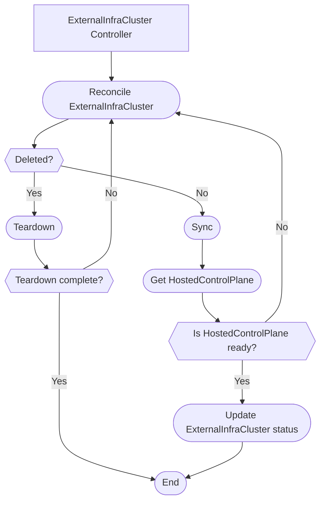
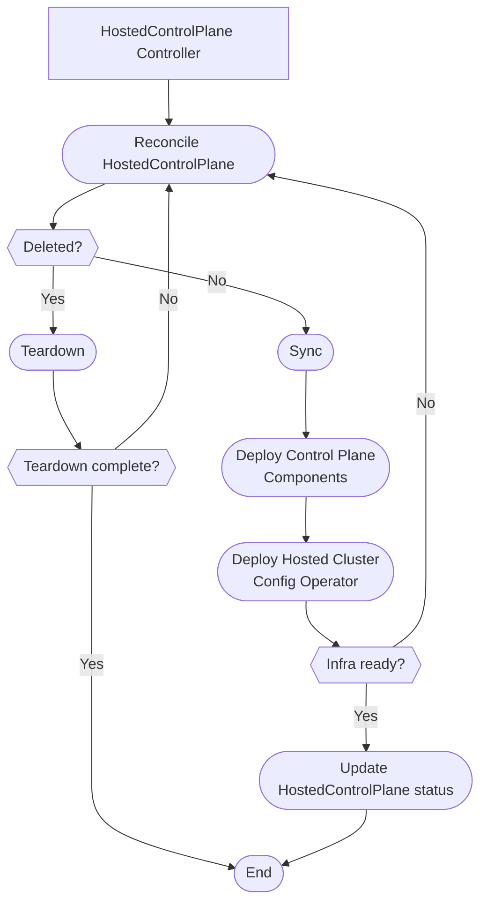
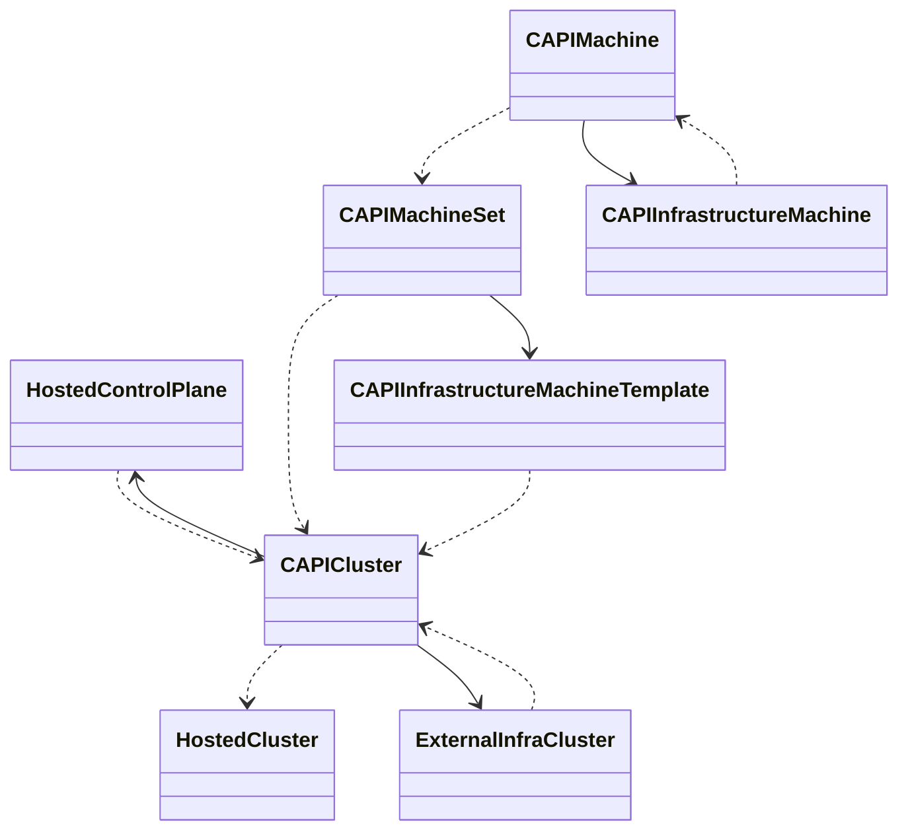
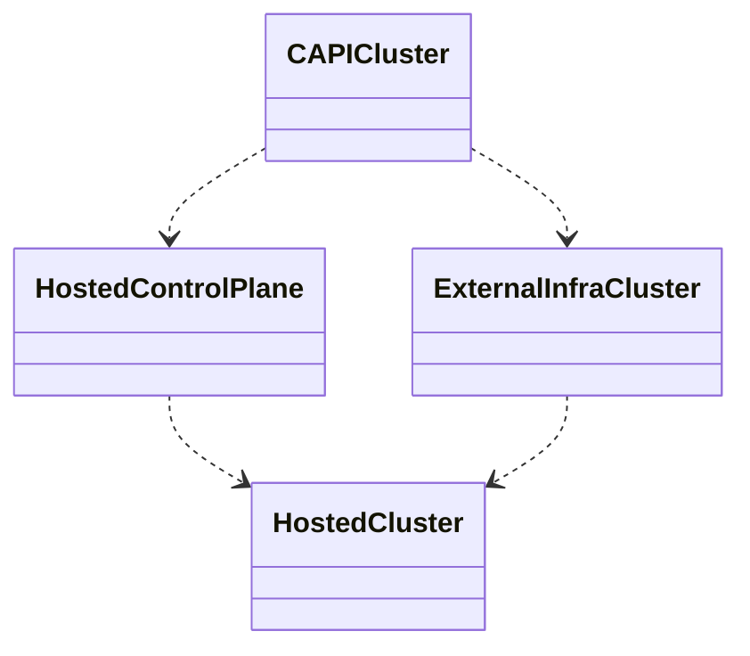
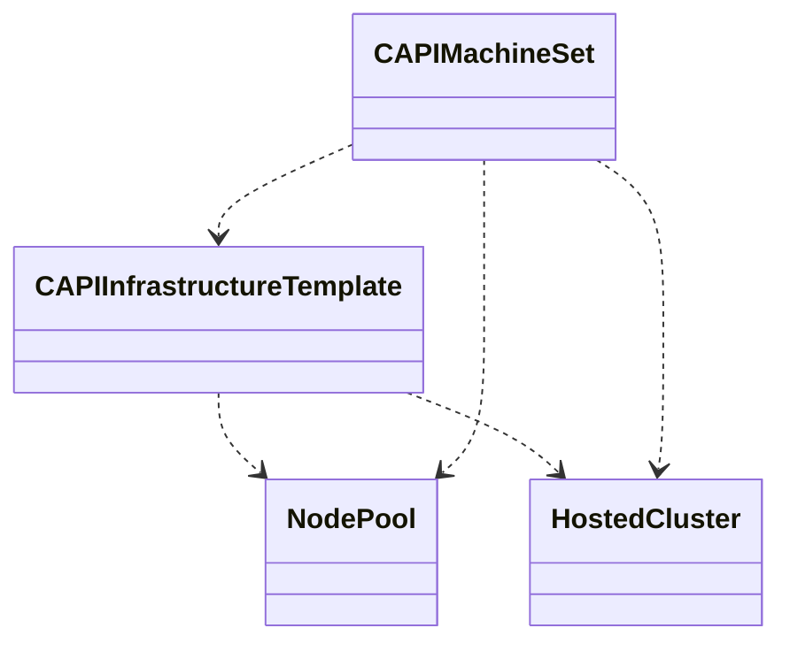

# Controller architecture

## High Level Overview

### Physical layout and operating model

Legend:

- Yellow box: namespace
- Rounded box: processes
- Rectangle: CR instances

TODO:
1. How do we (or should we) represent an input/output or "consumes" relationship (e.g. the hypershift operator creates and syncs machine templates, and the CAPI provider _reads_ the template, but nothing actively watches templates and does work in reaction to them directly)

## Major Components

### HyperShift Operator

The **HyperShift Operator** is a singleton within the management cluster that manages the lifecycle of hosted clusters represented by `HostedCluster` resources.

A single version of the the HyperShift Operator knows how to manage multiple hosted OCP versions.

The HyperShift Operator is responsible for:

- Processing `HostedCluster` and `NodePool` resources and managing Control Plane Operator and [Cluster API (CAPI)](https://github.com/kubernetes-sigs/cluster-api) deployments which do the actual work of installing a control plane.
- Managing the lifecycle of the hosted cluster by handling rollouts of new Control Plane Operator and CAPI deployments based on version changes to `HostedCluster` and `NodePool` resources.
- Aggregating and surfacing information about clusters.

#### HostedCluster Controller

#### NodePool Controller

#### ExternalInfraCluster Controller

### Control Plane Operator

The **Control Plane Operator** is a deployed by the HyperShift Operator into a hosted control plane namespace and manages the rollout of a single version of the the hosted cluster's control plane.

The Control Plane Operator is versioned in lockstep with a specific OCP version and is decoupled from the management cluster's version.

The Control Plane Operator is responsible for:

- Provisioning all the infrastructure required to host a control plane (whether this means creating or adopting existing infrastructure). This infrastructure may be management cluster resources, external cloud provider resources, etc.
- Deploying an OCP control plane configured to run in the context of the provisioned infrastructure.
- Implementing any versioned behavior necessary to rollout the new version (e.g. version specific changes at layers above OCP itself, like configuration or infrastructure changes).

#### HostedControlPlane Controller

### Hosted Cluster Config Operator

The **Hosted Cluster Config Operator** is a control plane component maintained by HyperShift that's a peer to other control plane components (e.g., etcd, apiserver, controller-manager), and is managed by the Control Plane Operator in the same way as those other control plane components.

The Hosted Cluster Config Operator is versioned in lockstep with a specific OCP version and is decoupled from the management cluster's version.

The Hosted Cluster Config Operator is responsible for:

- Reading CAs from the hosted cluster to configure the kube controller manager CA bundle running in the hosted control plane
- Reconciling resources that live on the hosted cluster:
    * CRDs created by operators that are absent from the hosted cluster (RequestCount CRD created by cluster-kube-apiserver-operator)
    * Clearing any user changes to the ClusterVersion resource (all updates should be driven via HostedCluster API)
    * ClusterOperator stubs for control plane components that run outside.
    * Global Configuration that is managed via the HostedCluster API
    * Namespaces that are normally created by operators that are absent from the cluster.
    * RBAC that is normally created by operators that are absent from the cluster.
    * Registry configuration
    * Default ingress controller
    * Control Plane PKI (kubelet serving CA, control plane signer CA)
    * Konnectivity Agent
    * OpenShift APIServer resources (APIServices, Service, Endpoints)
    * OpenShift OAuth APIServer resources (APIServices, Service, Endpoints)
    * Monitoring Configuration (set node selector to non-master nodes)
    * Pull Secret
    * OAuth serving cert CA
    * OAuthClients required by the console
    * Cloud Credential Secrets (contain STS role for components that need cloud access)
    * OLM CatalogSources
    * OLM PackageServer resources (APIService, Service, Endpoints)

## Resource dependency diagram

* Dotted lines are dependencies (ownerRefs)
* Solid lines are associations (e.g. infrastructureRefs or controlPlaneRefs on specs)

## Transformations

Trying to show how certain important resources are derived from others. These are resources created by our operators, not by CAPI.

