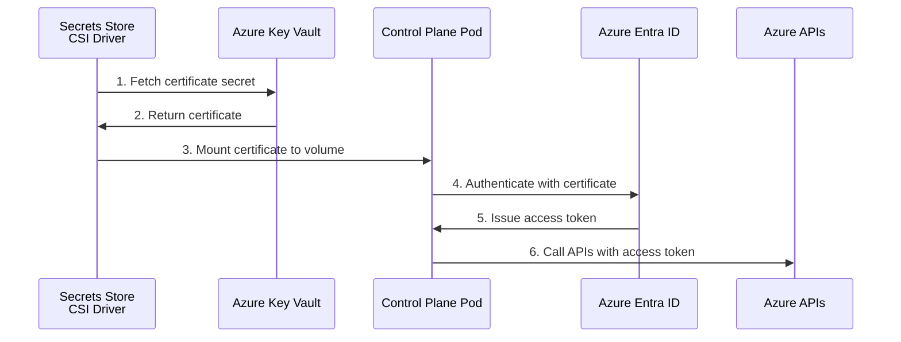
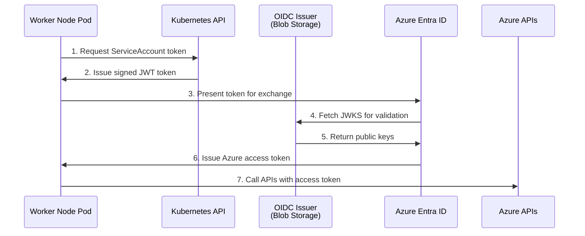

# ARO HCP (Managed Azure) Infrastructure

This section describes the infrastructure requirements for ARO HCP (Azure Red Hat OpenShift Hosted Control Planes) deployments. ARO HCP uses an AKS (Azure Kubernetes Service) management cluster to host OpenShift control planes with Azure worker nodes.

## Overview

ARO HCP deployments consist of:

1. **Management Cluster**: An AKS cluster that hosts the HyperShift operator and control planes
2. **Control Plane**: Kubernetes control plane components running as pods on the AKS management cluster
3. **Data Plane**: Worker nodes running as Azure Virtual Machines in the customer's Azure subscription

The architecture uses Azure Managed Identities with certificate-based authentication for secure communication between OpenShift components and Azure services. Credentials are stored in Azure Key Vault and accessed via the Secrets Store CSI driver.

## Infrastructure Stages

### Pre-required Infrastructure (Unmanaged)

The following infrastructure must exist before creating an ARO HCP HostedCluster:

#### Tool Requirements

| Requirement | Description |
|-------------|-------------|
| Azure CLI | `az` CLI installed and configured |
| OpenShift CLI | `oc` or `kubectl` for cluster management |
| HyperShift CLI | `hypershift` binary for cluster creation |
| `jq` | Command-line JSON processor |
| CCO Tool | Cloud Credential Operator tool for OIDC setup |

#### Azure Subscription Requirements

| Requirement | Description |
|-------------|-------------|
| Azure Subscription | Active subscription with sufficient quota |
| Microsoft Graph Permission | `Application.ReadWrite.OwnedBy` on the service principal |

#### Required Azure Permissions

The service principal creating infrastructure requires:

| Role | Scope | Purpose |
|------|-------|---------|
| `Contributor` | Subscription | Create and manage Azure resources |
| `User Access Administrator` | Subscription | Assign roles to managed identities |

Additionally, Microsoft Graph API permissions are required:

| Permission | Type | Purpose |
|------------|------|---------|
| `Application.ReadWrite.OwnedBy` | Application | Create and manage service principals |

#### Persistent Resource Group

A long-lived resource group for shared resources that persist across multiple HostedClusters:

| Resource | Purpose | Lifecycle |
|----------|---------|-----------|
| Azure Key Vault | Stores service principal certificates | Persistent |
| Service Principals | Control plane component authentication | Persistent |
| OIDC Issuer Storage Account | Hosts OIDC discovery documents | Persistent |
| Data Plane Managed Identities | Data plane component authentication | Persistent |
| Azure DNS Zones | DNS management | Persistent |

!!! warning "One-Time Setup Resources"

    Three categories of resources should be created once and **reused across multiple clusters** to avoid Azure quota limits:

    - Service principals and Key Vault
    - OIDC issuer
    - Data plane identities

#### AKS Management Cluster

An AKS cluster configured with the following requirements:

| Requirement | Configuration |
|-------------|---------------|
| Azure Key Vault Secrets Provider | Enabled for credential mounting |
| OIDC Issuer | Enabled for workload identity |
| Managed Identity | Cluster and kubelet managed identities |
| Autoscaling | Node pool autoscaling enabled |
| Node Pools | Appropriately sized for control plane workloads |

### Control Plane Identities

ARO HCP uses service principals with certificate-based authentication for control plane components. These credentials are stored in Azure Key Vault and mounted into pods via the Secrets Store CSI driver.

| Component | Operator/Controller | Key Vault Secret Name |
|-----------|--------------------|-----------------------|
| **Control Plane Operator** | control-plane-operator | `<name>-cpo` |
| **Node Pool Management** | Cluster API Provider Azure | `<name>-nodepool-mgmt` |
| **Cloud Provider** | Azure Cloud Controller Manager | `<name>-cloud-provider` |
| **Azure Disk CSI** | Azure Disk CSI Driver | `<name>-disk` |
| **Azure File CSI** | Azure File CSI Driver | `<name>-file` |
| **Ingress** | Cluster Ingress Operator | `<name>-ingress` |
| **Network** | Cloud Network Config Controller | `<name>-network` |
| **Image Registry** | Cluster Image Registry Operator | `<name>-image-registry` |

Each control plane identity includes:

- **Client ID**: UUID identifying the service principal
- **Certificate**: X.509 certificate for authentication
- **Object Encoding**: Format of the certificate in Key Vault (utf-8, hex, or base64)

The control plane identities are provided in a JSON file with the following format:

```json
{
  "controlPlane": {
    "managedIdentitiesKeyVault": {
      "name": "<key-vault-name>",
      "tenantID": "<tenant-id>"
    },
    "cloudProvider": {
      "clientID": "<uuid>",
      "credentialsSecretName": "<secret-name>",
      "objectEncoding": "utf-8"
    },
    "nodePoolManagement": { ... },
    "controlPlaneOperator": { ... },
    "imageRegistry": { ... },
    "ingress": { ... },
    "network": { ... },
    "disk": { ... },
    "file": { ... }
  },
  "dataPlane": {
    "imageRegistryMSIClientID": "<uuid>",
    "diskMSIClientID": "<uuid>",
    "fileMSIClientID": "<uuid>"
  }
}
```

### Data Plane Identities

Data plane identities are managed identities with federated credentials for components running on worker nodes:

| Component | Purpose | Azure Role |
|-----------|---------|------------|
| **Image Registry** | Image registry operations from worker nodes | Image Registry Role (`8b32b316-c2f5-4ddf-b05b-83dacd2d08b5`) |
| **Azure Disk CSI** | Disk operations from worker nodes | Azure Disk Role (`5b7237c5-45e1-49d6-bc18-a1f62f400748`) |
| **Azure File CSI** | File operations from worker nodes | Azure File Role (`0d7aedc0-15fd-4a67-a412-efad370c947e`) |

The data plane identities are provided in a JSON file with the following format:

```json
{
  "imageRegistryMSIClientID": "<uuid>",
  "diskMSIClientID": "<uuid>",
  "fileMSIClientID": "<uuid>"
}
```

#### OIDC Issuer

An OIDC issuer is required for data plane workload identity federation:

- Azure Blob Storage account configured as OIDC issuer
- RSA key pair for service account token signing
- Created using the Cloud Credential Operator (CCO) tool

### Infrastructure Created by HyperShift

The `hypershift create cluster azure` command creates the following resources:

#### Resource Groups

| Resource Group | Purpose | Default Naming |
|----------------|---------|----------------|
| Managed RG | Primary cluster infrastructure (VMs, disks, load balancers) | `<name>-<infra-id>` |
| VNet RG | Virtual network resources | `<name>-<infra-id>-vnet` |
| NSG RG | Network security group | `<name>-<infra-id>-nsg` |

#### Networking Resources

| Resource | Configuration | Notes |
|----------|---------------|-------|
| **Virtual Network (VNet)** | Address prefix: `10.0.0.0/16` | Contains the subnet for worker nodes |
| **Subnet** | Address prefix: `10.0.0.0/24` | Named `default`, attached to NSG |
| **Network Security Group (NSG)** | Empty rules by default | Additional rules added by cloud provider as needed |

#### DNS Resources

| Resource | Configuration | Notes |
|----------|---------------|-------|
| **Private DNS Zone** | `<name>-azurecluster.<baseDomain>` | For internal cluster DNS resolution |
| **Private DNS Zone Link** | Location: `global` | Links private zone to VNet, registration disabled |

#### Load Balancer Resources

| Resource | Configuration | Notes |
|----------|---------------|-------|
| **Public IP Address** | SKU: Standard, Static allocation, IPv4 | 4-minute idle timeout |
| **Load Balancer** | SKU: Standard | For guest cluster egress |

The load balancer is configured with:

- **Frontend IP Configuration**: Associated with the public IP
- **Backend Address Pool**: For worker node NICs
- **Health Probe**: HTTP probe on port 30595, path `/healthz`, 5-second interval
- **Outbound Rule**: All protocols, 1024 allocated ports per instance, TCP reset enabled, 4-minute idle timeout

### Infrastructure Managed by Kubernetes

The following resources are created and managed by Kubernetes controllers running in the hosted cluster:

#### Networking

- **Azure Load Balancers**: Created for ingress (default router) and services of type `LoadBalancer`
- **Public IP Addresses**: Allocated for load balancer frontends
- **Security Group Rules**: Added to the NSG for service traffic

#### Storage

- **Azure Disks**: Managed disks for persistent volumes (via Azure Disk CSI driver)
- **Azure File Shares**: File shares for ReadWriteMany persistent volumes (via Azure File CSI driver)
- **Storage Accounts**: Created as needed for Azure File storage

#### Compute

- **Azure Virtual Machines**: Worker nodes managed by Cluster API Provider Azure
- **Network Interfaces**: NICs attached to worker VMs
- **OS Disks**: Managed disks for VM operating systems

## Managed Identity Authentication

ARO HCP uses a two-tier authentication model:

### Control Plane Authentication (Certificate-Based)

Control plane components authenticate using service principal certificates stored in Azure Key Vault:



The Key Vault integration uses:

- **SecretProviderClass**: Defines which secrets to mount from Key Vault
- **CSI Volume**: Mounts secrets into pod filesystem at `/etc/kubernetes/azure/`
- **Managed Identity**: AKS cluster identity authorized to read from Key Vault

### Data Plane Authentication (Federated Identity)

Data plane components use federated managed identities similar to self-managed Azure:



## Resource Group Strategy

ARO HCP deployments use multiple resource groups with different lifecycles:

### Persistent Resources (Reused Across Clusters)

```
Persistent Resource Group (e.g., os4-common)
├── Azure Key Vault
│   └── Service Principal Certificates
├── OIDC Issuer Storage Account
├── Data Plane Managed Identities
│   ├── Image Registry Identity
│   ├── Disk CSI Identity
│   └── File CSI Identity
└── DNS Zones
```

### AKS Management Cluster Resources

```
AKS Resource Group
├── AKS Cluster
├── Node Pools
├── Cluster Managed Identity
└── Kubelet Managed Identity
```

### Cluster-Specific Resources (Created/Deleted Per Cluster)

By default, HyperShift creates separate resource groups for different resource types. However, all resources can be placed in a single managed resource group if preferred.

**Default (Separate Resource Groups):**

```
Managed Resource Group (<name>-<infra-id>)
├── Virtual Machines (worker nodes)
├── Managed Disks (OS and data disks)
├── Network Interfaces
└── Load Balancers (ingress, services)

VNet Resource Group (<name>-<infra-id>-vnet)
├── Virtual Network
├── Subnet
├── Private DNS Zone
└── Private DNS Zone Link

NSG Resource Group (<name>-<infra-id>-nsg)
└── Network Security Group
```

**Single Resource Group (Alternative):**

You can use an existing VNet and NSG from the same resource group, which places all cluster resources in a single resource group.

## Related Documentation

- [Create an Azure Hosted Cluster on AKS](../../how-to/azure/create-azure-cluster-on-aks.md) - Step-by-step setup guide
- [Azure Hosted Cluster with Options](../../how-to/azure/create-azure-cluster-with-options.md) - Advanced configuration options
- [Self-Managed Azure Infrastructure](azure-self-managed.md) - Alternative deployment model
