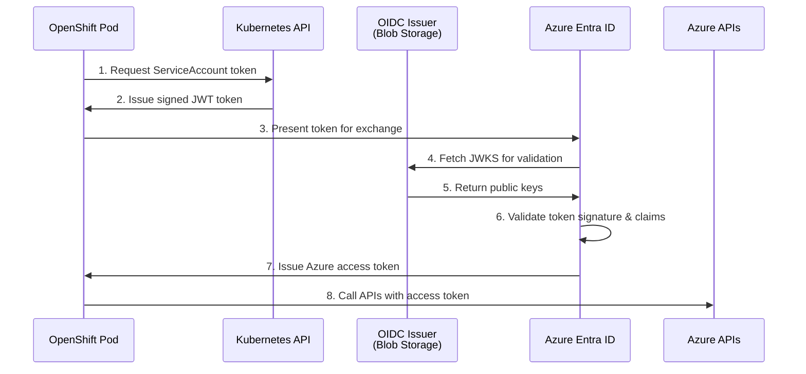

# Self-Managed Azure Infrastructure

This section describes the infrastructure requirements for self-managed Azure HyperShift deployments. Self-managed Azure allows you to deploy hosted clusters with Azure worker nodes using an OpenShift management cluster that you provision and manage.

!!! note "Developer Preview in OCP 4.21"

    Self-managed Azure HostedClusters are available as a Developer Preview feature in OpenShift Container Platform 4.21.

## Overview

Self-managed Azure HyperShift deployments consist of:

1. **Management Cluster**: An OpenShift cluster (can run on any platform - AWS, Azure, bare metal, etc.) that hosts the HyperShift operator and control planes
2. **Control Plane**: Kubernetes control plane components running as pods on the management cluster
3. **Data Plane**: Worker nodes running as Azure Virtual Machines in your Azure subscription

The architecture uses [Azure Workload Identity](https://azure.github.io/azure-workload-identity/docs/) for secure, credential-free authentication between OpenShift components and Azure services.

## Infrastructure Stages

### Pre-required Infrastructure (Unmanaged)

The following infrastructure must exist before creating a self-managed Azure HostedCluster:

#### Management Cluster Requirements

| Requirement | Description |
|-------------|-------------|
| OpenShift Cluster | Version 4.17+ with HyperShift operator installed. Can run on any platform (AWS, Azure, bare metal, etc.) |
| OpenShift CLI | `oc` or `kubectl` for cluster management |
| HyperShift CLI | `hypershift` binary for cluster creation |
| Pull Secret | Valid OpenShift pull secret |

#### Azure Subscription Requirements

| Requirement | Description |
|-------------|-------------|
| Azure Subscription | Active subscription with sufficient quota |
| Azure CLI | `az` CLI installed and configured |
| `jq` | Command-line JSON processor |
| CCO Tool | [Cloud Credential Operator CLI](https://github.com/openshift/cloud-credential-operator/blob/master/docs/ccoctl.md#azure) for OIDC setup |

#### Required Azure Permissions

The service principal or user creating infrastructure requires:

| Role | Scope | Purpose |
|------|-------|---------|
| `Contributor` | Subscription | Create and manage Azure resources |
| `User Access Administrator` | Subscription | Assign roles to managed identities |

#### Persistent Resource Group (Optional)

A persistent resource group is not required, but is recommended for shared resources that can be reused across multiple HostedClusters:

| Resource | Purpose | Lifecycle |
|----------|---------|-----------|
| OIDC Issuer Storage Account | Hosts OIDC discovery documents and JWKS | Can be reused |
| Workload Identities | Managed identities with federated credentials | Can be reused |
| Azure DNS Zones | Parent DNS zone for External DNS (optional) | Can be reused |

!!! tip "Resource Reuse"

    While you can create these resources per-cluster, placing workload identities and OIDC issuer in a persistent resource group allows you to reuse them across multiple hosted clusters. This reduces setup time, avoids unnecessary resource recreation, and helps stay within Azure quota limits.

#### OIDC Issuer

An OIDC issuer is required for workload identity federation. This is an Azure Blob Storage account configured to host:

- OIDC discovery document (`.well-known/openid-configuration`)
- JSON Web Key Set (JWKS) for token validation
- RSA key pair for service account token signing

The OIDC issuer is created using the Cloud Credential Operator (CCO) tool:

```bash
ccoctl azure create-oidc-issuer \
  --name=<name> \
  --region=<azure-region> \
  --subscription-id=<subscription-id> \
  --resource-group-name=<persistent-rg> \
  --storage-account-name=<oidc-storage-account> \
  --output-dir=<output-directory>
```

### Workload Identities

Self-managed Azure requires 7 managed identities with federated credentials for OpenShift components:

| Identity | Operator | Service Accounts | Azure Role |
|----------|----------|------------------|------------|
| **Disk** | Azure Disk CSI Driver | `azure-disk-csi-driver-node-sa`, `azure-disk-csi-driver-operator`, `azure-disk-csi-driver-controller-sa` | Azure Disk Role (`5b7237c5-45e1-49d6-bc18-a1f62f400748`) |
| **File** | Azure File CSI Driver | `azure-file-csi-driver-node-sa`, `azure-file-csi-driver-operator`, `azure-file-csi-driver-controller-sa` | Azure File Role (`0d7aedc0-15fd-4a67-a412-efad370c947e`) |
| **Image Registry** | Cluster Image Registry Operator | `registry`, `cluster-image-registry-operator` | Image Registry Role (`8b32b316-c2f5-4ddf-b05b-83dacd2d08b5`) |
| **Ingress** | Cluster Ingress Operator | `ingress-operator` | Ingress Role (`0336e1d3-7a87-462b-b6db-342b63f7802c`) |
| **Cloud Provider** | Azure Cloud Provider | `azure-cloud-provider` | Cloud Provider Role (`a1f96423-95ce-4224-ab27-4e3dc72facd4`) |
| **Node Pool Management** | Cluster API Provider Azure | `capi-provider` | Contributor (`b24988ac-6180-42a0-ab88-20f7382dd24c`) |
| **Network** | Cloud Network Config Controller | `cloud-network-config-controller` | Network Role (`be7a6435-15ae-4171-8f30-4a343eff9e8f`) |

Each identity is configured with:

- **Federated Identity Credentials**: Trust relationship between Azure Entra ID and OpenShift service accounts
- **Audience**: `openshift`
- **Issuer**: Your OIDC issuer URL

#### Role Assignment Scopes

Identities receive role assignments across multiple resource groups depending on their function:

| Identity | Managed RG | VNet RG | NSG RG | DNS Zone RG |
|----------|------------|---------|--------|-------------|
| Cloud Provider | Yes | Yes | Yes | No |
| Ingress | No | Yes | No | Yes |
| Azure File | Yes | Yes | Yes | No |
| Azure Disk | Yes | No | No | No |
| Network (CNCC) | Yes | Yes | No | No |
| Image Registry | Yes | No | No | No |
| Node Pool Management | Yes | Yes | No | No |

### Infrastructure Created by HyperShift

The `hypershift create cluster azure` command (or `hypershift create infra azure`) creates the following resources:

#### Resource Groups

| Resource Group | Purpose | Default Naming |
|----------------|---------|----------------|
| Managed RG | Primary cluster infrastructure (VMs, disks, load balancers) | `<name>-<infra-id>` |
| VNet RG | Virtual network resources | `<name>-<infra-id>-vnet` |
| NSG RG | Network security group | `<name>-<infra-id>-nsg` |

#### Networking Resources

| Resource | Configuration | Notes |
|----------|---------------|-------|
| **Virtual Network (VNet)** | Address prefix: `10.0.0.0/16` | Contains the subnet for worker nodes |
| **Subnet** | Address prefix: `10.0.0.0/24` | Named `default`, attached to NSG |
| **Network Security Group (NSG)** | Empty rules by default | Additional rules added by cloud provider as needed |

#### DNS Resources

| Resource | Configuration | Notes |
|----------|---------------|-------|
| **Private DNS Zone** | `<name>-azurecluster.<baseDomain>` | For internal cluster DNS resolution |
| **Private DNS Zone Link** | Location: `global` | Links private zone to VNet, registration disabled |

#### Load Balancer Resources

| Resource | Configuration | Notes |
|----------|---------------|-------|
| **Public IP Address** | SKU: Standard, Static allocation, IPv4 | 4-minute idle timeout |
| **Load Balancer** | SKU: Standard | For guest cluster egress |

The load balancer is configured with:

- **Frontend IP Configuration**: Associated with the public IP
- **Backend Address Pool**: For worker node NICs
- **Health Probe**: HTTP probe on port 30595, path `/healthz`, 5-second interval
- **Outbound Rule**: All protocols, 1024 allocated ports per instance, TCP reset enabled, 4-minute idle timeout

### Infrastructure Managed by Kubernetes

The following resources are created and managed by Kubernetes controllers running in the hosted cluster:

#### Networking

- **Azure Load Balancers**: Created for ingress (default router) and services of type `LoadBalancer`
- **Public IP Addresses**: Allocated for load balancer frontends
- **Security Group Rules**: Added to the NSG for service traffic

#### Storage

- **Azure Disks**: Managed disks for persistent volumes (via Azure Disk CSI driver)
- **Azure File Shares**: File shares for ReadWriteMany persistent volumes (via Azure File CSI driver)
- **Storage Accounts**: Created as needed for Azure File storage

#### Compute

- **Azure Virtual Machines**: Worker nodes managed by Cluster API Provider Azure
- **Network Interfaces**: NICs attached to worker VMs
- **OS Disks**: Managed disks for VM operating systems

## Workload Identity Authentication

Self-managed Azure uses workload identity federation for secure authentication. This eliminates long-lived credentials and follows Azure's modern authentication best practices.

### Authentication Flow



### Federated Credential Configuration

Each managed identity has one or more federated identity credentials configured:

```json
{
  "issuer": "https://<storage-account>.blob.core.windows.net/<container>",
  "subject": "system:serviceaccount:<namespace>:<service-account>",
  "audiences": ["openshift"]
}
```

## Resource Group Strategy

Self-managed Azure deployments use multiple resource groups with different lifecycles:

### Persistent Resources (Reused Across Clusters)

```
Persistent Resource Group (e.g., os4-common)
├── OIDC Issuer Storage Account
├── Workload Identities (7 managed identities)
├── Federated Identity Credentials
└── DNS Zones (optional, for External DNS)
```

### Cluster-Specific Resources (Created/Deleted Per Cluster)

By default, HyperShift creates separate resource groups for different resource types. However, all resources can be placed in a single managed resource group if preferred.

**Default (Separate Resource Groups):**

```
Managed Resource Group (<name>-<infra-id>)
├── Virtual Machines (worker nodes)
├── Managed Disks (OS and data disks)
├── Network Interfaces
└── Load Balancers (ingress, services)

VNet Resource Group (<name>-<infra-id>-vnet)
├── Virtual Network
├── Subnet
├── Private DNS Zone
└── Private DNS Zone Link

NSG Resource Group (<name>-<infra-id>-nsg)
└── Network Security Group
```

**Single Resource Group (Alternative):**

You can use an existing VNet and NSG from the same resource group, which places all cluster resources in a single resource group.

## Related Documentation

- [Azure Workload Identity Setup](../../how-to/azure/azure-workload-identity-setup.md) - Set up managed identities and OIDC federation
- [Setup Azure Management Cluster for HyperShift](../../how-to/azure/setup-management-cluster.md) - Install HyperShift operator
- [Create a Self-Managed Azure HostedCluster](../../how-to/azure/create-self-managed-azure-cluster.md) - Deploy your first hosted cluster
- [Self-Managed Azure Overview](../../how-to/azure/self-managed-azure-index.md) - Comprehensive overview
