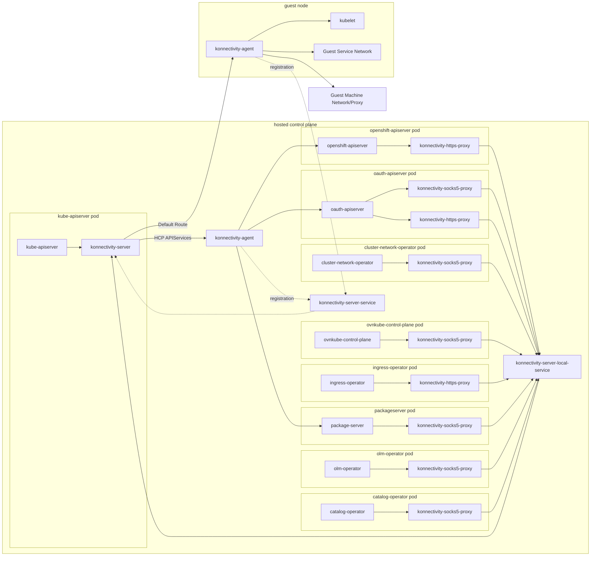

# Konnectivity in HyperShift

## What is Konnectivity?

The Konnectivity proxy, also known as apiserver-network-proxy, is a
component in Kubernetes that facilitates secure network communication
between the Kubernetes API server and cluster nodes. It allows the
Kubernetes API server to initiate communication to worker nodes or
kubernetes services running in the data plane.

Upstream References:

- [Setup Konnectivity](https://kubernetes.io/docs/tasks/extend-kubernetes/setup-konnectivity/)
- [Proposal](https://github.com/kubernetes/enhancements/tree/37ab8448371a38a1d7f0fd2a12ad327215e7d138/keps/sig-api-machinery/1281-network-proxy#proposal)
- [Reference Implementation](https://github.com/kubernetes-sigs/apiserver-network-proxy)

## Reference Network Diagram



## Why is it needed?

The Kubernetes API server needs to initiate requests to the kubelet
running in worker nodes in order to:

- Obtain logs of running pods.
- Execute into running pods.
- Port forward ports of pods or services.

In addition, the Kubernetes APIServer needs to access services running
in the data plane when those services are configured as either
aggregated API services (via `APIService` resource) or webhooks (via
`ValidatingWebhookConfiguration` or `MutatingWebhookConfiguration`
resources).

In a hosted control plane architecture, the Kubernetes API server may
not have direct network access to worker nodes. For example, in AWS, the
control plane runs in the provider VPC, while customer worker nodes run
in the customer's VPC. The worker nodes are not exposed externally.
Therefore communication initiated from the Kubernetes API server must
rely on a tunnel established by Konnectivity to enable this
communication.

In addition to the communication initiated by the Kubernetes API server,
in HyperShift hosted clusters, konnectivity is used via a socks or https
proxy (added as a sidecar) by the following components:

- **OpenShift APIServer**
    - Communicates with webhook services for resources served by the OpenShift APIServer
    - Routes ImageStream connection to remote registries through the data plane.

- **Ingress Operator**
    - Uses konnectivity for route health checks (routes in data plane are not necessarily accessible from the control plane)

- **OAuth Server**
    - Enables communication with identity providers that potentially are only available to the data plane network.

- **Cluster Network Operator**
    - Performs proxy readiness requests through the data plane network

- **OVNKube Control Plane**
    - Used to enable OVN interconnect for hosted clusters

- **OLM Operator**
    - Used for GRPC communication with in-cluster catalogs

- **OLM Catalog Operator**
    - Used for GRPC communication with in-cluster catalogs

- **OLM Package Server**
    - Used for GRPC communication with in-cluster catalogs

Konnectivity is **not** needed for traffic initiated from worker nodes
to the Kubernetes API server.

## How does Konnectivity work?

Konnectivity has 2 main components:

- **Konnectivity server** - accepts requests from the Kube APIServer (or
  other proxy clients) and routes them through an agent in the data
  plane. It also accepts connections from agents in the data plane to
  establish a tunnel.

- **Konnectivity agent(s)** - run as pods on the worker nodes and
  establish a connection with the Konnectivity server so that they can
  route traffic initiated by the Kube APIServer to the appropriate
  destination in the data plane.

Konnectivity agents are deployed to the data plane as a Daemonset that
runs in every worker node. When those agents first start up, they
establish a connection to the konnectivity server(s) (this means that
the control plane must be accessible to the worker nodes). The
established connection can then be used by the konnectivity server to
tunnel requests initiated by the Kubernetes API server.

In HyperShift, the Konnectivity server runs as a sidecar (container
`konnectivity-server`) of the Kubernetes API Server. This means that
when the control plane runs in HA mode, there are 3 instances of the
Konnectivity server in the control plane.

Konnectivity agents run as the `konnectivity-agent` Daemonset in the
`kube-system` namespace of the hosted cluster.

The konnectivity server exposes 2 endpoints:

- **server endpoint** - Exposed to clients of the tunnel such
  as the Kubernetes API server, proxies running in OpenShift API
  server, OAuth server, etc.
  In a HyperShift control plane namespace, this is exposed via the
  `konnectivity-server-local` service (port 8090).

- **cluster endpoint** - Exposed to agents that establish a connection
  to the Konnectivity server. In a HyperShift control plane namespace,
  this is exposed via the `konnectivity-server` service (port 8091) and
  externally via Route or NodePort.

## Konnectivity Artifacts in HyperShift

HyperShift requires konnectivity artifacts in both the control plane
namespace as well as the hosted cluster.

### In the Control Plane Namespace

#### Deployments

-   **kube-apiserver** - Runs the konnectivity-server container as a
    sidecar.

-   **konnectivity-agent** - Runs an agent for konnectivity on the control
    plane side (See Control Plane API services for more information)

#### ConfigMaps

-   **kas-egress-selector-config** - Contains the configuration that tells
    the Kubernetes API server how and when to use konnectivity. We only
    configure konnectivity for cluster connections. This means that the
    Kubernetes API server will route any connection to a service or a
    kubelet through the konnectivity server.

-   **konnectivity-ca-bundle** - Contains the self-signed CA bundle used to
    verify connections to the Konnectivity server.

#### Secrets

-   **konnectivity-signer** - Contains the self-signed CA for the
    konnectivity server

-   **konnectivity-server** - Contains the serving certificate for the
    konnectivity server endpoint (where Kube APIServer and socks5/http
    proxies connect)

-   **konnectivity-cluster** - Contains the serving certificate for the
    konnectivity cluster endpoint (where konnectivity agents connect)

-   **konnectivity-client** - Contains certificate and key to be used by
    server clients (Kube APIServer and socks5/http proxies) to
    authenticate with the konnectivity server.

-   **konnectivity-agent** - Contains certificate and key to be used by
    agents to authenticate with the konnectivity server.

#### Services

-   **konnectivity-server** - Exposes the cluster endpoint of the
    konnectivity server. This is the service that agents use to connect
    to the konnectivity server. It must be exposed externally so that
    workers can reach it.

-   **konnectivity-server-local** - The endpoint where clients connect to
    the konnectivity server to send traffic to the data plane. This
    endpoint is only exposed to control plane components and is
    protected via network policy from access by components outside of
    its own control plane namespace.

#### Routes

-   **konnectivity-server** - Exposes the konnectivity-server service
    externally so that agents can connect to it.

### In the Hosted Cluster

#### Daemonsets

-   **konnectivity-agent** (`kube-system` namespace) - Runs a pod in every
    node that establishes a connection that allows clients in the
    control plane namespace to communicate through it.

#### ConfigMaps

-   **konnectivity-ca-bundle** (`kube-system` namespace) - Contains trust
    bundle that agents use to verify connections to the konnectivity
    server.

#### Secrets

-   **konnectivity-agent** (`kube-system` namespace) - Contains certificate
    and key used by agents to authenticate with the konnectivity server.

## Konnectivity Proxies in HyperShift

The HyperShift code base contains 2 proxy commands that make use of the
konnectivity tunnel to send traffic to the data plane. These are usually
run in sidecar containers in the deployments of components that need to
send their traffic through konnectivity.

-   **konnectivity-socks5-proxy** - Starts a socks5 proxy that allows TCP
    connections to endpoints accessible from the data plane. Cannot
    route traffic through customer-supplied HTTP/S proxy. Use cases for
    this are:

    -   Traffic only destined for the data plane without the need to
        traverse a customer-supplied proxy.

    -   Traffic that is not HTTP/S. For example GRPC traffic to OLM
        catalogs, or LDAP traffic to LDAP identity providers.

-   **konnectivity-https-proxy** - Starts a HTTP proxy that can send HTTP/S
    traffic to endpoints accessible from the data plane. Can make use of
    customer-supplied HTTP/S proxy to route traffic through that. Use
    cases for this are:

    -   Traffic that can be sent through the data plane but must reach
        external endpoints and must honor customer-supplied HTTP/S proxy
        configuration. For example, openshift-apiserver traffic to
        external registries to import ImageStreams or OAuth server
        traffic to non-LDAP identity providers that rely on HTTP/S
        protocol.

To summarize, there are 2 main use cases for these proxies:

-   Routing of traffic from the control plane with destination inside
    the data plane: This is the case for services such as webhooks and
    aggregated API servers that run in the data plane, as well as OLM
    catalogs, or network checks. For this use case, customer-configured
    HTTP/S proxies are not relevant, because traffic is only needed to
    reach inside the data plane. The socks5 proxy is adequate for this.

-   Routing of traffic from the control plane to destinations outside
    the data plane but potentially only accessible from the data plane.
    This is the case for ImageStream registries, and external identity
    providers. For this use case, customer-configured HTTP/S proxy
    configuration should be taken into consideration because traffic may
    only be able to leave the data plane through those proxies. For this
    use case, the HTTP proxy is needed.

## Konnectivity and Control Plane Aggregated API Servers

For OpenShift clusters, servers such as openshift-apiserver,
openshift-oauth-apiserver, and OLM packageserver are aggregated API
servers that handle essential OpenShift resources such as ImageStreams,
Users, and Groups.

Because we consider these servers part of the control plane, they run in
the control plane namespace along with the Kubernetes API server. They
are configured via APIService resources which tell the Kubernetes API
server how to reach them to serve up their resources. APIServices have
the limitation of only allowing a Kubernetes Service to be configured as
the endpoint of the APIService. This means that a Service resource must
exist in the data plane for every APIService we want to configure for
the HostedCluster. This Service in the data plane needs to send traffic
to the components in the control plane.

The way this is accomplished is that a Service without pod selector is
created in the default namespace. Then a corresponding Endpoints
resource is created in the same namespace that contains the IP of the
service in the control plane namespace. Whenever the Kubernetes API
Server wants to reach the aggregated API server, it ends up sending
traffic to the service in the control plane.

One problem with the way Konnectivity is configured is that when you
configure the egress selector for the cluster to be proxied through
Konnectivity, then all the traffic destined for services is sent through
Konnectivity. For these services that live in the control plane
namespace, the Konnectivity server needs to know to send traffic to the
control plane and not the data plane.

The way that the Konnectivity server can send traffic to the control
plane and not the data plane, is that we run a Konnectivity agent pod in
the control plane. This agent is configured with the --agent-identifiers
flag to only route traffic destined for the control plane aggregated
API services. This means that only traffic that is destined for those
services will be routed to the control plane through the Konnectivity agent.

## Troubleshooting Konnectivity in HyperShift clusters

### Checking whether Konnectivity is functional

To determine whether Konnectivity is functional for a particular hosted
cluster an easy test is to get the logs of a pod running in the hosted
cluster. If that works, then traffic is getting routed from the
Kubernetes API server to the kubelet running in the nodes.

### Testing the Konnectivity server with curl

It is possible to use curl to send traffic through the konnectivity
server to a node. The konnectivity server acts like a regular proxy,
however it requires authentication via client certificate/key. Curl
allows specifying a proxy CA, certificate and key (`--proxy-cacert`,
`--proxy-cert`, `--proxy-key`) in addition to the certs used for the final
endpoint. The following script shows how the appropriate certificates
can be extracted and used to make a request to the kubelet running in a
worker node. The konnectivity server is made available locally via the
port-forward command. NOTE: The konnectivity server does not resolve
names, so it can only be tested with IP addresses.

```sh
#!/bin/bash

set -euo pipefail

workdir="$(mktemp -d)"
cp_namespace="CONTROL_PLANE_NAMESPACE_HERE"

echo "work directory is: ${workdir}"

# Get the cert/CA required to use the konnectivity server as a proxy
oc get secret konnectivity-client -n ${cp_namespace} -o jsonpath='{ .data.tls\.key }' | base64 -d > "${workdir}/client.key"
oc get secret konnectivity-client -n ${cp_namespace} -o jsonpath='{ .data.tls\.crt }' | base64 -d > "${workdir}/client.crt"
oc get cm konnectivity-ca-bundle -n ${cp_namespace} -o jsonpath='{ .data.ca\.crt }' > "${workdir}/konnectivity_ca.crt"

# Get the cert/CA required to access the kubelet endpoint
oc get cm kubelet-client-ca -n ${cp_namespace} -o jsonpath='{ .data.ca\.crt }' > ${workdir}/kubelet_ca.crt
oc get secret kas-kubelet-client-crt -n ${cp_namespace} -o jsonpath='{ .data.tls\.crt }' | base64 -d > ${workdir}/kubelet_client.crt
oc get secret kas-kubelet-client-crt -n ${cp_namespace} -o jsonpath='{ .data.tls\.key }' | base64 -d > ${workdir}/kubelet_client.key

# Obtain a node IP from local machines
nodeip="$(oc get machines -n ${cp_namespace} -o json | jq -r '.items[0].status.addresses[] | select(.type=="InternalIP") | .address')"

# Forward the konnectivity server endpoint to the local machine
oc port-forward -n ${cp_namespace} svc/konnectivity-server-local 8090:8090 &

# Allow some time for the port-forwarding to start
sleep 2

# Perform the curl command with the localhost konnectivity endpoint
curl -x "https://127.0.0.1:8090" \
  --proxy-cacert ${workdir}/konnectivity_ca.crt \
  --proxy-cert ${workdir}/client.crt \
  --proxy-key ${workdir}/client.key \
  --cacert ${workdir}/kubelet_ca.crt \
  --cert ${workdir}/kubelet_client.crt \
  --key ${workdir}/kubelet_client.key \
  "https://${nodeip}:10250/metrics"

# Kill the port-forward job
kill %1
```

## Konnectivity Q&A

**Upstream allows grpc or http-connect mode for the konnectivity protocol, why does HyperShift use http-connect?**
We need to use http-connect to allow clients other than the Kubernetes
API server to send traffic through the konnectivity server. The socks5
and http proxies can use http-connect to establish a connection through
konnectivity-server.

**Upstream allows connecting to the konnectivity server via unix domain socket or via tcp port. Why does HyperShift use tcp port?**
The konnectivity server only allows one way of serving (via UDS or TCP
port). We need to use a TCP port so we can expose it as a service to
clients that use the socks5 and http proxies.

**Why does Konnectivity server run as a sidecar of the Kubernetes API server and not in its own deployment?**
When running as a sidecar, the Kubernetes API server can communicate
with the Konnectivity server very fast, since traffic happens over the
loopback interface. It also allows the Kubernetes API server to
communicate with a konnectivity-server as soon as it comes up.

**How is the Konnectivity server secured in HyperShift?**
We use mTLS to authenticate connections to Konnectivity either from
clients like Kubernetes API server or from agents. The certificates used
for authentication are in the konnectivity-client and konnectivity-agent
secrets in the control plane.

**How does Konnectivity HA work?**
When a HyperShift control plane runs in HA mode, there are by default 3
replicas of the konnectivity server (1 sidecar per kube-apiserver pod).
Each server generates an ID when starting up and the number of total
servers is passed as a command line argument. When an agent dials the
konnectivity server endpoint, the server's response includes its own ID
and the total number of servers that the agent can expect. If greater
than one, the agent keeps dialing the konnectivity server endpoint until
it can establish connections with the same number of unique servers
(identified by their unique id).

**What breaks if Konnectivity is not working?**
The first thing that breaks when Konnectivity is not working is any
operation that requires that the Kubernetes API server access kubelets
on nodes. This includes getting logs from pods, proxying to
pods/services, port-forwarding and remote execution. The next thing that
breaks is any aggregated API servers and webhooks that use data plane
services.
