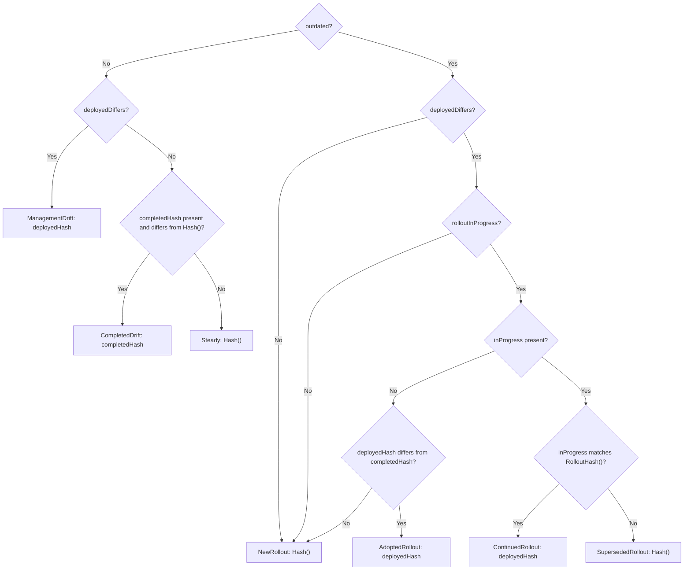

# NodePool Rollout State Machine

This document describes the secret-maintenance state machine that controls which token and user-data secrets `Token.Reconcile()` maintains on each reconcile cycle. The state machine ensures that management-side configuration changes (such as HAProxy image bumps) do not trigger unnecessary node replacements, while spec-driven changes (user MachineConfig edits, version upgrades) still produce rollouts.

For a higher-level overview of what triggers rollouts and how they execute, see [NodePool Rollouts](nodepool-rollouts.md).

## Dual-Hash System

The NodePool controller computes two families of configuration hashes:

| Hash | Includes | Purpose |
|------|----------|---------|
| `Hash()` | All config inputs: MCO config, HAProxy config, proxy (with platform defaults), pull secret, trust bundle, release version, RHEL stream | Names the token and user-data secrets. Uniquely identifies a full payload. |
| `HashWithoutVersion()` | Same as `Hash()` minus the release version and global configuration | Legacy config-only comparison. |
| `RolloutHash()` | Spec-driven inputs only: MCO config (without HAProxy), proxy (user-set fields only), pull secret, trust bundle, release version, RHEL stream, endpoint config | Determines whether a node-replacing rollout is needed. |
| `RolloutHashWithoutVersion()` | Same as `RolloutHash()` minus the release version | Detects config-only changes independently from version changes. |

The key insight is that `Hash()` can change when only management-side content changes (e.g., an operator upgrade bumps the HAProxy image digest). In that case, `RolloutHash()` stays the same, and no rollout should occur. But the secrets are named using `Hash()`, so the controller must decide which hash to use when maintaining secrets.

### What Is Excluded from the Rollout Hash

The rollout hash excludes content that changes due to operator upgrades rather than user intent:

- **HAProxy image digest** — can change on an operator release without changing node connectivity.
- **Platform-computed proxy defaults** — `NoProxy` CIDRs and metadata endpoints are derived by operator code; changes to that code should not roll nodes.

Connectivity-affecting HAProxy inputs (endpoint access mode, API server address/port) are captured in a separate `endpointConfig` field that **is** included in the rollout hash.

!!! note
    If a future change needs to include a new piece of HAProxy configuration in rollout decisions, it should be added to `endpointConfig` or a new rollout-hash input, gated behind a hash version bump (see PR #9007).

## Annotations

Four annotations on the NodePool track the rollout lifecycle:

| Annotation | Key | Set by | Cleared by |
|------------|-----|--------|------------|
| **Current Config** | `hypershift.openshift.io/nodePoolCurrentConfig` | `reconcileMachineDeploymentStatus` / `reconcileMachineSetStatus` on rollout completion | Never (overwritten) |
| **Current Config Version** | `hypershift.openshift.io/nodePoolCurrentConfigVersion` | Same as above; records the full `Hash()` of the completed payload | Never (overwritten) |
| **Current Rollout Config** | `hypershift.openshift.io/nodePoolCurrentRolloutConfig` | `seedRolloutAnnotation` on first reconcile; status reconciliation on completion | Never (overwritten) |
| **In-Progress Rollout Config** | `hypershift.openshift.io/nodePoolInProgressRolloutConfig` | `propagateVersionAndTemplate` when a change is propagated to the CAPI workload | Status reconciliation on rollout completion (`delete`) |

### Annotation Lifecycle

```
 New NodePool                 Operator Upgrade              Spec Change              Completion
 ──────────                   ────────────────              ───────────              ──────────
 currentConfig:       ──      currentConfig:       H1_cfg   currentConfig:  H1_cfg   currentConfig:  H2_cfg
 currentConfigVer:    ──      currentConfigVer:    H1       currentConfigVer: H1     currentConfigVer: H2
 currentRolloutCfg:   ──  →   currentRolloutCfg:   R1   →   currentRolloutCfg: R1 →  currentRolloutCfg: R2
 inProgressRollout:   ──      inProgressRollout:   ──       inProgressRollout: R2    inProgressRollout: (deleted)
```

- On a **new NodePool**, no annotations exist. `isOutdated()` returns true and secrets are created. The rollout baseline is seeded during reconciliation; propagation records the in-progress target, and completion records the completed hashes and clears the in-progress annotation.
- On **operator upgrade**, `seedRolloutAnnotation` writes `currentRolloutConfig` if absent. The completed config version is left to status reconciliation.
- On a **spec-driven change**, `propagateVersionAndTemplate` writes `inProgressRolloutConfig` when it updates the CAPI workload.
- On **completion**, status reconciliation updates all config annotations and deletes `inProgressRolloutConfig`.

## The `resolveEffectiveHash` State Machine

Each reconcile cycle, `resolveEffectiveHash` (called from `Token.Reconcile()`) determines which full hash to use for maintaining secrets and records one of seven states.

### Inputs

| Input | Source | Description |
|-------|--------|-------------|
| `outdated` | `isOutdated()` | True when a spec-driven change (version, config, or reversion) requires reconciliation of the rollout target |
| `deployedHash` | CAPI workload's `bootstrap.dataSecretName` | The full hash extracted from the MachineDeployment or MachineSet's current bootstrap secret reference. Empty if the workload does not exist or has no bootstrap reference. |
| `completedHash` | `nodePoolAnnotationCurrentConfigVersion` | The full hash of the last completed rollout payload |
| `inProgress` | `nodePoolAnnotationInProgressRolloutConfig` | The rollout hash last propagated to the CAPI workload; cleared on completion |
| `Hash()` | Current configuration | The calculated full payload hash |
| `RolloutHash()` | Current spec-driven configuration | The calculated rollout hash |
| Target and completed versions | `Version()` and `nodePool.Status.Version` | A mismatch can indicate either a fresh version upgrade or one still in progress |

The decision uses two derived signals:

```go
deployedDiffers := deployedHash != "" && deployedHash != Hash()
rolloutInProgress := deployedHash != completedHash || Version() != nodePool.Status.Version
```

`rolloutInProgress` is consulted only when `outdated` and `deployedDiffers` are true. A version mismatch alone does not prove a rollout has already started: when the deployed and completed hashes match and `inProgress` is empty, the state is `NewRollout`.

### States



When `outdated` is true and the deployed hash is absent or already matches `Hash()`, the state is always `NewRollout`, regardless of the completed hash or in-progress annotation. `CompletedDrift` and `Steady` are only selected when `outdated` is false.

### State Descriptions

#### 1. Steady

- **Condition**: `!outdated`, and the deployed and completed hashes are each absent or match `Hash()`.
- **Action**: Maintain secrets under `Hash()`.
- **Meaning**: No spec-driven change is pending and no recorded full hash differs from the current calculation.

#### 2. ManagementDrift

- **Condition**: `!outdated` and `deployedDiffers`.
- **Action**: Maintain secrets under `deployedHash`.
- **Meaning**: The rollout decision does not require a change, but the CAPI workload references a different full hash. Its secrets must stay in sync with ignition server token rotation. This commonly follows management-side content changes such as an HAProxy image bump.

!!! warning
    If the deployed secrets are not maintained, the ignition server's periodic token rotation will eventually invalidate the token UUID embedded in the user-data secret. New machines joining the NodePool will fail ignition with HTTP 511.

#### 3. CompletedDrift

- **Condition**: `!outdated`, `!deployedDiffers`, and `completedHash` is present and differs from `Hash()`.
- **Action**: Maintain secrets under `completedHash`.
- **Meaning**: The completed annotation provides the fallback hash when the deployed hash is absent or matches `Hash()`. The CAPI workload does not have to be absent for this state to apply.

#### 4. NewRollout

- **Condition**: `outdated`, and either `!deployedDiffers`, `!rolloutInProgress`, or both `inProgress` is empty and `deployedHash == completedHash`.
- **Action**: Create/maintain secrets under `Hash()`.
- **Meaning**: Use the current calculated target without retaining or superseding a different active target. This covers new NodePools, fresh config or version changes after a completed rollout, and a current target that is already deployed but has not finished rolling out. The in-progress annotation may be present in this state.

#### 5. AdoptedRollout

- **Condition**: `outdated`, `deployedDiffers`, `inProgress` is empty, and `deployedHash != completedHash`.
- **Action**: Maintain secrets under `deployedHash`.
- **Meaning**: Without an in-progress annotation, the deployed hash being ahead of completion is treated as an existing rollout target. This preserves the active bootstrap secrets when adopting a rollout started by an older operator. An empty completed hash also satisfies this condition when the deployed hash is present and differs from `Hash()`.

!!! note
    This decision depends on the absence of `inProgress`, not on the presence or absence of `currentRolloutConfig`. Seeding the completed rollout baseline alone does not rule out adoption.

#### 6. ContinuedRollout

- **Condition**: `outdated`, `deployedDiffers`, `rolloutInProgress`, and a nonempty `inProgress` annotation matching `RolloutHash()`.
- **Action**: Maintain secrets under `deployedHash`.
- **Meaning**: The same rollout is still pending while the calculated full hash differs from its deployed target, typically because of management-side drift. The version comparison allows this state even when the deployed and completed hashes match.

#### 7. SupersededRollout

- **Condition**: `outdated`, `deployedDiffers`, `rolloutInProgress`, and a nonempty `inProgress` annotation differing from `RolloutHash()`.
- **Action**: Create/maintain secrets under `Hash()`.
- **Meaning**: A new spec-driven target supersedes a previously recorded rollout. A fresh version upgrade without an in-progress annotation is `NewRollout` instead.

### States Across Reconcile Cycles

The state is recalculated from these inputs on every reconcile; the previous `secretState` is not an input. State names describe the secret-maintenance decision, rather than a persistent phase of the rollout.

For example, a spec change from a completed target selects `NewRollout`, including when that target has management drift. After the new target is propagated, subsequent reconciles continue to select `NewRollout` while the deployed hash matches `Hash()` and completion is pending. Management drift during that rollout can instead select `ContinuedRollout`.

When the rollout completes and no further spec change is pending, the state becomes `Steady` if the deployed and completed hashes match `Hash()`. If management drift remains, it becomes `ManagementDrift`, maintaining the completed rollout's deployed secrets.

## Integration Points

### `isOutdated()`

`isOutdated()` determines whether a spec-driven change requires new secrets. It uses `RolloutHashWithoutVersion()` (not `Hash()`) to compare against the `currentRolloutConfig` annotation, plus a separate version comparison against `Status.Version`.

An in-progress rollout hash that differs from `RolloutHash()` also makes `isOutdated()` true, allowing a reversion to supersede a pending target. The result feeds into `resolveEffectiveHash` as the `outdated` input.

**Migration behavior**: When `currentRolloutConfig` is absent but a completed config-version annotation exists (first reconcile after operator upgrade), `isOutdated()` checks only for version changes. Config changes during migration are absorbed into the new baseline because the opaque full-hash comparison cannot distinguish user config changes from management-only drift.

### `cleanupOutdated()`

Called before `resolveEffectiveHash` when `outdated` is true. It marks the **previous** token secret (named with the completed hash) for expiration and deletes the previous user-data secret, except on AWS and KubeVirt where the user-data secret is retained for existing Machines.

**Guard**: During migration (no rollout annotation), if the completed hash matches the deployed bootstrap hash, cleanup is skipped to avoid invalidating the secret the CAPI workload actively references.

### Secret Janitor

The secret janitor runs as a separate controller that garbage-collects orphaned token and user-data secrets. It accepts secrets matching any of three hashes:

1. **Current `Hash()`** — the latest calculated payload hash.
2. **Completed hash** — from `nodePoolAnnotationCurrentConfigVersion`. Protects secrets during ManagementDrift.
3. **Active CAPI bootstrap hash** — from the MachineDeployment or MachineSet's `bootstrap.dataSecretName`. Protects secrets during in-progress rollouts.

Any secret that does not match one of these three categories is cleaned up (token secrets are given an expiration annotation; user-data secrets are deleted immediately).

!!! important
    The janitor must accept the same set of hashes that `resolveEffectiveHash` may select. If the janitor's valid-hash set is narrower than the state machine's, it will delete secrets that `Token.Reconcile()` is actively maintaining, causing a delete/recreate loop.

### CAPI Propagation

`propagateVersionAndTemplate` (MachineDeployment) and `propagateVersionAndTemplateToMachineSet` (MachineSet) decide when to update the CAPI workload's bootstrap secret reference. They are gated on the rollout hash, not the full hash:

```
versionChanged := targetVersion != workload.Spec.Template.Spec.Version
rolloutConfigChanged := currentRolloutConfig != "" && RolloutHashWithoutVersion() != currentRolloutConfig
revertPending := inProgressRollout != "" && RolloutHash() != inProgressRollout
```

When any of these is true, the workload is updated to point at the user-data secret named with `EffectiveHash()` (the output of `resolveEffectiveHash`). The `inProgressRolloutConfig` annotation is set to `RolloutHash()`.

When none is true, the workload is not updated. Management-side-only changes do not propagate.

### Status Reconciliation

On rollout completion (`MachineDeploymentComplete` or `machineSetInPlaceRolloutIsComplete`):

1. `Status.Version` is updated.
2. `currentRolloutConfig` is set to the target rollout hash.
3. `currentConfigVersion` is set to the deployed bootstrap hash (extracted from the workload's current bootstrap secret name), ensuring the completed hash tracks what actually rolled out.
4. `inProgressRolloutConfig` is deleted.

!!! note
    The completed hash is derived from the workload's bootstrap secret name, not from `Hash()`. This is important because a reversion (A→B→A) or management drift can cause the completed payload hash to differ from the current `Hash()` even when the rollout config matches.
