# Service Publishing Strategy Reference

Service publishing strategies control how control plane services are exposed to external users and the data plane.

## Overview

### Services

HostedClusters expose the following control plane services:

- **APIServer**: The Kubernetes API server endpoint
- **OAuthServer**: The OAuth authentication service
- **Konnectivity**: The networking proxy service for control plane to data plane communication
- **Ignition**: The node ignition configuration service

### Publishing Strategy Types

Each service can be published using one of the following strategies:

| Strategy Type | Description | Use Case |
|--------------|-------------|----------|
| **LoadBalancer** | Exposes the service through a dedicated cloud load balancer | Primary method for exposing KubeAPIServer in cloud environments without external DNS configured |
| **Route** | Exposes the service through OpenShift Routes and the management cluster's ingress controller | Default for most services; requires management cluster to have Route capability |
| **NodePort** | Exposes the service on a static port on each node | Used in on-premise and bare metal scenarios (Agent, None platforms) |

### Terminology

Understanding the following terms is essential for configuring service publishing strategies:

| Term | Definition |
|------|------------|
| **Public** | Services accessible from the public internet. Uses external-facing load balancers or publicly accessible routes. |
| **Private** | Services accessible only through private networking (e.g., AWS PrivateLink, GCP Private Service Connect). Not accessible from the public internet. |
| **External** | Refers to resources or endpoints accessible from outside the management cluster's VPC or network. Typically synonymous with "public" but may also include cross-VPC access. |
| **Internal** | Refers to resources or endpoints accessible only within the management cluster's VPC or network. Uses internal load balancers or private networking. |
| **External DNS** | A system that manages DNS records in a public or shared DNS zone. The `--external-dns-domain` flag enables this functionality, allowing custom hostnames for services. |
| **External Load Balancer** | A cloud load balancer with a public IP address, accessible from the internet. |
| **Internal Load Balancer** | A cloud load balancer with a private IP address, accessible only within the VPC or through private networking (e.g., PrivateLink). |
| **HCP Router** | A dedicated router (typically HAProxy or OpenShift Router) deployed within the Hosted Control Plane namespace, scoped to a specific hosted cluster. Used when Route publishing strategy is configured with external DNS. |
| **Management Cluster Ingress** | The shared ingress controller of the management cluster (e.g., OpenShift Router). Used for Route publishing when external DNS is not configured. |

### Configuration Requirements

1. **Unique Hostnames**: Each service must have a unique hostname if a hostname is specified in the publishing strategy
2. **Route Publishing**: Services using the `Route` publishing strategy can be exposed either through the management cluster's ingress controller (requires OpenShift) or through HyperShift's dedicated HCP router (a router deployed in the hosted control plane namespace, scoped to the specific hosted cluster, which works on any Kubernetes cluster)

## Platform-Specific Configurations

### AWS

AWS publishing strategies are determined by the endpoint access mode and whether external DNS is configured.

#### Endpoint Access Types

AWS HostedClusters support three endpoint access modes that control how the API server and other control plane services are exposed:

| Access Type | Description |
|------------|-------------|
| **Public** | Control plane endpoints are accessible from the public internet. External users and data plane nodes connect via public load balancers or routes. |
| **PublicAndPrivate** | Control plane endpoints are accessible from both the public internet AND from within the VPC via AWS PrivateLink. Provides flexibility for both external access and private VPC connectivity. |
| **Private** | Control plane endpoints are only accessible from within the VPC via AWS PrivateLink. No public internet access. External users must connect through VPN or other private connectivity solutions. |

The endpoint access type is specified in `spec.platform.aws.endpointAccess` and affects which service publishing strategies are valid and how services are exposed.

#### Public Endpoint Access

**With External DNS** (`--external-dns-domain` flag):

- **APIServer**: `Route` (hostname required)
- **OAuthServer**: `Route` (hostname required)
- **Konnectivity**: `Route` (hostname required)
- **Ignition**: `Route` (hostname required)

All Route-based services are exposed through a dedicated HCP router with an external load balancer.

**Example Configuration:**

```yaml
spec:
  platform:
    type: AWS
    aws:
      endpointAccess: Public
  services:
  - service: APIServer
    servicePublishingStrategy:
      type: Route
      route:
        hostname: api.my-cluster.example.com
  - service: OAuthServer
    servicePublishingStrategy:
      type: Route
      route:
        hostname: oauth.my-cluster.example.com
  - service: Konnectivity
    servicePublishingStrategy:
      type: Route
      route:
        hostname: konnectivity.my-cluster.example.com
  - service: Ignition
    servicePublishingStrategy:
      type: Route
      route:
        hostname: ignition.my-cluster.example.com
```

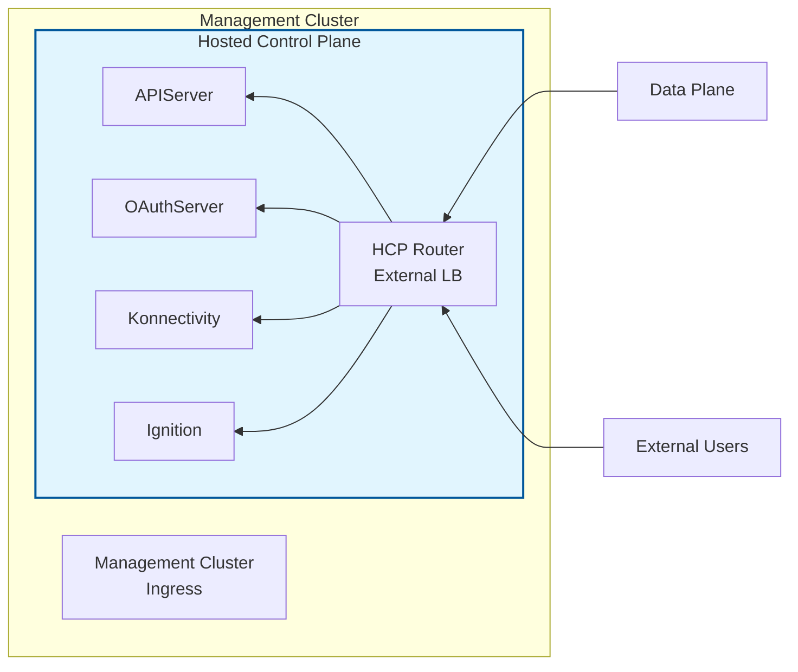

**Without External DNS**:

- **APIServer**: `LoadBalancer` (dedicated external load balancer)
- **OAuthServer**: `Route` (management cluster ingress)
- **Konnectivity**: `Route` (management cluster ingress)
- **Ignition**: `Route` (management cluster ingress)

**Example Configuration:**

```yaml
spec:
  platform:
    type: AWS
    aws:
      endpointAccess: Public
  services:
  - service: APIServer
    servicePublishingStrategy:
      type: LoadBalancer
  - service: OAuthServer
    servicePublishingStrategy:
      type: Route
  - service: Konnectivity
    servicePublishingStrategy:
      type: Route
  - service: Ignition
    servicePublishingStrategy:
      type: Route
```


#### PublicAndPrivate Endpoint Access

**With External DNS** (`--external-dns-domain` flag):

- **APIServer**: `Route` (hostname required)
- **OAuthServer**: `Route` (hostname required)
- **Konnectivity**: `Route` (hostname required)
- **Ignition**: `Route` (hostname required)

All Route-based services are exposed through a dedicated HCP router with both internal and external load balancers.

**Example Configuration:**

```yaml
spec:
  platform:
    type: AWS
    aws:
      endpointAccess: PublicAndPrivate
  services:
  - service: APIServer
    servicePublishingStrategy:
      type: Route
      route:
        hostname: api.my-cluster.example.com
  - service: OAuthServer
    servicePublishingStrategy:
      type: Route
      route:
        hostname: oauth.my-cluster.example.com
  - service: Konnectivity
    servicePublishingStrategy:
      type: Route
      route:
        hostname: konnectivity.my-cluster.example.com
  - service: Ignition
    servicePublishingStrategy:
      type: Route
      route:
        hostname: ignition.my-cluster.example.com
```

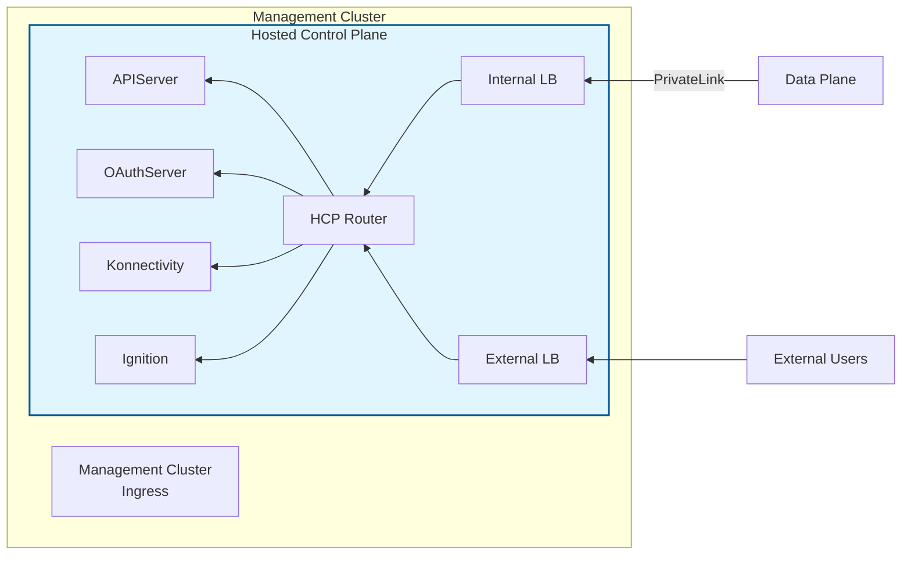

**Without External DNS**:

- **APIServer**: `LoadBalancer` (dedicated external load balancer)
- **OAuthServer**: `Route` (HCP router with internal load balancer)
- **Konnectivity**: `Route` (HCP router with internal load balancer)
- **Ignition**: `Route` (HCP router with internal load balancer)

**Example Configuration:**

```yaml
spec:
  platform:
    type: AWS
    aws:
      endpointAccess: PublicAndPrivate
  services:
  - service: APIServer
    servicePublishingStrategy:
      type: LoadBalancer
  - service: OAuthServer
    servicePublishingStrategy:
      type: Route
  - service: Konnectivity
    servicePublishingStrategy:
      type: Route
  - service: Ignition
    servicePublishingStrategy:
      type: Route
```

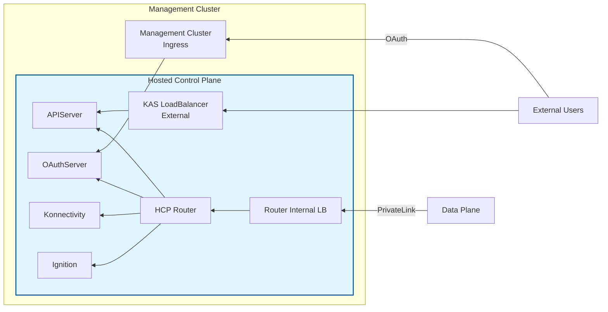

#### Private Endpoint Access

**With External DNS** (`--external-dns-domain` flag):

- **APIServer**: `Route` (hostname required)
- **OAuthServer**: `Route` (hostname required)
- **Konnectivity**: `Route` (hostname required)
- **Ignition**: `Route` (hostname required)

All Route-based services are exposed through a dedicated HCP router with an internal load balancer.

**Example Configuration:**

```yaml
spec:
  platform:
    type: AWS
    aws:
      endpointAccess: Private
  services:
  - service: APIServer
    servicePublishingStrategy:
      type: Route
      route:
        hostname: api.my-cluster.example.com
  - service: OAuthServer
    servicePublishingStrategy:
      type: Route
      route:
        hostname: oauth.my-cluster.example.com
  - service: Konnectivity
    servicePublishingStrategy:
      type: Route
      route:
        hostname: konnectivity.my-cluster.example.com
  - service: Ignition
    servicePublishingStrategy:
      type: Route
      route:
        hostname: ignition.my-cluster.example.com
```

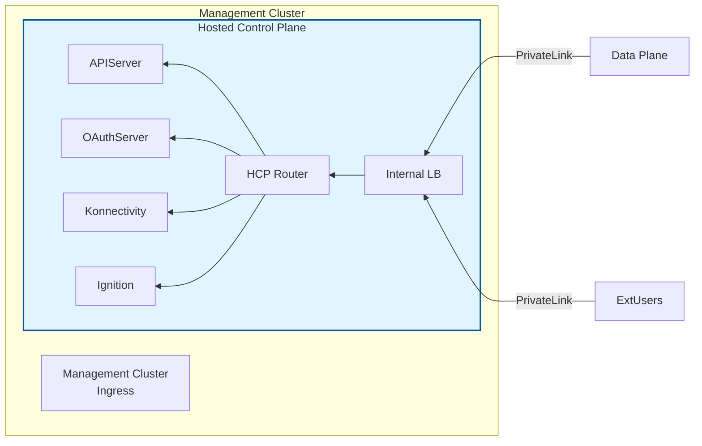

**Without External DNS**:

- **APIServer**: `LoadBalancer` (dedicated internal load balancer)
- **OAuthServer**: `Route` (HCP router with internal load balancer)
- **Konnectivity**: `Route` (HCP router with internal load balancer)
- **Ignition**: `Route` (HCP router with internal load balancer)

**Example Configuration:**

```yaml
spec:
  platform:
    type: AWS
    aws:
      endpointAccess: Private
  services:
  - service: APIServer
    servicePublishingStrategy:
      type: LoadBalancer
  - service: OAuthServer
    servicePublishingStrategy:
      type: Route
  - service: Konnectivity
    servicePublishingStrategy:
      type: Route
  - service: Ignition
    servicePublishingStrategy:
      type: Route
```

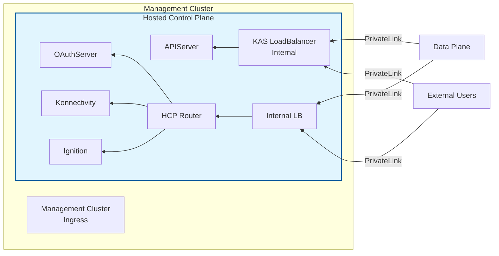


### Azure

Azure has two deployment modes with different service publishing strategy requirements:

#### Managed Azure (ARO HCP)

ARO HCP (Azure Red Hat OpenShift Hosted Control Planes) uses a unique shared ingress architecture that differs from other platforms.

##### Shared Ingress Architecture

ARO HCP management clusters are based on **AKS (Azure Kubernetes Service)**, not OpenShift. All hosted clusters share a single HAProxy-based ingress system:

**Architecture Components:**

1. **Shared Ingress HAProxy**: A single HAProxy deployment in the `hypershift-sharedingress` namespace
2. **Single LoadBalancer**: One Azure LoadBalancer fronts the HAProxy for the entire management cluster
3. **PROXY Protocol**: Uses PROXY protocol with ClusterID in TLV fields to route traffic to specific hosted clusters
4. **Guest Cluster Proxy**: Each worker node runs a kube-apiserver-proxy (HAProxy) that forwards requests to the central HAProxy with ClusterID metadata

**Traffic Flow:**

```
Worker Node → kube-apiserver-proxy (HAProxy) → 
    Shared Ingress LoadBalancer → 
    Central HAProxy (routes by ClusterID) → 
    Hosted Control Plane Services
```

**Architecture Diagram:**

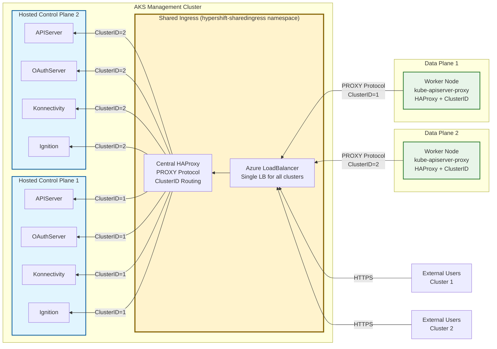

##### Service Publishing Strategy

ARO HCP requires **all services to use the `Route` publishing strategy type** with explicit hostnames:

| Service | Required Type | Hostname Requirement |
|---------|--------------|---------------------|
| **APIServer** | `Route` | Required - must specify explicit hostname |
| **OAuthServer** | `Route` | Required - must specify explicit hostname |
| **Konnectivity** | `Route` | Required - must specify explicit hostname |
| **Ignition** | `Route` | Required - must specify explicit hostname |

**Important ARO HCP Requirements:**

1. **Route Type Mandatory**: All services must use `Route` type (not `LoadBalancer`)
2. **Hostname Required**: Every Route must specify an explicit hostname

**Key Differences from Other Platforms:**

- **No individual LoadBalancers**: Unlike AWS or self-managed Azure, each hosted cluster does NOT get its own LoadBalancer for any service
- **No OpenShift Routes**: The management cluster is AKS, so there are no OpenShift ingress controllers. The "Route" type refers to entries in the shared ingress HAProxy configuration
- **Shared Infrastructure**: All hosted clusters share the single LoadBalancer and HAProxy, reducing costs and provisioning time
- **ClusterID + Hostname Routing**: Traffic differentiation happens at the HAProxy level using PROXY protocol metadata (ClusterID) combined with SNI-based hostname routing

##### Example Configuration

```yaml
spec:
  platform:
    type: Azure
    azure:
      azureAuthenticationConfig:
        azureAuthenticationConfigType: ManagedIdentities
        managedIdentities:
          # Managed identity configuration
  services:
  - service: APIServer
    servicePublishingStrategy:
      type: Route
      route:
        hostname: api-my-cluster.aks-e2e.hypershift.azure.example.com
  - service: OAuthServer
    servicePublishingStrategy:
      type: Route
      route:
        hostname: oauth-my-cluster.aks-e2e.hypershift.azure.example.com
  - service: Konnectivity
    servicePublishingStrategy:
      type: Route
      route:
        hostname: konnectivity-my-cluster.aks-e2e.hypershift.azure.example.com
  - service: Ignition
    servicePublishingStrategy:
      type: Route
      route:
        hostname: ignition-my-cluster.aks-e2e.hypershift.azure.example.com
```

For more details on the shared ingress architecture, see [Shared Ingress Architecture](../architecture/managed-azure/shared-ingress.md).

#### Self-Managed Azure

Self-managed Azure clusters are customer-managed HyperShift deployments on Azure.

##### Supported Publishing Strategies

| Service | Supported Strategies |
|---------|---------------------|
| **APIServer** | `LoadBalancer` (default) |
| **OAuthServer** | `Route` (enforced) |
| **Konnectivity** | `Route` (enforced) |
| **Ignition** | `Route` (enforced) |

##### Defaults

When creating a self-managed Azure cluster using `--workload-identities-file`:
- **APIServer**: `LoadBalancer` (default)
- **OAuthServer**: `Route` (enforced)
- **Konnectivity**: `Route` (enforced)
- **Ignition**: `Route` (enforced)

**Note**: When using the `--external-dns-domain` flag with self-managed Azure clusters, the APIServer can use Route publishing strategy with a custom hostname instead of LoadBalancer.

##### Example Configuration

```yaml
spec:
  platform:
    type: Azure
    azure:
      azureAuthenticationConfig:
        azureAuthenticationConfigType: WorkloadIdentities
        workloadIdentities:
          # Workload identity configuration
  services:
  - service: APIServer
    servicePublishingStrategy:
      type: LoadBalancer
  - service: OAuthServer
    servicePublishingStrategy:
      type: Route
  - service: Konnectivity
    servicePublishingStrategy:
      type: Route
  - service: Ignition
    servicePublishingStrategy:
      type: Route
```

**Architecture Diagram:**

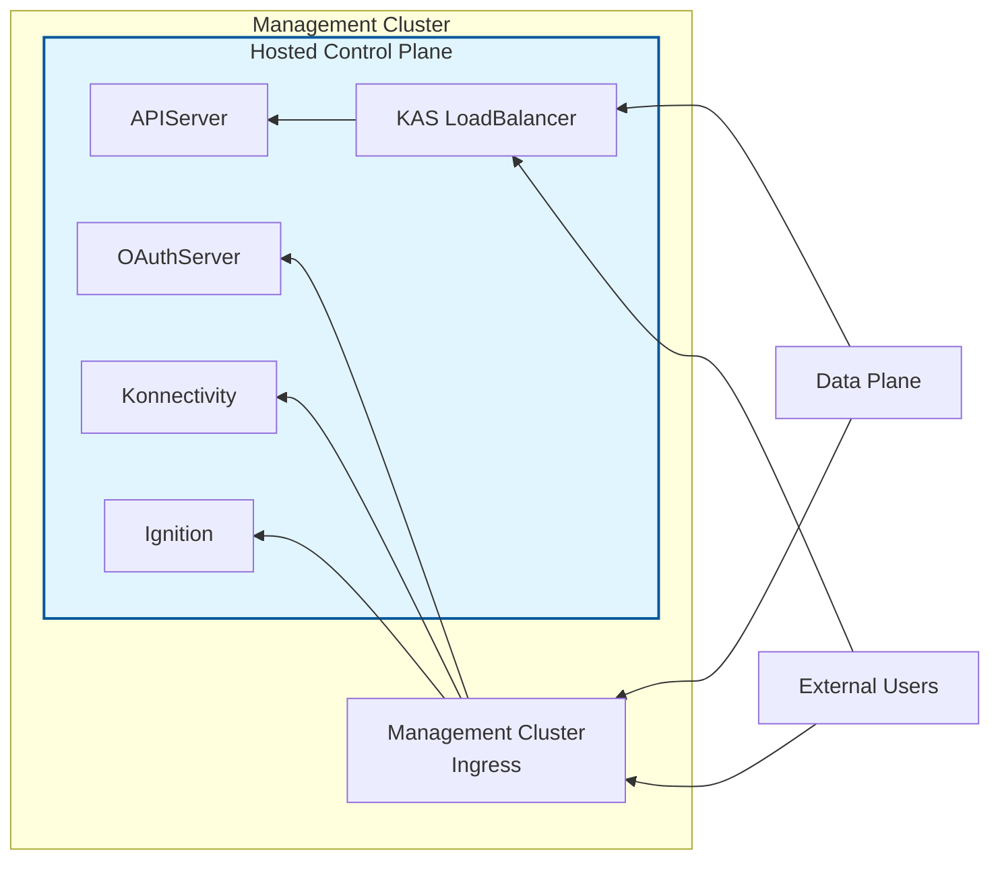

### Managed GCP

Managed GCP (Google Cloud Platform) HostedClusters are managed service deployments on GCP. Publishing strategies are determined by the endpoint access mode. All services use Route publishing strategy, including APIServer.

#### PublicAndPrivate Endpoint Access

External DNS is required for GCP (`--external-dns-domain` flag):

- **APIServer**: `Route` (hostname required)
- **OAuthServer**: `Route` (hostname required)
- **Konnectivity**: `Route` (hostname required)
- **Ignition**: `Route` (hostname required)

All Route-based services are exposed through a dedicated HCP router with both internal and external load balancers.

**Example Configuration:**

```yaml
spec:
  platform:
    type: GCP
    gcp:
      endpointAccess: PublicAndPrivate
  services:
  - service: APIServer
    servicePublishingStrategy:
      type: Route
      route:
        hostname: api.my-cluster.example.com
  - service: OAuthServer
    servicePublishingStrategy:
      type: Route
      route:
        hostname: oauth.my-cluster.example.com
  - service: Konnectivity
    servicePublishingStrategy:
      type: Route
      route:
        hostname: konnectivity.my-cluster.example.com
  - service: Ignition
    servicePublishingStrategy:
      type: Route
      route:
        hostname: ignition.my-cluster.example.com
```

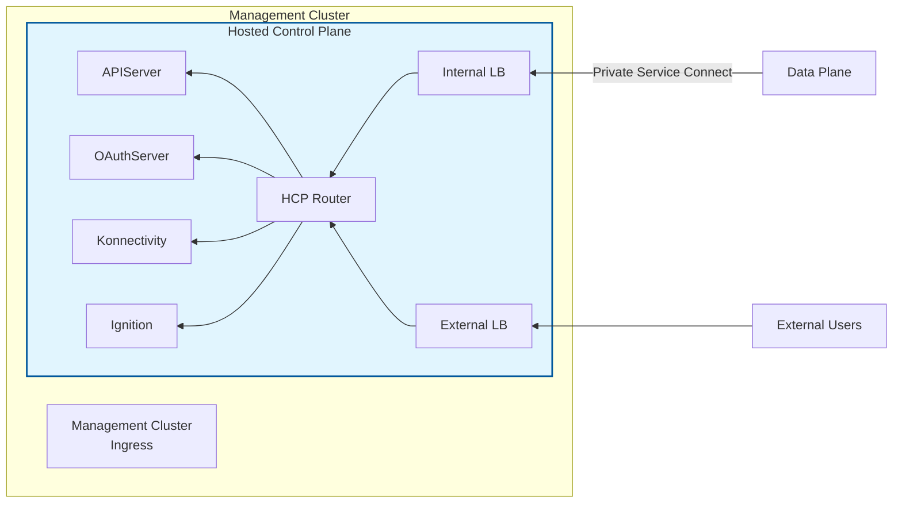

#### Private Endpoint Access

External DNS is required for GCP (`--external-dns-domain` flag):

- **APIServer**: `Route` (hostname required)
- **OAuthServer**: `Route` (hostname required)
- **Konnectivity**: `Route` (hostname required)
- **Ignition**: `Route` (hostname required)

All Route-based services are exposed through a dedicated HCP router with an internal load balancer.

**Example Configuration:**

```yaml
spec:
  platform:
    type: GCP
    gcp:
      endpointAccess: Private
  services:
  - service: APIServer
    servicePublishingStrategy:
      type: Route
      route:
        hostname: api.my-cluster.example.com
  - service: OAuthServer
    servicePublishingStrategy:
      type: Route
      route:
        hostname: oauth.my-cluster.example.com
  - service: Konnectivity
    servicePublishingStrategy:
      type: Route
      route:
        hostname: konnectivity.my-cluster.example.com
  - service: Ignition
    servicePublishingStrategy:
      type: Route
      route:
        hostname: ignition.my-cluster.example.com
```

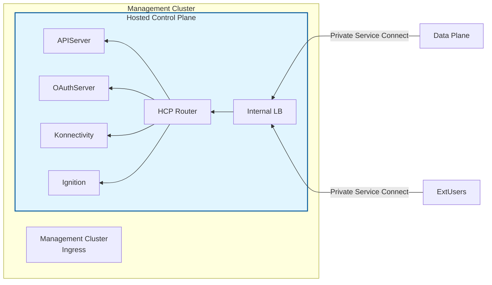

### KubeVirt

KubeVirt is unique in supporting both Ingress-based (Route/LoadBalancer) and NodePort-based service publishing strategies through the `--service-publishing-strategy` flag.

#### Supported Publishing Strategies

**Ingress Strategy (Default)**:

| Service | Supported Strategies |
|---------|---------------------|
| **APIServer** | `LoadBalancer` or `Route`* |
| **OAuthServer** | `Route` |
| **Konnectivity** | `Route` |
| **Ignition** | `Route` |

\* With external DNS, uses `Route`; without it, uses `LoadBalancer`.

**NodePort Strategy**:

| Service | Supported Strategies |
|---------|---------------------|
| **APIServer** | `NodePort` |
| **OAuthServer** | `NodePort` |
| **Konnectivity** | `NodePort` |
| **Ignition** | `NodePort` |

#### Validation Rules

- When using `--service-publishing-strategy=NodePort`, the `--api-server-address` flag is required
- If not provided, the system will attempt to auto-detect the API server address
- Supports `--external-dns-domain` flag when using Ingress strategy

#### Example Configurations

**Ingress Strategy with External DNS**:

```yaml
spec:
  platform:
    type: Kubevirt
  services:
  - service: APIServer
    servicePublishingStrategy:
      type: Route
      route:
        hostname: api-mycluster.example.com
  - service: OAuthServer
    servicePublishingStrategy:
      type: Route
  - service: Konnectivity
    servicePublishingStrategy:
      type: Route
  - service: Ignition
    servicePublishingStrategy:
      type: Route
```

**Architecture Diagram:**

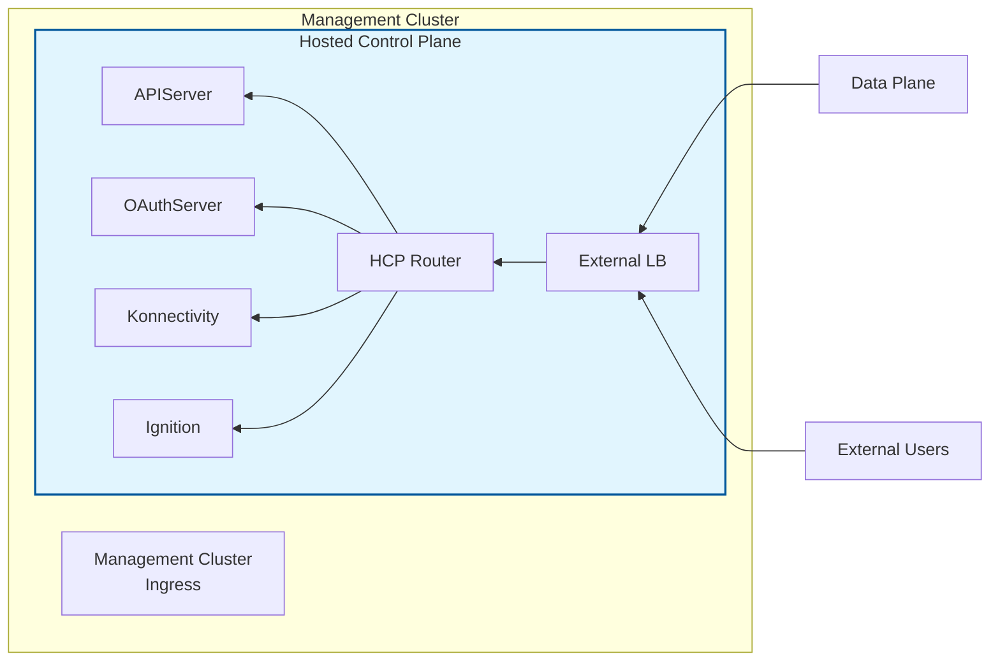

**NodePort Strategy**:

```yaml
spec:
  platform:
    type: Kubevirt
  services:
  - service: APIServer
    servicePublishingStrategy:
      type: NodePort
      nodePort:
        address: 192.168.1.100
        port: 30000
  - service: OAuthServer
    servicePublishingStrategy:
      type: NodePort
      nodePort:
        address: 192.168.1.100
  - service: Konnectivity
    servicePublishingStrategy:
      type: NodePort
      nodePort:
        address: 192.168.1.100
  - service: Ignition
    servicePublishingStrategy:
      type: NodePort
      nodePort:
        address: 192.168.1.100
```

**Architecture Diagram:**

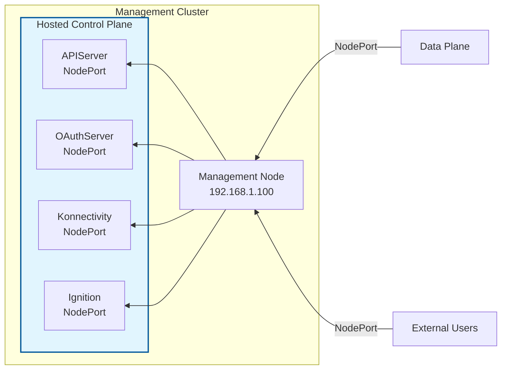

### Agent

The Agent platform supports multiple service publishing strategies. By default, the `hcp create cluster agent` command creates a hosted cluster with NodePort configuration. However, LoadBalancer is the preferred publishing strategy for production environments.

#### Supported Publishing Strategies

| Service | Supported Strategies |
|---------|---------------------|
| **APIServer** | `NodePort` (default), `LoadBalancer`, `Route` |
| **OAuthServer** | `NodePort`, `Route` |
| **Konnectivity** | `NodePort`, `Route` |
| **Ignition** | `NodePort`, `Route` |

#### Publishing Strategy Recommendations

- **NodePort (Default)**: Used by default when creating clusters with `hcp create cluster agent`. Suitable for development and testing.
- **LoadBalancer (Recommended for Production)**: Provides better certificate handling and automatic DNS resolution. Requires MetalLB or similar load balancer infrastructure.
- **Route**: Services can be exposed through Routes on the management cluster's ingress controller.

#### NodePort Strategy (Default)

**Configuration:**

- **APIServer**: `NodePort` (with address and optional port)
- **OAuthServer**: `NodePort`
- **Konnectivity**: `NodePort`
- **Ignition**: `NodePort`

**Important Notes:**
- When using NodePort, the `--api-server-address` flag is required or the system will auto-detect the API server address from available nodes
- DNS must point to the hosted cluster compute nodes, not the management cluster nodes

**Example Configuration:**

```yaml
spec:
  platform:
    type: Agent
    agent:
      agentNamespace: agent-namespace
  services:
  - service: APIServer
    servicePublishingStrategy:
      type: NodePort
      nodePort:
        address: 10.0.0.100
        port: 30000
  - service: OAuthServer
    servicePublishingStrategy:
      type: NodePort
      nodePort:
        address: 10.0.0.100
  - service: Konnectivity
    servicePublishingStrategy:
      type: NodePort
      nodePort:
        address: 10.0.0.100
  - service: Ignition
    servicePublishingStrategy:
      type: NodePort
      nodePort:
        address: 10.0.0.100
```

**Architecture Diagram:**

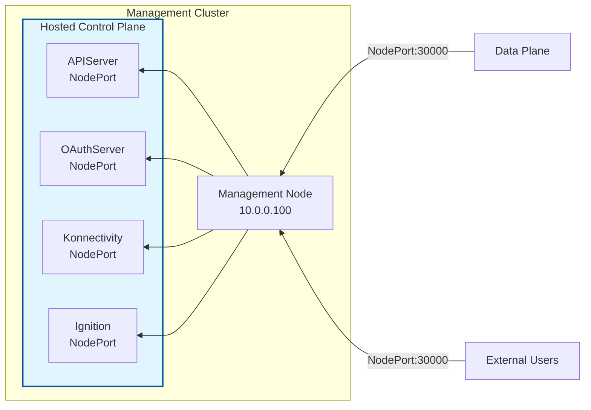

#### LoadBalancer Strategy (Recommended for Production)

**Configuration:**

- **APIServer**: `LoadBalancer`
- **OAuthServer**: `Route`
- **Konnectivity**: `Route`
- **Ignition**: `Route`

**Benefits:**
- Better certificate handling
- Automatic DNS resolution
- Simplified access through a single IP address

**Prerequisites:**
- MetalLB or similar load balancer infrastructure must be installed and configured on the hosted cluster

**Example Configuration:**

```yaml
spec:
  platform:
    type: Agent
    agent:
      agentNamespace: agent-namespace
  services:
  - service: APIServer
    servicePublishingStrategy:
      type: LoadBalancer
  - service: OAuthServer
    servicePublishingStrategy:
      type: Route
  - service: Konnectivity
    servicePublishingStrategy:
      type: Route
  - service: Ignition
    servicePublishingStrategy:
      type: Route
```

**Architecture Diagram:**

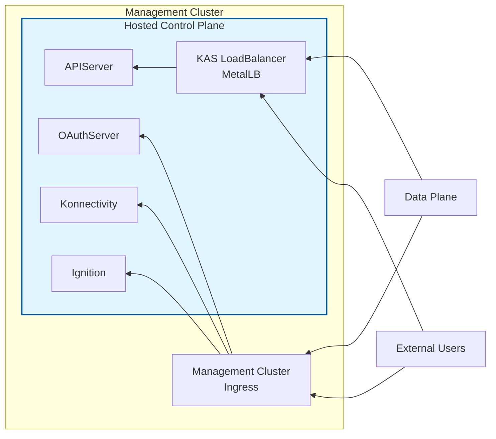

## Summary Table

| Platform | APIServer Default | Other Services Default | External DNS Support | NodePort Support | Special Features |
|----------|------------------|----------------------|---------------------|-----------------|------------------|
| AWS | LoadBalancer or Route | Route | Yes | No | Endpoint access modes |
| Azure (Managed/ARO HCP) | Route (hostname required) | Route (hostname required) | No | No | Shared ingress HAProxy, all Routes need explicit hostnames |
| Azure (Self-Managed) | LoadBalancer | Route (enforced) | Yes | No | Uses workload identities |
| GCP (Managed) | Route | Route | Required | No | Endpoint access modes (PublicAndPrivate, Private) |
| KubeVirt | LoadBalancer or Route | Route | Yes | Yes | Dual strategy support via flag |
| Agent | NodePort (default), LoadBalancer | NodePort, Route | No | Yes (default) | LoadBalancer recommended for production |

\* **ARO HCP Shared Ingress**: All services must use `Route` type with explicit hostnames. All traffic routes through a single shared HAProxy deployment and LoadBalancer using PROXY protocol with ClusterID metadata combined with SNI-based hostname routing. This is fundamentally different from other platforms where each service or hosted cluster gets dedicated infrastructure.

## Best Practices

1. **Use External DNS when available**: For cloud platforms that support it (AWS, Azure, GCP, KubeVirt), using the `--external-dns-domain` flag provides a cleaner configuration with predictable hostnames for all services. Note that Managed GCP requires external DNS, while it's optional for AWS, Azure, and KubeVirt.

2. **Understand endpoint access modes**: On AWS, choose the endpoint access mode that matches your security requirements:
   - `Public`: Services accessible from the internet
   - `PublicAndPrivate`: Services accessible from both internet and VPC
   - `Private`: Services only accessible from VPC

3. **Validate your configuration**: Always check the `ValidConfiguration` condition on your HostedCluster to ensure your service publishing strategy is valid:
   ```bash
   oc get hostedcluster <name> -o jsonpath='{.status.conditions[?(@.type=="ValidConfiguration")]}'
   ```

4. **Consider management cluster capabilities**: Ensure your management cluster has Route capability (i.e., is an OpenShift cluster) if you plan to use Route-based publishing strategies.

5. **Use LoadBalancer for Agent platform in production**: For Agent platform deployments (bare metal and non-bare-metal), use the LoadBalancer publishing strategy for production environments. While NodePort is the default, LoadBalancer provides better certificate handling, automatic DNS resolution, and simplified access.

6. **Plan for high availability**: When using NodePort strategies, remember that you're pointing to specific node IPs. Consider using a load balancer or DNS round-robin for high availability.

## Troubleshooting

### ValidConfiguration Condition is False

If the `ValidConfiguration` condition is set to `False`, check the condition message for details. Common issues include:

- Using an unsupported publishing strategy for a specific service on your platform
- Missing required hostname for Route-based APIServer publishing
- Using LoadBalancer for APIServer when external DNS is configured
- Duplicate hostnames across services

### Management Cluster Doesn't Support Routes

If you see an error about Routes not being supported, this means your management cluster is not an OpenShift cluster. You'll need to either:

- Use a different publishing strategy (e.g., LoadBalancer or NodePort)
- Deploy your HostedCluster on an OpenShift management cluster

### Service Not Accessible

If a service is configured but not accessible:

1. Verify the service publishing strategy is valid for your platform
2. Check that the management cluster has the necessary capabilities
3. Verify DNS resolution for Route-based services
4. Check load balancer provisioning for LoadBalancer-based services
5. Verify node ports are accessible for NodePort-based services

## Related Documentation

- [Exposing Services from Hosted Control Plane](../../how-to/common/exposing-services-from-hcp.md)
- [AWS External DNS](../../how-to/aws/external-dns.md)
- [HostedCluster API Reference](api.md)
