# TestHAEtcdChaos False Positive Root Cause Analysis

## 🎯 Executive Summary

**Issue**: `TestHAEtcdChaos` was passing in older test runs but started failing consistently after OpenShift 4.21.

**Root Cause**: The test exhibited a **false positive** (appearing to pass when it should have failed) because proper validation was inadvertently skipped for `Platform=None` clusters. When OCP 4.21 introduced `ValidateConfigurationStatus` - which **does not skip** Platform=None - it exposed an underlying infrastructure readiness bug that had been masked for previous versions.

**Real Problem**: Platform=None clusters using shared ingress with routes that lack explicit hostnames cannot reach infrastructure readiness because:
1. Routes are created without `spec.host` field
2. Shared ingress HAProxy cannot route to routes without hostnames
3. OAuth service route never gets a valid host
4. `InfrastructureReady` condition stays `False`
5. Kubeconfig is never published

**Impact**: This is not a new regression - the infrastructure was **always broken** for this configuration, but tests were passing due to incomplete validation.

---

## 📅 Issue Timeline

### Historical Behavior (Pre-4.21)
- ✅ `TestHAEtcdChaos` **PASSED** (false positive)
- **Why**: Test validation in `hypershift_framework.go:205-217` explicitly **skipped** `WaitForGuestClient` for Platform=None
- Infrastructure was actually not ready, but test didn't check it

### Current Behavior (4.21+)
- ❌ `TestHAEtcdChaos` **FAILS** after 10 minutes
- **Why**: New validation `ValidateConfigurationStatus` (added in 4.21) calls `WaitForGuestClient` **for all platforms** including None
- Exposes the real issue: kubeconfig never published because infrastructure isn't ready

---

## 🔍 Investigation Findings

### Symptom: Test Timeout

**Error from build-log.txt:506-507**:
```
util.go:260: Failed to wait for kubeconfig to be published for HostedCluster
e2e-clusters-7blgt/ha-etcd-chaos-28xtx in 10m0s: context deadline exceeded
```

**Critical Condition from HostedCluster Status**:
```yaml
- type: InfrastructureReady
  status: "False"
  reason: WaitingOnInfrastructureReady
  message: "OAuth service route does not contain valid host; 8m since creation"
```

### Investigation Path

#### 1. Initial Hypothesis: External-DNS Delay ❌
**Tested**: Searched external-DNS logs for `ha-etcd-chaos` references
**Result**: NO matches found in either successful or failed runs
**Conclusion**: External-DNS does **not** process Platform=None routes

#### 2. Examined OAuth Route Resource
**File**: `artifacts/TestHAEtcdChaos/namespaces/e2e-clusters-7blgt-ha-etcd-chaos-28xtx/route.openshift.io/routes/oauth.yaml`

**Failed Run**:
```yaml
spec:
  tls:
    termination: passthrough
  to:
    kind: Service
    name: oauth-openshift
  # NO spec.host field! ⚠️
status: {}  # Empty - route not processed
```

**Successful Comparison (TestAutoscaling)**:
```yaml
spec:
  host: oauth-autoscaling-2lvhd.aks-e2e.hypershift.azure.devcluster.openshift.com  # ✅ Has hostname
  tls:
    termination: passthrough
  to:
    kind: Service
    name: oauth-openshift
status:
  ingress:
    - host: oauth-autoscaling-2lvhd.aks-e2e.hypershift.azure.devcluster.openshift.com
      # Route properly processed
```

#### 3. Traced Route Creation Flow

**Code Reference: `cmd/cluster/none/create.go:68-71`**:
```go
if o.APIServerAddress != "" {
    cluster.Spec.Services = core.GetServicePublishingStrategyMappingByAPIServerAddress(...)
} else {
    cluster.Spec.Services = core.GetIngressServicePublishingStrategyMapping(
        cluster.Spec.Networking.NetworkType,
        false  // usesExternalDNS = false → Pattern B
    )
}
```

**Result**: Creates services with `type: Route` but **no `route.hostname` field**

#### 4. Route Reconciliation Logic

**Code Reference: `support/util/route.go:90-113`**:
```go
func ReconcileExternalRoute(route *routev1.Route, hostname string,
                            defaultIngressDomain string, serviceName string,
                            labelHCPRoutes bool) error {
    if labelHCPRoutes {
        AddHCPRouteLabel(route)  // Adds label for shared ingress watching
    }
    if hostname != "" {
        route.Spec.Host = hostname  // Pattern A: explicit hostname
    } else {
        if route.Spec.Host == "" {
            // Pattern B: auto-generate from domain
            route.Spec.Host = ShortenRouteHostnameIfNeeded(
                route.Name, route.Namespace, defaultIngressDomain)
        }
    }
    // ... rest of route configuration
}
```

**Critical Problem**: When both `hostname` AND `defaultIngressDomain` are empty, `route.Spec.Host` remains **empty**!

#### 5. Shared Ingress Config Generator

**Code Reference: `sharedingress-config-generator/config.go:135`**:
```go
// Lists routes with HCP label
routes, err := listRoutesWithLabel(ctx, client, hc)
// Generates HAProxy config only for routes with non-empty spec.host
```

**Result**: Routes without hostnames are **ignored** by shared ingress HAProxy configuration

---

## 🎯 Root Cause Analysis

### The False Positive Mechanism

#### Before: Incomplete Validation (< 4.21)

**Code Reference: `test/e2e/util/hypershift_framework.go:125-132`**:
```go
func (h *hypershiftTest) before(hostedCluster *hyperv1.HostedCluster, ...) {
    h.Run("ValidateHostedCluster", func(t *testing.T) {
        if platform != hyperv1.NonePlatform {  // ⚠️ SKIPS None platform!
            if opts.AWSPlatform.EndpointAccess == string(hyperv1.Private) {
                ValidatePrivateCluster(t, h.ctx, h.client, hostedCluster, opts)
            } else {
                ValidatePublicCluster(t, h.ctx, h.client, hostedCluster, opts)
            }
        }
        // ... other validations
    })
}
```

**Line 202-217**: Additional skip for None platform:
```go
// TODO(alberto): consider drop this gate when we fix OCPBUGS-61291.
if hostedCluster.Spec.Platform.Type != hyperv1.NonePlatform {
    hasWorkerNodes := true
    if !util.IsPrivateHC(hostedCluster) {
        guestClient := WaitForGuestClient(...)  // ⬅️ SKIPPED for None!
        // ... validation
    }
    ValidateHostedClusterConditions(...)  // ⬅️ Also skipped
}
```

**Result**: Test passes without ever checking if infrastructure is ready or if kubeconfig is available.

#### After: Complete Validation (4.21+)

**Code Reference: `test/e2e/util/util.go:3862-3872`**:
```go
func ValidateConfigurationStatus(t *testing.T, ctx context.Context,
                                 mgmtClient crclient.Client,
                                 hostedCluster *hyperv1.HostedCluster) {
    t.Run("ValidateConfigurationStatus", func(t *testing.T) {
        // Configuration status was added in 4.21
        AtLeast(t, Version421)
        g := NewWithT(t)

        // ⚠️ NO platform check! Runs for ALL platforms including None
        guestClient := WaitForGuestClient(t, ctx, mgmtClient, hostedCluster)

        // Tries to access guest cluster API to validate configuration
        // This REQUIRES kubeconfig to be published
        // Which REQUIRES InfrastructureReady=True
        // Which REQUIRES OAuth route to have a valid hostname
```

**Result**: Test now properly validates infrastructure, exposing the bug that was always present.

### The Underlying Infrastructure Bug


---

## 🔧 Technical Deep Dive

### Service Publishing Strategies

HyperShift supports three service publishing patterns:

| Strategy | Use Case | Hostname Source |
|----------|----------|-----------------|
| **LoadBalancer** | Cloud platforms (AWS, Azure) | Cloud provider assigns external IP |
| **NodePort** | On-premises, testing | Manual DNS configuration |
| **Route** | Shared ingress, multi-tenant | Explicit hostname OR auto-generated from domain |

### Route Hostname Assignment: Pattern A vs Pattern B

#### Pattern A: Explicit Hostnames ✅
**Used by**: Azure platform with `--e2e.external-dns-domain` flag

**Code**: `cmd/cluster/azure/create.go:307-328`
```go
cluster.Spec.Services = core.GetIngressServicePublishingStrategyMapping(
    cluster.Spec.Networking.NetworkType,
    o.externalDNSDomain != ""  // true → uses Route strategy
)

if o.externalDNSDomain != "" {
    for i, svc := range cluster.Spec.Services {
        switch svc.Service {
        case hyperv1.OAuthServer:
            cluster.Spec.Services[i].Route = &hyperv1.RoutePublishingStrategy{
                Hostname: fmt.Sprintf("oauth-%s.%s", cluster.Name, o.externalDNSDomain),
            }
        // ... similar for APIServer, Konnectivity, Ignition
        }
    }
}
```

**Result**: Routes get explicit hostnames like `oauth-cluster.aks-e2e.hypershift.azure.devcluster.openshift.com`

**External-DNS**: Picks up these routes and creates Azure DNS records

#### Pattern B: Auto-Generated Hostnames ⚠️
**Used by**: None platform, or when `--e2e.external-dns-domain` not provided

**Code**: Service strategy created without hostname field
```yaml
services:
- service: OAuthServer
  servicePublishingStrategy:
    type: Route
    # NO route.hostname field
```

**Route reconciliation** depends on `DEFAULT_INGRESS_DOMAIN` environment variable:
```go
// If hostname is empty, tries to use defaultIngressDomain
route.Spec.Host = ShortenRouteHostnameIfNeeded(
    route.Name, route.Namespace, defaultIngressDomain)
```

**Problem**: When `DEFAULT_INGRESS_DOMAIN` is **not set**, `route.Spec.Host` remains **empty**

### Shared Ingress Architecture


**Key Components**:

1. **Control-Plane-Operator**: Creates Route resources in HCP namespace
2. **Route Label**: `hypershift.openshift.io/hosted-control-plane`
3. **SharedIngress Config Generator**: Watches labeled routes, generates HAProxy config
4. **HAProxy**: Routes traffic based on SNI hostname matching

**Critical Requirement**: Routes **MUST** have `spec.host` field populated to be included in HAProxy configuration

---

## ✅ Why It Used to Pass (False Positive)

### Version-Based Skipping

**Successful Run Analysis**:
- Release: `ci-op-c4fsk6d1/release@sha256:dd098539...` (likely < 4.21)
- `ValidateConfigurationStatus` skipped due to version check `AtLeast(t, Version421)`
- Test only ran basic validations that explicitly skipped Platform=None
- Infrastructure was **not ready**, but test didn't check

### Validation Flow (< 4.21)


---

## ❌ Why It Fails Now (Exposed Bug)

### New Validation in 4.21+

**Failed Run Analysis**:
- Release: `ci-op-itc6lz95/release@sha256:aff7275f...` (4.21+)
- `ValidateConfigurationStatus` **runs** because version >= 4.21
- Calls `WaitForGuestClient` **without checking platform type**
- Waits 10 minutes for kubeconfig publication
- Times out because infrastructure never ready

### Validation Flow (4.21+)

```mermaid
graph TD
    A[TestHAEtcdChaos starts] --> B[CreateHostedCluster]
    B --> C[Platform=None with shared ingress]
    C --> D[Routes created without hostnames]
    D --> E[InfrastructureReady=False]
    E --> F[Kubeconfig NOT published]
    F --> G[before validation skips None]
    G --> H[Test body executes]
    H --> I[ValidateConfigurationStatus runs]
    I --> J[WaitForGuestClient called]
    J --> K{Kubeconfig available?}
    K -->|No - 10min timeout| L[FAILS ❌]
    K -->|Yes| M[Would pass]

    style D fill:#ff6b6b
    style E fill:#ff6b6b
    style F fill:#ff6b6b
    style L fill:#ff6b6b
```



**Error Message**:
```
Failed to wait for kubeconfig to be published for HostedCluster
e2e-clusters-7blgt/ha-etcd-chaos-28xtx in 10m0s: context deadline exceeded

InfrastructureReady=False: WaitingOnInfrastructureReady
(OAuth service route does not contain valid host; 8m since creation)
```

---

## 📋 Related JIRA Issues

### OCPBUGS-61291
**Status**: Known issue
**Description**: TestHAEtcdChaos runs as NonePlatform and it's broken

**Code Reference**: `test/e2e/util/hypershift_framework.go:202-204`
```go
// TestHAEtcdChaos runs as NonePlatform and it's broken.
// so skipping until we fix it.
// TODO(alberto): consider drop this gate when we fix OCPBUGS-61291.
```

**Issue**: The TODO acknowledges the skip is a workaround, not a fix

---

## 🛠️ Recommendations

### Short-Term Fix: Update ValidateConfigurationStatus

**File**: `test/e2e/util/util.go:3862`

**Add platform check** to match existing validation pattern:

```go
func ValidateConfigurationStatus(t *testing.T, ctx context.Context,
                                 mgmtClient crclient.Client,
                                 hostedCluster *hyperv1.HostedCluster) {
    t.Run("ValidateConfigurationStatus", func(t *testing.T) {
        AtLeast(t, Version421)

        // ADDITION: Skip None platform same as other validations
        if hostedCluster.Spec.Platform.Type == hyperv1.NonePlatform {
            t.Skip("Skipping ValidateConfigurationStatus for None platform (OCPBUGS-61291)")
            return
        }

        g := NewWithT(t)
        guestClient := WaitForGuestClient(t, ctx, mgmtClient, hostedCluster)
        // ... rest of validation
    })
}
```

**Benefit**: Test stops failing, maintains existing behavior
**Drawback**: Continues masking the infrastructure issue

### Long-Term Fix: Support Platform=None with Shared Ingress

Choose ONE of the following approaches:

#### Option 1: Set DEFAULT_INGRESS_DOMAIN for None Platform

**File**: `hypershift-operator/controllers/hostedcontrolplane/*.go`

**Modify control-plane-operator deployment** to include environment variable:

```go
if hcp.Spec.Platform.Type == hyperv1.NonePlatform && usesSharedIngress(hcp) {
    deployment.Spec.Template.Spec.Containers[0].Env = append(
        deployment.Spec.Template.Spec.Containers[0].Env,
        corev1.EnvVar{
            Name:  config.DefaultIngressDomainEnvVar,
            Value: "hypershift-sharedingress.svc.cluster.local",
        },
    )
}
```

**Benefit**: Routes get auto-generated hostnames, infrastructure becomes ready
**Drawback**: Requires defining a default domain convention

#### Option 2: Require Explicit Hostnames for None Platform

**File**: `cmd/cluster/none/create.go`

**Fail early if using Route strategy without hostnames**:

```go
if usesRouteStrategy(opts) && opts.ExternalDNSDomain == "" {
    return fmt.Errorf("--external-dns-domain required when using Route service publishing strategy with None platform")
}
```

**Benefit**: Clear error message, forces users to provide proper configuration
**Drawback**: Breaking change for existing deployments

#### Option 3: Make None Platform Incompatible with Shared Ingress

**Documentation Update**: Clarify that Platform=None should use LoadBalancer or NodePort

**Code**: Validate at HostedCluster creation:

```go
if hc.Spec.Platform.Type == hyperv1.NonePlatform {
    for _, svc := range hc.Spec.Services {
        if svc.ServicePublishingStrategy.Type == hyperv1.Route {
            return admission.Errored(http.StatusBadRequest,
                fmt.Errorf("Platform=None does not support Route service publishing strategy"))
        }
    }
}
```

**Benefit**: Prevents users from creating broken configurations
**Drawback**: Limits Platform=None functionality

---

## 📚 Cross-References

- **Test Artifacts Guide**: [test-artifacts-directory-structure.md](test-artifacts-directory-structure.md)
- **Service Publishing Architecture**: [Pending - service-publishing-routes.md]
- **Controller Architecture**: [../../controller-architecture.md](../../controller-architecture.md)

---

## 🔑 Key Takeaways

1. **The test was passing for the wrong reason** - incomplete validation created a false positive
2. **Infrastructure was always broken** - routes without hostnames cannot work with shared ingress
3. **4.21 validation is correct** - it exposed a real bug that should be fixed
4. **The skip in hypershift_framework.go is a workaround**, not a fix (OCPBUGS-61291)
5. **Platform=None + Shared Ingress + No explicit hostnames = fundamentally broken configuration**
6. **Proper fix requires addressing the infrastructure issue**, not just restoring the false positive

---

**Document Version**: 1.0
**Last Updated**: 2025-10-08
**Analyzed Test Runs**:
- Failed: `ci-op-itc6lz95/release@sha256:aff7275f...` (4.21+)
- Successful: `ci-op-c4fsk6d1/release@sha256:dd098539...` (< 4.21)
